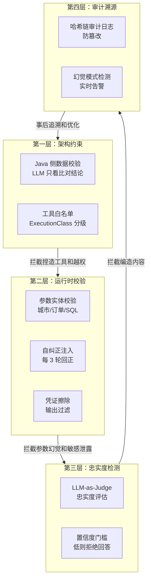

> 造一个好 Agent 系列（十一）：LLM 会编造不存在的工具、捏造数据、产生逻辑矛盾——幻觉不是小概率事件，而是大语言模型的固有缺陷。大多数 Agent 框架把反幻觉做成「事后检测」，但真正可靠的做法是从架构层面让幻觉无处发生。从架构约束、工具执行校验、输出守卫、忠实度检测到审计追溯，多层防线怎么建。

## 一、幻觉的四种形态

Agent 场景下的幻觉比纯对话更危险——它不只是说错话，还会**做错事**。

| 形态 | 表现 | 后果 |
|------|------|------|
| **捏造工具** | 模型调用一个不存在的工具名 | 执行崩溃，循环失败 |
| **捏造数据** | 工具没返回数据，模型自行编造结果 | 用户拿到错误信息 |
| **参数幻觉** | 编造不存在的参数值（如假城市名、假订单号） | 工具返回错误或脏数据 |
| **逻辑矛盾** | 同一回答中前后信息矛盾，或与工具结果矛盾 | 用户信任崩塌 |

传统 LLM 的幻觉只是文本层面的错误。Agent 的幻觉会通过工具调用产生**真实世界的副作用**——发了一封不该发的邮件、删了一条不该删的记录、给用户报了一个不存在的价格。

> 反幻觉不是「让模型别撒谎」，是**让幻觉在产生副作用之前就被拦截**。

## 二、第一层：架构约束——让模型没有幻觉的机会

事后检测永远不如事前预防。最彻底的方案是从架构层面**消除幻觉产生的条件**。

### 2.1 架构级数据校验：Java 侧比对，LLM 只看结果

这是最激进的反幻觉方案——不让 LLM 直接接触原始数据，而是让 Java 代码拿真实数据做比对，LLM 只拿到比对结论。

```java
/**
 * 防幻觉架构：LLM 不直接访问业务数据，而是通过 Java 侧的校验工具。
 * Java 代码查询真实数据 → 比对 → 返回结构化结论 → LLM 基于结论推理。
 *
 * 核心思想：业务真实性由 Java 代码保证，LLM 只负责推理和表达。
 */
@Component
public class AntiHallucinationValidator {

    private final OrderRepository orderRepo;
    private final PriceRepository priceRepo;

    /**
     * LLM 不能直接说「订单 12345 金额是 500 元」——
     * 它必须先调用 validateOrder，由 Java 侧查数据库返回真实结果。
     */
    public OrderValidation validateOrder(String orderId) {
        Order order = orderRepo.findById(orderId).orElse(null);
        if (order == null) {
            return new OrderValidation(false, "订单不存在: " + orderId, null);
        }
        return new OrderValidation(true, "订单存在", order);
    }

    /**
     * 价格比对：LLM 说「价格是 X 元」，Java 侧查真实价格并比对。
     * LLM 拿到的不是原始价格，而是「你说的价格与实际价格是否一致」的结论。
     */
    public PriceCheckResult checkPrice(String productId, String claimedPrice) {
        BigDecimal actualPrice = priceRepo.findPrice(productId);
        if (actualPrice == null) {
            return new PriceCheckResult(false, "商品不存在", null);
        }
        boolean matches = actualPrice.compareTo(new BigDecimal(claimedPrice)) == 0;
        return new PriceCheckResult(matches,
            matches ? "价格正确" : "价格不符，实际为 " + actualPrice,
            actualPrice);
    }
}
```

**这个设计的关键洞察**：LLM 的幻觉来源于「它不知道真实数据是什么，只能猜」。如果把「猜」这个环节去掉——让 Java 代码查真实数据，LLM 只基于真实结论推理——幻觉就从根本上被消除了。

### 2.2 工具白名单 + 执行类标签

模型不能调用不在白名单里的工具。即使它在推理过程中「发明」了一个新工具名，执行层也会拒绝。

```java
/**
 * 工具执行策略：双重校验。
 * 第一重：工具名必须在注册表中存在（防捏造工具）。
 * 第二重：工具的 ExecutionClass 决定了是否需要审批（防越权）。
 */
@Component
public class ToolExecutionGate {

    private final ToolRegistry registry;
    private final ApprovalService approval;

    public ExecutionDecision decide(ToolCall call) {
        // 第一重：工具是否存在
        ToolSpec tool = registry.get(call.name());
        if (tool == null) {
            return ExecutionDecision.reject("工具不存在: " + call.name()
                + "。模型可能产生了幻觉，请检查工具列表。");
        }

        // 第二重：执行类是否需要审批
        if (tool.executionClass() == ExecutionClass.USER_FACING
            && approval.needsApproval(call.name())) {
            return ExecutionDecision.requireApproval(
                "工具 " + call.name() + " 需要人工审批后执行");
        }

        return ExecutionDecision.allow();
    }
}
```

## 三、第二层：运行时校验——执行过程中的实时拦截

架构约束不能覆盖所有场景。运行时校验在工具调用和输出生成的过程中实时拦截幻觉。

### 3.1 工具参数校验

```java
/**
 * 工具参数校验器：在工具执行前检查参数的合法性。
 * 捕获参数幻觉——模型编造了不存在的参数值。
 */
@Component
public class ToolParameterValidator {

    private final CityRepository cityRepo;
    private final OrderRepository orderRepo;

    /**
     * 校验工具参数中的实体引用是否真实存在。
     * 例如：get_weather(city="亚特兰提斯") → 城市不存在 → 拦截
     */
    public ValidationResult validate(String toolName, Map<String, Object> params) {
        return switch (toolName) {
            case "get_weather" -> validateCity(params.get("city"));
            case "get_order_detail" -> validateOrderId(params.get("order_id"));
            case "query_database" -> validateSqlSafety(params.get("sql"));
            default -> ValidationResult.pass();  // 未知工具不在此层拦截
        };
    }

    private ValidationResult validateCity(Object city) {
        if (city == null) return ValidationResult.reject("缺少城市参数");
        boolean exists = cityRepo.existsByName(city.toString());
        return exists ? ValidationResult.pass()
                      : ValidationResult.reject("城市不存在: " + city);
    }

    private ValidationResult validateOrderId(Object orderId) {
        if (orderId == null) return ValidationResult.reject("缺少订单ID");
        boolean exists = orderRepo.existsById(orderId.toString());
        return exists ? ValidationResult.pass()
                      : ValidationResult.reject("订单不存在: " + orderId);
    }

    /** SQL 安全校验：只读 + 防注入 */
    private ValidationResult validateSqlSafety(Object sql) {
        String trimmed = sql.toString().trim().toUpperCase();
        if (!trimmed.startsWith("SELECT") && !trimmed.startsWith("WITH")) {
            return ValidationResult.reject("SQL 必须是只读查询");
        }
        if (trimmed.contains("DROP") || trimmed.contains("DELETE")
            || trimmed.contains("INSERT") || trimmed.contains("UPDATE")) {
            return ValidationResult.reject("SQL 包含写操作关键字");
        }
        return ValidationResult.pass();
    }
}
```

### 3.2 自纠正注入：周期性把模型拉回正轨

模型在长循环中容易「迷失」——反复调用同一个工具、偏离原始目标。定期注入自纠正 prompt，主动把模型拉回来。

```java
/**
 * 自纠正注入器：每 N 轮自动注入重规划 prompt。
 * 不等模型走偏才干预——主动、周期性地校准方向。
 */
@Component
public class SelfCorrectionInjector {

    private final int interval = 3;  // 每 3 轮注入一次
    private final List<String> recentToolCalls = new ArrayList<>();

    public String maybeInject(int currentStep, List<String> toolCalls) {
        recentToolCalls.addAll(toolCalls);
        if (currentStep % interval != 0) return null;

        // 检测重复调用
        Map<String, Long> callCounts = recentToolCalls.stream()
            .collect(Collectors.groupingBy(t -> t, Collectors.counting()));
        Optional<String> repeatedTool = callCounts.entrySet().stream()
            .filter(e -> e.getValue() >= 3)
            .map(Map.Entry::getKey)
            .findFirst();

        if (repeatedTool.isPresent()) {
            return "⚠ 检测到你可能在重复调用工具 [" + repeatedTool.get()
                + "]（已调用 " + callCounts.get(repeatedTool.get()) + " 次）。"
                + "请回顾原始目标，确认是否需要换一种方式。";
        }

        return "请回顾当前进度：已完成 " + currentStep + " 步。"
             + "是否已接近目标？如果偏离，请调整方向。";
    }
}
```

### 3.3 凭证擦除：防止模型泄露敏感信息

模型有时会在推理过程中「回忆」起 system prompt 里的 API Key 或密码并输出到上下文中。输出守卫在每轮回复后做正则擦除。

```java
/**
 * 凭证擦除器：在 Agent 输出中掩盖常见敏感信息。
 * 覆盖 API Key、JWT、PEM 私钥、数据库连接串、AWS 密钥等。
 */
@Component
public class CredentialScrubber {

    private static final List<Pattern> PATTERNS = List.of(
        Pattern.compile("sk-[a-zA-Z0-9]{20,}", Pattern.CASE_INSENSITIVE),
        Pattern.compile("(Bearer\\s+)[a-zA-Z0-9\\-_.]+"),
        Pattern.compile("(password\\s*[:=]\\s*)\\S+", Pattern.CASE_INSENSITIVE),
        Pattern.compile("-----BEGIN\\s+(?:RSA |EC |DSA )?PRIVATE KEY-----[\\s\\S]*?-----END"),
        Pattern.compile("AKIA[A-Z0-9]{16}"),
        Pattern.compile("(jdbc:[\\w:]+://)(\\S+):(\\S+)@")
    );

    public String scrub(String text) {
        String result = text;
        for (Pattern pattern : PATTERNS) {
            result = pattern.matcher(result).replaceAll("***REDACTED***");
        }
        return result;
    }
}
```

## 四、第三层：忠实度检测——回答是否忠于检索结果

RAG 场景下最常见的幻觉是「回答看似合理，但检索到的文档里根本没有这个信息」。忠实度检测专门捕获这类幻觉。

### 4.1 LLM-as-Judge 忠实度评估

```java
/**
 * 忠实度检查器：检测 Agent 的回答是否忠实于检索到的源文档。
 * 采用 LLM-as-Judge 方案，以关键词回退作为降级策略。
 */
@Component
public class FaithfulnessChecker {

    private final LlmClient llmClient;

    private static final String FAITHFULNESS_PROMPT = """
        你是一个忠实度评估器。给定生成的回答和检索到的源文档，
        判断回答中的每个声明是否被源文档支持。
        
        规则：
        1. 将回答拆分为独立的声明（每个事实陈述为一条）
        2. 逐条检查声明是否在源文档中有依据
        3. 输出 JSON: {"claims": [{"text": "...", "supported": true/false}], "faithfulness": M/N}
        """;

    public Mono<FaithfulnessResult> check(String answer, List<Document> sources) {
        String sourceText = sources.stream()
            .map(Document::getContent)
            .collect(Collectors.joining("\n---\n"));

        return llmClient.complete(FAITHFULNESS_PROMPT
                + "\n回答: " + answer
                + "\n源文档: " + sourceText)
            .map(resp -> parseFaithfulnessJson(resp.getContent()))
            .onErrorResume(e -> {
                log.warn("LLM 忠实度检查失败，降级到关键词检查", e);
                return Mono.just(keywordFallback(answer, sources));
            });
    }

    /** LLM 不可用时的关键词回退：检查回答中的关键实体是否在源文档中出现 */
    private FaithfulnessResult keywordFallback(String answer, List<Document> sources) {
        String sourceText = sources.stream()
            .map(Document::getContent)
            .collect(Collectors.joining(" "));
        String[] sentences = answer.split("[.。！!？?]");
        long supported = Arrays.stream(sentences)
            .filter(s -> !s.isBlank())
            .filter(s -> containsKeyEntities(s, sourceText))
            .count();
        return new FaithfulnessResult(supported, sentences.length,
            (double) supported / Math.max(1, sentences.length), "keyword");
    }
}
```

### 4.2 置信度门槛：低置信度时拒绝回答

```java
/**
 * RAG 结果封装：带置信度和低置信度检测。
 * 置信度 = 重排后最高分文档的分数。
 * 低于阈值时，Agent 应回答「我不确定」而不是编造。
 */
public record RagResult(
    String answer,
    List<Document> sources,
    Double confidence,
    FaithfulnessResult faithfulness
) {
    /** 置信度过低 → 建议 Agent 拒绝回答 */
    public boolean isLowConfidence(double threshold) {
        return confidence == null || confidence < threshold;
    }

    /** 忠实度过低 → 回答可能包含幻觉 */
    public boolean isUnfaithful(double threshold) {
        return faithfulness != null && faithfulness.score() < threshold;
    }
}
```

## 五、第四层：审计与溯源——幻觉出了事能追责

即使前面的防线都失效了，审计日志确保每一次幻觉都能被事后追溯。

### 5.1 哈希链审计日志

```java
/**
 * 审计日志 + 哈希链防篡改。
 * 每条记录包含前一条的哈希，篡改任何一条都会导致后续校验全部失败。
 */
public record AuditLog(
    long id,
    String sessionId,
    String phase,          // "llm_input" / "tool_call" / "llm_output"
    String result,         // "ALLOW" / "DENY" / "HALLUCINATION_DETECTED"
    String toolName,
    String argsHash,       // 参数哈希（不存原文，保护隐私）
    String hash,           // 当前记录 SHA-256
    String prevHash,       // 前一条记录哈希
    Instant timestamp
) {
    /** 检测审计链是否被篡改 */
    public static boolean verifyChain(List<AuditLog> entries) {
        String prevHash = null;
        for (AuditLog entry : entries) {
            String expected = computeHash(entry, prevHash);
            if (!expected.equals(entry.hash())) return false;
            prevHash = entry.hash();
        }
        return true;
    }

    private static String computeHash(AuditLog entry, String prevHash) {
        String content = entry.sessionId() + entry.phase() + entry.result()
                       + entry.timestamp() + prevHash;
        try {
            MessageDigest md = MessageDigest.getInstance("SHA-256");
            return Base64.getEncoder().encodeToString(
                md.digest(content.getBytes(StandardCharsets.UTF_8)));
        } catch (NoSuchAlgorithmException e) {
            throw new RuntimeException(e);
        }
    }
}
```

### 5.2 安全监控：幻觉模式检测

```java
/**
 * 安全监控器：基于审计日志检测幻觉模式。
 * 不是事后人工排查，而是实时告警。
 */
@Component
public class HallucinationMonitor {

    /** 检测：同一会话中多次工具调用返回「不存在」但模型继续编造 */
    public void detectFabrication(List<AuditLog> recent, String sessionId) {
        long denyCount = recent.stream()
            .filter(l -> "DENY".equals(l.result()) && l.toolName() != null)
            .count();
        // 如果大量工具调用被拒绝（参数不存在），但模型仍在继续推理
        if (denyCount >= 3) {
            alert("会话 " + sessionId + " 疑似幻觉：连续 " + denyCount + " 次工具调用被拒绝");
        }
    }

    /** 检测：输出中包含被擦除的凭证（说明模型在尝试泄露敏感信息） */
    public void detectCredentialLeak(List<AuditLog> recent, String sessionId) {
        long maskCount = recent.stream()
            .filter(l -> "WARN".equals(l.result()) && "credential-scrubbed".equals(l.denyReason()))
            .count();
        if (maskCount > 0) {
            alert("会话 " + sessionId + " 检测到凭证泄露尝试: " + maskCount + " 次");
        }
    }

    private void alert(String message) {
        // 发送到告警平台
    }
}
```

## 六、多层防线的协同

四层防线不是孤立的——它们在 Agent 循环的不同位置咬合：



| 防线 | 拦截什么 | 时机 | 代价 |
|------|---------|------|------|
| 架构约束 | 捏造工具、越权执行 | 工具注册时 | 零运行时开销 |
| 运行时校验 | 参数幻觉、循环迷失、凭证泄露 | 每轮循环 | 低（本地校验） |
| 忠实度检测 | 编造内容、与源文档矛盾 | 输出生成后 | 中（一次 LLM 调用） |
| 审计溯源 | 事后追溯、模式检测 | 全程记录 | 低（异步写入） |

## 七、行业实践：反幻觉的设计共识

| 策略 | 做法 | 反面模式 |
|------|------|---------|
| 架构级 | Java 侧校验真实数据，LLM 只看结论 | 让 LLM 直接编造数据 |
| 工具白名单 | 注册表 + ExecutionClass + 权限矩阵 | 模型自由调用任意工具 |
| 参数校验 | 实体存在性检查 + SQL 安全校验 | 参数直接传给工具 |
| 自纠正 | 周期性注入重规划 prompt | 等失败了再处理 |
| 输出守卫 | 凭证擦除 + 敏感信息掩码 | 不检查直接输出 |
| 忠实度 | LLM-as-Judge + 关键词回退 + 置信度门槛 | 不检测直接给用户 |
| 审计 | 哈希链防篡改 + 模式告警 | 只记日志不校验 |

## 结语

反幻觉不是某一个模块的责任，是整个 Agent 工程体系的底线。

> 事后检测永远不如事前预防。架构级约束消除幻觉产生的条件，运行时校验在过程中拦截，忠实度检测兜底输出质量，审计链路确保出了事能追溯。四层防线层层叠加，才让 Agent 的输出从「可能可信」变成「可以信赖」。

一个不会幻觉的 Agent 比一个聪明的 Agent 更有价值——因为用户不需要每次都验证它说的是真是假。

---

> **🔁 闭环视角**
>
> 本篇覆盖 Agent 闭环中贯穿始终的可信度保障——它不是一个独立阶段，而是叠加在每个阶段之上的横切关注点。规划阶段需要架构约束防捏造，行动阶段需要参数校验防幻觉，记忆阶段需要忠实度检测防编造，反馈阶段需要审计溯源防抵赖。可信不是闭环的某个环节，是闭环每一环的底线。
