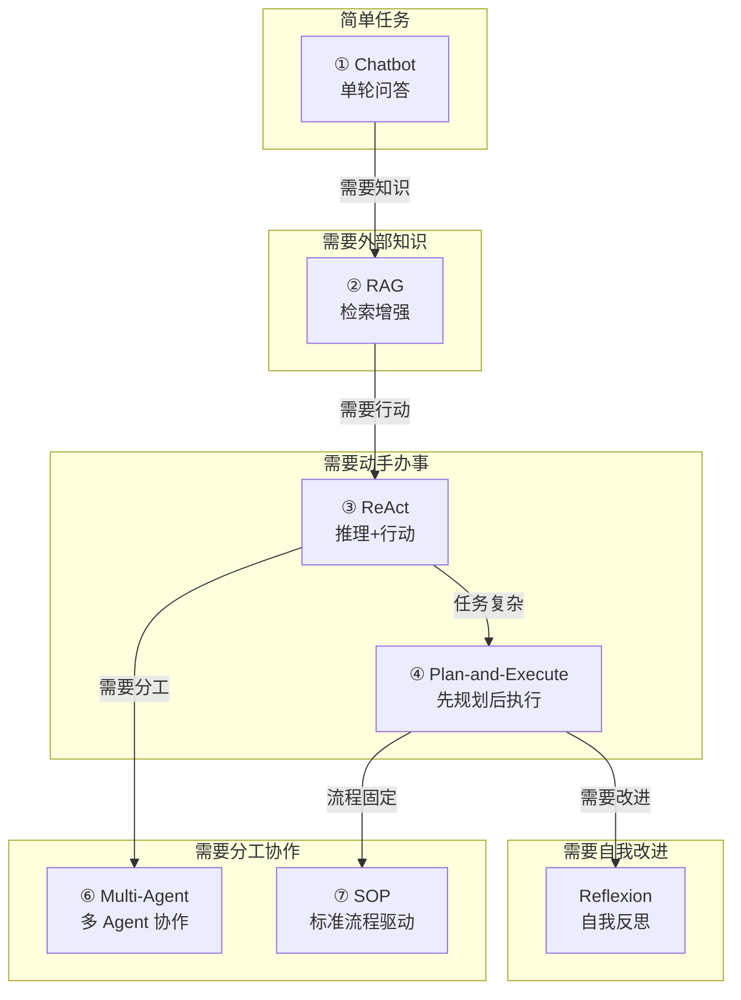
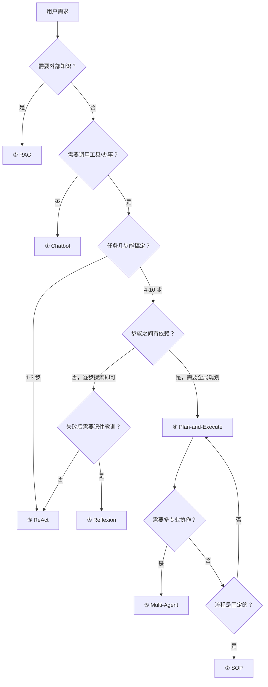

> 造一个好 Agent 系列（十九）：Agent 不是只有一种写法。从最简单的聊天机器人到最复杂的多 Agent 蜂群，七种架构各有适用的战场。选错架构，再好的模型也白搭；选对架构，70B 模型能干出 400B 的活。用真实代码对比每种架构的核心循环，一张表看清该用哪种。

## 一、七种架构一张图



## 二、 Chatbot：最简单的基线

**核心循环**：用户问 → 模型答。没有工具、没有记忆、没有循环。

```java
/**
 * Chatbot：最基础的 Agent 形态。
 * 单轮问答，无状态，适合 FAQ、闲聊、简单知识问答。
 */
@Component
public class ChatbotAgent {

    private final LlmClient llm;

    public String chat(String userInput, String systemPrompt) {
        return llm.chat(List.of(
            Map.of("role", "system", "content", systemPrompt),
            Map.of("role", "user", "content", userInput)
        ));
    }
}
```

| 维度 | 评估 |
|------|------|
| 适合场景 | FAQ、闲聊、简单知识问答 |
| 优势 | 实现简单、延迟低、成本最低 |
| 短板 | 不知道实时信息、不会办事、不记得历史 |
| 复杂度 | ★☆☆☆☆ |

## 三、② RAG：给 Agent 装知识库

**核心循环**：用户问 → 检索相关知识 → 拼接上下文 → 模型基于知识回答。

Chatbot 不知道公司内部的规章制度、最新的产品价格、昨天的会议纪要。RAG 解决了这个问题——把外部知识检索出来喂给模型。

```java
/**
 * RAG Agent：检索增强生成。
 * 核心改变：在模型推理前插入「知识检索」步骤。
 */
@Component
public class RagAgent {

    private final VectorStore vectorStore;
    private final LlmClient llm;
    private final ContextAssembler assembler;

    public String chat(String userInput) {
        // 1. 检索相关知识
        List<Document> docs = vectorStore.search(userInput, 5);

        // 2. 组装上下文（知识 + 用户问题）
        String context = assembler.assemble(docs);

        // 3. 基于知识回答
        return llm.chat(List.of(
            Map.of("role", "system", "content", "基于以下知识回答问题：\n" + context),
            Map.of("role", "user", "content", userInput)
        ));
    }
}
```

| 维度 | 评估 |
|------|------|
| 适合场景 | 知识库问答、文档检索、内部制度查询 |
| 优势 | 知识可更新、答案可溯源、减少幻觉 |
| 短板 | 只会回答不会办事、检索质量依赖分片和向量 |
| 复杂度 | ★★☆☆☆ |

## 四、③ ReAct：让 Agent 动起来

**核心循环**：思考 → 行动 → 观察 → 再思考 → …… → 给出答案。

RAG 解决了「知道什么」的问题，但 Agent 还需要「能做什么」——查天气、下单、发邮件。ReAct 让模型在推理过程中调用工具，把想法变成行动。

```java
/**
 * ReAct Agent：推理 + 行动循环。
 * 核心改变：模型可以调用工具，工具结果回灌上下文供下一轮推理。
 */
@Component
public class ReActAgent {

    private final ToolRegistry toolRegistry;
    private final LlmClient llm;
    private final int maxSteps = 10;

    public String chat(String userInput, String systemPrompt) {
        List<ChatMessage> messages = new ArrayList<>();
        messages.add(new SystemMessage(systemPrompt));
        messages.add(new UserMessage(userInput));

        for (int step = 0; step < maxSteps; step++) {
            ChatResponse resp = llm.chat(messages, toolRegistry.getDefinitions());

            // 模型不再请求工具 → 给出最终答案
            if (resp.toolCalls().isEmpty()) {
                return resp.content();
            }

            // 执行工具调用，结果回灌上下文
            for (ToolCall call : resp.toolCalls()) {
                messages.add(new AssistantMessage(resp.content(), resp.toolCalls()));
                ToolResult result = toolRegistry.execute(call);
                messages.add(new ToolMessage(call.id(), result.content()));
            }
        }
        return "达到最大步骤数，未能完成任务";
    }
}
```

| 维度 | 评估 |
|------|------|
| 适合场景 | 查天气、搜索、计算、简单多步任务 |
| 优势 | 通用、灵活、能调用真实世界的工具 |
| 短板 | 长任务 Token 浪费、无全局视野、容易走偏 |
| 复杂度 | ★★★☆☆ |

## 五、④ Plan-and-Execute：先看地图再出发

**核心循环**：生成完整计划 → 按计划执行 → 检查完成度 → 未完成则重规划。

ReAct 是「走一步看一步」，Plan-and-Execute 是「先看地图再出发」。对于复杂任务，先规划再执行比边想边做高效得多。

```java
/**
 * Plan-and-Execute Agent：先规划后执行。
 * 核心改变：第一步生成完整计划，后续按依赖顺序执行。
 */
@Component
public class PlanAndExecuteAgent {

    private final LlmClient llm;
    private final ToolRegistry toolRegistry;

    public String chat(String userInput) {
        // 1. 生成完整计划
        Plan plan = generatePlan(userInput);
        log.info("计划: {} 步", plan.steps().size());

        // 2. 按依赖顺序执行
        List<StepResult> results = new ArrayList<>();
        for (Step step : plan.orderedSteps(results)) {
            ToolResult output = toolRegistry.execute(step.toolCall());
            results.add(new StepResult(step.id(), output));
        }

        // 3. 汇总结果生成最终回答
        return synthesize(plan, results);
    }

    private Plan generatePlan(String goal) {
        // LLM 生成结构化的步骤列表
        String planJson = llm.chat(List.of(
            new SystemMessage("你是任务规划专家。将目标分解为有序步骤。"),
            new UserMessage("目标: " + goal)
        ));
        return parsePlan(planJson);
    }
}
```

| 维度 | 评估 |
|------|------|
| 适合场景 | 竞品分析、报告生成、多步数据处理 |
| 优势 | 全局视野、可观测、可重规划、支持并行 |
| 短板 | 规划质量依赖模型、计划可能过于乐观 |
| 复杂度 | ★★★★☆ |

## 六、⑤ Reflexion：从失败中学习

**核心循环**：执行 → 评估 → 反思 → 记录教训 → 下次带着教训执行。

前面的架构都是「一次性」的——失败了就重试，但不会记住为什么失败。Reflexion 给 Agent 加了一个「草稿本」，每次失败后把教训写下来，下次执行时带着这些教训。

```java
/**
 * Reflexion Agent：自我反思 + 经验积累。
 * 核心改变：失败后记录教训到 scratchpad，下次执行时注入上下文。
 */
@Component
public class ReflexionAgent {

    private final LlmClient llm;
    private final ToolRegistry toolRegistry;
    private final List<String> scratchpad = new ArrayList<>();  // 经验草稿本
    private final int maxAttempts = 3;

    public String solve(String problem) {
        for (int attempt = 1; attempt <= maxAttempts; attempt++) {
            // 1. 带着历史教训执行
            String action = llm.chat(buildMessages(problem, scratchpad));
            ToolResult result = toolRegistry.execute(parseToolCall(action));

            // 2. 评估结果
            if (result.success()) return result.content();

            // 3. 反思：为什么失败？下次怎么改进？
            String reflection = llm.reflect(problem, action, result.error(), scratchpad);
            scratchpad.add("[第 " + attempt + " 次尝试] " + reflection);
        }
        return "经过 " + maxAttempts + " 次尝试仍未解决";
    }

    private List<ChatMessage> buildMessages(String problem, List<String> scratchpad) {
        List<ChatMessage> msgs = new ArrayList<>();
        msgs.add(new SystemMessage("你是问题解决专家。参考历史教训，避免重复犯错。"));
        if (!scratchpad.isEmpty()) {
            msgs.add(new SystemMessage("历史教训:\n" + String.join("\n", scratchpad)));
        }
        msgs.add(new UserMessage(problem));
        return msgs;
    }
}
```

| 维度 | 评估 |
|------|------|
| 适合场景 | 代码调试、复杂问题求解、需要多轮试错的任务 |
| 优势 | 从失败中学习、不重复犯错、渐进改进 |
| 短板 | 额外推理成本、scratchpad 膨胀需要管理 |
| 复杂度 | ★★★★☆ |

## 七、⑥ Multi-Agent：一个人干不完就组团队

**核心循环**：调度中心接收任务 → 分配给专业 Agent → 并行执行 → 汇总结果。

单个 Agent 有上下文天花板、专业化不足、并行度为零三个硬瓶颈。Multi-Agent 把一个大 Agent 拆成多个专业 Agent，各司其职。

```java
/**
 * Multi-Agent Orchestrator：中央调度 + 专业 Agent 团队。
 * 核心改变：任务分解 → 能力匹配 → 并行执行 → 结果聚合。
 */
@Component
public class AgentOrchestrator {

    private final Map<String, SpecializedAgent> agents;  // 专业 Agent 注册表

    public String handleTask(String taskDescription) {
        // 1. 任务分解
        List<SubTask> subtasks = decompose(taskDescription);

        // 2. 能力匹配 + 分配
        Map<SpecializedAgent, List<SubTask>> assignments = new HashMap<>();
        for (SubTask sub : subtasks) {
            SpecializedAgent agent = findBestAgent(sub.requiredSkills());
            assignments.computeIfAbsent(agent, k -> new ArrayList<>()).add(sub);
        }

        // 3. 并行执行
        Map<SpecializedAgent, CompletableFuture<String>> futures = new HashMap<>();
        for (var entry : assignments.entrySet()) {
            futures.put(entry.getKey(),
                entry.getKey().executeBatchAsync(entry.getValue()));
        }

        // 4. 等待全部完成 + 汇总
        Map<SpecializedAgent, String> results = futures.entrySet().stream()
            .collect(Collectors.toMap(Map.Entry::getKey, e -> e.getValue().join()));

        return synthesize(results);
    }
}
```

| 维度 | 评估 |
|------|------|
| 适合场景 | 代码审查、竞品分析、需要多专业协作的复杂任务 |
| 优势 | 突破上下文天花板、专业化分工、并行加速 |
| 短板 | 通信开销、协调复杂度、冲突解决成本 |
| 复杂度 | ★★★★★ |

## 八、⑦ SOP：当自由推理遇到标准流程

**核心循环**：按预定义步骤顺序执行 → 遇审批暂停等人 → 继续 → 完成。

不是所有任务都需要自由推理。审批流程、故障处理、入职办理——这些场景每一步都有明确规定，SOP 用 Markdown 定义流程，用状态机驱动执行。

```java
/**
 * SOP Agent：标准流程驱动。
 * 核心改变：流程由 Markdown 定义，引擎按步骤顺序执行，checkpoint 暂停等审批。
 */
@Component
public class SopAgent {

    private final SopDefinition sop;  // Markdown 解析后的流程定义
    private final ToolRegistry toolRegistry;
    private final ApprovalService approval;

    public SopRunAction run(SopRun sopRun) {
        int step = sopRun.currentStep();

        while (step <= sop.totalSteps()) {
            SopStep stepDef = sop.steps().get(step - 1);

            if (stepDef.kind() == SopStepKind.CHECKPOINT) {
                // 暂停，等人工审批
                return SopRunAction.waitApproval(sopRun.runId(), step);
            }

            if (stepDef.loop()) {
                // 轮询步骤：等待异步结果
                executeLoopStep(stepDef, sopRun);
            } else {
                executeStep(stepDef, sopRun);
            }
            step++;
        }
        return SopRunAction.completed(sopRun.runId());
    }
}
```

| 维度 | 评估 |
|------|------|
| 适合场景 | 审批流程、故障处理、数据报表、入职办理 |
| 优势 | 可复现、可审计、不遗漏、人工可控 |
| 短板 | 灵活性低、流程变更需要改定义 |
| 复杂度 | ★★★☆☆ |

## 九、七种架构横向对比

| 维度 | Chatbot | ②RAG | ③ReAct | ④PnE | ⑤Reflexion | Multi | ⑦SOP |
|------|:---:|:---:|:---:|:---:|:---:|:---:|:---:|
| **知识能力** | ★☆☆ | ★★★ | ★★☆ | ★★☆ | ★★☆ | ★★☆ | ★★☆ |
| **行动能力** | ☆☆☆ | ☆☆☆ | ★★★ | ★★★ | ★★★ | ★★★ | ★★☆ |
| **规划能力** | ☆☆☆ | ☆☆☆ | ★☆☆ | ★★★ | ★★☆ | ★★★ | ★★★ |
| **自我改进** | ☆☆☆ | ☆☆☆ | ☆☆☆ | ★☆☆ | ★★★ | ★☆☆ | ☆☆☆ |
| **协作能力** | ☆☆☆ | ☆☆☆ | ☆☆☆ | ☆☆☆ | ☆☆☆ | ★★★ | ★★☆ |
| **可控性** | ★★★ | ★★★ | ★★☆ | ★★☆ | ★☆☆ | ★☆☆ | ★★★ |
| **实现成本** | ★☆☆ | ★★☆ | ★★★ | ★★★★ | ★★★★ | ★★★★★ | ★★★ |
| **适合任务复杂度** | 低 | 中 | 中高 | 高 | 高 | 很高 | 中 |

## 十、选型指南：什么情况用什么架构



## 十一、架构不是单选——是叠加

真实生产环境中的 Agent 不会只用一种架构——它们是**叠加**的：

```
一个完整的 Agent = SOP（流程骨架）
                  + Plan-and-Execute（复杂步骤的规划）
                  + ReAct（每步内的推理和行动）
                  + RAG（步骤内需要的知识检索）
                  + Reflexion（失败后的自我修正）
                  + Multi-Agent（需要专业分工时）
                  + Chatbot（最简单的兜底问答）
```

架构选型不是「选一个」，而是**根据任务的不同阶段，动态切换最合适的架构**。

## 结语

七种架构，没有哪一种绝对优于另一种。

> Chatbot 是基线，RAG 补知识，ReAct 加行动，Plan-and-Execute 给全局视野，Reflexion 加自我改进，Multi-Agent 突破单点瓶颈，SOP 保证流程可控。理解每种架构的适用场景和短板，才能在不同任务之间灵活切换，让每个 Agent 都用最合适的架构干活。

---

> ** 闭环视角**
>
> 本篇是系列中唯一一篇**横向对比**的文章——不聚焦闭环的某个阶段，而是展示七种架构如何在闭环链路的不同位置发力。Chatbot 和 RAG 强化感知输入，ReAct 和 Plan-and-Execute 强化理解规划和行动执行，Reflexion 强化反馈优化，Multi-Agent 和 SOP 是整个闭环的不同编排方式。
