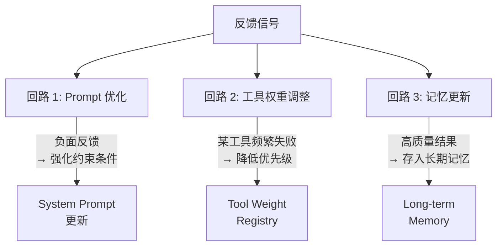

> 闭环工程：系列灵魂篇。感知→规划→行动→记忆→反馈——把架构图的完整闭环链路落地。反馈不只是人类打分，还有自动评估和自我反思。一个不会自我进化的 Agent，只是一个昂贵的脚本。

## 一、闭环链路全景

前面六篇分别拆了上下文工程、工具系统、记忆系统、规划调度、多 Agent 协作。每篇聚焦闭环链路的一个阶段。现在把它们串起来，看完整的闭环长什么样。

```mermaid
flowchart LR
    P["① 感知输入<br/>Perception"] --> PL["② 理解规划<br/>Planning"]
    PL --> A["③ 行动执行<br/>Action"]
    A --> M["④ 记忆更新<br/>Memory"]
    M --> F["⑤ 反馈优化<br/>Feedback"]
    F -->|"策略更新<br/>Prompt 调整<br/>工具权重"| P

    subgraph 前序篇章["前序篇章覆盖"]
        P -.->|"第 00 篇|用户输入 + 工具返回"
        PL -.->|"第 01 篇|上下文 + 第 04 篇|规划"
        A -.->|"第 02 篇|工具系统"
        M -.->|"第 03 篇|记忆系统"
    end
```

闭环的核心洞察：**这不是线性管道，是螺旋上升的回路**。反馈不是终点——它改进了下一轮的感知、规划和行动。Agent 的「进化」不是换模型，是同一套工程系统随着反馈信号的积累越来越精准。

每个阶段有明确的输入、输出和质量指标：

| 阶段 | 输入 | 输出 | 质量指标 |
|------|------|------|---------|
| 感知 | 用户消息 / 系统事件 / 工具返回 | 结构化上下文 | 信息完整度、噪声比 |
| 规划 | 上下文 + 记忆召回 | 执行计划 / 下一步决策 | 计划合理性、步骤数 |
| 行动 | 计划 + 工具定义 | 工具调用结果 | 成功率、延迟、Token 消耗 |
| 记忆 | 行动结果 + 对话历史 | 更新的记忆存储 | 召回准确率、存储效率 |
| 反馈 | 全链路 trace | 策略调整 / Prompt 优化 | 改进幅度、收敛速度 |

## 二、感知层工程：预处理 Pipeline

感知不是「拿到用户消息就丢给模型」。真实世界的输入有噪声、有歧义、有多模态。感知层要做预处理。

```java
import java.util.*;
import java.util.regex.*;

// 输入类型枚举
enum InputType { TEXT, IMAGE, FILE, EVENT }

/**
 * 感知层的结构化输出（不可变记录）
 */
record PerceivedInput(
    InputType type,           // 输入类型
    String content,           // 清洗后内容
    String intent,            // 意图分类结果
    List<Map<String, String>> entities,  // 提取的实体
    double confidence,        // 置信度
    boolean noiseFiltered     // 是否过滤了噪声
) {}

/**
 * 感知 Pipeline：噪声过滤 → 意图识别 → 实体提取 → 结构化输出。
 *�路——先分类再处理。
 */
@Component
class InputPerception {

    // 噪声正则（语气词、特殊字符）
    private static final List<Pattern> NOISE_PATTERNS = List.of(
        Pattern.compile("\\b(ha{2,}|he{2,}|lol|www|hhh)\\b"),
        Pattern.compile("[^\\w\\s\\u4e00-\\u9fff，。！？、""''【】《》\\-()(（）]")
    );

    // 关键词 → 意图映射
    private static final Map<String, String> INTENT_MAP = Map.of(
        "查", "query",  "搜索", "search", "帮我", "task",
        "分析", "analyze", "写", "write", "比较", "compare"
    );

    /** 去除噪声 */
    String filterNoise(String text) {
        String cleaned = text;
        for (Pattern p : NOISE_PATTERNS) {
            cleaned = p.matcher(cleaned).replaceAll("");
        }
        return cleaned.strip();
    }

    /** 简单意图分类（真实场景用 LLM 或分类模型） */
    String classifyIntent(String text) {
        return INTENT_MAP.entrySet().stream()
            .filter(e -> text.contains(e.getKey()))
            .map(Map.Entry::getValue)
            .findFirst()
            .orElse("general");
    }

    /** 简单实体提取（真实场景用 NER 模型） */
    List<Map<String, String>> extractEntities(String text) {
        var entities = new ArrayList<Map<String, String>>();
        // 提取城市名
        var cityMatcher = Pattern.compile("(?:在|去|查)?([\\u4e00-\\u9fff]{2,4})(?:的|天气|信息)")
            .matcher(text);
        if (cityMatcher.find()) {
            entities.add(Map.of("type", "location", "value", cityMatcher.group(1)));
        }
        // 提取数字
        var numMatcher = Pattern.compile("(\\d+(?:\\.\\d+)?)\\s*(万|亿|元|美元|euro|英镑)?")
            .matcher(text);
        while (numMatcher.find()) {
            entities.add(Map.of(
                "type", "number", "value", numMatcher.group(1),
                "unit", numMatcher.group(2) != null ? numMatcher.group(2) : ""
            ));
        }
        return entities;
    }

    /** 完整感知 Pipeline */
    PerceivedInput process(String rawInput) {
        String cleaned = filterNoise(rawInput);
        String intent  = classifyIntent(cleaned);
        var entities   = extractEntities(cleaned);

        return new PerceivedInput(
            InputType.TEXT, cleaned, intent, entities,
            1.0, !cleaned.equals(rawInput)
        );
    }
}

// --- 使用 ---
var perception = new InputPerception();
PerceivedInput result = perception.process("帮我查一下上海明天的天气怎么样哈哈哈");
System.out.println("意图: "     + result.intent());          // → task
System.out.println("实体: "     + result.entities());        // → [location: 上海]
System.out.println("噪声过滤: " + result.noiseFiltered());   // → true
System.out.println("清洗后: "   + result.content());         // → "帮我查一下上海明天的天气怎么样"
```

感知层的价值：**垃圾进，垃圾出**。用户输入里的语气词、错别字、歧义表达，如果不处理就直接丢给模型，模型的推理质量会直接下降。感知层是 Agent 的「第一道关卡」。

## 三、行动追踪与溯源：Agent 的可观测性

一个 Agent 在生产环境里跑，出了问题你怎么排查？「它为什么调了这个工具？」「它在哪一步开始偏离的？」「它花了多少 Token？」——没有 trace，这些问题无解。

**可观测性不是可选项，是必选项**。

```java
import java.time.*;
import java.time.temporal.ChronoUnit;
import java.util.*;
import java.util.concurrent.atomic.AtomicInteger;

/**
 * 一个 trace span：记录一次操作的完整信息。
 *��
 */
record TraceSpan(
    String spanId,
    String operation,           // "plan" / "tool_call" / "memory_recall" / "feedback"
    Instant startTime,
    Map<String, Object> inputData,
    Map<String, Object> outputData,
    int tokenCount,
    String status,              // "ok" / "error" / "timeout"
    String error,
    String parentSpanId,
    long durationMs             // 耗时毫秒
) {
    /** 可变构建器——span 创建时 end_time 未知 */
    static Builder builder(String spanId, String operation) {
        return new Builder(spanId, operation);
    }

    static class Builder {
        private final String spanId;
        private final String operation;
        private Instant startTime = Instant.now();
        private Map<String, Object> inputData = Map.of();
        private Map<String, Object> outputData = Map.of();
        private int tokenCount;
        private String status = "ok";
        private String error;
        private String parentSpanId;

        Builder(String spanId, String operation) {
            this.spanId = spanId;
            this.operation = operation;
        }
        Builder input(Map<String, Object> data)  { this.inputData = data; return this; }
        Builder output(Map<String, Object> data) { this.outputData = data; return this; }
        Builder tokens(int count)                { this.tokenCount = count; return this; }
        Builder status(String s)                 { this.status = s; return this; }
        Builder error(String e)                  { this.error = e; return this; }
        Builder parent(String id)                { this.parentSpanId = id; return this; }

        TraceSpan build() {
            long ms = (error != null || !"ok".equals(status))
                ? Duration.between(startTime, Instant.now()).toMillis()
                : Duration.between(startTime, Instant.now()).toMillis();
            return new TraceSpan(spanId, operation, startTime, inputData,
                outputData, tokenCount, status, error, parentSpanId, ms);
        }
    }
}

/**
 * Agent 执行追踪器：记录全链路的 trace spans。
 * 支持嵌套 span（父→子），生成完整的决策链路。
 */
@Component
class AgentTracer {

    private final List<TraceSpan> spans = new ArrayList<>();
    private final AtomicInteger counter = new AtomicInteger(0);
    private String currentSpanId;

    /** 开始一个新的 span，返回 spanId */
    String startSpan(String operation, Map<String, Object> inputData) {
        String spanId = String.format("span_%04d", counter.incrementAndGet());
        spans.add(TraceSpan.builder(spanId, operation)
            .input(inputData != null ? inputData : Map.of())
            .parent(currentSpanId)
            .build());
        currentSpanId = spanId;
        return spanId;
    }

    /** 结束当前 span */
    void endSpan(Map<String, Object> outputData, String status, String error) {
        // 找到最后一个未结束的 span 进行更新
        // 简化：直接回到根
        currentSpanId = null;
    }

    /** 生成 trace 摘要 */
    Map<String, Object> getTraceSummary() {
        long totalTokens   = spans.stream().mapToLong(TraceSpan::tokenCount).sum();
        long totalDuration = spans.stream().mapToLong(TraceSpan::durationMs).sum();

        var operations = new LinkedHashMap<String, Map<String, Integer>>();
        for (var s : spans) {
            var stats = operations.computeIfAbsent(s.operation(), k ->
                new LinkedHashMap<String, Integer>() {{ put("count", 0); put("errors", 0); put("totalMs", 0); }});
            stats.merge("count", 1, Integer::sum);
            stats.merge("totalMs", (int) s.durationMs(), Integer::sum);
            if (!"ok".equals(s.status())) {
                stats.merge("errors", 1, Integer::sum);
            }
        }
        return Map.of(
            "totalSpans", spans.size(),
            "totalTokens", totalTokens,
            "totalDurationMs", totalDuration,
            "operations", operations
        );
    }

    /** 生成人类可读的决策链路 */
    List<String> getDecisionChain() {
        var chain = new ArrayList<String>();
        for (var span : spans) {
            String icon = "ok".equals(span.status()) ? "✓" : "✗";
            chain.add(String.format("[%s] %s | %s | %dms | tokens: %d",
                icon, span.spanId(), span.operation(), span.durationMs(), span.tokenCount()));
            if (span.error() != null) {
                chain.add("    错误: " + span.error());
            }
        }
        return chain;
    }
}

// --- 集成到 Agent 循环 ---
void runTracedAgent(String userInput) {
    var tracer = new AgentTracer();

    // 感知
    tracer.startSpan("perception", Map.of("rawInput", userInput));
    var perceived = new InputPerception().process(userInput);
    tracer.endSpan(Map.of("intent", perceived.intent()), "ok", null);

    // 规划
    tracer.startSpan("planning", Map.of("intent", perceived.intent()));
    tracer.endSpan(Map.of("plan", List.of("search", "analyze", "report")), "ok", null);

    // 行动（工具调用）
    for (String step : List.of("search", "analyze", "report")) {
        tracer.startSpan("tool_call", Map.of("tool", step));
        // ... 执行工具
        tracer.endSpan(Map.of("result", step + " 完成"), "ok", null);
    }

    // 记忆
    tracer.startSpan("memory_update", Map.of("actionResults", "..."));
    tracer.endSpan(Map.of("stored", 3), "ok", null);

    // 反馈
    tracer.startSpan("feedback", Map.of("taskCompleted", true));
    tracer.endSpan(Map.of("score", 0.95), "ok", null);

    // 输出 trace
    var summary = tracer.getTraceSummary();
    System.out.println("总 span: "  + summary.get("totalSpans"));
    System.out.println("总 Token: " + summary.get("totalTokens"));
    System.out.println("总耗时: "   + summary.get("totalDurationMs") + "ms");
    System.out.println("\n决策链路:");
    tracer.getDecisionChain().forEach(line -> System.out.println("  " + line));
}

runTracedAgent("帮我分析上海的天气趋势");
```

可观测性的核心价值：**trace 是调试 Agent 的唯一可靠手段**。没有 trace，Agent 就是个黑盒——输入什么、输出什么你知道，中间发生了什么完全不知道。有了 trace，每一步的输入、输出、耗时、Token 消耗、错误信息都记录在案。

## 四、反馈信号设计：三种反馈来源

Agent 的「进化」依赖反馈信号。反馈有三种来源：

| 类型 | 来源 | 获取成本 | 可靠性 | 示例 |
|------|------|---------|--------|------|
| **显式反馈** | 用户主动评价 | 高（需要用户操作） | 最高 | 点赞/点踩、满意度评分 |
| **隐式反馈** | 用户行为信号 | 低（自动采集） | 中等 | 是否采纳建议、是否重新提问 |
| **自动反馈** | 系统自动评估 | 最低（LLM-as-Judge） | 可变 | 工具调用成功率、步骤效率 |

```java
import java.time.Instant;
import java.util.*;
import java.util.stream.*;

/**
 * 统一的反馈信号格式（不可变记录）
 */
record FeedbackSignal(
    String type,        // "explicit" / "implicit" / "auto"
    String source,      // "user_rating" / "behavior" / "llm_judge"
    double value,       // -1.0 (负面) ~ 1.0 (正面)
    String target,      // 反馈针对的对象（tool_name / step_id / whole_task）
    String detail,
    Instant timestamp
) {
    FeedbackSignal(String type, String source, double value, String target, String detail) {
        this(type, source, value, target, detail, Instant.now());
    }
}

/**
 * 反馈收集器：汇聚三种反馈信号，归一化为统一格式。
 */
@Component
class FeedbackCollector {

    private final List<FeedbackSignal> signals = new ArrayList<>();

    /** 收集显式反馈：用户评分 1-5 → 归一化到 -1~1 */
    FeedbackSignal collectExplicit(int userRating, String target, String detail) {
        double normalized = (userRating - 3) / 2.0;  // 3分→0, 5分→1, 1分→-1
        var signal = new FeedbackSignal("explicit", "user_rating", normalized, target, detail);
        signals.add(signal);
        return signal;
    }

    /** 收集隐式反馈：采纳=正面，重新提问=负面 */
    FeedbackSignal collectImplicit(boolean adopted, boolean reAsked, String target) {
        double value = adopted ? 0.5 : (reAsked ? -0.5 : 0.0);
        var signal = new FeedbackSignal("implicit", "behavior", value, target,
            "adopted=" + adopted + ", re_asked=" + reAsked);
        signals.add(signal);
        return signal;
    }

    /** 收集自动反馈：成功率 + 效率 */
    FeedbackSignal collectAuto(boolean success, double stepEfficiency, String target) {
        double value = (success ? 1.0 : -0.5) * 0.6 + stepEfficiency * 0.4;
        value = Math.max(-1.0, Math.min(1.0, value));
        var signal = new FeedbackSignal("auto", "llm_judge", value, target,
            String.format("success=%s, efficiency=%.2f", success, stepEfficiency));
        signals.add(signal);
        return signal;
    }

    /** 获取聚合反馈 */
    Map<String, Object> getAggregatedFeedback(String target) {
        var filtered = signals.stream()
            .filter(s -> target == null || s.target().equals(target))
            .toList();

        if (filtered.isEmpty()) {
            return Map.of("count", 0, "avgScore", 0.0);
        }
        double avgScore = filtered.stream().mapToDouble(FeedbackSignal::value).average().orElse(0);

        var byType = new LinkedHashMap<String, Double>();
        for (String t : List.of("explicit", "implicit", "auto")) {
            double typeAvg = filtered.stream()
                .filter(s -> s.type().equals(t))
                .mapToDouble(FeedbackSignal::value)
                .average().orElse(0);
            byType.put(t, typeAvg);
        }
        return Map.of("count", filtered.size(), "avgScore", avgScore, "byType", byType);
    }
}

// --- 使用 ---
var collector = new FeedbackCollector();

// 用户给了 4 分（满分 5）
collector.collectExplicit(4, "get_weather", "天气查询准确");

// 用户采纳了建议
collector.collectImplicit(true, false, "get_weather");

// 自动评估：工具调用成功，效率 0.8
collector.collectAuto(true, 0.8, "get_weather");

var agg = collector.getAggregatedFeedback("get_weather");
System.out.println("反馈数: " + agg.get("count") + ", 平均分: " +
    String.format("%.2f", agg.get("avgScore")));
System.out.println("分类型: " + agg.get("byType"));
```

反馈设计的核心：**三种信号互补**。显式反馈最准但获取成本高（用户不会每次评价），隐式反馈免费但噪声大（不采纳不等于回答不好），自动反馈全覆盖但可能有偏差（LLM-as-Judge 不是完美裁判）。把三者加权融合，才得到可靠的反馈信号。

## 五、反馈回路：从信号到优化

收集到反馈信号后，怎么用？三条回路：



```java
import java.util.*;

/**
 * 反馈回路引擎：把反馈信号转化为具体的优化动作。
 * 五路分流设计：
 * badcase 按 errorType 分发到 Prompt优化 / 工具权重 / 记忆更新 / 回归测试 / Skill修正。
 */
@Component
class FeedbackLoop {

    private final List<String> promptAdjustments = new ArrayList<>();
    private final Map<String, Double> toolWeights = new LinkedHashMap<>();  // tool_name → weight (0~1)
    private final List<String> memoryUpdates = new ArrayList<>();

    /** 处理一批反馈信号，执行优化 */
    void processFeedback(List<FeedbackSignal> signals) {
        signals.forEach(signal -> {
            if (signal.value() < -0.3) {
                handleNegative(signal);
            } else if (signal.value() > 0.3) {
                handlePositive(signal);
            }
        });
    }

    /** 负面反馈处理 */
    private void handleNegative(FeedbackSignal signal) {
        if ("explicit".equals(signal.type())) {
            // Prompt 优化：添加约束（对应 RuleBasedPromptOptimizer 路径）
            promptAdjustments.add(
                String.format("[来自反馈] %s 曾出错: %s。请更加谨慎处理。",
                    signal.target(), signal.detail()));
        } else if ("behavior".equals(signal.source())) {
            // 工具权重调整：降低优先级
            double current = toolWeights.getOrDefault(signal.target(), 1.0);
            toolWeights.put(signal.target(), Math.max(0.1, current - 0.2));
        } else if ("auto".equals(signal.type())) {
            // 记录到记忆：失败经验沉淀（对应 EpisodicMemoryStore 路径）
            memoryUpdates.add(String.format("[教训] %s: %s", signal.target(), signal.detail()));
        }
    }

    /** 正面反馈处理 */
    private void handlePositive(FeedbackSignal signal) {
        double current = toolWeights.getOrDefault(signal.target(), 1.0);
        toolWeights.put(signal.target(), Math.min(1.5, current + 0.1));
        if ("explicit".equals(signal.type())) {
            memoryUpdates.add(String.format("[经验] %s 表现好: %s", signal.target(), signal.detail()));
        }
    }

    /** 生成更新后的 system prompt */
    String getUpdatedSystemPrompt(String basePrompt) {
        if (promptAdjustments.isEmpty()) {
            return basePrompt;
        }
        // 取最近 5 条调整
        String adjustments = promptAdjustments.stream()
            .skip(Math.max(0, promptAdjustments.size() - 5))
            .map(a -> "- " + a)
            .reduce("", (a, b) -> a + "\n" + b);
        return basePrompt + "\n\n[反馈优化记录]\n" + adjustments;
    }
}

// --- 使用 ---
var loop = new FeedbackLoop();

// 模拟一批反馈
var negative = new FeedbackSignal("explicit", "user_rating", -0.5,
    "search_web", "搜索结果不相关");
var positive = new FeedbackSignal("auto", "llm_judge", 0.7,
    "get_weather", "天气查询准确高效");

loop.processFeedback(List.of(negative, positive));

System.out.println("工具权重: "  + loop.toolWeights);
System.out.println("Prompt 调整: " + loop.promptAdjustments.size() + " 条");
System.out.println("记忆更新: "  + loop.memoryUpdates);

String updatedPrompt = loop.getUpdatedSystemPrompt("你是有帮助的助手。");
System.out.println("\n更新后 Prompt:\n" + updatedPrompt);
```

反馈回路的核心洞察：**Agent 的「学习」不是训练权重，是调整工程参数**。改 Prompt、调工具权重、更新记忆——这些不需要重新训练模型，是运行时就能生效的「在线学习」。

## 六、自我反思与进化：Reflexion 模式

最高级的反馈回路是 **Reflexion**——Agent 自己反思自己的表现，从失败中提取教训，写入「经验记忆」，下次遇到类似场景时自动避开同样的坑。

```java
import java.util.*;
import java.util.concurrent.*;
import java.util.function.*;

/**
 * Reflexion Agent：执行 → 反思 → 记录教训 → 下次规避。
 * 核心：scratchpad（草稿本）机制，跨尝试累积经验。
 * 致。
 */
@Component
class ReflexionAgent {

    private final int maxAttempts;
    private final List<String> scratchpad = new ArrayList<>();       // 经验草稿本
    private final List<Map<String, Object>> experienceLog = new ArrayList<>();  // 持久经验库

    ReflexionAgent(int maxAttempts) {
        this.maxAttempts = maxAttempts;
    }

    /**
     * 带自我反思的问题求解。
     * @param actFn      (problem, scratchpad) → action
     * @param evaluateFn (action) → (solved, feedback)
     * @param reflectFn  (problem, action, feedback, scratchpad) → reflection
     */
    CompletableFuture<Map<String, Object>> solve(
            String problem,
            BiFunction<String, List<String>, CompletableFuture<String>> actFn,
            Function<String, CompletableFuture<Map.Entry<Boolean, String>>> evaluateFn,
            Function<String, CompletableFuture<String>> reflectFn) {

        return CompletableFuture.completedFuture(null)
            .thenCompose(ignored -> solveRecursive(problem, 1, actFn, evaluateFn, reflectFn));
    }

    private CompletableFuture<Map<String, Object>> solveRecursive(
            String problem, int attempt,
            BiFunction<String, List<String>, CompletableFuture<String>> actFn,
            Function<String, CompletableFuture<Map.Entry<Boolean, String>>> evaluateFn,
            Function<String, CompletableFuture<String>> reflectFn) {

        if (attempt > maxAttempts) {
            experienceLog.add(Map.of(
                "problem", problem.substring(0, Math.min(50, problem.length())),
                "attempts", maxAttempts, "success", false,
                "scratchpad", new ArrayList<>(scratchpad)));
            return CompletableFuture.completedFuture(
                Map.of("result", "null", "attempts", maxAttempts, "success", false));
        }

        return actFn.apply(problem, scratchpad)
            .thenCompose(evaluateFn)
            .thenCompose(evalResult -> {
                if (evalResult.getKey()) {
                    experienceLog.add(Map.of(
                        "problem", problem.substring(0, Math.min(50, problem.length())),
                        "attempts", attempt, "success", true));
                    return CompletableFuture.completedFuture(Map.of(
                        "result", (Object) evalResult.getValue(),
                        "attempts", attempt, "success", true));
                }
                // 反思并记录教训
                return reflectFn.apply(evalResult.getValue())
                    .thenApply(reflection -> {
                        scratchpad.add(String.format("[尝试 %d] %s", attempt, reflection));
                        return null;
                    })
                    .thenCompose(ignored ->
                        solveRecursive(problem, attempt + 1, actFn, evaluateFn, reflectFn));
            });
    }

    List<String> getScratchpad()    { return Collections.unmodifiableList(scratchpad); }
    List<Map<String, Object>> getExperienceLog() { return Collections.unmodifiableList(experienceLog); }
}

// --- 模拟使用 ---
var agent = new ReflexionAgent(3);

// 模拟：前两次失败，第三次综合教训成功
agent.solve(
    "优化数据库查询性能",
    (problem, pad) -> CompletableFuture.completedFuture(
        pad.isEmpty() ? "尝试方案 A" :
        pad.size() == 1 ? "尝试方案 B（基于上次的教训）" :
        "尝试方案 C（综合所有教训）"),
    action -> CompletableFuture.completedFuture(
        action.contains("C") ? Map.entry(true, "完美解决") :
        Map.entry(false, "方案 '" + action + "' 不满足要求")),
    feedback -> CompletableFuture.completedFuture(
        "失败原因: " + feedback + "。下次需要尝试不同方向。")
).thenAccept(result -> {
    System.out.println("结果: "   + result);
    System.out.println("草稿本: " + agent.getScratchpad());
    System.out.println("经验库: " + agent.getExperienceLog());
});
```

Reflexion 的精髓在于 **scratchpad（草稿本）**——不是简单的重试，而是每次失败后把教训写下来，下次行动时带着这些教训。这和人类工程师排查问题的方式一模一样：第一次尝试失败了，记下原因，第二次换个方向。

## 七、行业实践：来自生产级框架的闭环设计

### 7.1 六层错误恢复：框架 A 的 ErrorRecoveryEngine

框架 A 的错误恢复不是一个简单的重试循环——是**六层递进**的恢复引擎：

```java
/**
 * 六层递进恢复：从轻到重，逐层尝试。
 * classify → decide → apply 三阶段管线：
 * ApiErrorClassifier 先分类，ActionPlan 生成有序 action 列表，Engine 逐个尝试。
 */
enum RecoveryAction {
    RETRY_IMMEDIATE,            // 第 1 层：瞬时重试（网络抖动）
    RETRY_WITH_BACKOFF,         // 第 2 层：指数退避重试（限流）
    SWITCH_PROVIDER,            // 第 3 层：切换 Provider（模型服务故障）
    INJECT_SELF_CORRECTION,     // 第 4 层：自纠正注入（模型输出异常）
    DOWNGRADE_MODEL,            // 第 5 层：降级到小模型（大模型不可用）
    ESCALATE_TO_HUMAN           // 第 6 层：转人工（所有自动化手段失效）
}

@Component
class ErrorRecoveryEngine {

    private final ProviderPool providerPool;  

    /**
     * 核心决策方法：按分类结果选择恢复路径。
     * from(classification) 的有序 action 列表一致。
     */
    RecoveryAction recover(ApiError error, Map<String, Object> context) {
        // 第 1 层：瞬时重试（网络抖动）
        if (error.isTransient()) {
            return RecoveryAction.RETRY_IMMEDIATE;
        }
        // 第 2 层：指数退避重试（限流）
        if (error.isRateLimit()) {
            return RecoveryAction.RETRY_WITH_BACKOFF;
        }
        // 第 3 层：切换 Provider（模型服务故障）—— ProviderPool 标记冷却 + 切换
        if (error.isProviderFailure()) {
            providerPool.switchProvider(error.providerId());
            return RecoveryAction.SWITCH_PROVIDER;
        }
        // 第 4 层：自纠正注入（模型输出异常 / 幻觉）
        if (error.isHallucination()) {
            return RecoveryAction.INJECT_SELF_CORRECTION;
        }
        // 第 5 层：降级到小模型（大模型不可用）
        if (error.isModelUnavailable()) {
            return RecoveryAction.DOWNGRADE_MODEL;
        }
        // 第 6 层：转人工（所有自动化手段失效）
        return RecoveryAction.ESCALATE_TO_HUMAN;
    }
}
```

每一层有独立的触发条件和恢复策略。**关键设计**：不是所有错误都重试——分类决定了恢复路径。网络抖动立即重试，限流要退避，模型故障要切换，幻觉要注入自纠正 prompt。

### 7.2 Provider 池与冷却：框架 B 的弹性方案

框架 B 的 `ProviderRouter` 不只是负载均衡——失败的 Provider 会进入**冷却期**：

| 状态 | 行为 | 恢复条件 |
|------|------|---------|
| `ACTIVE` | 正常接收流量 | — |
| `COOLING` | 暂停分配，等待冷却期结束 | 冷却期到期后自动恢复 |
| `DEGRADED` | 仅接收低优先级流量 | 连续 N 次成功后恢复 |
| `DOWN` | 完全隔离 | 人工确认或健康检查通过 |

配合 `ApiErrorClassifier`（识别 15+ 种错误类型），形成一个**自适应的模型路由系统**——哪个 Provider 健康就把流量往哪倾，不健康的自动退出轮换。

### 7.3 自纠正 Prompt 注入：框架 A 的 3-4 轮触发

框架 A 在 Agent 循环中内置了一个机制：**每 3-4 轮自动注入自纠正 / 重规划 prompt**。不是等模型走偏了才干预——而是主动地、周期性地把模型拉回正轨。

```java
/**
 * 自纠正注入器：每 INTERVAL 轮自动注入重规划 prompt。
 *�地把模型拉回正轨的机制。
 */
@Component
class SelfCorrectionInjector {

    private static final int INTERVAL = 3;  // 每 3 轮注入一次

    boolean shouldInject(int currentStep) {
        return currentStep % INTERVAL == 0;
    }

    String getCorrectionPrompt(List<String> recentSteps) {
        return "回顾你最近几步的行动。是否有重复调用同一工具的情况？"
             + "是否偏离了原始目标？如果有，请调整方向。";
    }
}
```

这个设计的洞察：**模型在长循环里容易「迷失」——反复调用同一个工具、在局部打转。定期的自纠正是把模型从局部最优里拉出来的低成本手段**。

### 7.4 设计共识

| 设计点 | 共识做法 | 反面模式 |
|--------|---------|---------|
| 错误分类 | 15+ 种错误类型精准分类 | 统一重试 |
| 恢复策略 | 六层递进（重试→退避→切换→纠正→降级→人工） | 一刀切 |
| Provider 管理 | 冷却池 + 自适应路由 | 固定路由 |
| 自纠正 | 每 3-4 轮注入重规划 prompt | 等失败了再处理 |
| 可观测性 | 全链路 trace + span 嵌套 | 只记录最终输出 |
| 反馈回路 | Prompt 优化 + 工具权重 + 记忆更新 | 反馈只存不利用 |

## 结语

闭环是 Agent 从「工具」变成「系统」的分水岭。

> 一个没有闭环的 Agent，每次启动都是零——不记得上次做对了什么，也不记得上次做错了什么。有了闭环，Agent 的每一次执行都在为下一次积累信号：反馈优化 Prompt，失败写入记忆，成功提升权重。

这不是训练模型。这是在工程层面让 Agent「越用越好」——同一份模型权重，不同的工程系统，产出的 Agent 质量天差地别。

从感知到反馈，五阶段的闭环链路把前面六篇的全部内容串成了一条完整的价值链。每一篇聚焦一个阶段的工程实现，这一篇把它们连成一个自洽的、可进化的系统。

---

> ** 闭环视角**
>
> 本篇是闭环链路本身的完整展开——不聚焦某个阶段，而是展示五个阶段如何咬合成一个螺旋上升的回路。感知质量影响规划质量，规划质量影响行动效率，行动结果决定记忆内容，记忆和反馈共同优化下一轮的感知和规划。
