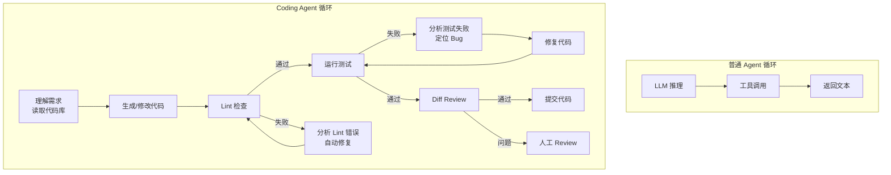
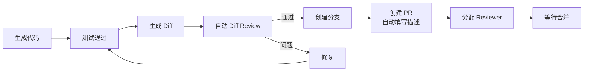

> 造一个好 Agent 系列（十四）：Coding Agent 是当前最热的 Agent 形态。但它远不止「帮写代码」那么简单——它是一个完整的工程循环：理解需求、生成代码、Lint 检查、运行测试、分析失败、自动修复、Diff Review。每一步都需要工程化的保障：Sandbox 隔离执行、多文件协同编辑、测试驱动开发、自愈循环。从架构到实现，完整拆解。

## 一、Coding Agent 与普通 Agent 的区别

普通 Agent 的输出是一段文本。Coding Agent 的输出是**会跑的代码**——它需要编译、需要通过测试、需要不引入安全漏洞。这意味着 Coding Agent 的每一步都需要比文本 Agent 更严格的校验。

| 维度 | 普通 Agent | Coding Agent |
|------|-----------|-------------|
| 输出 | 文本/JSON | 可执行代码 |
| 校验 | 格式校验 | 编译 + Lint + 测试 |
| 执行环境 | 无 | 需要隔离 Sandbox |
| 修改范围 | 上下文内 | 可能跨多个文件 |
| 失败后果 | 回答不准确 | 代码崩溃、安全漏洞 |
| 自愈能力 | 重试即可 | 分析错误 → 定位 → 修复 |



## 二、代码理解：结构化分片

Coding Agent 首先需要理解现有代码。不是把整个文件丢给模型——而是按语言结构智能分片，让模型看到精确的代码块。

### 2.1 语言感知的代码分片

```java
/**
 * 代码分片器：按编程语言的语法结构分割代码，保留完整的函数/类体。
 * 不同语言用不同的分割策略。
 */
@Component
public class CodeSplitter implements DocumentSplitter {

    private final Map<String, Function<String, List<String>>> strategies = Map.of(
        "java",   this::splitByBraces,
        "python", this::splitByIndent,
        "go",     this::splitByBraces,
        "ts",     this::splitByBraces
    );

    public List<Document> split(Document doc) {
        String language = (String) doc.getMetadata().get("language");
        String code = doc.getContent();
        Function<String, List<String>> strategy = strategies.getOrDefault(language, this::splitByBraces);
        return strategy.apply(code).stream()
            .filter(b -> !b.isBlank())
            .map(b -> new Document(b, Map.of("language", language, "sourcePath", doc.getMetadata().get("sourcePath"))))
            .toList();
    }

    /** Java/Go/TS：按花括号平衡匹配，保留完整的函数/类体 */
    private List<String> splitByBraces(String code) {
        List<String> blocks = new ArrayList<>();
        int depth = 0, start = 0;
        boolean inString = false, inChar = false;
        char prev = 0;

        for (int i = 0; i < code.length(); i++) {
            char c = code.charAt(i);
            // 跳过字符串和字符常量内的花括号
            if (c == '"' && prev != '\\') inString = !inString;
            if (c == '\'' && prev != '\\') inChar = !inChar;
            if (inString || inChar) { prev = c; continue; }

            if (c == '{') depth++;
            else if (c == '}') {
                depth--;
                if (depth == 0) {
                    blocks.add(code.substring(start, i + 1).trim());
                    start = i + 1;
                }
            }
            prev = c;
        }
        return blocks;
    }

    /** Python：按缩进级别分割（顶级函数/类） */
    private List<String> splitByIndent(String code) {
        List<String> blocks = new ArrayList<>();
        String[] lines = code.split("\n");
        StringBuilder current = new StringBuilder();
        int topIndent = -1;

        for (String line : lines) {
            if (line.isBlank()) { current.append(line).append("\n"); continue; }
            int indent = leadingSpaces(line);
            if (topIndent < 0) topIndent = indent;
            if (indent <= topIndent && current.length() > 0) {
                blocks.add(current.toString().trim());
                current.setLength(0);
            }
            current.append(line).append("\n");
        }
        if (current.length() > 0) blocks.add(current.toString().trim());
        return blocks;
    }
}
```

**关键设计**：字符串内的花括号不能被误判为代码块边界。`splitByBraces` 用状态机跟踪是否在字符串/字符常量内。

## 三、Sandbox 执行：代码必须在隔离环境跑

生成的代码不能直接在宿主环境执行——可能有死循环、文件删除、网络请求。Sandbox 是 Coding Agent 的安全底线。

### 3.1 危险模式黑名单

```java
/**
 * Sandbox 代码安全检查：执行前扫描代码，拦截危险操作。
 * 多层防御：正则黑名单 + 文件系统隔离 + 跨用户隔离。
 */
@Component
public class SandboxCodeUtils {

    private static final List<Map.Entry<Pattern, String>> DANGEROUS_PATTERNS = List.of(
        Map.entry(Pattern.compile("os\\.system\\s*\\("), "沙箱禁止执行系统命令"),
        Map.entry(Pattern.compile("subprocess\\.(Popen|run|call|check_output)\\s*\\("), "沙箱禁止创建子进程"),
        Map.entry(Pattern.compile("\\b(eval|exec)\\s*\\("), "沙箱禁止动态代码执行"),
        Map.entry(Pattern.compile("ctypes\\."), "沙箱禁止底层内存操作"),
        Map.entry(Pattern.compile("multiprocessing\\."), "沙箱禁止多进程"),
        Map.entry(Pattern.compile("shutil\\.(rmtree|remove)\\s*\\("), "沙箱禁止删除文件"),
        Map.entry(Pattern.compile("open\\s*\\([^)]*,\\s*['\"]w['\"]"), "沙箱禁止写文件")
    );

    public List<String> check(String code) {
        return DANGEROUS_PATTERNS.stream()
            .filter(e -> e.getKey().matcher(code).find())
            .map(Map.Entry::getValue)
            .toList();
    }
}
```

### 3.2 三模式 Sandbox

```java
/**
 * Sandbox 执行器：三种隔离级别。
 * LOCAL：进程内沙箱，适合可信代码。
 * REMOTE：容器级隔离（E2B），适合不确定来源的代码。
 * FALLBACK：降级模式，沙箱不可用时拒绝执行。
 */
@Component
public class SandboxExecutor {

    private final SubprocessSandboxExecutor localExecutor;
    private final RemoteSandboxExecutor remoteExecutor;

    public SandboxResult execute(SandboxRequest request, SandboxMode mode) {
        return switch (mode) {
            case LOCAL -> localExecutor.execute(request);
            case REMOTE -> remoteExecutor.execute(request);
            case FALLBACK -> SandboxResult.reject("沙箱不可用，代码执行已拒绝");
        };
    }
}

/**
 * 本地子进程 Sandbox：文件系统隔离 + 危险模块移除 + 跨用户隔离。
 * 管理员用户可进入特权模式。
 */
@Component
public class SubprocessSandboxExecutor {

    public SandboxResult execute(SandboxRequest request) {
        // 1. 代码安全检查
        List<String> violations = codeUtils.check(request.code());
        if (!violations.isEmpty()) {
            return SandboxResult.reject(String.join("; ", violations));
        }

        // 2. 构建隔离环境
        Path sandboxDir = createIsolatedSandbox(request.userId());
        Map<String, String> env = new HashMap<>();
        env.put("SANDBOX_DIR", sandboxDir.toString());

        // 3. 管理员特权模式（调试用）
        if (request.userId() != null && isAdmin(request.userId())) {
            env.put("PRIVILEGED_MODE", "1");
        }

        // 4. 执行（超时 + 资源限制）
        return runSubprocess(request.code(), env, sandboxDir, request.timeoutMs());
    }
}
```

## 四、Lint → Test → Fix 自愈循环

Coding Agent 的核心循环不是「生成一次就完」——是**生成 → 检查 → 失败 → 分析 → 修复 → 再检查**，直到通过。

### 4.1 自愈循环引擎

```java
/**
 * Coding Agent 自愈循环：generate → lint → test → fix → retry。
 * 最大重试次数可配，防止无限循环。
 */
@Component
public class CodingAgentLoop {

    private final LlmClient llm;
    private final SandboxExecutor sandbox;
    private final CodeSplitter codeSplitter;
    private final int maxFixRounds = 5;

    public CodingResult generateAndVerify(CodingRequest request) {
        String code = generateCode(request);

        for (int round = 1; round <= maxFixRounds; round++) {
            // 1. Lint 检查
            LintResult lintResult = runLint(code, request.language());
            if (lintResult.hasErrors()) {
                code = fixCode(code, lintResult.errors(), request);
                continue;
            }

            // 2. 运行测试
            TestResult testResult = runTests(code, request);
            if (testResult.allPassed()) {
                return new CodingResult(code, testResult, round, true);
            }

            // 3. 分析失败并修复
            code = fixCode(code, testResult.failures(), request);
        }

        return new CodingResult(code, null, maxFixRounds, false);
    }

    /** 让 LLM 基于错误信息修复代码 */
    private String fixCode(String code, List<ErrorInfo> errors, CodingRequest request) {
        String prompt = """
            以下是代码和它产生的错误。请修复代码使其通过检查。
            
            原始代码：
            %s
            
            错误信息：
            %s
            
            请只输出修复后的完整代码，不要解释。
            """.formatted(code, formatErrors(errors));

        return llm.complete(prompt).content();
    }
}
```

### 4.2 测试驱动：先写测试再生成

比「生成代码再跑测试」更可靠的方式是**先写测试，再让模型生成满足测试的代码**。

```java
/**
 * 测试驱动代码生成：TDD 模式的 Coding Agent。
 * 1. 根据需求生成测试用例
 * 2. 运行测试（预期全部失败）
 * 3. 生成实现代码
 * 4. 运行测试（预期全部通过）
 * 5. 如果有失败，进入自愈循环
 */
@Component
public class TddCodingAgent {

    public CodingResult generateTdd(TddRequest request) {
        // 1. 生成测试用例
        String tests = generateTests(request.requirement(), request.language());

        // 2. 确认测试会失败（验证测试的有效性）
        TestResult preResult = runTests(tests, request.withoutImplementation());
        if (preResult.allPassed()) {
            return CodingResult.failed("测试用例在空实现下通过了，测试可能无效");
        }

        // 3. 生成实现代码
        String implementation = generateImplementation(request.requirement(), tests);
        String fullCode = tests + "\n" + implementation;

        // 4. 运行测试
        TestResult postResult = runTests(fullCode, request);
        if (postResult.allPassed()) {
            return new CodingResult(fullCode, postResult, 1, true);
        }

        // 5. 自愈修复
        return fixLoop(fullCode, postResult.failures(), request);
    }
}
```

## 五、多文件编辑：不是改一个文件那么简单

真实场景下，一个功能改动往往涉及多个文件——改了接口定义要改实现，改了实现要改测试。

### 5.1 变更计划

```java
/**
 * 多文件变更计划：先生成变更计划，经确认后批量执行。
 * 避免模型一次改太多文件导致混乱。
 */
public record ChangePlan(
    String description,
    List<FileChange> changes,
    List<String> newFiles
) {
    public record FileChange(
        String filePath,
        ChangeType type,      // CREATE / MODIFY / DELETE
        String oldContent,
        String newContent,
        String diff           // 统一格式的 diff
    ) {}

    public enum ChangeType { CREATE, MODIFY, DELETE }

    /** 生成人类可读的变更摘要 */
    public String summary() {
        StringBuilder sb = new StringBuilder();
        sb.append(description).append("\n");
        for (FileChange c : changes) {
            sb.append("  %s %s (%d 行变更)\n".formatted(
                c.type(), c.filePath(), countChangedLines(c.diff())));
        }
        for (String f : newFiles) {
            sb.append("  CREATE %s\n".formatted(f));
        }
        return sb.toString();
    }
}
```

### 5.2 Diff Review

```java
/**
 * Diff Review 引擎：对比变更前后的代码，生成可读的变更报告。
 * 用于自动审查和人工 Review 前的预检。
 */
@Component
public class DiffReviewer {

    private final LlmClient llm;

    /**
     * 自动 Diff Review：让 LLM 检查变更是否合理。
     * 检查项：逻辑正确性、边界处理、命名一致性、是否有遗漏的关联修改。
     */
    public ReviewResult review(String originalCode, String newCode, String changeDescription) {
        String diff = generateUnifiedDiff(originalCode, newCode);
        String prompt = """
            请审查以下代码变更。检查：
            1. 逻辑是否正确
            2. 边界条件是否处理
            3. 命名是否与现有代码一致
            4. 是否有遗漏的关联修改（如改了接口但没改实现）
            
            变更说明：%s
            Diff:
            %s
            
            输出 JSON: {"approved": bool, "issues": [...], "suggestions": [...]}
            """.formatted(changeDescription, diff);

        return llm.complete(prompt)
            .map(resp -> parseReviewResult(resp.getContent()))
            .block();
    }
}
```

## 六、Pull Request 自动化

Coding Agent 的最终产出不是代码文件——是一个可以 Review 和合并的 Pull Request。

### 6.1 PR 生成流程



```java
/**
 * PR 自动化服务：代码通过后自动创建分支、生成 PR 描述、分配 Reviewer。
 */
@Component
public class PrAutomation {

    private final GitClient gitClient;
    private final PrClient prClient;

    public PrResult createPr(CodingResult result, String featureBranch) {
        // 1. 创建特性分支
        gitClient.createBranch(featureBranch, "master");

        // 2. 提交代码
        gitClient.commit(result.code(), "feat: " + result.changeDescription());

        // 3. 生成 PR 描述（包含变更摘要、测试结果、Review 结论）
        String prBody = generatePrBody(result);

        // 4. 创建 PR
        return prClient.create(PrRequest.builder()
            .fromBranch(featureBranch)
            .toBranch("master")
            .title(result.changeDescription())
            .body(prBody)
            .reviewers(selectReviewers(result))
            .build());
    }

    /** 自动生成 PR 描述：包含变更摘要 + 测试报告 + 审查结论 */
    private String generatePrBody(CodingResult result) {
        return """
            ## 变更说明
            %s
            
            ## 测试结果
            - 总测试数: %d
            - 通过: %d
            - 失败: %d
            - 自愈轮次: %d
            
            ## Diff Review
            %s
            """.formatted(
                result.changeDescription(),
                result.testResult().totalTests(),
                result.testResult().passed(),
                result.testResult().failed(),
                result.fixRounds(),
                result.reviewResult().summary()
            );
    }
}
```

## 七、行业实践：Coding Agent 的设计共识

| 设计点 | 共识做法 | 反面模式 |
|--------|---------|---------|
| 代码理解 | 语言感知分片（花括号/缩进） | 整文件塞入 |
| 代码执行 | Sandbox 隔离 + 危险模式黑名单 | 直接在宿主环境执行 |
| 质量保证 | Lint → Test → Fix 自愈循环 | 生成一次就交付 |
| 测试策略 | TDD：先写测试再写实现 | 事后补测试 |
| 多文件变更 | 先出变更计划，确认后批量执行 | 一次改一堆文件 |
| 代码审查 | 自动 Diff Review + 人工 Review | 跳过 Review 直接合并 |
| PR 自动化 | 自动分支 + PR 描述 + Reviewer 分配 | 手动创建 PR |
| 自愈限制 | 最大重试次数 + 循环检测 | 无限重试 |

## 结语

Coding Agent 的价值不在于「写代码更快」，而在于**把代码质量保障的工程流程自动化了**。

> 从代码理解的结构化分片、Sandbox 的隔离执行、Lint-Test-Fix 的自愈循环、TDD 的测试驱动、多文件变更的计划确认，到 Diff Review 的自动审查、PR 的全流程自动化——Coding Agent 把软件工程的最佳实践编码进了 Agent 的循环里。

一个成熟的 Coding Agent 不是替代开发者，是把开发者从重复性的质量保证工作中解放出来——让人专注于架构设计和业务逻辑，让 Agent 处理代码生成的苦力活。

---

> **🔁 闭环视角**
>
> 本篇聚焦 Agent 闭环的**行动执行**阶段（代码形态）——Coding Agent 的行动不只是调用一个工具，而是一个包含生成、校验、测试、修复的完整子循环。自愈循环的每一次迭代都是反馈信号：测试失败告诉 Agent 哪里理解错了，Lint 错误告诉 Agent 代码风格不合规，Diff Review 告诉 Agent 变更不够合理。
