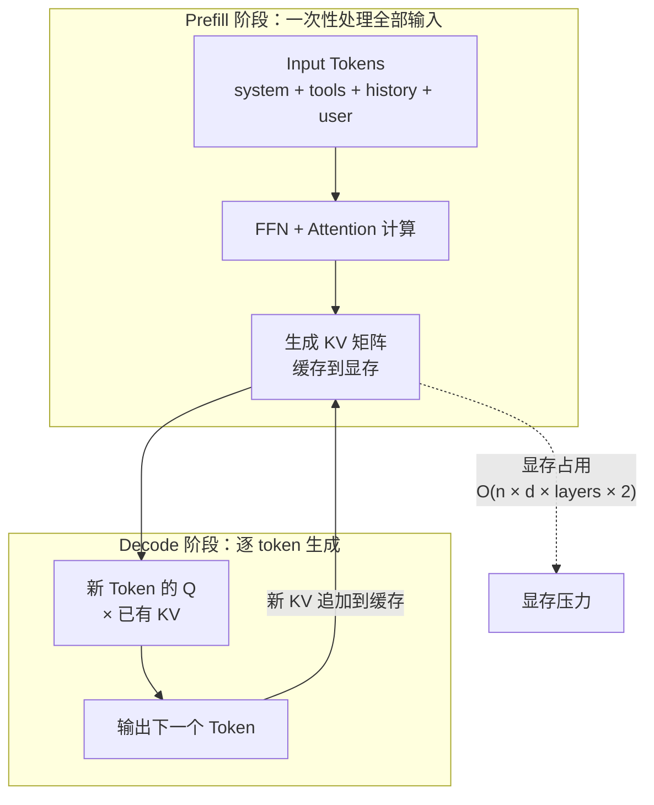
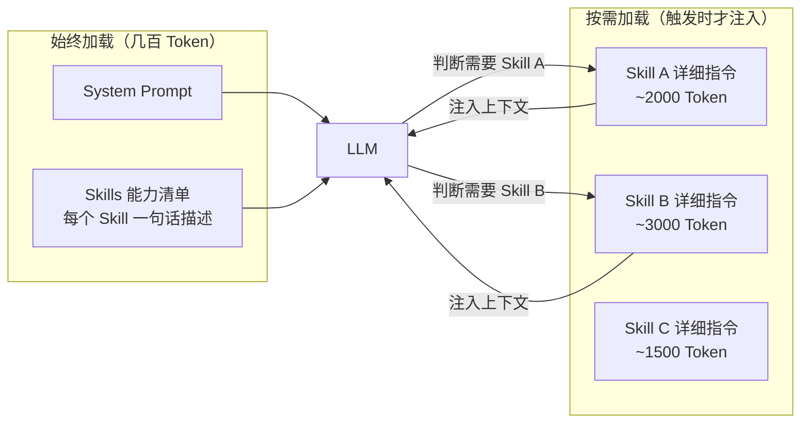

> 上下文工程：Token 就是内存，Prompt 就是操作系统。Agent 能力的天花板由模型决定，但上下文工程的厚薄，决定一个 Agent 是「能用」还是「好用」。

## 一、Token 经济学：Agent 最稀缺的资源

Agent 的循环靠的是把完整的 `messages` 列表每一轮都重发给模型。这意味着：**Agent 没有状态，它靠重放历史恢复记忆**。

重放历史的代价就是 Token。每一轮对话，模型要重新处理 system prompt、工具定义、全部历史消息、以及本轮的新输入。上下文窗口不是无限的——128K、200K、甚至 1M token 的窗口听起来很大，但一个带几十个工具定义的 Agent，光是工具声明就能吃掉上万 token，再叠加多轮对话的工具返回结果，窗口很快就会见底。

> **上下文窗口是 Agent 最稀缺的资源。谁能把有限的 Token 装进最关键的信息，谁就赢了。**

这不是 Prompt 技巧的问题，是工程系统的问题。一个成熟的 Agent 框架，上下文管理至少要做四件事：

| 职责 | 做什么 | 不做会怎样 |
|------|--------|------------|
| Token 预算 | 为 system / tools / history / results 分配额度 | 某一类信息撑爆窗口，其他信息被截断 |
| 缓存命中 | 稳定前缀走 KV Cache，减少重复计算 | 每轮全量推理，延迟和成本爆炸 |
| 动态压缩 | 超限时自动摘要 / 滑动窗口 / 关键提取 | 粗暴截断丢掉关键脉络 |
| 按需注入 | 工具和 Skills 不全量加载，需要时才塞入 | 工具定义撑爆上下文 |

把这四件事做好，就是上下文工程的全部。

## 二、KV Cache：Transformer 的「缓存」机制

理解上下文工程，先理解 Transformer 的 KV Cache。这是所有优化策略的物理基础。

Transformer 生成 token 时分两个阶段：**Prefill**（预填充）和 **Decode**（解码）。Prefill 阶段一次性处理全部输入 token，生成每层 attention 的 Key 和 Value 矩阵；Decode 阶段每生成一个新 token，只需拿新 token 的 Q 去和已有的 KV 矩阵做 attention，不用重新算前面所有 token 的 KV。



KV Cache 的显存占用公式：`O(n × d × layers × 2)`，其中 `n` 是上下文长度，`d` 是 hidden size，`layers` 是层数，`×2` 是 K 和 V 各一份。一个 70B 模型处理 128K 上下文，KV Cache 可以吃到 80GB+ 显存——这是长上下文昂贵的根本原因。

对 Agent 来说，KV Cache 带来一个关键洞察：**前缀可缓存**。如果连续两轮请求的前 N 个 token 完全一致，第二轮的 Prefill 只需要计算新增的那部分。在 Agent 场景里，system prompt + 工具定义通常几千 token 且几乎不变，这部分天然命中缓存。

```java
// KV Cache 显存估算（以 某 70B 级模型 为例）

/**
 * KV Cache 显存 = tokens × hiddenSize × layers × 2(K+V) × dtypeBytes
 * 某 70B 级模型: hiddenSize=8192, numLayers=80
 * 128K tokens: 128000 × 8192 × 80 × 2 × 2 ≈ 335 GB（远超单卡）
 */
static double estimateKvCacheMemory(int numTokens, int hiddenSize,
                                     int numLayers, int dtypeBytes) {
    long memoryBytes = (long) numTokens * hiddenSize * numLayers * 2 * dtypeBytes;
    return memoryBytes / Math.pow(1024, 3);  // 返回 GB
}

// 输出: 128K context: 327.7 GB
System.out.printf("128K context: %.1f GB%n",
    estimateKvCacheMemory(128_000, 8192, 80));
```

这就是为什么生产级 Agent 不会把 128K 窗口塞满——不是塞不进去，是塞进去之后推理成本直接起飞。**上下文工程的第一课：把上下文分成「稳定前缀」和「动态尾部」，前缀走缓存，尾部做压缩。**

## 三、上下文压缩三板斧

当对话越跑越长，工具返回结果越积越多，上下文迟早撞到上限。这时候不能粗暴截断——截断会丢掉「我之所以走到这一步」的关键脉络。成熟的 Harness 有三种压缩策略：

### 3.1 摘要压缩（Summary Compression）

用模型自己把历史压缩成一段摘要。保留关键决策路径和工具返回的结论，丢弃中间推理过程。

```java
/**
 * 把早期对话压缩成摘要，保留最近的 N 轮不压缩。
 * 适用于：长对话、多工具调用后需要腾出空间。
 */
List<Message> summaryCompress(List<Message> messages, LlmClient llmClient) {
    int KEEP_RECENT = 4;  // 最近 4 条消息保留原文

    if (messages.size() <= KEEP_RECENT + 2) {  // +2: system + 当前 user
        return messages;
    }

    // 提取需要压缩的部分（system 之后、最近 N 轮之前）
    var systemMsg = messages.get(0);
    var recent = messages.subList(messages.size() - KEEP_RECENT, messages.size());
    var toCompress = messages.subList(1, messages.size() - KEEP_RECENT);

    // 让模型自己压缩
    String compressPrompt = """
        将以下对话历史压缩为一段简洁的摘要，保留：
        1. 用户的核心诉求
        2. 已执行的关键工具调用及其结果
        3. 已做出的重要决策
        丢弃：中间推理过程、重复信息、已完成的中间步骤
        
        对话历史：
        """ + toCompress.stream()
            .filter(m -> m.content() != null)
            .map(m -> "[%s]: %s".formatted(m.role(), m.content()))
            .collect(Collectors.joining("\n"));

    String summary = llmClient.chat("qwen3", compressPrompt, 500);

    // 重组：system + 摘要 + 最近 N 轮
    var result = new ArrayList<Message>();
    result.add(systemMsg);
    result.add(Message.system("[历史摘要]\n" + summary));
    result.addAll(recent);
    return result;
}
```

### 3.2 滑动窗口（Sliding Window）

固定只保留最近 N 轮对话，更早的全部丢弃。简单粗暴，但有效——大多数 Agent 任务的关键信息都在最近几轮。

```java
/**
 * 保留 system prompt + 最近 N 轮（每轮 = user + assistant + 可能的 tool 消息）。
 * 适用于：短任务、对历史依赖弱的场景。
 */
List<Message> slidingWindow(List<Message> messages, int keepLastNRounds) {
    // system prompt 永远保留
    var system = messages.subList(0, 1);

    // 从后往前找最近 N 轮
    var rounds = new ArrayList<List<Message>>();
    var currentRound = new ArrayList<Message>();
    int roundCount = 0;

    for (var it = messages.listIterator(messages.size() - 1); it.hasPrevious(); ) {
        var msg = it.previous();
        currentRound.addFirst(msg);
        if ("user".equals(msg.role())) {
            rounds.addFirst(List.copyOf(currentRound));
            currentRound.clear();
            roundCount++;
            if (roundCount >= keepLastNRounds) break;
        }
    }
    if (!currentRound.isEmpty()) {
        rounds.addFirst(List.copyOf(currentRound));
    }

    var result = new ArrayList<>(system);
    rounds.stream().flatMap(Collection::stream).forEach(result::add);
    return result;
}
```

### 3.3 关键信息提取（Key Information Extraction）

最精细的策略——不是压缩整段对话，而是从每轮对话里抽取「关键事实」，组装成一份结构化的上下文摘要。

```java
/**
 * 从每轮对话提取关键信息（实体、决策、工具结果），组装成紧凑的结构化摘要。
 * 比摘要压缩更精准——不丢关键事实，只丢叙事外壳。
 */
List<Message> extractKeyInfo(List<Message> messages, LlmClient llmClient) {
    String EXTRACT_PROMPT = """
        从以下 Agent 对话中提取关键信息，输出 JSON 数组，每项包含：
        - type: 'decision' | 'tool_result' | 'fact' | 'user_intent'
        - content: 一句话描述
        
        只保留对后续任务有影响的信息。丢弃寒暄、重复、已覆盖的中间步骤。
        
        对话：
        """ + messages.subList(1, messages.size()).stream()
            .map(m -> "%s: %s".formatted(m.role(),
                m.content() != null ? m.content().substring(0, Math.min(200, m.content().length())) : ""))
            .collect(Collectors.joining("\n"));

    String extracted = llmClient.chat("qwen3", EXTRACT_PROMPT, 800);

    var system = messages.subList(0, 1);
    var recent = messages.subList(messages.size() - 2, messages.size());  // 保留最近一轮

    var result = new ArrayList<>(system);
    result.add(Message.system("[关键信息提取]\n" + extracted));
    result.addAll(recent);
    return result;
}
```

三种策略的选择不是非此即彼。一个成熟的 Agent 会根据当前上下文的 Token 占用情况，**分级触发**：轻度超限用滑动窗口，中度用摘要压缩，重度用关键信息提取。

## 四、Token 预算管理：像管理内存一样管理上下文

把上面的压缩策略串起来的，是一个 **Token Budget Manager**——像操作系统管理内存一样管理 Token 分配。

```java
/** Token 预算优先级：数字越大越优先保留 */
enum Priority {
    OLD_HISTORY(30), SKILLS(50), TOOL_RESULTS(60),
    RECENT_HISTORY(70), STATUS_BAR(80),
    TOOL_DEFINITIONS(90), SYSTEM_PROMPT(100);

    final int weight;
    Priority(int weight) { this.weight = weight; }
}

/**
 * Token 预算管理器。
 * 核心思路：为每类上下文信息分配优先级和额度，
 * 超限时按优先级从低到高压缩/丢弃。
 */
class TokenBudget {

    private final int maxTokens;
    private final int reserve;   // 预留 15% 给模型输出
    private final int usable;
    private final Map<String, Integer> allocated = new LinkedHashMap<>();

    // 类别名 → 优先级 的映射表
    private static final Map<String, Priority> CATEGORY_PRIORITY = Map.of(
        "system", Priority.SYSTEM_PROMPT,
        "tools", Priority.TOOL_DEFINITIONS,
        "status", Priority.STATUS_BAR,
        "recent", Priority.RECENT_HISTORY,
        "tool_results", Priority.TOOL_RESULTS,
        "history", Priority.OLD_HISTORY,
        "skills", Priority.SKILLS
    );

    TokenBudget(int maxTokens, double reserveRatio) {
        this.maxTokens = maxTokens;
        this.reserve = (int) (maxTokens * reserveRatio);
        this.usable = maxTokens - reserve;
    }

    TokenBudget(int maxTokens) { this(maxTokens, 0.15); }

    /**
     * 粗略估算 Token 数。
     * 生产级实现：
     *   sum(ceil(contentLength / 4) + 4 framing) * 1.2 safety
     * 此处简化为中英文混合估算，便于理解核心思路。
     */
    int estimateTokens(String text) {
        int cnChars = (int) text.chars()
            .filter(c -> c >= '一' && c <= '鿿').count();
        int enChars = text.length() - cnChars;
        return (int) ((cnChars / 1.5 + enChars / 4) * 1.2);  // ×1.2 安全系数
    }

    /** 分配 Token 额度，返回实际可使用的文本（可能被截断） */
    String allocate(String category, String text, Priority priority) {
        allocated.put(category, estimateTokens(text));
        return text;  // 分配阶段不截断，压缩阶段统一处理
    }

    int totalAllocated() {
        return allocated.values().stream().mapToInt(Integer::intValue).sum();
    }

    boolean isOverBudget() { return totalAllocated() > usable; }

    /**
     * 超预算时按优先级从低到高压缩。
     * categories: {categoryName → text}
     */
    Map<String, String> compress(Map<String, String> categories,
                                  String strategy) {
        if (!isOverBudget()) return new LinkedHashMap<>(categories);

        int overBy = totalAllocated() - usable;
        var result = new LinkedHashMap<>(categories);

        // 按优先级从低到高排序，先压缩低优先级的
        var sortedCats = categories.keySet().stream()
            .sorted(Comparator.comparingInt(c ->
                Optional.ofNullable(CATEGORY_PRIORITY.get(c))
                    .map(p -> p.weight).orElse(0)))
            .toList();

        for (var cat : sortedCats) {
            if (overBy <= 0) break;
            int catTokens = allocated.getOrDefault(cat, 0);
            if (catTokens == 0) continue;

            // 按比例压缩
            double reduceRatio = Math.min((double) overBy / catTokens, 0.8);  // 单次最多砍 80%
            String text = result.get(cat);
            int charsToKeep = (int) (text.length() * (1 - reduceRatio));
            result.put(cat, text.substring(0, charsToKeep) + "...");
            overBy -= (int) (catTokens * reduceRatio);
        }
        return result;
    }
}


// --- 使用示例 ---
var budget = new TokenBudget(32_000);

// 分配各类上下文
String systemText = "你是一个有帮助的助手。你需要使用工具来获取实时信息。";
String toolsText = """
    [
      {"name": "get_weather", "description": "获取天气", "params": {"city": "string"}},
      {"name": "search_web",  "description": "搜索网页", "params": {"query": "string"}}
    ]""";
String historyText = "用户: 帮我查一下上海天气\n助手: 上海今天晴，28°C...".repeat(20);
String statusText = "[状态] 第 3 步 | 剩余预算: 25000 tokens | 待办: 查完天气后查机票";

budget.allocate("system", systemText, Priority.SYSTEM_PROMPT);
budget.allocate("tools", toolsText, Priority.TOOL_DEFINITIONS);
budget.allocate("history", historyText, Priority.OLD_HISTORY);
budget.allocate("status", statusText, Priority.STATUS_BAR);

System.out.printf("总分配: %d / 可用: %d%n", budget.totalAllocated(), budget.usable);
System.out.printf("超预算: %b%n", budget.isOverBudget());

if (budget.isOverBudget()) {
    var originals = Map.of("system", systemText, "tools", toolsText,
                           "history", historyText, "status", statusText);
    var compressed = budget.compress(originals, "sliding");
    compressed.forEach((k, v) ->
        System.out.printf("%s: %d chars (原 %d chars)%n", k, v.length(),
            originals.get(k).length()));
}
```

这套 `TokenBudget` 的核心逻辑很简单：**分配 → 检查 → 按优先级压缩**。它不是要替代上面的三种压缩策略，而是决定「什么时候触发哪种策略」的调度器。

## 五、Skills 注入：按需加载，不全量塞入

工具一多，光定义就能吃掉上万 token。一个有 50 个工具的 Agent，如果每轮都把 50 个工具的 JSON Schema 塞进上下文，窗口很快就会不够用。

**Skills 的做法是渐进式披露**：



能力清单只占几百 token——每个 Skill 一行描述：`weather: 查询指定城市的实时天气和预报`。模型看到清单后，判断当前任务需要哪个 Skill，Harness 再去加载那个 Skill 的完整指令（可能几千 token），注入上下文。用完就丢，下一轮不再携带。

```java
/**
 * Skill 注册表：管理 Skills 的清单和按需加载。
 * 清单（轻）始终在上下文中，详情（重）按需注入。
 */
class SkillRegistry {

    record Skill(String name, String description, String fullInstruction) {}

    private final Map<String, Skill> skills = new LinkedHashMap<>();

    void register(String name, String description, String fullInstruction) {
        skills.put(name, new Skill(name, description, fullInstruction));
    }

    /** 返回能力清单（始终注入 system prompt） */
    String getCatalog() {
        var lines = new ArrayList<String>();
        lines.add("可用 Skills：");
        skills.values().forEach(s ->
            lines.add("  - %s: %s".formatted(s.name(), s.description())));
        return String.join("\n", lines);
    }

    /** 按需加载某个 Skill 的完整指令 */
    Optional<String> load(String name) {
        var skill = skills.get(name);
        if (skill == null) return Optional.empty();
        return Optional.of("[Skill: %s]\n%s".formatted(skill.name(), skill.fullInstruction()));
    }

    /**
     * 让模型判断需要哪个 Skill，然后加载。
     * 这是「渐进式披露」的关键一步。
     */
    Optional<String> detectAndLoad(String userMessage, LlmClient llmClient) {
        String catalog = getCatalog();
        String detectPrompt = """
            根据用户消息，判断是否需要调用某个 Skill。
            %s
            
            用户消息：%s
            
            如果需要，返回 Skill 名称（如 weather）。不需要则返回 none。只返回名称，不要解释。
            """.formatted(catalog, userMessage);

        String skillName = llmClient.chat("qwen3", detectPrompt, 10).trim().toLowerCase();
        if (!skillName.isEmpty() && !"none".equals(skillName)) {
            return load(skillName);
        }
        return Optional.empty();
    }
}


// 使用示例
var registry = new SkillRegistry();
registry.register("weather", "查询指定城市的实时天气和预报", """
    你是天气查询专家。当用户询问天气时：
    1. 调用 get_weather 工具获取实时数据
    2. 如果用户提到未来几天，调用 get_forecast
    3. 输出格式：城市 + 温度 + 天气状况 + 建议（如带伞）
    注意：温度统一用摄氏度，风速用 m/s。
    """);
registry.register("translate", "多语言翻译，支持 50+ 语种", """
    你是翻译专家。处理翻译请求时：
    1. 识别源语言和目标语言
    2. 保持专业术语准确
    3. 输出原文 + 译文对照
    """);

// 始终注入的清单
System.out.println(registry.getCatalog());
// 按需加载
registry.load("weather").ifPresent(System.out::println);
```

和操作系统按需加载模块是一个道理——不用的代码不占内存，不用的 Skill 不占 Token。

## 六、状态栏：Agent 的 HUD

模型没有时间感。它不知道「我已经调了三次电话了」，不知道「用户等了 30 秒了」，不知道「再调一次工具就要超预算了」。

**状态栏（Status Bar）就是给模型一个 HUD**——像游戏界面左上角的血量/蓝量/小地图一样，每一轮往上下文里塞一段当前状态，让模型知道自己在哪、该干什么、还剩多少资源。

```java
/**
 * Agent 状态栏。每一轮注入上下文，告诉模型当前进度。
 * 类比：游戏 HUD、飞行仪表盘、CLI 的 progress bar。
 */
class AgentStatusBar {

    private int step = 0;
    private final int maxSteps;
    private final TokenBudget tokenBudget;
    private final List<String> toolsCalled = new ArrayList<>();
    private final Deque<String> pendingTasks = new ArrayDeque<>();
    private final List<String> errors = new ArrayList<>();

    AgentStatusBar(int maxSteps, TokenBudget tokenBudget) {
        this.maxSteps = maxSteps;
        this.tokenBudget = tokenBudget;
    }

    void tick(String toolName, String error) {
        step++;
        if (toolName != null) toolsCalled.add(toolName);
        if (error != null) errors.add(error);
    }

    void tick(String toolName) { tick(toolName, null); }

    void addTask(String task)   { pendingTasks.addLast(task); }
    void completeTask()         { if (!pendingTasks.isEmpty()) pendingTasks.pollFirst(); }

    String render() {
        var lines = new ArrayList<String>();
        lines.add("[Agent 状态]");
        lines.add("步骤: %d/%d".formatted(step, maxSteps));

        if (tokenBudget != null) {
            int used = tokenBudget.totalAllocated();
            lines.add("Token 使用: %d/%d (%.0f%%)".formatted(
                used, tokenBudget.usable(),
                used * 100.0 / tokenBudget.usable()));
        }

        if (!toolsCalled.isEmpty()) {
            var recent = toolsCalled.subList(
                Math.max(0, toolsCalled.size() - 3), toolsCalled.size());
            lines.add("最近工具调用: " + String.join(", ", recent));
        }

        if (!pendingTasks.isEmpty()) {
            lines.add("待办: " + String.join("; ", pendingTasks));
        } else {
            lines.add("待办: 无");
        }

        if (!errors.isEmpty()) {
            lines.add("⚠ 错误: " + errors.getLast());
        }

        if (step >= maxSteps - 2) {
            lines.add("⛔ 警告: 接近步骤上限，请尽快给出最终答案");
        }

        return String.join("\n", lines);
    }
}


// 集成到 Agent 循环
void runAgentWithStatus(String userInput, List<ChatCompletionTool> tools,
                         LlmClient client) {
    var budget = new TokenBudget(32_000);
    var status = new AgentStatusBar(10, budget);
    status.addTask("回答: " + userInput.substring(0, Math.min(50, userInput.length())) + "...");

    var messages = new ArrayList<ChatCompletionMessageParam>();
    messages.add(SystemMessage.builder()
        .content("你是一个有用的助手。需要实时信息时使用工具。").build());
    messages.add(UserMessage.builder().content(userInput).build());

    for (int i = 0; i < 10; i++) {
        // 每一轮注入状态栏
        String statusText = status.render();
        var messagesWithStatus = new ArrayList<>(messages);
        messagesWithStatus.add(SystemMessage.builder().content(statusText).build());

        var resp = client.chat("qwen3", messagesWithStatus, tools);
        var msg = resp.message();
        messages.add(msg);

        if (msg.toolCalls().isEmpty()) {
            System.out.println(msg.content());
            break;
        }

        for (var call : msg.toolCalls()) {
            status.tick(call.function().name());
            // ... 执行工具调用，省略
        }
    }

    System.out.println("\n最终状态:\n" + status.render());
}
```

没有状态栏的 Agent 会反复干同一件事还不自知。有了状态栏，模型能「看到」自己的进度、剩余预算和待办清单——它从盲目循环变成了有目标地推进。

## 七、行业实践：来自生产级框架的上下文工程

### 7.1 四级压缩流水线：框架 B 的 AdvancedContextCompressor

框架 B 的上下文压缩不是「超过上限就截断」——是四级流水线：

```java

class AdvancedContextCompressor {

    List<Message> compress(List<Message> messages, int budget) {
        // 第 1 级：工具结果修剪（丢弃已完成步骤的工具返回）
        messages = toolResultPruner.prune(messages);

        // 第 2 级：边界对齐（不切断语义单元——工具调用必须成对保留）
        messages = boundaryAligner.align(messages);

        // 第 3 级：LLM 摘要（让模型压缩早期对话）
        messages = llmSummarizer.summarize(messages, budget);

        // 第 4 级：AntiJitter 监控（检测压缩是否引入了信息振荡）
        messages = antiJitterMonitor.stabilize(messages);

        return messages;
    }
}
```

关键设计在**第 2 级边界对齐**——工具调用是 `assistant(tool_call)` + `tool(result)` 成对出现的，截断时如果只保留了一半，模型会困惑。BoundaryAligner 确保裁剪点在完整的对话轮次边界上。

### 7.2 七层 System Prompt 组装：框架 C 的分层架构

框架 C 把 system prompt 拆成了七层，5 层并行组装 + 2 层串行拼接：

| 层 | 内容 | 组装方式 |
|----|------|---------|
| 1 | 角色定义 | 并行 |
| 2 | 安全规则 | 并行 |
| 3 | 工具能力清单 | 并行 |
| 4 | 输出格式约束 | 并行 |
| 5 | 业务规则 | 并行 |
| 6 | 动态 Skill 指令 | 串行（依赖 Skill 加载结果） |
| 7 | 状态栏 / 记忆召回 | 串行（依赖运行时状态） |

用 sealed interface 定义每一层的合约，新增一层不需要改已有代码。这个设计的精髓：**稳定层（1-5）走 KV Cache，动态层（6-7）每轮重新计算**——和 02 篇讲的「前缀可缓存」完全一致。

### 7.3 凭证擦除：框架 A 的安全输出过滤

框架 A 在上下文输出前加了一层**正则凭证擦除**——防止模型把 API Key、密码等敏感信息输出到上下文里：

```java
// 凭证擦除正则模式
private static final List<Pattern> CREDENTIAL_PATTERNS = List.of(
    Pattern.compile("(?i)(?:api[_-]?key|secret|password|token)\\s*[:=]\\s*\\S+"),
    Pattern.compile("Bearer\\s+[A-Za-z0-9\\-_.]+"),
    Pattern.compile("AKIA[0-9A-Z]{16}")   // AWS Access Key
);

/** 输出前擦除敏感凭证 */
static String scrubCredentials(String text) {
    for (Pattern pattern : CREDENTIAL_PATTERNS) {
        text = pattern.matcher(text).replaceAll("[REDACTED]");
    }
    return text;
}
```

这个看似简单的过滤器，挡住了大量「模型在推理过程中意外暴露密钥」的事故。上下文工程不只是管 Token——还要管 Token 里**有什么**。

### 7.4 共识总结

| 框架实践 | 核心思路 | 关键设计 |
|---------|---------|---------|
| 框架 B 四级压缩 | 工具修剪→边界对齐→LLM 摘要→防振荡 | BoundaryAligner 保证工具调用成对 |
| 框架 C 七层 Prompt | 5 层并行 + 2 层串行 | 稳定层走缓存，动态层每轮重算 |
| 框架 A 凭证擦除 | 输出前正则过滤 | 防止模型泄漏密钥 |
| 通用实践 | 前缀缓存 + 按需注入 | KV Cache 命中 + Skill 渐进式披露 |

## 结语

上下文工程不是「写一个好的 system prompt」。它是 Token 预算分配、KV Cache 利用、动态压缩、按需注入、状态追踪的**工程系统**。

> 系统提示词、工具定义、对话历史、工具结果、状态栏——它们一起构成 Agent 的「工作记忆」。管理好这份记忆，就是上下文工程的全部。

一个把上下文管到极致的 Agent，用 32K 的窗口能干别的框架 128K 窗口干的事。这不是魔法，是把每一个 Token 都花在刀刃上。

---

> **🔁 闭环视角**
>
> 本篇聚焦 Agent 闭环的**理解规划**阶段——模型拿到上下文，理解意图，规划下一步。上下文的质量直接决定了规划的质量：塞进去的是噪声，规划出来的也是噪声。
