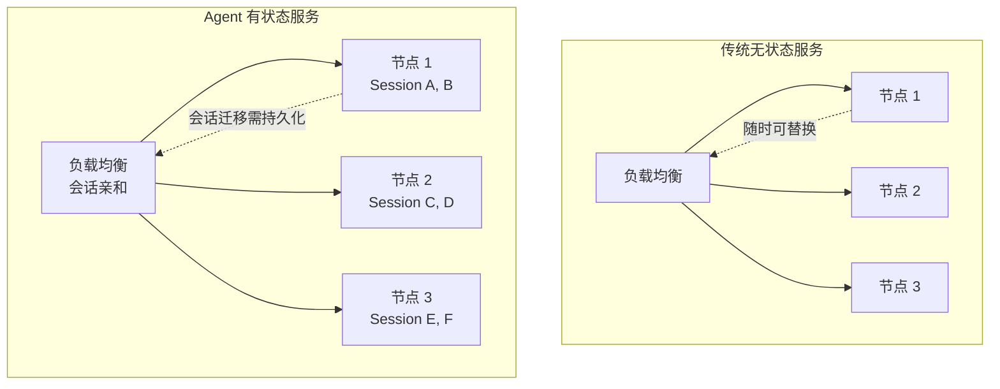

> 造一个好 Agent 系列（十五）：Agent 在开发环境跑通了，离生产上线还有多远？会话持久化怎么保证不丢状态？入口守卫怎么防重复请求和并发雪崩？多租户怎么隔离？版本怎么灰度发布？节点挂了怎么优雅停机？配置怎么热更新？从开发到生产的六个核心问题，逐一拆解。

## 一、为什么 Agent 部署比传统服务更难

传统无状态 Web 服务部署已经很成熟：请求进来，处理后返回，节点随时可以扩缩容。Agent 有状态——会话、记忆、上下文——这让部署变得复杂。

| 挑战 | 传统服务 | Agent 服务 |
|------|---------|-----------|
| 状态 | 无状态，请求独立 | 有状态，会话持续多轮 |
| 执行时间 | 毫秒级，可预测 | 秒~分钟级，不可预测 |
| 并发模型 | 线程池，请求排队 | 循环执行，占用资源久 |
| 扩缩容 | 随时加减节点 | 会话迁移有成本 |
| 版本切换 | 即时生效 | 需等活跃会话结束 |
| 多租户 | 数据隔离即可 | 上下文 + 记忆 + 预算都要隔离 |



## 二、会话管理：状态持久化与恢复

### 2.1 会话存储抽象

```java
/**
 * 会话存储 SPI：支持内存版（开发）和 Redis 版（生产）。
 * 会话数据包含：对话历史、记忆快照、SOP 进度、Token 消耗。
 */
public interface SessionStore {
    Mono<Session> get(String sessionId);
    Mono<Void> save(Session session);
    Mono<Void> delete(String sessionId);
    Mono<List<String>> listByUser(String userId);
}

/**
 * 会话数据模型：一次 Agent 会话的完整状态。
 */
public record Session(
    String sessionId,
    String userId,
    String agentName,
    List<ChatMessage> messages,       // 对话历史
    Map<String, String> memory,       // 记忆快照
    String sopRunId,                  // 关联的 SOP 运行 ID（如有）
    CostUsage costUsage,              // Token 消耗
    Instant createdAt,
    Instant lastActiveAt
) {
    /** 会话是否过期（超过 N 分钟无活动） */
    public boolean isExpired(Duration ttl) {
        return Duration.between(lastActiveAt, Instant.now()).compareTo(ttl) > 0;
    }
}
```

### 2.2 Redis 会话存储

```java
/**
 * Redis 会话存储：TTL 自动过期 + JSON 序列化。
 * 会话在最后一次活动后 30 分钟自动过期释放资源。
 */
@Component
public class RedisSessionStore implements SessionStore {

    private final RedisTemplate<String, String> redis;
    private final ObjectMapper mapper;
    private final Duration ttl = Duration.ofMinutes(30);

    @Override
    public Mono<Session> get(String sessionId) {
        return Mono.fromCallable(() -> {
            String key = "agent:session:" + sessionId;
            String json = redis.opsForValue().get(key);
            return json != null ? mapper.readValue(json, Session.class) : null;
        });
    }

    @Override
    public Mono<Void> save(Session session) {
        return Mono.fromRunnable(() -> {
            String key = "agent:session:" + session.sessionId();
            redis.opsForValue().set(key, mapper.writeValueAsString(session), ttl);
        });
    }

    @Override
    public Mono<Void> delete(String sessionId) {
        return Mono.fromRunnable(() -> redis.delete("agent:session:" + sessionId));
    }
}
```

## 三、入口守卫：三道防线

Agent 服务的第一道关卡不是业务逻辑——是入口守卫。没有它，一个用户的重复点击就能让 Agent 重复执行三次，浪费 Token 还可能产生不一致的结果。

### 3.1 请求去重

```java
/**
 * 请求去重器：相同用户在短时间内的相同请求只处理一次。
 * 用请求哈希 + 短时间窗口实现。
 */
@Component
public class RequestDedup {

    private final Cache<String, String> dedupCache;  // requestHash → sessionId
    private final Duration window = Duration.ofSeconds(5);

    public Optional<String> checkOrRegister(String userId, String content) {
        String hash = hash(userId, content);
        String existing = dedupCache.getIfPresent(hash);
        if (existing != null) {
            return Optional.of(existing);  // 重复请求，返回已有的 sessionId
        }
        String sessionId = UUID.randomUUID().toString();
        dedupCache.put(hash, sessionId);
        return Optional.empty();  // 新请求
    }

    private String hash(String userId, String content) {
        return userId + ":" + content.hashCode() + ":" +
            (System.currentTimeMillis() / window.toMillis());
    }
}
```

### 3.2 会话锁

```java
/**
 * 会话锁：同一会话的请求串行执行，防止并发冲突。
 * 用 Redis SETNX 实现分布式锁 + Watchdog 续期。
 */
@Component
public class SessionLock {

    private final RedisTemplate<String, String> redis;
    private final Duration leaseTime = Duration.ofSeconds(60);

    /**
     * 尝试获取会话锁。
     * 获取成功 → 执行业务；获取失败 → 请求排队或拒绝。
     */
    public boolean tryLock(String sessionId, String holderId) {
        String key = "agent:lock:" + sessionId;
        Boolean acquired = redis.opsForValue()
            .setIfAbsent(key, holderId, leaseTime);
        return Boolean.TRUE.equals(acquired);
    }

    /**
     * 释放锁。只有持有者能释放——防止误释放别人的锁。
     */
    public void unlock(String sessionId, String holderId) {
        String key = "agent:lock:" + sessionId;
        String current = redis.opsForValue().get(key);
        if (holderId.equals(current)) {
            redis.delete(key);
        }
    }

    /**
     * Watchdog 续期：长时间运行的 Agent 循环定期续租。
     */
    public void renew(String sessionId, String holderId) {
        String key = "agent:lock:" + sessionId;
        String current = redis.opsForValue().get(key);
        if (holderId.equals(current)) {
            redis.expire(key, leaseTime);
        }
    }
}
```

### 3.3 并发限制

```java
/**
 * 并发限制器：限制同时运行的 Agent 数量。
 * 超过上限时，新请求进入排队队列或返回「系统繁忙」。
 */
@Component
public class ConcurrencyLimiter {

    private final Semaphore semaphore;
    private final Queue<String> waitQueue = new ConcurrentLinkedQueue<>();

    public ConcurrencyLimiter(int maxConcurrent) {
        this.semaphore = new Semaphore(maxConcurrent);
    }

    public Mono<Permit> acquire(String userId) {
        return Mono.create(sink -> {
            if (semaphore.tryAcquire()) {
                sink.success(new Permit(this::release));
            } else {
                waitQueue.add(userId);
                // 排队超时 → 返回系统繁忙
                sink.error(new ConcurrencyLimitExceededException("系统繁忙，请稍后重试"));
            }
        });
    }

    private void release() {
        semaphore.release();
        // 唤醒排队的请求
        String next = waitQueue.poll();
        if (next != null && semaphore.tryAcquire()) {
            // 通知排队中的请求继续
        } else if (next != null) {
            waitQueue.add(next);  // 没拿到，重新排队
        }
    }

    public record Permit(Runnable release) {}
}
```

## 四、多租户隔离：数据、上下文、预算

### 4.1 租户上下文

```java
/**
 * 租户上下文：贯穿整个请求生命周期的租户标识。
 * 所有组件（会话存储、向量检索、成本管控）都从上下文读取租户信息。
 */
public record TenantContext(
    String tenantId,
    String userId,
    String agentName,
    Set<String> allowedSkills,
    long tokenBudget      // 本轮 Token 预算上限
) {
    private static final ThreadLocal<TenantContext> CURRENT = new ThreadLocal<>();

    public static void set(TenantContext ctx) { CURRENT.set(ctx); }
    public static TenantContext get() { return CURRENT.get(); }
    public static void clear() { CURRENT.remove(); }
}
```

### 4.2 向量检索的租户隔离

```java
/**
 * 向量存储的租户隔离：同一向量库，不同租户看到不同的数据。
 * 通过 metadata 过滤实现逻辑隔离。
 */
@Component
public class TenantAwareVectorStore implements VectorStore {

    private final VectorStore delegate;

    @Override
    public Mono<List<Document>> search(String query, int topK) {
        TenantContext ctx = TenantContext.get();
        // 所有检索自动带上租户过滤条件
        return delegate.search(query, List.of("tenant:" + ctx.tenantId()), topK);
    }

    @Override
    public Mono<Void> add(List<Document> documents) {
        TenantContext ctx = TenantContext.get();
        // 写入时自动注入租户元数据
        List<Document> tagged = documents.stream()
            .map(d -> d.withMetadata("tenant", ctx.tenantId()))
            .toList();
        return delegate.add(tagged);
    }
}
```

## 五、版本灰度：Agent 版本的平滑切换

### 5.1 版本路由

```java
/**
 * Agent 版本路由器：按灰度比例将请求路由到不同版本的 Agent。
 * 支持按用户、按百分比、按标签灰度。
 */
@Component
public class AgentVersionRouter {

    private final Map<String, List<VersionRoute>> routes = new ConcurrentHashMap<>();

    public record VersionRoute(
        String version,
        double weight,          // 流量比例 0~1
        Predicate<TenantContext> condition  // 灰度条件
    ) {}

    public String route(TenantContext ctx) {
        List<VersionRoute> candidates = routes.getOrDefault(ctx.agentName(), List.of());
        for (VersionRoute route : candidates) {
            if (route.condition().test(ctx)) {
                return route.version();
            }
        }
        // 默认版本
        return candidates.isEmpty() ? "latest" : candidates.get(0).version();
    }

    /**
     * 灰度策略：按用户 ID 哈希分配。
     * 10% 灰度 = userId.hashCode() % 100 < 10 的用户走新版本。
     */
    public static Predicate<TenantContext> byPercentage(double percentage) {
        return ctx -> Math.abs(ctx.userId().hashCode() % 100) < percentage * 100;
    }
}
```

### 5.2 优雅停机

```java
/**
 * 优雅停机：节点下线时，等待活跃会话完成后再接收新请求。
 * 1. 停止接收新请求
 * 2. 等待活跃会话完成（最长等待 N 秒）
 * 3. 强制终止超时会话
 * 4. 释放资源
 */
@Component
public class GracefulShutdown {

    private final Set<String> activeSessions = ConcurrentHashMap.newKeySet();
    private final Duration maxWait = Duration.ofSeconds(120);

    @PreDestroy
    public void shutdown() {
        log.info("开始优雅停机，活跃会话数: {}", activeSessions.size());

        // 1. 标记为正在关闭（不再接收新请求）
        shuttingDown = true;

        // 2. 等待活跃会话完成
        long deadline = System.currentTimeMillis() + maxWait.toMillis();
        while (!activeSessions.isEmpty() && System.currentTimeMillis() < deadline) {
            try { Thread.sleep(1000); } catch (InterruptedException e) { break; }
            log.info("等待会话完成，剩余: {}", activeSessions.size());
        }

        // 3. 强制终止超时会话
        if (!activeSessions.isEmpty()) {
            log.warn("强制终止 {} 个超时会话", activeSessions.size());
            activeSessions.forEach(this::forceTerminate);
        }

        log.info("优雅停机完成");
    }

    public void registerSession(String sessionId) { activeSessions.add(sessionId); }
    public void unregisterSession(String sessionId) { activeSessions.remove(sessionId); }
}
```

## 六、配置热更新：不重启改配置

```java
/**
 * 配置热更新：从配置中心监听配置变更，实时更新 Agent 行为。
 * 支持：模型切换、Token 预算调整、工具白名单变更。
 */
@Component
public class HotConfigUpdater {

    private final ConfigClient configClient;
    private volatile ModelConfig modelConfig;
    private volatile long tokenBudget;

    @PostConstruct
    public void start() {
        // 初始加载
        reloadConfig();
        // 监听变更
        configClient.watch("agent.config", this::onConfigChange);
    }

    private void onConfigChange(String key, String newValue) {
        log.info("配置变更: {} = {}", key, newValue);
        reloadConfig();
    }

    private void reloadConfig() {
        this.modelConfig = configClient.getAs("agent.model", ModelConfig.class);
        this.tokenBudget = configClient.getLong("agent.tokenBudget", 32000);
        log.info("配置已更新: model={}, budget={}", modelConfig.name(), tokenBudget);
    }
}
```

## 七、行业实践：部署工程的设计共识

| 设计点 | 共识做法 | 反面模式 |
|--------|---------|---------|
| 会话存储 | Redis TTL 自动过期 + JSON 序列化 | 内存存储（节点挂了丢状态） |
| 请求去重 | 请求哈希 + 短时间窗口 | 无去重（重复点击重复执行） |
| 会话锁 | Redis SETNX + Watchdog 续期 | 无锁（并发冲突） |
| 并发控制 | Semaphore + 排队队列 | 无限制（资源耗尽） |
| 多租户 | 租户上下文 + 元数据过滤 | 数据混在一起 |
| 版本灰度 | 按比例/用户/标签路由 | 直接全量切换 |
| 优雅停机 | 停止接收 → 等待完成 → 强制终止 | 直接 kill（会话中断） |
| 配置热更新 | 配置中心监听 + 运行时 reload | 改配置必须重启 |

## 结语

Agent 工程化部署不是「把服务放到服务器上」——是把一个有状态的、长耗时的、多租户的智能系统，变成可以在生产环境可靠运行的服务。

> 会话持久化保证状态不丢，入口守卫挡住异常流量，多租户隔离保证数据安全，版本灰度保证变更可控，优雅停机保证不丢会话，配置热更新保证灵活应变。六件套齐了，Agent 才能从开发环境走向生产。

---

> **🔁 闭环视角**
>
> 本篇覆盖 Agent 闭环的**基础设施层**——它不是闭环的某个阶段，而是支撑闭环运行的底座。入口守卫保护感知输入，会话管理支撑记忆持久化，并发控制保障行动执行，版本灰度和配置热更新让反馈优化能快速生效。
