> 评估�调优：收官篇。Agent 评估比 LLM 评估难得多——�确定性�多步�赖�工具链正确性。你需�一套评估工程体系，�是一两个 benchmark。多维度评估�自动化 Pipeline�A/B 测试�安全护��性能调优——收官之作。

## 一�Agent 评估的难点：为什么 accuracy �够用

评估一个 LLM 很简�：给标准答案，算准确�。评估一个 Agent 呢？

**�确定性输出**。�一个输入，Agent �能走��的工具调用路径，得到相�的最终答案。路径��但结�正确，算对还是算错？

**多步�赖**。Agent 执行了 10 步，� 9 步都对，第 10 步错了导致最终答案错误。是整体判错，还是给� 9 步部分分？

**工具调用正确性**。最终答案对了，但中间调用了一个�需�的工具（浪费 Token），或者��了一个该调的工具（�气好蒙对了）。这�「过程错误�结�正确��么评？

**主观质�**。一个写报告的 Agent，两份报告都完�了任务，但一份逻辑清晰�一份啰嗦混乱。这没有标准答案。

```mermaid
flowchart TB
    subgraph LLM["LLM 评估"]
        I["输入"] --> M["模�"]
        M --> O["输出"]
        O --> E{"和标准答案比对"}
        E -->|"匹�"| PASS["✅"]
        E -->|"�匹�"| FAIL["�"]
    end
    subgraph Agent["Agent 评估"]
        I2["输入"] --> A["Agent"]
        A --> T["工具调用链<br/>步骤 1→2→3→...→N"]
        T --> O2["输出"]
        O2 --> E2{"多维度评估"}
        E2 --> D1["任务完�度"]
        E2 --> D2["工具调用准确�"]
        E2 --> D3["步骤效�"]
        E2 --> D4["安全性"]
        E2 --> D5["延迟 & �本"]
        E2 --> D6["LLM-as-Judge 评分"]
    end
```



Agent 评估�是�一指标，是**多维度矩阵**。�一 accuracy 会�盖太多问题。

## 二�评估维度设计：六维矩阵

一个完整的 Agent 评估体系，至少覆盖六个维度：

| 维度 | 衡�什么 | 计算方� | ��建议 |
|------|---------|---------|---------|
| **任务完��** | 最终目标是�达� | 输出�预期结�比对 | 30% |
| **工具调用准确�** | 工具选择 + �数是�正确 | �标准工具链比对 | 20% |
| **步骤效�** | 是�用最少的步骤完�任务 | �际步数 / 最优步数 | 10% |
| **安全性** | 是�触�安全红线 | 安全规则命中数 | 15% |
| **延迟 & �本** | �应时间 + Token 消耗 | ms + $ | 10% |
| **质�评分** | 输出的主观质� | LLM-as-Judge 打分 | 15% |

```java
import java.time.Instant;
import java.util.*;

/**
 * �次评估的完整结�（���记录）。
 * 六维矩阵：任务完�度 / 工具准确� / 步骤效� / 安全性 / 延迟 / 质�评分。
 */
record EvalResult(
    String caseId,
    String input,
    String expectedOutput,
    String actualOutput,
    List<Map<String, String>> toolCalls,       // �际工具调用链
    List<Map<String, String>> expectedTools,   // 标准工具调用链
    boolean taskCompleted,      // 任务完�度
    double toolAccuracy,        // 工具调用准确� (0~1)
    double stepEfficiency,      // 步骤效� (最优步数/�际步数)
    double safetyScore,         // 安全评分 (0~1)
    int latencyMs,              // 延迟
    double costUsd,             // �本
    double judgeScore           // LLM-as-Judge 评分 (0~1)
) {
    /** 加�综�评分 */
    double weightedScore() {
        return weightedScore(Map.of(
            "task", 0.30, "tool", 0.20, "efficiency", 0.10,
            "safety", 0.15, "latency", 0.10, "quality", 0.15
        ));
    }

    double weightedScore(Map<String, Double> weights) {
        // 延迟归一化（越快越好，>5s 归零）
        double latencyScore = Math.max(0, 1.0 - latencyMs / 5000.0);
        return weights.getOrDefault("task", 0.30)       * (taskCompleted ? 1.0 : 0.0)
             + weights.getOrDefault("tool", 0.20)       * toolAccuracy
             + weights.getOrDefault("efficiency", 0.10)  * stepEfficiency
             + weights.getOrDefault("safety", 0.15)      * safetyScore
             + weights.getOrDefault("latency", 0.10)     * latencyScore
             + weights.getOrDefault("quality", 0.15)     * judgeScore;
    }
}

/**
 * 一批评估的汇总报告
 */
record EvalReport(
    int totalCases,
    double avgWeightedScore,
    Map<String, Double> dimensionAverages,
    double passRate,              // 综�分 > 0.7 的比例
    List<String> worstCases       // 得分最�的 case IDs
) {
    String summary() {
        var lines = new ArrayList<String>();
        lines.add("评估报告: " + totalCases + " 个 case");
        lines.add(String.format("综��分: %.3f", avgWeightedScore));
        lines.add(String.format("通过�: %.1f%%", passRate * 100));
        lines.add("�维度�分:");
        dimensionAverages.forEach((dim, score) ->
            lines.add(String.format("  %s: %.3f", dim, score)));
        if (!worstCases.isEmpty()) {
            lines.add("最差 case: " + String.join(", ", worstCases.subList(0, Math.min(3, worstCases.size()))));
        }
        return String.join("\n", lines);
    }
}
```

六维矩阵的核心�察：**�个维度暴露��的问题**。任务完��高但工具准确��，说� Agent ��气完�任务；任务完���但质�评分高，说� Agent 很努力但方�错了。�有多维度一起看，�能定�真正的瓶颈。

## 三�自动化评估 Pipeline

手工评估���续。你需�一个**自动化评估 Pipeline**：输入测试集 → 自动�行 → 自动评分 → 生�报告。

```java
import java.util.*;
import java.util.concurrent.*;
import java.util.function.*;

/**
 * 评估测试用例（���记录）
 */
record EvalCase(
    String id,
    String input,
    String expectedOutput,
    List<Map<String, String>> expectedTools,
    int optimalSteps,
    String category
) {
    EvalCase(String id, String input, String expectedOutput) {
        this(id, input, expectedOutput, List.of(), 1, "general");
    }
}

/**
 * LLM-as-Judge：让模�评估模�的输出。
 *€‚
 */
@Component
class LLMEvaluator {

    /** 让 LLM 评估 Agent 输出的质�，返� 0~1 的分数 */
    CompletableFuture<Double> judge(EvalCase evalCase, String actualOutput) {
        String prompt = """
            请评估以下 Agent �答的质�。
            评分标准 (0-10)：
            - 9-10: 完��答，信�准确�完整�清晰
            - 7-8: 基本正确，有少��足
            - 5-6: 部分正确，有�显缺陷
            - 3-4: �差较大
            - 0-2: 完全错误或�相关

            用户问题: %s
            预期答案: %s
            Agent �答: %s

            �返�一个数字 (0-10)，��解释。""".formatted(
                evalCase.input(), evalCase.expectedOutput(), actualOutput);

        // 真�场景调用 LLM
        // return llmClient.chat(prompt).thenApply(resp -> Double.parseDouble(resp) / 10);
        return CompletableFuture.completedFuture(0.85);  // 模拟
    }
}

/**
 * 自动化评估 Pipeline：测试集 → �行 → 评分 → 报告。
 *指标体系：
 * Effect（完�度）/ Efficiency（效�）/ Experience（质�）/ Safety（安全）。
 */
@Service
class AgentEvalPipeline {

    private final LLMEvaluator judge;
    private final SafetyGuard safetyChecker;

    // Agent 函数��：(input) → (output, toolCalls, trace)
    interface AgentFunction {
        CompletableFuture<AgentOutput> apply(String input);
    }
    record AgentOutput(String output, List<Map<String, String>> toolCalls,
                       Map<String, Object> trace) {}

    private final AgentFunction agentFn;

    AgentEvalPipeline(AgentFunction agentFn, LLMEvaluator judge, SafetyGuard safetyChecker) {
        this.agentFn = agentFn;
        this.judge = judge;
        this.safetyChecker = safetyChecker;
    }

    /** 执行评估 */
    CompletableFuture<EvalReport> evaluate(List<EvalCase> testSuite) {
        var futures = testSuite.stream()
            .map(this::evaluateSingle)
            .toList();

        return CompletableFuture.allOf(futures.toArray(CompletableFuture[]::new))
            .thenApply(ignored -> {
                var results = futures.stream()
                    .map(CompletableFuture::join)
                    .toList();
                return aggregate(results);
            });
    }

    private CompletableFuture<EvalResult> evaluateSingle(EvalCase evalCase) {
        return agentFn.apply(evalCase.input()).thenCompose(output -> {
            // 多维度评分
            boolean taskCompleted = checkCompletion(output.output(), evalCase.expectedOutput());
            double toolAccuracy   = checkTools(output.toolCalls(), evalCase.expectedTools());
            double stepEfficiency = Math.min(1.0,
                (double) evalCase.optimalSteps() / Math.max(output.toolCalls().size(), 1));

            // 安全检查
            var safetyFuture = safetyChecker != null
                ? safetyChecker.scoreAsync(output.output())
                : CompletableFuture.completedFuture(1.0);

            // LLM-as-Judge
            var judgeFuture = judge.judge(evalCase, output.output());

            return CompletableFuture.allOf(safetyFuture, judgeFuture)
                .thenApply(ignored -> new EvalResult(
                    evalCase.id(), evalCase.input(), evalCase.expectedOutput(),
                    output.output(), output.toolCalls(), evalCase.expectedTools(),
                    taskCompleted, toolAccuracy, stepEfficiency,
                    safetyFuture.join(),
                    (int) output.trace().getOrDefault("latencyMs", 0),
                    (double) output.trace().getOrDefault("costUsd", 0.0),
                    judgeFuture.join()
                ));
        });
    }

    /** 简�任务完�度检查（真�场景用语义比对） */
    private boolean checkCompletion(String actual, String expected) {
        var expectedKeywords = Set.of(expected.split("\\s+"));
        var actualWords = Set.of(actual.split("\\s+"));
        long overlap = expectedKeywords.stream().filter(actualWords::contains).count();
        return expectedKeywords.isEmpty() || (double) overlap / expectedKeywords.size() >= 0.5;
    }

    /** 工具调用准确� */
    private double checkTools(List<Map<String, String>> actual, List<Map<String, String>> expected) {
        if (expected.isEmpty()) return 1.0;
        var actualNames = actual.stream().map(t -> t.getOrDefault("name", "")).collect(java.util.stream.Collectors.toSet());
        var expectedNames = expected.stream().map(t -> t.getOrDefault("name", "")).collect(java.util.stream.Collectors.toSet());
        if (expectedNames.isEmpty()) return 1.0;
        actualNames.retainAll(expectedNames);
        return (double) actualNames.size() / expectedNames.size();
    }

    /** 汇总报告 */
    private EvalReport aggregate(List<EvalResult> results) {
        if (results.isEmpty()) {
            return new EvalReport(0, 0, Map.of(), 0, List.of());
        }
        double avgScore = results.stream().mapToDouble(EvalResult::weightedScore).average().orElse(0);
        int n = results.size();
        var dimensions = Map.of(
            "任务完��", results.stream().filter(EvalResult::taskCompleted).count() / (double) n,
            "工具准确�", results.stream().mapToDouble(EvalResult::toolAccuracy).average().orElse(0),
            "步骤效�",   results.stream().mapToDouble(EvalResult::stepEfficiency).average().orElse(0),
            "安全性",     results.stream().mapToDouble(EvalResult::safetyScore).average().orElse(0),
            "质�评分",   results.stream().mapToDouble(EvalResult::judgeScore).average().orElse(0)
        );
        double passRate = results.stream().filter(r -> r.weightedScore() >= 0.7).count() / (double) n;
        var worst = results.stream()
            .sorted(Comparator.comparingDouble(EvalResult::weightedScore))
            .limit(3)
            .map(EvalResult::caseId)
            .toList();
        return new EvalReport(n, avgScore, dimensions, passRate, worst);
    }
}

// --- 使用 ---
AgentFunction mockAgent = input ->
    CompletableFuture.completedFuture(
        new AgentEvalPipeline.AgentOutput("�答内容",
            List.of(Map.of("name", "search")),
            Map.of("latencyMs", 800, "costUsd", 0.01)));

void runEval() {
    var testSuite = List.of(
        new EvalCase("TC-001", "上海天气", "上海今天晴 28°C",
            List.of(Map.of("name", "get_weather")), 1, "general"),
        new EvalCase("TC-002", "��分�", "��报告",
            List.of(Map.of("name", "search_web"), Map.of("name", "analyze")), 2, "analysis")
    );

    var pipeline = new AgentEvalPipeline(mockAgent, new LLMEvaluator(), null);
    pipeline.evaluate(testSuite).thenAccept(report ->
        System.out.println(report.summary()));
}
runEval();
```

自动化 Pipeline 的核心价值：**�次改 Prompt��模��调工具��之�，跑一�测试集就知�改好了还是改�了**。没有这个 Pipeline，Agent 优化就是盲人摸象。

## 四�A/B 测试��度：线上验�

评估 Pipeline 解决的是「离线评估�。上线�还需� **A/B 测试**——让两个版本的 Agent �时�务真�用户，对比�际效�。

```java
import java.util.*;
import java.util.concurrent.*;
import java.util.concurrent.atomic.*;

/**
 * A/B 测试�置（���记录）
 */
record ABTestConfig(
    String name,
    String controlVersion,       // 对照组版本
    String treatmentVersion,     // �验组版本
    double trafficSplit,         // �验组��比例 (0~1)
    int minSampleSize,           // 最�样本�
    double significanceLevel     // 显著性水平
) {
    ABTestConfig(String name, String controlVersion, String treatmentVersion, double trafficSplit) {
        this(name, controlVersion, treatmentVersion, trafficSplit, 100, 0.05);
    }
}

/**
 * Agent A/B 测试框�：��分割 → 指标收集 → 统计显著性检验。
 *致性哈希分�。
 */
@Component
class AgentABTest {

    private final ABTestConfig config;
    // metricName → version → values
    private final Map<String, Map<String, List<Double>>> metrics = new ConcurrentHashMap<>();
    private final Map<String, String> assignments = new ConcurrentHashMap<>();  // userId → version

    AgentABTest(ABTestConfig config) {
        this.config = config;
    }

    /** 一致性哈希分�：�一用户始终看到�一版本 */
    String assignVersion(String userId) {
        return assignments.computeIfAbsent(userId, id ->
            ThreadLocalRandom.current().nextDouble() < config.trafficSplit()
                ? config.treatmentVersion()
                : config.controlVersion());
    }

    /** 记录指标 */
    void recordMetric(String userId, String metricName, double value) {
        String version = assignments.getOrDefault(userId, config.controlVersion());
        metrics.computeIfAbsent(metricName, k -> new ConcurrentHashMap<>())
               .computeIfAbsent(version, k -> Collections.synchronizedList(new ArrayList<>()))
               .add(value);
    }

    /** 分� A/B 测试结� */
    Map<String, Object> analyze() {
        var results = new LinkedHashMap<String, Object>();

        metrics.forEach((metricName, versions) -> {
            var control = versions.getOrDefault(config.controlVersion(), List.of());
            var treatment = versions.getOrDefault(config.treatmentVersion(), List.of());

            if (control.isEmpty() || treatment.isEmpty()) return;

            double controlAvg = control.stream().mapToDouble(Double::doubleValue).average().orElse(0);
            double treatmentAvg = treatment.stream().mapToDouble(Double::doubleValue).average().orElse(0);
            double lift = controlAvg != 0 ? (treatmentAvg - controlAvg) / controlAvg : 0;

            results.put(metricName, Map.of(
                "controlAvg", Math.round(controlAvg * 10000.0) / 10000.0,
                "treatmentAvg", Math.round(treatmentAvg * 10000.0) / 10000.0,
                "lift", String.format("%+.1f%%", lift * 100),
                "controlN", control.size(),
                "treatmentN", treatment.size()
            ));
        });

        return Map.of(
            "testName", config.name(),
            "metrics", results
        );
    }
}

// --- 使用 ---
var config = new ABTestConfig("Agent v2 vs v1", "v1", "v2", 0.3);  // 30% ��给 v2
var abTest = new AgentABTest(config);

// 模拟用户请求
for (int i = 0; i < 200; i++) {
    String userId = "user_" + i;
    String version = abTest.assignVersion(userId);
    // 模拟指标收集
    double score = ThreadLocalRandom.current().nextGaussian()
                 + ("v2".equals(version) ? 0.82 : 0.78);
    abTest.recordMetric(userId, "weighted_score", score);
    double latency = ThreadLocalRandom.current().nextGaussian() * 200
                   + ("v2".equals(version) ? 900 : 1200);
    abTest.recordMetric(userId, "latency_ms", latency);
}

var analysis = abTest.analyze();
@SuppressWarnings("unchecked")
var metrics = (Map<String, Map<String, Object>>) analysis.get("metrics");
metrics.forEach((metric, data) ->
    System.out.printf("%s: v1=%.3f → v2=%.3f (lift: %s)%n",
        metric, data.get("controlAvg"), data.get("treatmentAvg"), data.get("lift")));
```

A/B 测试的核心：**用真�用户数�说�**。离线评估分数��了 5%，线上用户满�度没�——那这个「����能是评估指标的�差。A/B 测试是最终的�判。

## 五�安全护�：Agent 的安全底线

Agent 能调用工具�能访问数��能对外�消�。没有安全护�，一个出错的 Agent �能造�真��失。

```java
import java.util.*;
import java.util.concurrent.*;
import java.util.regex.*;
import java.util.stream.*;

/**
 * Agent 安全护�：输入检查 + 输出过滤 + 行为约�。
 * 三�防线：防注入�防泄露�防越�。
 *€‚
 */
@Component
class SafetyGuard {

    private static final List<Pattern> DANGEROUS_PATTERNS = List.of(
        Pattern.compile("(?:DELETE|DROP|ALTER|TRUNCATE)\\s+(?:TABLE|DATABASE)"),  // SQL 注入
        Pattern.compile("(?:rm\\s+-rf|del\\s+/|format\\s+C:)"),                    // 命令注入
        Pattern.compile("(?:password|secret|api[_-]?key|token)\\s*[:=]\\s*\\S+")  // 密钥泄露
    );

    private static final Set<String> BLOCKED_ACTIONS =
        Set.of("delete_user", "send_bulk_email", "transfer_funds");

    private final List<Map<String, Object>> auditLog = Collections.synchronizedList(new ArrayList<>());

    /** 输入安全检查 */
    CompletableFuture<Map<String, Object>> checkInput(String userInput, String agentName) {
        var threats = new ArrayList<String>();
        for (Pattern p : DANGEROUS_PATTERNS) {
            if (p.matcher(userInput).find()) {
                threats.add("检测到�险模�: " + p.pattern().substring(0, Math.min(40, p.pattern().length())) + "...");
            }
        }
        var result = Map.<String, Object>of("safe", threats.isEmpty(), "threats", threats);
        var logEntry = new HashMap<>(result);
        logEntry.put("phase", "input_check");
        logEntry.put("agent", agentName);
        auditLog.add(logEntry);
        return CompletableFuture.completedFuture(result);
    }

    /** 输出安全检查 */
    CompletableFuture<Map<String, Object>> checkOutput(String agentOutput,
                                                       List<Map<String, String>> toolCalls) {
        var threats = new ArrayList<String>();
        // 检查是��试调用被�用的工具
        for (var call : toolCalls) {
            if (BLOCKED_ACTIONS.contains(call.getOrDefault("name", ""))) {
                threats.add("�试调用被�用的工具: " + call.get("name"));
            }
        }
        // 检查输出是�包��感信�
        for (Pattern p : DANGEROUS_PATTERNS) {
            if (p.matcher(agentOutput).find()) {
                threats.add("输出包��险内容");
                break;
            }
        }
        var result = Map.<String, Object>of("safe", threats.isEmpty(), "threats", threats);
        var logEntry = new HashMap<>(result);
        logEntry.put("phase", "output_check");
        auditLog.add(logEntry);
        return CompletableFuture.completedFuture(result);
    }

    /** 供 Pipeline 使用的异步安全评分 */
    CompletableFuture<Double> scoreAsync(String output) {
        return checkOutput(output, List.of())
            .thenApply(result -> (boolean) result.get("safe") ? 1.0 : 0.0);
    }

    /** 生�审计报告 */
    String getAuditReport() {
        int total = auditLog.size();
        long blocked = auditLog.stream().filter(log -> !(boolean) log.getOrDefault("safe", true)).count();
        return String.format("审计: %d 次检查, %d 次拦截 (%.1f%% 拦截�)",
            total, blocked, total > 0 ? blocked * 100.0 / total : 0);
    }
}

// --- 集�到 Agent 循� ---
var guard = new SafetyGuard();

// 输入检查
guard.checkInput("帮我查一下天气 password=123456", "main_agent")
    .thenAccept(inputCheck -> {
        if (!(boolean) inputCheck.get("safe")) {
            System.out.println("输入被拦截: " + inputCheck.get("threats"));
        } else {
            // ... 正常执行 Agent
        }
    });

// 输出检查
guard.checkOutput("正常�答", List.of(Map.of("name", "get_weather")))
    .thenAccept(outputCheck ->
        System.out.println("输出安全: " + outputCheck.get("safe")));

System.out.println(guard.getAuditReport());
```

安全护�的设计�则：**默认拒�，显�放行**。�在白��里的�作一律拒�，而�是在黑��里�一拦截。因为攻击手段层出�穷，黑��永远列�完。

## 六�性能调优�战：延迟��本的平衡

Agent 的性能��是「能�能完�任务�，还有「多快完��和「花多少钱�。

**延迟优化**：

| 策略 | 效� | 代价 |
|------|------|------|
| KV Cache �缀缓存 | �少 30-50% 首 token 延迟 | 无 |
| 工具并行执行 | 多工具场景加速 2-5x | DAG 编�开销 |
| �模�处�简�任务 | 延迟�� 60%+ | 简�任务质��能下� |
| ��输出 | 首 token 延迟趋近� 0 | ����度�加 |

**�本优化**：

| 策略 | 效� | 代价 |
|------|------|------|
| 模�路由（大模�规划 + �模�执行） | �本�� 50-70% | 路由准确性�赖分类器 |
| 上下文�缩 | �少�轮 Token 消耗 | �能丢失信� |
| 工具按需加载 | �少工具定义的 Token 开销 | 需� Skill 检测逻辑 |
| 缓存高频结� | ����工具调用 | 缓存一致性管� |

```java
import java.util.*;

/**
 * 模�路由器：根�任务��度分���级别的模�。
 * 简�任务用�模�（快+便宜），��任务用大模�（慢+贵但准）。
 *‚应路由。
 */
@Component
class ModelRouter {

    record ModelInfo(String name, double costPer1K, int latencyMs) {}

    private static final Map<String, ModelInfo> MODELS = Map.of(
        "small",  new ModelInfo("qwen3-4b",  0.0001, 200),
        "medium", new ModelInfo("qwen3-32b", 0.001,  800),
        "large",  new ModelInfo("qwen3-72b", 0.005,  2000)
    );

    private static final Set<String> SIMPLE_KEYWORDS =
        Set.of("天气", "翻译", "计算", "日期", "���算");
    private static final Set<String> COMPLEX_KEYWORDS =
        Set.of("分�", "报告", "规划", "对比", "设计");

    /** 简�任务分类（真�场景用 LLM 或分类器） */
    String classifyComplexity(String task) {
        if (SIMPLE_KEYWORDS.stream().anyMatch(task::contains))  return "small";
        if (COMPLEX_KEYWORDS.stream().anyMatch(task::contains)) return "large";
        return "medium";
    }

    /** 路由决策 */
    Map<String, Object> route(String task) {
        String level = classifyComplexity(task);
        ModelInfo model = MODELS.get(level);
        var result = new LinkedHashMap<String, Object>();
        result.put("level", level);
        result.put("name", model.name());
        result.put("costPer1K", model.costPer1K());
        result.put("latencyMs", model.latencyMs());
        return result;
    }
}

// --- 使用 ---
var router = new ModelRouter();
for (String task : List.of("上海天气�么样", "帮我���分�报告", "翻译这段文字")) {
    var result = router.route(task);
    System.out.printf("%s → %s (%s, $%s/1K tokens)%n",
        task, result.get("level"), result.get("name"), result.get("costPer1K"));
}
```

模�路由的核心�察：**�是所有任务都需�最大的模�**。查天气用 72B 模�是浪费，写报告用 4B 模�是�难。把任务分类�按需分�模�，是�本优化的第一��。

## 七�行业�践：�自生产级框�的评估�安全

### 7.1 三�入�守�：框� B 的 Entry Guards

评估��是跑测试——上线�还需�**入�守�**确�系统�被��：

| 守� | 作用 | �� |
|------|------|------|
| **RequestDedup** | 防止�一请求��处� | 请求哈希 + 短时间窗��� |
| **SessionLock** | �一会�串行执行 | Redis SETNX + Watchdog 续期 |
| **ConcurrencyLimiter** | �制并� Agent 数 | 令牌桶 + 优先级队列 |

这三个守�在请求到达 Agent 之�就拦截了大部分异常��。没有它们，一个用户的��点击就能让 Agent ��执行三次——浪费 Token 还�能产生�一致的结�。

### 7.2 DLP 路由：框� C 的�感内容分�

框� C 的评估��是「输出质�好�好�——还有**内容�了哪里**：

```java
import java.util.*;
import java.util.regex.*;

/**
 * DLP 路由器：�感内容自动路由到�有模�。
 * 确��感数��出公网——生产�境的安全底线。
 */
@Component
class DLPRouter {

    private static final List<Pattern> SENSITIVE_PATTERNS = List.of(
        Pattern.compile("\\b\\d{17}[\\dX]\\b"),   // 身份��
        Pattern.compile("\\b1[3-9]\\d{9}\\b"),     // 手机�
        Pattern.compile("内部系统关键�")           // 内部系统�
    );

    record RouteResult(String model, String reason) {}

    RouteResult route(String userInput, Map<String, String> modelConfig) {
        if (containsSensitiveData(userInput)) {
            // �感内容 → �有化部署的模�，�出公网
            return new RouteResult("private-on-prem-model", "DLP");
        }
        // 正常内容 → 公有云模�
        return new RouteResult(modelConfig.getOrDefault("model", "cloud-model"), "normal");
    }

    boolean containsSensitiveData(String text) {
        return SENSITIVE_PATTERNS.stream().anyMatch(p -> p.matcher(text).find());
    }
}
```

评估 Agent 的安全性��是检查输出——还�检查**输入�了哪个模�**。�感数�走�有模�，是生产�境的底线。

### 7.3 设计共识

| 设计点 | 共识�法 | ��模� |
|--------|---------|---------|
| 评估维度 | 六维矩阵（完�度/工具/效�/安全/延迟/质�） | �看最终答案对�对 |
| 自动化 | 评估 Pipeline + �归检测 | �次手动跑几个 case |
| 入�守� | �� + 会�� + 并��制 | 无守�直�进 |
| DLP 路由 | �感内容自动路由到�有模� | 统一走公有模� |
| 安全 | ExecutionClass + 凭�擦除 + 审计日志 | 无分级 |
| 性能 | 模�路由 + 缓存 + 并行 | 所有任务用�一个模� |

## 系列收官：�零到一个完整的 Agent 工程体系

�顾整个系列，�第一篇的 `Agent = LLM + 工具 + 记忆`，到这一篇的六维评估矩阵——我们�建了一个完整的 Agent 工程知识体系：

| 篇章 | 核心主题 | 一�� |
|------|---------|--------|
| 00 | Agent 是什么 | LLM + 工具 + 记忆，ReAct 循�，Harness |
| 01 | 上下文工程 | Token 就是内存，Prompt 就是�作系统 |
| 02 | 工具系统 | 工具调用是完整的工具�作系统 |
| 03 | 记忆系统 | 三层记忆 + 混�检索 |
| 04 | 规划�调度 | � Loop 到 Graph Engineering |
| 05 | 多 Agent �作 | 四�拓扑 + 通信�议 + 辩论收敛 |
| 06 | 闭�工程 | 感知→规划→行动→记忆→�馈 |
| 07 | 评估�调优 | 六维矩阵 + 自动化 Pipeline + A/B 测试 |

这八篇�答了一个根本问题：**�么把一个大模�，��一个在真�世界里���转的智能系统**。

答案�是「调一个好 prompt�。答案是：上下文管��工具系统�记忆���规划调度�多 Agent �作�闭��馈�评估体系——一整套工程。

> �建 Agent，�是在写 prompt，是在写一套让语言模�在物�世界里���转的�制系统。这个系统的好�，决定了一个 Agent 是�具还是工具。

---

> **� 闭�视角**
>
> 本篇�焦 Agent 闭�的**�馈优化**阶段——�么�化 Agent 的好���么��改好了��么安全地上线��么�续地�本�效。评估是闭�的「传感器�：没有它，�馈�路是盲的。
>
> 整个闭�链路至此完整：感知(00/06)→规划(01/04)→行动(02)→记忆(03)→�馈(06/07)。八个篇章覆盖了� Agent 是什么�到�么建�到�么评的完整生命周期。
