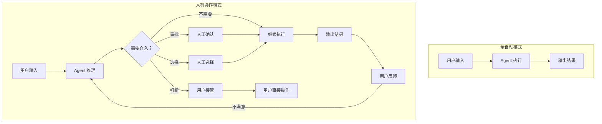
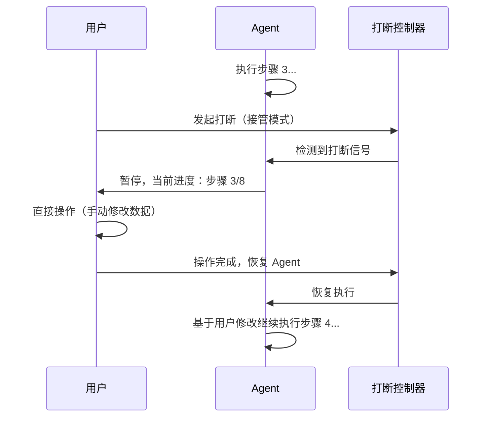

> 造一个好 Agent 系列（十七）：Agent 最容易被忽视的工程环节不是模型、不是工具、不是记忆——是「人」。审批流怎么设计？用户想打断 Agent 时怎么办？进度怎么实时展示？通知推送到哪里？反馈怎么收集？人机协作界面做得好不好，直接决定了 Agent 能不能被用户信任和接受。

## 一、为什么人机协作是 Agent 工程的关键

纯自动化系统不需要人机协作——输入→处理→输出，一气呵成。但 Agent 有自主性，自主性意味着不确定性。用户需要**在关键节点介入**：

| 场景 | 为什么需要人 | 协作模式 |
|------|------------|---------|
| 高风险操作（转账、删除） | 错误后果不可逆 | 人工审批 |
| 模型不确定 | 多个选项难以自动决策 | 人工选择 |
| 用户打断 | 需求变了、方向错了 | 实时接管 |
| 长任务 | 用户想看到进度 | 实时可视化 |
| 结果不满意 | 模型回答不够好 | 反馈 + 修正 |
| 异常告警 | 出了意料之外的问题 | 告警通知 + 介入 |

> 人机协作不是「Agent 做不了的事丢给人」——是**让正确的事在正确的时间由正确的一方处理**。



## 二、审批流设计：让高风险操作可控

### 2.1 审批触发规则

```java
/**
 * 审批服务：根据工具的风险等级和操作上下文，决定是否需要人工审批。
 * 审批通过后，Agent 才能继续执行该步骤。
 */
@Component
public class ApprovalService {

    private final Map<String, ApprovalPolicy> policies = Map.of(
        "transfer_money",   new ApprovalPolicy(Level.HIGH, 600, "转账操作需要人工确认"),
        "delete_record",    new ApprovalPolicy(Level.HIGH, 300, "删除操作需要人工确认"),
        "send_bulk_email",  new ApprovalPolicy(Level.MEDIUM, 120, "群发邮件需要人工确认"),
        "update_config",    new ApprovalPolicy(Level.MEDIUM, 120, "配置变更需要人工确认"),
        "query_data",       new ApprovalPolicy(Level.NONE, 0, null)   // 查询无需审批
    );

    public ApprovalDecision check(String toolName, Map<String, Object> params, String userId) {
        ApprovalPolicy policy = policies.getOrDefault(toolName, ApprovalPolicy.DEFAULT);
        if (policy.level() == Level.NONE) {
            return ApprovalDecision.autoApprove("无需审批");
        }
        // 创建审批请求，推送到用户的通知通道
        return ApprovalDecision.pending(
            policy.message(),
            policy.timeoutSecs(),
            new ApprovalRequest(toolName, params, userId, policy.level())
        );
    }
}

public record ApprovalPolicy(Level level, int timeoutSecs, String message) {
    static final ApprovalPolicy DEFAULT = new ApprovalPolicy(Level.NONE, 0, null);
}

public enum Level { NONE, LOW, MEDIUM, HIGH, CRITICAL }
```

### 2.2 审批超时策略

审批不能无限等待。超时后有两种策略——**自动通过**和**自动拒绝**，取决于风险等级：

```java
/**
 * 审批超时处理器：超时后根据风险等级决定自动通过或拒绝。
 * CRITICAL 级别永远不自动通过——宁可中断流程也不冒险。
 */
@Component
public class ApprovalTimeoutHandler {

    public ApprovalDecision onTimeout(ApprovalRequest request) {
        return switch (request.level()) {
            case CRITICAL -> ApprovalDecision.autoReject(
                "高风险操作超时未审批，自动拒绝。请联系管理员手动处理。");
            case HIGH -> ApprovalDecision.autoReject(
                "审批超时，操作已取消。如需继续请重新发起。");
            case MEDIUM -> ApprovalDecision.autoApprove(
                "审批超时，已自动通过（中风险操作允许超时通过）。");
            case LOW -> ApprovalDecision.autoApprove(
                "审批超时，已自动通过。");
            case NONE -> ApprovalDecision.autoApprove("无需审批");
        };
    }
}
```

## 三、打断与接管：用户随时可以叫停

Agent 在执行一个长任务时，用户可能发现方向错了、需求变了、或者只是不想等了。系统必须支持**实时打断**。

### 3.1 打断信号处理

```java
/**
 * 打断控制器：Agent 循环的每个步骤开始前检查是否有打断信号。
 * 支持三种打断模式：暂停（稍后继续）、终止（放弃当前任务）、接管（用户直接操作）。
 */
@Component
public class InterruptionController {

    private final Map<String, InterruptionSignal> signals = new ConcurrentHashMap<>();

    public enum Mode { PAUSE, TERMINATE, TAKEOVER }

    public record InterruptionSignal(Mode mode, String userId, String reason, Instant at) {}

    /** 用户发起打断 */
    public void interrupt(String sessionId, Mode mode, String reason, String userId) {
        signals.put(sessionId, new InterruptionSignal(mode, userId, reason, Instant.now()));
    }

    /** Agent 循环每步开始前检查 */
    public Optional<InterruptionSignal> checkAndClear(String sessionId) {
        return Optional.ofNullable(signals.remove(sessionId));
    }

    /** 暂停恢复：用户确认继续 */
    public void resume(String sessionId) {
        signals.remove(sessionId);
    }
}
```

### 3.2 接管模式

接管时，Agent 暂停自己的推理，让用户直接操作。操作完成后，用户可以选择把控制权还给 Agent。



## 四、进度可视化：让用户知道 Agent 在干什么

Agent 执行过程中，用户最焦虑的是「它在干嘛？怎么还没完？」。实时进度推送解决这个焦虑。

### 4.1 进度事件流

```java
/**
 * 进度推送服务：将 Agent 执行的每个步骤实时推送到前端。
 * 通过 SSE（Server-Sent Events）实现单向实时推送。
 */
@Component
public class ProgressPublisher {

    private final Map<String, List<SseEmitter>> subscribers = new ConcurrentHashMap<>();

    /** 推送步骤进度 */
    public void publishStep(String sessionId, StepProgress step) {
        Map<String, Object> event = Map.of(
            "type", "step_progress",
            "sessionId", sessionId,
            "stepNumber", step.number(),
            "totalSteps", step.total(),
            "stepTitle", step.title(),
            "status", step.status().name(),    // RUNNING / COMPLETED / FAILED
            "durationMs", step.durationMs(),
            "timestamp", Instant.now().toString()
        );
        sendToSubscribers(sessionId, event);
    }

    /** 推送工具调用详情 */
    public void publishToolCall(String sessionId, String toolName, Map<String, Object> params) {
        sendToSubscribers(sessionId, Map.of(
            "type", "tool_call",
            "toolName", toolName,
            "params", maskSensitive(params),
            "timestamp", Instant.now().toString()
        ));
    }

    /** 推送最终结果 */
    public void publishResult(String sessionId, String result, double confidence) {
        sendToSubscribers(sessionId, Map.of(
            "type", "result",
            "result", result,
            "confidence", confidence,
            "timestamp", Instant.now().toString()
        ));
    }

    private void sendToSubscribers(String sessionId, Object event) {
        String json = toJson(event);
        List<SseEmitter> emitters = subscribers.getOrDefault(sessionId, List.of());
        for (SseEmitter emitter : emitters) {
            try { emitter.send(SseEmitter.event().data(json)); }
            catch (IOException e) { subscribers.get(sessionId).remove(emitter); }
        }
    }
}
```

### 4.2 进度数据结构

```java
/**
 * 步骤进度：Agent 当前执行到第几步、总步数、每步耗时。
 */
public record StepProgress(
    int number,
    int total,
    String title,
    StepStatus status,
    long durationMs,
    String output         // 步骤输出摘要（截断到 200 字）
) {
    public double completionRatio() {
        return total > 0 ? (double) number / total : 0.0;
    }

    public String summary() {
        return "步骤 %d/%d [%s] %s (%dms)".formatted(
            number, total, status, title, durationMs);
    }
}

public enum StepStatus { PENDING, RUNNING, COMPLETED, FAILED, SKIPPED }
```

## 五、多通道触达：用户在哪儿，通知就到哪儿

不同用户在不同场景下使用不同的通信工具。Agent 的通知和审批请求需要适配多个通道。

### 5.1 通道抽象

```java
/**
 * 消息通道 SPI：统一的消息发送接口。
 * 具体实现：钉钉 Stream、企业微信、Slack、邮件、短信。
 */
public interface MessageChannel {
    String name();
    Mono<SendResult> send(MessageRequest request);
    boolean isAvailable(String userId);
}

public record MessageRequest(
    String userId,
    String title,
    String content,
    MessagePriority priority,         // LOW / NORMAL / HIGH / URGENT
    List<ActionButton> actions,       // 审批按钮等交互元素
    String sessionId,                 // 关联的 Agent 会话
    String replyToMessageId           // 回复关联（用于对话上下文）
) {}

public record ActionButton(
    String label,                     // 按钮文字："通过" / "拒绝" / "查看详情"
    String actionId,                  // 动作 ID
    ActionType type                   // APPROVE / REJECT / CUSTOM
) {}
```

### 5.2 钉钉 Stream 卡片通道

```java
/**
 * 钉钉 Stream 卡片通道：通过钉钉开放平台的 Stream 连接推送交互卡片。
 * 卡片内嵌审批按钮，用户点击后回调到 Agent 系统。
 */
@Component
public class DingTalkStreamChannel implements MessageChannel {

    private final DingTalkClient dingTalkClient;

    @Override
    public Mono<SendResult> send(MessageRequest request) {
        CardMessage card = buildCard(request);
        return dingTalkClient.sendCard(request.userId(), card)
            .map(resp -> new SendResult(resp.messageId(), "dingtalk_stream"));
    }

    private CardMessage buildCard(MessageRequest request) {
        CardMessage card = new CardMessage();
        card.setTitle(request.title());
        card.setContent(request.content());

        // 根据优先级设置卡片样式
        if (request.priority() == MessagePriority.URGENT) {
            card.setTheme("red");    // 红色警示
        } else if (request.priority() == MessagePriority.HIGH) {
            card.setTheme("orange");
        }

        // 添加交互按钮
        for (ActionButton action : request.actions()) {
            card.addAction(action.label(), "agent_callback", Map.of(
                "actionId", action.actionId(),
                "sessionId", request.sessionId()
            ));
        }
        return card;
    }

    @Override
    public String name() { return "dingtalk_stream"; }

    @Override
    public boolean isAvailable(String userId) {
        return dingTalkClient.isBound(userId);
    }
}
```

### 5.3 通道路由

```java
/**
 * 通道路由器：根据用户的绑定情况和消息优先级，选择最佳通道。
 * 优先级：钉钉 Stream > 企业微信 > 邮件 > 短信（成本递增）。
 */
@Component
public class ChannelRouter {

    private final List<MessageChannel> channels;
    // 按优先级排序：stream > webhook > email > sms

    public Mono<SendResult> send(MessageRequest request) {
        // 找到用户可用的最高优先级通道
        for (MessageChannel channel : channels) {
            if (channel.isAvailable(request.userId())) {
                return channel.send(request);
            }
        }
        // 没有可用通道 → 记录到站内消息
        return inboxService.save(request);
    }
}
```

## 六、反馈收集：让用户的评价变成改进信号

Agent 执行完毕后，收集用户反馈是改进闭环的起点。

### 6.1 反馈交互设计

```java
/**
 * 反馈收集器：在 Agent 结果推送时附带反馈入口。
 * 支持：点赞/点踩、满意度评分、文字反馈、问题分类。
 */
@Component
public class FeedbackCollector {

    /**
     * 在结果卡片中嵌入反馈按钮。
     * 用户点击后触发回调，记录反馈数据。
     */
    public CardMessage appendFeedbackButtons(CardMessage card, String sessionId) {
        card.addAction("👍 有帮助", "feedback", Map.of(
            "sessionId", sessionId, "rating", "positive"));
        card.addAction("👎 没帮助", "feedback", Map.of(
            "sessionId", sessionId, "rating", "negative"));
        card.addAction("️ 补充反馈", "feedback_text", Map.of(
            "sessionId", sessionId));
        return card;
    }

    /**
     * 处理反馈回调。
     */
    public void onFeedback(String sessionId, String rating, String comment) {
        feedbackStore.save(new FeedbackRecord(
            sessionId, rating, comment, Instant.now()));

        if ("negative".equals(rating)) {
            // 负面反馈触发自动分析
            analyzeFailure(sessionId);
        }
    }

    /** 负面反馈时自动分析失败原因 */
    private void analyzeFailure(String sessionId) {
        ReasoningTrace trace = traceStore.load(sessionId);
        if (trace != null) {
            log.info("负面反馈 - 会话 {}: {} 步, 工具调用 {} 次",
                sessionId, trace.steps().size(), countToolCalls(trace));
        }
    }
}
```

## 七、行业实践：人机协作的设计共识

| 设计点 | 共识做法 | 反面模式 |
|--------|---------|---------|
| 审批触发 | 按工具风险等级自动判定 | 所有操作都审批 / 都不审批 |
| 审批超时 | 高风险拒绝、低风险通过 | 无限等待 |
| 打断机制 | 每步检查打断信号 | 执行完才能停 |
| 接管模式 | 暂停→用户操作→恢复 | 只能终止不能接管 |
| 进度推送 | SSE 实时推送每步状态 | 完成后才通知 |
| 多通道 | 按用户绑定自动路由 | 只推一个通道 |
| 反馈收集 | 结果卡片嵌入反馈按钮 | 无反馈入口 |
| 可解释性 | 展示推理过程和决策依据 | 只给最终答案 |

## 结语

人机协作不是 Agent 的附属功能——是 Agent 能不能被信任和接受的**决定性因素**。

> 一个从不开口问人的 Agent，用户不敢用。一个事事都要问人的 Agent，用户不想用。好的 Agent 在两者之间找到平衡：在关键节点停下来等人，在日常操作里安静做事，在用户需要时随时可打断，在完成后主动收集反馈。

界面工程的价值在于：让用户从「不知道 Agent 在干嘛」变成「看着 Agent 一步步把事情做成」。信任感就是这样建立起来的。

---

> **🔁 闭环视角**
>
> 本篇覆盖 Agent 闭环中**人与系统交互**的所有触点。审批是行动阶段的网关，打断是规划阶段的修正，进度是执行阶段的透明化，反馈是闭环链路的信号源。人机协作不是闭环的某个阶段——是闭环与外部世界（人）的接口。
