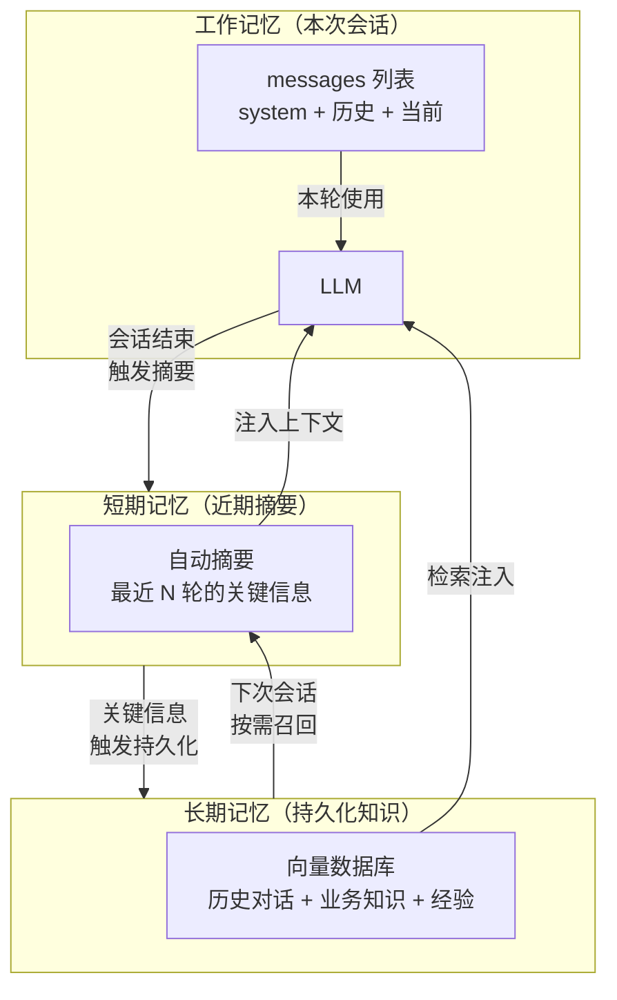
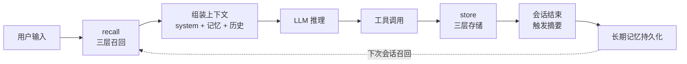

> 没有记忆的 Agent 只是一次性对话。从 KV Cache 到向量数据库，工作记忆 / 短期摘要 / 长期 RAG 三层记忆的工程实现，以及混合检索怎么把语义相似度和时间衰减捏在一起。

## 一、记忆三层模型：为什么一层不够

上下文工程解决的是「这一轮」的问题。Agent 跨对话、跨任务需要记住的东西，上下文窗口装不下。

人类记忆的三层模型给了一个清晰的框架：

| 层级 | 类比 | 存储什么 | 存活时间 | 工程方案 |
|------|------|---------|---------|---------|
| **工作记忆** | 大脑的「草稿纸」 | 当前对话的 messages 列表 | 本次会话 | 内存中的 list / dict |
| **短期记忆** | 「今天发生了什么」 | 近期对话的摘要 | 几小时 ~ 几天 | 自动摘要 + 滚动窗口 |
| **长期记忆** | 「我记得三年前的一件事」 | 持久化的知识与经验 | 永久 | 向量数据库 + RAG |



三层记忆的关键洞察：**不是所有信息都值得存，也不是所有存下来的信息都该立刻用**。工作记忆是「现在正在用的」，短期记忆是「最近发生的」，长期记忆是「可能相关的」。检索时从三层分别取，合并后喂给模型。

## 二、工作记忆：对话状态追踪

工作记忆最朴素——就是 `messages` 列表。但 Agent 跑起来之后，这个列表会变得复杂：多轮对话、工具调用、中间状态。你需要一个 **ConversationStateManager** 来追踪它。

```java
import java.time.Instant;
import java.util.*;
import java.util.concurrent.atomic.AtomicInteger;

/** 一轮对话的状态 */
public enum TurnStatus {
    PENDING,        // 等待模型响应
    TOOL_CALLING,   // 模型正在调用工具
    COMPLETED,      // 本轮完成
    FAILED          // 本轮失败
}

/** 一轮对话的完整记录 */
public record TurnRecord(
    int turnId,
    String userInput,
    String modelOutput,
    List<Map<String, Object>> toolCalls,
    List<String> toolResults,
    TurnStatus status,
    Instant startedAt,
    Instant completedAt,
    int tokenCount
) {
    // 便捷构造：刚创建时的状态
    public static TurnRecord create(int turnId, String userInput) {
        return new TurnRecord(turnId, userInput, null,
            new ArrayList<>(), new ArrayList<>(),
            TurnStatus.PENDING, Instant.now(), null, 0);
    }

    // 不可变 record，用 withXxx 方法返回新实例模拟"更新"
    public TurnRecord withModelOutput(String output, int tokens) {
        return new TurnRecord(turnId, userInput, output, toolCalls, toolResults,
            TurnStatus.COMPLETED, startedAt, Instant.now(), tokens);
    }
}

/**
 * 对话状态管理器：追踪每轮对话的完整生命周期。
 * 不只是存 messages，还存元数据（状态、耗时、Token 数）。
 */
@Component
public class ConversationStateManager {

    private final String systemPrompt;
    private final List<TurnRecord> turns = new ArrayList<>();
    private final AtomicInteger currentTurn = new AtomicInteger(0);
    private final List<Map<String, String>> messages = new ArrayList<>();

    public ConversationStateManager(String systemPrompt) {
        this.systemPrompt = systemPrompt;
        this.messages.add(Map.of("role", "system", "content", systemPrompt));
    }

    /** 开始新一轮对话 */
    public int startTurn(String userInput) {
        int turnId = currentTurn.incrementAndGet();
        turns.add(TurnRecord.create(turnId, userInput));
        messages.add(Map.of("role", "user", "content", userInput));
        return turnId;
    }

    /** 记录工具调用 */
    public void recordToolCall(String toolName, Map<String, Object> arguments, String toolCallId) {
        if (!turns.isEmpty()) {
            var last = turns.getLast();
            last.toolCalls().add(Map.of("name", toolName, "arguments", arguments, "id", toolCallId));
        }
    }

    /** 记录工具返回 */
    public void recordToolResult(String result) {
        if (!turns.isEmpty()) {
            turns.getLast().toolResults().add(result);
        }
    }

    /** 完成本轮对话 */
    public void completeTurn(String modelOutput, int tokenCount) {
        if (!turns.isEmpty()) {
            int lastIdx = turns.size() - 1;
            turns.set(lastIdx, turns.get(lastIdx).withModelOutput(modelOutput, tokenCount));
        }
        messages.add(Map.of("role", "assistant", "content", modelOutput));
    }

    /** 获取最近 N 轮对话 */
    public List<TurnRecord> getRecentTurns(int n) {
        return turns.subList(Math.max(0, turns.size() - n), turns.size());
    }

    /** 获取对话摘要（用于注入上下文或存储） */
    public Map<String, Object> getSummary() {
        return Map.of(
            "totalTurns", turns.size(),
            "completedTurns", turns.stream().filter(t -> t.status() == TurnStatus.COMPLETED).count(),
            "totalToolCalls", turns.stream().mapToInt(t -> t.toolCalls().size()).sum(),
            "totalTokens", turns.stream().mapToInt(TurnRecord::tokenCount).sum(),
            "lastUserInput", turns.isEmpty() ? null : turns.getLast().userInput(),
            "lastModelOutput", turns.isEmpty() ? null : turns.getLast().modelOutput()
        );
    }

    public List<Map<String, String>> getMessages() { return List.copyOf(messages); }
}

// --- 使用 ---
var state = new ConversationStateManager("你是一个有帮助的助手。");

var turnId = state.startTurn("上海今天天气怎么样？");
state.recordToolCall("get_weather", Map.of("city", "上海"), "call_001");
state.recordToolResult("{\"city\": \"上海\", \"temp\": 28, \"conditions\": \"晴\"}");
state.completeTurn("上海今天晴，28°C。", 150);

System.out.println(state.getSummary());
// {totalTurns=1, completedTurns=1, totalToolCalls=1, totalTokens=150, ...}
```

工作记忆的核心价值不在存储——在于**可观测性**。`TurnRecord` 里的元数据（状态、耗时、Token 数）让后续的评估和调试有据可查。

## 三、短期记忆：自动摘要与滚动窗口

对话跑到 10 轮以上，messages 列表就膨胀了。短期记忆要做两件事：**自动触发摘要**，以及**滚动清理过期内容**。

```java
import java.util.*;
import java.util.function.Function;
import java.util.function.Predicate;

/**
 * 短期记忆管理器：自动摘要 + 滚动窗口。
 * 当对话超过阈值时，把早期对话压缩成摘要，保留最近 N 轮原文。
 */
@Component
public class RollingSummarizer {

    private final int maxTurns;
    private final int keepRecent;
    private final Function<String, String> summarizeFn;
    private final List<String> summaryHistory = new ArrayList<>();  // 多期摘要（滚动保存）

    public RollingSummarizer(int maxTurnsBeforeSummarize, int keepRecentTurns,
                              Function<String, String> summarizeFn) {
        this.maxTurns = maxTurnsBeforeSummarize;
        this.keepRecent = keepRecentTurns;
        this.summarizeFn = summarizeFn != null ? summarizeFn : this::defaultSummarize;
    }

    /** 默认摘要策略（真实场景替换为 LLM 调用） */
    private String defaultSummarize(String conversationText) {
        // 提取关键信息
        var lines = new ArrayList<String>();
        for (var line : conversationText.split("\n")) {
            if (line.startsWith("user:") || line.startsWith("assistant:")) {
                lines.add(line.strip().substring(0, Math.min(100, line.strip().length())));
            }
        }
        return "对话摘要: " + String.join(" | ", lines.subList(0, Math.min(10, lines.size())));
    }

    /** 判断是否需要触发摘要 */
    public boolean shouldSummarize(int totalTurns) {
        return totalTurns >= maxTurns;
    }

    /**
     * 执行摘要：保留 system + 历史摘要 + 最近 N 轮。
     * 返回压缩后的 messages 列表。
     */
    public List<Map<String, String>> summarize(List<Map<String, String>> messages) {
        if (messages.size() <= keepRecent + 2) {
            return messages;
        }

        var system = messages.subList(0, 1);
        var recent = messages.subList(
            Math.max(0, messages.size() - (keepRecent * 2 + 1)), messages.size());

        // 需要压缩的部分
        var toSummarize = messages.subList(1,
            Math.max(0, messages.size() - (keepRecent * 2)));
        var convText = toSummarize.stream()
            .filter(m -> m.get("content") != null && !"system".equals(m.get("role")))
            .map(m -> m.get("role") + ": " + m.getOrDefault("content", ""))
            .reduce("", (a, b) -> a + "\n" + b);

        var summary = summarizeFn.apply(convText);
        summaryHistory.add(summary);

        // 保留最近 3 期摘要（更早的丢弃，防止摘要本身膨胀）
        if (summaryHistory.size() > 3) {
            summaryHistory.subList(0, summaryHistory.size() - 3).clear();
        }

        // 重组
        var sb = new StringBuilder();
        for (int i = 0; i < summaryHistory.size(); i++) {
            sb.append("[第%d期摘要] %s\n".formatted(i + 1, summaryHistory.get(i)));
        }
        var summaryText = sb.toString().trim();

        var result = new ArrayList<>(system);
        result.add(Map.of("role", "system", "content", "[短期记忆 - 历史摘要]\n" + summaryText));
        result.addAll(recent);
        return result;
    }

    /** 导出当前短期记忆内容（用于注入长期记忆） */
    public String getMemoryContext() {
        if (summaryHistory.isEmpty()) return "";
        int from = Math.max(0, summaryHistory.size() - 3);
        return String.join("\n", summaryHistory.subList(from, summaryHistory.size()));
    }

    public List<String> getSummaryHistory() { return List.copyOf(summaryHistory); }
}

// --- 使用：模拟长对话 + 自动摘要 ---
/** 模拟 LLM 摘要（真实场景调用模型） */
Function<String, String> mockLlmSummarize = text -> {
    // 提取关键决策和工具结果
    var keyPoints = new ArrayList<String>();
    for (var line : text.split("\n")) {
        if (line.contains("工具") || line.contains("决定") || line.contains("结果")) {
            keyPoints.add(line.strip().substring(0, Math.min(80, line.strip().length())));
        }
    }
    return keyPoints.isEmpty() ? "对话无明显关键信息" : String.join("; ", keyPoints);
};

var summarizer = new RollingSummarizer(5, 2, mockLlmSummarize);

// 模拟 8 轮对话
var messages = new ArrayList<>(List.of(Map.of("role", "system", "content", "你是助手。")));
for (int i = 1; i <= 8; i++) {
    messages.add(Map.of("role", "user", "content", "第" + i + "轮问题"));
    messages.add(Map.of("role", "assistant", "content", "第" + i + "轮回答"));

    long userTurnCount = messages.stream().filter(m -> "user".equals(m.get("role"))).count();
    if (summarizer.shouldSummarize((int) userTurnCount)) {
        messages = new ArrayList<>(summarizer.summarize(messages));
        System.out.printf("第%d轮后触发摘要, messages 长度: %d%n", i, messages.size());
    }
}

System.out.printf("\n最终 messages 长度: %d%n", messages.size());
System.out.printf("摘要历史: %d 期%n", summarizer.getSummaryHistory().size());
```

滚动摘要的核心设计：

- **触发条件可配**：对话轮数 / Token 数 / 时间间隔，都可以作为触发条件
- **多期摘要滚动保存**：不是一期覆盖一期，而是保留最近 3 期，形成「摘要的摘要」
- **摘要质量可控**：`summarize_fn` 可替换——简单的规则提取，或调用 LLM 做语义摘要

## 四、长期记忆：RAG 深度实现

长期记忆的工程方案是 **RAG（Retrieval-Augmented Generation）**——把知识存进向量数据库，需要时检索出来喂给模型。

### 4.1 Embedding 选型

把文本变成向量是 RAG 的第一步。不同 Embedding 模型的效果差异很大：

| 模型 | 维度 | 中文效果 | 成本 | 适合场景 |
|------|------|---------|------|---------|
| `text-embedding-3-small` | 1536 | 良好 | 低 | 通用场景，性价比最高 |
| `text-embedding-3-large` | 3072 | 优秀 | 中 | 高精度需求 |
| BGE-m3 | 1024 | 优秀 | 免费(本地) | 中文优先、离线部署 |
| Jina v3 | 1024 | 良好 | 中 | 多语言混合 |

选型原则：**中文场景优先 BGE-m3 或 `text-embedding-3-small`**。前者免费可本地跑，后者性价比高。除非任务对精度要求极高，否则不必上 large。

### 4.2 Chunk 策略：分割的坑

把长文档切成 chunk 是 RAG 的基础操作，但切法直接影响检索质量：

```java
import java.util.*;
import java.util.regex.Pattern;

/**
 * 文本分块策略。
 * - FIXED: 固定长度 + 重叠窗口（简单但可能切断语义）
 * - SENTENCE: 按句子边界分割（保持语义完整）
 * - RECURSIVE: 递归分割（先按段落，再按句子，最后按字符）
 */
public enum ChunkStrategy { FIXED, SENTENCE, RECURSIVE }

public class Chunker {

    public static List<String> chunkText(String text, int chunkSize, int overlap, ChunkStrategy strategy) {
        return switch (strategy) {
            case FIXED -> chunkFixed(text, chunkSize, overlap);
            case SENTENCE -> chunkBySentence(text, chunkSize);
            case RECURSIVE -> chunkRecursive(text, chunkSize, overlap);
        };
    }

    private static List<String> chunkFixed(String text, int chunkSize, int overlap) {
        var chunks = new ArrayList<String>();
        int start = 0;
        while (start < text.length()) {
            int end = Math.min(start + chunkSize, text.length());
            chunks.add(text.substring(start, end));
            start = end - overlap;
        }
        return chunks;
    }

    private static List<String> chunkBySentence(String text, int chunkSize) {
        // 按句子边界切分
        var sentences = Pattern.compile("[。！？\\n]+").split(text);
        var chunks = new ArrayList<String>();
        var current = new StringBuilder();

        for (var sent : sentences) {
            if (current.length() + sent.length() > chunkSize && !current.isEmpty()) {
                chunks.add(current.toString().strip());
                current = new StringBuilder(sent);
            } else {
                current.append(sent).append("。");
            }
        }
        if (!current.isEmpty()) {
            chunks.add(current.toString().strip());
        }
        return chunks;
    }

    /** 先按段落切，段落太大再按句子切 */
    private static List<String> chunkRecursive(String text, int chunkSize, int overlap) {
        var paragraphs = text.split("\n\n");
        var chunks = new ArrayList<String>();
        for (var para : paragraphs) {
            if (para.length() <= chunkSize) {
                chunks.add(para);
            } else {
                chunks.addAll(chunkBySentence(para, chunkSize));
            }
        }
        return chunks;
    }
}

// --- 对比三种策略 ---
var sampleText = """
    Agent 的记忆系统是 Agent 工程的核心组件之一。
    它分为三个层次：工作记忆、短期记忆和长期记忆。

    工作记忆存储当前会话的对话历史，存活时间短，但访问速度最快。
    短期记忆通过自动摘要保存近期对话的关键信息，存活几小时到几天。
    长期记忆将重要知识持久化到向量数据库中，可以跨会话召回。

    在实际工程中，三层记忆需要协同工作。当用户发起一个新会话时，
    系统首先从长期记忆中检索与当前话题相关的知识，注入上下文。
    然后在对话过程中，短期记忆不断滚动更新。
    会话结束时，关键信息被持久化到长期记忆。
    """;

for (var strategy : ChunkStrategy.values()) {
    var chunks = Chunker.chunkText(sampleText, 100, 20, strategy);
    System.out.printf("[%s] %d chunks%n", strategy, chunks.size());
    for (int i = 0; i < chunks.size(); i++) {
        var c = chunks.get(i);
        System.out.printf("  %d: %s...%n", i, c.substring(0, Math.min(60, c.length())));
    }
}
```

Chunk 策略的选择直接影响检索召回率。**递归分割（recursive）是大多数场景的默认选择**——先按自然段落切，段落太大再按句子切，最后才 resort 到固定长度。这保证了大多数 chunk 是语义完整的。

### 4.3 向量数据库：存储与检索

向量数据库负责存储 embedding 向量并提供相似度检索。轻量场景用 **ChromaDB**（本地、零配置），生产场景用 **Milvus / Qdrant / Weaviate**。

```java
import java.nio.charset.StandardCharsets;
import java.security.MessageDigest;
import java.time.Instant;
import java.util.*;
import java.util.concurrent.ConcurrentHashMap;
import java.util.concurrent.atomic.AtomicInteger;
import java.util.function.Predicate;

/**
 * 一条长期记忆
 * MemoryEntry record：
 */
public record MemoryEntry(
    String id,
    String content,
    float[] embedding,
    String source,             // 来源：对话 / 文档 / 工具结果
    Instant createdAt,
    AtomicInteger accessCount, // 被检索次数（用于热度排序）
    Map<String, Object> metadata
) {
    // 便捷构造：自动生成 ID
    public static MemoryEntry of(String content, float[] embedding, String source, Map<String, Object> metadata) {
        return new MemoryEntry(generateId(content), content, embedding, source,
            Instant.now(), new AtomicInteger(0), metadata != null ? metadata : Map.of());
    }

    private static String generateId(String content) {
        try {
            var md = MessageDigest.getInstance("MD5");
            var digest = md.digest(content.getBytes(StandardCharsets.UTF_8));
            var sb = new StringBuilder();
            for (int i = 0; i < 6; i++) sb.append("%02x".formatted(digest[i]));
            return sb.toString();
        } catch (Exception e) {
            return UUID.randomUUID().toString().substring(0, 12);
        }
    }
}

/**
 * 轻量向量存储（内存版）。
 * 生产环境替换为 ChromaDB / Milvus / Qdrant。
 * 核心接口：add / search / delete
 * 参考 eos-next-agent 的 InMemoryVectorStore 设计
 */
@Component
public class SimpleVectorStore {

    private final Map<String, MemoryEntry> entries = new ConcurrentHashMap<>();

    public void add(MemoryEntry entry) {
        entries.put(entry.id(), entry);
    }

    public void addBatch(List<MemoryEntry> batch) {
        batch.forEach(this::add);
    }

    /**
     * 余弦相似度检索。
     * 真实场景用向量数据库的 ANN 索引（HNSW / IVF），这里是暴力计算。
     */
    public List<Map.Entry<MemoryEntry, Double>> search(
            float[] queryEmbedding, int topK, Predicate<MemoryEntry> filter) {

        var results = new ArrayList<Map.Entry<MemoryEntry, Double>>();
        for (var entry : entries.values()) {
            if (filter != null && !filter.test(entry)) continue;
            double score = cosineSimilarity(queryEmbedding, entry.embedding());
            results.add(Map.entry(entry, score));
        }
        results.sort((a, b) -> Double.compare(b.getValue(), a.getValue()));
        return results.subList(0, Math.min(topK, results.size()));
    }

    public void delete(String entryId) {
        entries.remove(entryId);
    }

    public int size() {
        return entries.size();
    }

    /** 余弦相似度计算 */
    public static double cosineSimilarity(float[] a, float[] b) {
        if (a == null || b == null || a.length != b.length || a.length == 0) return 0.0;
        double dot = 0, normA = 0, normB = 0;
        for (int i = 0; i < a.length; i++) {
            dot += a[i] * b[i];
            normA += a[i] * a[i];
            normB += b[i] * b[i];
        }
        if (normA == 0 || normB == 0) return 0.0;
        return dot / (Math.sqrt(normA) * Math.sqrt(normB));
    }
}

// --- 使用 ---
var store = new SimpleVectorStore();
var random = new Random(42);

// 添加记忆（embedding 用模拟向量，真实场景用 Embedding 模型）
for (int i = 0; i < 20; i++) {
    var topic = i < 7 ? "天气" : i < 14 ? "代码" : "会议";
    var embedding = random.doubles(128).toArray();  // 模拟 128 维向量
    var entry = MemoryEntry.of(
        "记忆条目 %d: %s相关内容...".formatted(i, topic),
        Arrays.copyOf(embedding, embedding.length),  // float[]
        "dialogue", null
    );
    store.add(entry);
}

System.out.printf("存储规模: %d 条%n", store.size());
```

### 4.4 混合检索：语义 + 时间 + 热度

纯向量检索只考虑语义相似度，但实际场景中，**时效性**和**热度**同样重要。一条半年前的相关记忆，可能不如昨天的一条弱相关记忆有用。

```java
/**
 * 混合检索器：语义相似度 + 时间衰减 + 访问热度，加权融合。
 * 最终得分 = α × 语义分数 + β × 时间分数 + γ × 热度分数
 * 参考 eos-next-agent 的 HybridRetriever 设计（dense + sparse 加权融合）
 */
@Component
public class HybridRetriever {

    private final double alpha;   // 语义权重
    private final double beta;    // 时间权重
    private final double gamma;   // 热度权重
    private final double halfLife; // 时间衰减半衰期（天）

    public HybridRetriever() {
        this(0.6, 0.25, 0.15, 30.0);
    }

    public HybridRetriever(double alpha, double beta, double gamma, double halfLifeDays) {
        this.alpha = alpha;
        this.beta = beta;
        this.gamma = gamma;
        this.halfLife = halfLifeDays;
    }

    /** 时间衰减分数：越近越高，指数衰减 */
    private double timeScore(MemoryEntry entry) {
        double ageDays = (double) (java.time.Duration.between(entry.createdAt(), java.time.Instant.now()).toSeconds()) / 86400;
        return Math.exp(-Math.log(2) * ageDays / halfLife);
    }

    /** 热度分数：被检索次数越多越高，对数缩放 */
    private double popularityScore(MemoryEntry entry, int maxCount) {
        return Math.min(Math.log(1 + entry.accessCount().get()) / Math.log(1 + maxCount), 1.0);
    }

    /**
     * 混合检索：返回 (entry, finalScore, breakdown)。
     * breakdown 包含各维度分数，便于调试。
     */
    public List<SearchResult> search(SimpleVectorStore store, float[] queryEmbedding, int topK) {
        var rawResults = store.search(queryEmbedding, topK * 3, null);  // 多取一些，再做融合排序

        var scored = new ArrayList<SearchResult>();
        for (var raw : rawResults) {
            var entry = raw.getKey();
            var semanticScore = raw.getValue();
            var timeScore = timeScore(entry);
            var popScore = popularityScore(entry, 10);

            var finalScore = alpha * semanticScore + beta * timeScore + gamma * popScore;

            entry.accessCount().incrementAndGet();  // 更新热度
            scored.add(new SearchResult(entry, finalScore,
                Map.of("semantic", Math.round(semanticScore * 1000) / 1000.0,
                       "time", Math.round(timeScore * 1000) / 1000.0,
                       "popularity", Math.round(popScore * 1000) / 1000.0)));
        }

        scored.sort((a, b) -> Double.compare(b.finalScore(), a.finalScore()));
        return scored.subList(0, Math.min(topK, scored.size()));
    }

    /** 检索结果：包含记忆条目、最终得分、各维度分数 */
    public record SearchResult(MemoryEntry entry, double finalScore, Map<String, Double> breakdown) {}
}

// --- 使用 ---
var retriever = new HybridRetriever(0.6, 0.25, 0.15, 30.0);

// 模拟查询（用随机向量）
var queryVec = new Random(42).doubles(128).toArray();
var results = retriever.search(store, Arrays.copyOf(queryVec, queryVec.length), 3);

for (var r : results) {
    System.out.printf("得分: %.3f | 语义=%s 时间=%s 热度=%s%n",
        r.finalScore(), r.breakdown().get("semantic"),
        r.breakdown().get("time"), r.breakdown().get("popularity"));
    System.out.printf("  → %s...%n", r.entry().content().substring(0,
        Math.min(50, r.entry().content().length())));
}
```

混合检索的核心洞察：**语义相似度决定「相关性」，时间衰减决定「新鲜度」，热度决定「可靠性」**。三者加权融合，比纯向量检索的召回质量高一个量级。

权重怎么调？经验值：`α=0.6, β=0.25, γ=0.15`。语义永远是大头，但时间和热度不是可选项——没有它们，Agent 会翻出半年前的旧事还当宝。

## 五、三层记忆集成：给 Agent 装上完整记忆

把上面的组件拼在一起，就是一个完整的三层记忆系统。

```java
import java.util.*;
import java.util.concurrent.CompletableFuture;

/**
 * Agent 三层记忆系统。
 * 对外暴露一个接口：recall(query) → 合并三层记忆返回上下文。
 */
@Service
public class AgentMemory {

    private final SimpleVectorStore vectorStore;
    private final RollingSummarizer summarizer;
    private final HybridRetriever retriever;
    private final List<String> workingBuffer = new ArrayList<>();  // 工作记忆的额外缓存
    private final Random random = new Random();  // 模拟 Embedding 用

    public AgentMemory(SimpleVectorStore vectorStore,
                       RollingSummarizer summarizer,
                       HybridRetriever retriever) {
        this.vectorStore = vectorStore;
        this.summarizer = summarizer;
        this.retriever = retriever;
    }

    /** 存储一条长期记忆 */
    public void store(String content, String source, Map<String, Object> metadata) {
        var entry = MemoryEntry.of(
            content,
            random.doubles(128).toArray(),  // 真实场景：调用 Embedding 模型
            source, metadata
        );
        vectorStore.add(entry);
    }

    /** 对话结束时，把关键信息存入三层记忆 */
    public void storeConversation(TurnRecord turn) {
        // 工作记忆：ConversationStateManager 已处理
        // 短期记忆：交给 summarizer
        if (summarizer.shouldSummarize(0)) {
            // 由外部判断是否触发 summarizer.summarize()
        }

        // 长期记忆：存储本轮关键信息
        for (var call : turn.toolCalls()) {
            store("工具调用: %s(%s)".formatted(call.get("name"), call.get("arguments")),
                  "tool_call", Map.of("turnId", turn.turnId()));
        }
        if (turn.modelOutput() != null) {
            store(turn.modelOutput().substring(0, Math.min(200, turn.modelOutput().length())),
                  "model_output", Map.of("turnId", turn.turnId()));
        }
    }

    /**
     * 召回记忆：从三层分别取，合并成一段上下文。
     * 真实场景中 queryEmbedding 由 Embedding 模型生成。
     */
    public String recall(String query, float[] queryEmbedding) {
        var parts = new ArrayList<String>();

        // 1. 短期记忆摘要
        var shortTerm = summarizer.getMemoryContext();
        if (!shortTerm.isEmpty()) {
            parts.add("[短期记忆]\n" + shortTerm);
        }

        // 2. 长期记忆检索
        if (queryEmbedding != null) {
            var results = retriever.search(vectorStore, queryEmbedding, 3);
            if (!results.isEmpty()) {
                var lines = results.stream()
                    .map(r -> "- %s (得分: %.2f)".formatted(
                        r.entry().content().substring(0, Math.min(80, r.entry().content().length())),
                        r.finalScore()))
                    .toList();
                parts.add("[长期记忆 - 检索结果]\n" + String.join("\n", lines));
            }
        }

        // 3. 工作记忆缓存
        if (!workingBuffer.isEmpty()) {
            int from = Math.max(0, workingBuffer.size() - 5);
            parts.add("[工作记忆 - 缓存]\n" + String.join("\n",
                workingBuffer.subList(from, workingBuffer.size())));
        }

        return parts.isEmpty() ? "无相关记忆" : String.join("\n\n", parts);
    }

    /** 导出完整的记忆上下文（给 Harness 注入用） */
    public Map<String, Object> exportContext(String query) {
        return Map.of(
            "recallResult", recall(query, null),
            "storeSize", vectorStore.size(),
            "summaryPeriods", summarizer.getSummaryHistory().size()
        );
    }
}

// --- 集成到 Agent 循环 ---
public CompletableFuture<Map<String, Object>> runAgentWithMemory(
        String userInput, List<?> tools, Object llmClient) {

    var memory = new AgentMemory(new SimpleVectorStore(),
        new RollingSummarizer(8, 4, null), new HybridRetriever());
    var state = new ConversationStateManager("你是助手。");

    var turnId = state.startTurn(userInput);

    // 召回记忆，注入上下文
    var memoryContext = memory.recall(userInput, null);
    var augmentedMessages = new ArrayList<>(state.getMessages());
    if (memoryContext != null && !"无相关记忆".equals(memoryContext)) {
        augmentedMessages.add(Map.of("role", "system", "content", "[记忆召回]\n" + memoryContext));
    }

    // 模型推理（省略 toolCalls 处理）
    // ... resp = llmClient.chat().completions().create(...)

    // 存储结果
    state.completeTurn("基于记忆的回复", 200);
    if (!state.getRecentTurns(1).isEmpty()) {
        memory.storeConversation(state.getRecentTurns(1).getLast());
    }

    return CompletableFuture.completedFuture(state.getSummary());
}
```

三层记忆集成后的 Agent 循环变成了：



## 六、行业实践：来自生产级框架的记忆设计

### 6.1 信任分长期记忆：框架 C 的 Redis ZSet 方案

框架 C 的长期记忆不只存向量——每条记忆带一个**信任分**，存在 Redis ZSet 里：

```java
/**
 * 框架 C 信任分记忆概念映射
 * MemoryService + Redis ZSet 方案：
 */
@Component
public class TrustScoredMemory {

    static final double INITIAL_SCORE = 0.5;        // 新记忆初始分
    static final double RETRIEVAL_BOOST = 0.1;      // 被检索到就加分
    static final double EVICTION_THRESHOLD = 0.3;   // 低于此分自动淘汰
    static final int MAX_ENTRIES = 10000;

    // 概念实现：实际用 Redis ZSet，这里用 TreeMap 演示
    private final Map<String, Double> zset = new LinkedHashMap<>();

    /** 新记忆入库，初始分 0.5 */
    public void store(String fact, float[] embedding) {
        zset.put(fact, INITIAL_SCORE);
    }

    /** 检索时加分，越常用越不容易被淘汰 */
    public List<String> retrieve(float[] queryEmbedding, int topK) {
        // 概念实现：向量检索取 topK*2
        var results = vectorSearch(queryEmbedding, topK * 2);
        for (var fact : results) {
            zset.merge(fact, RETRIEVAL_BOOST, Double::sum);
        }
        return results.subList(0, Math.min(topK, results.size()));
    }

    /** 定期清理：低于阈值的记忆自动淘汰 */
    public void evict() {
        zset.entrySet().removeIf(e -> e.getValue() < EVICTION_THRESHOLD);
    }

    // 概念方法：实际由向量数据库实现
    private List<String> vectorSearch(float[] queryEmbedding, int topK) {
        return List.of(); // 占位
    }
}
```

这个设计的精妙之处：**被频繁检索的记忆自动获得更高权重，无人问津的记忆自然沉底淘汰**。不需要人工标记重要性——使用频率就是重要性。

### 6.2 三层记忆 + 自动合并：框架 A 的方案

框架 A 的记忆分三层，多了一层**合并（Consolidation）**：

| 层级 | 存储 | 触发合并 |
|------|------|---------|
| Session Memory | 内存，当前会话 | 会话结束 |
| Long-term Memory | MongoDB，持久化 | 定期触发 |
| Consolidation | LLM 驱动的记忆合并 | 相似记忆积累到阈值 |

合并层是 框架 A 独有的设计——当长期记忆里积累了多条关于同一主题的记忆时，LLM 自动把它们合并成一条更精炼的记忆。这解决了「记忆碎片化」的问题：5 次对话都提到了同一个项目，不需要存 5 条，合并成 1 条综合记忆。

### 6.3 设计共识

| 设计点 | 共识做法 | 反面模式 |
|--------|---------|---------|
| 分层存储 | 工作/短期/长期三层分离 | 全塞一个 list |
| 摘要触发 | 轮数/Token 数/时间多重条件 | 固定 N 轮一刀切 |
| 信任分 | 检索加分 + 低分淘汰 | 只进不出 |
| 记忆合并 | LLM 驱动的碎片合并 | 重复记忆堆积 |
| Embedding | 中文 BGE-m3 或 text-embedding-3-small | 用未微调的通用模型 |
| Chunk 策略 | 递归分割（段落→句子→字符） | 固定长度硬切 |
| 检索排序 | 语义 + 时间 + 热度加权融合 | 纯向量余弦相似度 |

记忆系统的终极挑战不是「怎么存」，是**「怎么忘」**。一个不会遗忘的 Agent，检索时会被噪音淹没。好的记忆系统和好的人类记忆一样——记住重要的，忘掉不重要的，在需要时能精准召回。

## 结语

记忆让 Agent 从「一次性对话」变成「持续进化的助手」。

> 没有记忆的 Agent 只是一次性对话。工作记忆管当下，短期记忆管近期，长期记忆管永久——三层记忆各司其职，混合检索把语义、时间、热度捏在一起，才让 Agent 在跨会话、跨任务的场景里真正「记得住」。

这不是 RAG 的简单套用。RAG 解决的是「从文档里找答案」，Agent 记忆解决的是「从自己的经验里找线索」。前者是开卷考试，后者是带着阅历做事。

---

> **🔁 闭环视角**
>
> 本篇聚焦 Agent 闭环的**记忆更新**阶段——行动执行后，工具返回的结果和对话的关键信息怎么存、怎么组织、怎么在下次需要时被召回。记忆的质量决定了 Agent 能不能「吃一堑长一智」。
