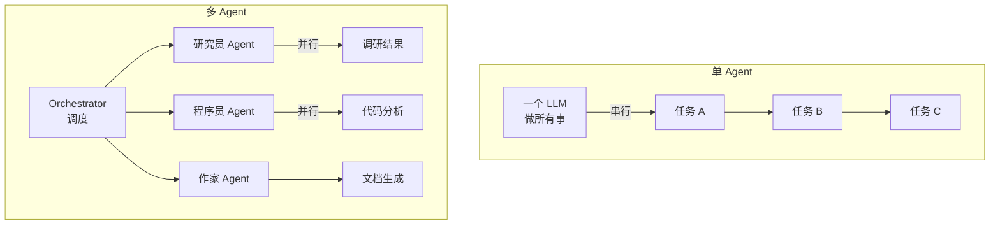
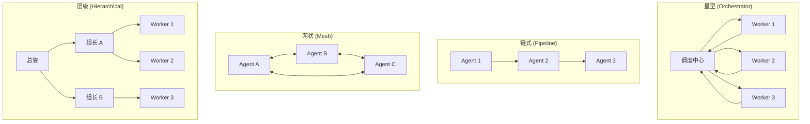
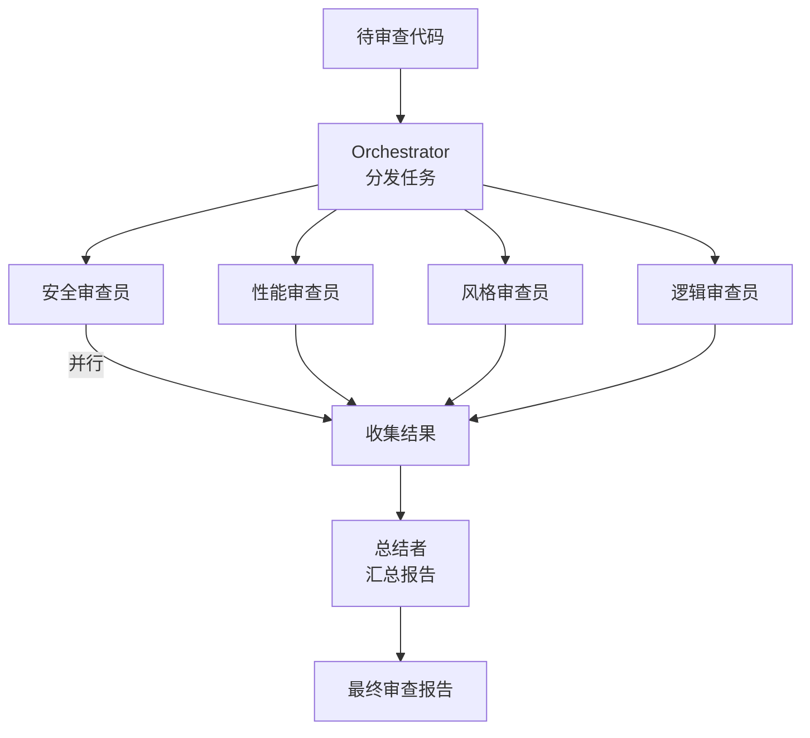

> 多 Agent 协作：一个 Agent 不够用？任务太大、上下文装不下、需要专业分工——那就来一支 Agent 团队。四种协作拓扑、通信协议、辩论收敛，以及一个完整的代码审查多 Agent 实战。

## 一、为什么需要多 Agent

单个 Agent 有三个硬瓶颈：

**上下文天花板**。再大的窗口也有上限。一个要做「竞品分析 + 代码审查 + 文档生成」的任务，每块都需要大量上下文，全塞给一个 Agent，窗口直接爆。

**专业化不足**。一个 Agent 既是研究员又是程序员又是作家，每个角色都只能做到 60 分。让专门的 Agent 做专门的事，每个角色都能做到 90 分。

**并行度为零**。单 Agent 串行执行，10 步任务就是 10 步的时间。多 Agent 可以分工并行，10 步变 3 批。



多 Agent 的核心问题不是「起多个 LLM 调用」——那是暴力堆算力。真正的工程问题是：**任务怎么分？Agent 之间怎么通信？意见不一致怎么办？结果怎么聚合？**

类比分布式系统，但多了一个新维度——Agent 有「自主推理能力」，不像微服务那样完全按代码逻辑跑。

## 二、四种协作拓扑

多 Agent 的协作方式决定了系统的复杂度和可靠性。四种经典拓扑：



| 拓扑 | 适用场景 | 优势 | 风险 |
|------|---------|------|------|
| **星型** | 任务可明确拆分、需要统一调度 | 集中控制、易调试 | Orchestrator 是单点瓶颈 |
| **链式** | 流水线作业（输入→处理→输出） | 简单、顺序确定 | 上游错误传导到下游 |
| **网状** | 需要频繁协商的复杂任务 | 灵活、信息充分 | 通信开销大、可能死锁 |
| **层级** | 大规模团队、任务可递归分解 | 可扩展、分工清晰 | 管理层 overhead |

工程实践中的共识：**默认用星型，流水线用链式，复杂协商才上网状**。层级拓扑在 Agent 数量超过 10 个时才值得引入。

## 三、通信协议：Agent 之间怎么说话

多 Agent 系统的核心是通信。Agent 之间传的不是自然语言对话——是**结构化消息**。

```java
import java.time.Instant;
import java.util.*;
import java.util.concurrent.ConcurrentLinkedQueue;

// --- 消息类型枚举 ---
enum MessageType {
    TASK,            // 分配任务
    RESULT,          // 返回结果
    REQUEST_INFO,    // 请求信息
    RESPONSE_INFO,   // 回复信息
    DEBATE,          // 发起辩论
    VOTE,            // 投票
    BROADCAST        // 广播
}

// --- Agent 间通信的标准消息格式（不可变 record） ---
record AgentMessage(
    String id,
    String fromAgent,
    String toAgent,           // "" 表示广播
    MessageType type,
    Object content,
    Map<String, Object> context,  // 共享上下文片段
    Instant timestamp,
    String replyTo            // 回复的消息 ID，可为 null
) {
    AgentMessage(String fromAgent, String toAgent, MessageType type, Object content) {
        this(UUID.randomUUID().toString().substring(0, 8),
             fromAgent, toAgent, type, content, Map.of(), Instant.now(), null);
    }

    AgentMessage(String fromAgent, String toAgent, MessageType type, Object content,
                 Map<String, Object> context, String replyTo) {
        this(UUID.randomUUID().toString().substring(0, 8),
             fromAgent, toAgent, type, content, context, Instant.now(), replyTo);
    }

    Map<String, Object> toDict() {
        return Map.of(
            "id", id, "from", fromAgent, "to", toAgent,
            "type", type.name(), "content", content,
            "context", context, "timestamp", timestamp.toString()
        );
    }
}

// --- 消息总线：Agent 间通信的中枢 ---
class MessageBus {
    /**
     * 支持：点对点、广播、订阅。
     * 生产环境可替换为 Redis Pub/Sub 或 MQ。
     */
    private final Map<String, Queue<AgentMessage>> queues = new HashMap<>();
    private final Queue<AgentMessage> broadcastQueue = new ConcurrentLinkedQueue<>();
    private final List<AgentMessage> log = new ArrayList<>();

    void send(AgentMessage msg) {
        log.add(msg);
        if (msg.toAgent() == null || msg.toAgent().isEmpty()) {
            broadcastQueue.add(msg);
        } else {
            queues.computeIfAbsent(msg.toAgent(), k -> new ConcurrentLinkedQueue<>()).add(msg);
        }
    }

    List<AgentMessage> receive(String agentName) {
        var messages = new ArrayList<AgentMessage>();
        // 点对点消息
        var q = queues.remove(agentName);
        if (q != null) messages.addAll(q);
        // 广播消息
        messages.addAll(broadcastQueue);
        broadcastQueue.clear();
        return messages;
    }

    List<Map<String, Object>> getLog() {
        return log.stream().map(AgentMessage::toDict).toList();
    }
}

// --- 使用：两个 Agent 通过消息总线通信 ---
var bus = new MessageBus();

// 调度者发送任务
bus.send(new AgentMessage("orchestrator", "researcher", MessageType.TASK,
    "搜索竞品 A 的核心功能", Map.of("deadline", "5min"), null));
bus.send(new AgentMessage("orchestrator", "analyst", MessageType.TASK,
    "分析竞品 A 的定价策略"));

// 研究员接收并回复
for (var msg : bus.receive("researcher")) {
    System.out.printf("收到: %s → %s%n", msg.fromAgent(), msg.content());
    bus.send(new AgentMessage("researcher", "orchestrator", MessageType.RESULT,
        Map.of("features", List.of("功能1", "功能2", "功能3")),
        Map.of(), msg.id()));
}

// 调度者接收结果
for (var r : bus.receive("orchestrator")) {
    System.out.printf("结果: %s → %s%n", r.fromAgent(), r.content());
}
```

通信协议的关键设计决策：**共享上下文 vs 私有上下文**。

- **共享上下文**（黑板模式）：所有 Agent 看到同一份上下文。信息充分，但 token 消耗大，且有信息过载的风险。
- **私有上下文**（消息传递）：每个 Agent 只看到自己需要的信息。节省 token，但可能信息不全。

工程实践的选择：**混合模式**——Orchestrator 维护全局上下文，Worker 只拿到自己任务相关的片段。结果回传后由 Orchestrator 合并。

## 四、任务分配与调度

Orchestrator 的核心职责是把大任务拆成子任务、分配给合适的 Agent、追踪进度。

```java
import java.util.*;
import java.util.concurrent.atomic.AtomicInteger;

// --- Agent 能力画像（record，调度器用它来匹配任务） ---
record AgentProfile(
    String name,
    List<String> capabilities,     // 能力标签：["search", "coding", "writing"]
    int maxContextTokens,          // 上下文窗口大小
    AtomicInteger currentLoad,     // 当前负载（进行中的任务数）
    double successRate             // 历史成功率
) {
    AgentProfile(String name, List<String> capabilities, int maxContextTokens) {
        this(name, capabilities, maxContextTokens, new AtomicInteger(0), 1.0);
    }
}

// --- 任务分配器：基于能力匹配 + 负载均衡分配子任务 ---
class TaskDispatcher {
    private final Map<String, AgentProfile> agents;

    TaskDispatcher(Map<String, AgentProfile> agents) {
        this.agents = new HashMap<>(agents);
    }

    /** 找到能胜任的所有 Agent（能力全匹配） */
    List<String> match(List<String> requiredCapabilities) {
        return agents.entrySet().stream()
            .filter(e -> requiredCapabilities.stream()
                .allMatch(cap -> e.getValue().capabilities().contains(cap)))
            .map(Map.Entry::getKey)
            .toList();
    }

    /**
     * 分配任务：能力匹配 → 负载均衡 → 返回分配方案。
     * 返回 {agentName: [assignedTasks]}
     */
    Map<String, List<Map<String, Object>>> assign(List<Map<String, Object>> tasks) {
        Map<String, List<Map<String, Object>>> assignments = new LinkedHashMap<>();
        agents.keySet().forEach(name -> assignments.put(name, new ArrayList<>()));

        // 按优先级排序（高优先级先分配）
        var sortedTasks = tasks.stream()
            .sorted(Comparator.comparingInt(t -> -(int) t.getOrDefault("priority", 0)))
            .toList();

        for (var task : sortedTasks) {
            @SuppressWarnings("unchecked")
            List<String> caps = (List<String>) task.get("capabilities");
            List<String> candidates = match(caps);
            if (candidates.isEmpty()) {
                candidates = new ArrayList<>(agents.keySet()); // 无完美匹配，全部候选
            }

            // 负载均衡：选当前负载最低的
            String best = candidates.stream()
                .min(Comparator.comparingInt(n -> agents.get(n).currentLoad().get()))
                .orElseThrow();
            assignments.get(best).add(task);
            agents.get(best).currentLoad().incrementAndGet();
        }
        return assignments;
    }
}

// --- 使用 ---
var agents = Map.of(
    "researcher", new AgentProfile("researcher", List.of("search", "analysis", "writing"), 128_000),
    "coder",      new AgentProfile("coder", List.of("coding", "debugging", "review"), 128_000),
    "writer",     new AgentProfile("writer", List.of("writing", "editing", "translation"), 64_000)
);

var dispatcher = new TaskDispatcher(agents);

var tasks = List.of(
    Map.<String, Object>of("desc", "搜索竞品信息", "capabilities", List.of("search", "analysis"), "priority", 3),
    Map.<String, Object>of("desc", "写代码实现",   "capabilities", List.of("coding"),             "priority", 2),
    Map.<String, Object>of("desc", "写报告",       "capabilities", List.of("writing"),            "priority", 1),
    Map.<String, Object>of("desc", "代码审查",     "capabilities", List.of("coding", "review"),    "priority", 2)
);

var assignments = dispatcher.assign(tasks);
assignments.forEach((agent, taskList) -> {
    var descs = taskList.stream().map(t -> t.get("desc")).toList();
    System.out.printf("%s: %s%n", agent, descs);
});
```

任务分配的核心逻辑：**能力匹配是第一优先级，负载均衡是第二优先级**。先确保任务分配给能胜任的 Agent，再在多个胜任者里选最闲的。

## 五、冲突解决与辩论收敛

多 Agent 最棘手的场景：**意见不一致**。代码审查时，Agent A 说这段代码有性能问题，Agent B 说没问题。怎么办？

三种策略：

### 5.1 投票（Voting）

简单直接——每个 Agent 投票，少数服从多数。适合「是/否」类决策。

### 5.2 辩论（Debate）

多轮辩论 → 收敛。每轮每个 Agent 看到对方的论点，修正自己的立场。

### 5.3 裁判（Judge）

引入一个权威 Agent（通常是更强的模型）做最终裁决。

```java
import java.util.*;
import java.util.concurrent.CompletableFuture;
import java.util.function.BiFunction;
import java.util.stream.Collectors;

/**
 * 辩论收敛引擎：多 Agent 多轮辩论 → 共识收敛。
 * 灵感来自 Constitutional AI 的多 Agent 版本。
 */
class AgentDebate {
    private final List<String> participants;
    private final int maxRounds;
    private final double convergenceThreshold;

    AgentDebate(List<String> participants, int maxRounds, double convergenceThreshold) {
        this.participants = participants;
        this.maxRounds = maxRounds;
        this.convergenceThreshold = convergenceThreshold;
    }

    /**
     * 多轮辩论流程。
     * @param critiqueFn  (agent, allProposals) → 该 agent 的批评
     * @param reviseFn    (agent, ownProposal, allCritiques) → 修订后的提案
     */
    Map<String, Object> resolve(
            String topic,
            Map<String, String> initialProposals,
            BiFunction<String, Map<String, String>, String> critiqueFn,
            TriFunction<String, String, Map<String, String>, String> reviseFn) {

        var proposals = new HashMap<>(initialProposals);
        var debateLog = new ArrayList<String>();

        for (int round = 1; round <= maxRounds; round++) {
            debateLog.add("--- 第 %d 轮辩论 ---".formatted(round));

            // 1. 互相批评
            Map<String, String> critiques = new LinkedHashMap<>();
            for (String agent : participants) {
                String critique = critiqueFn.apply(agent, proposals);
                critiques.put(agent, critique);
                debateLog.add("  %s 的批评: %s...".formatted(agent,
                    critique.substring(0, Math.min(60, critique.length()))));
            }

            // 2. 各自修订
            for (String agent : participants) {
                // 只看其他人的批评
                Map<String, String> otherCritiques = critiques.entrySet().stream()
                    .filter(e -> !e.getKey().equals(agent))
                    .collect(Collectors.toMap(Map.Entry::getKey, Map.Entry::getValue));
                String revised = reviseFn.apply(agent, proposals.get(agent), otherCritiques);
                proposals.put(agent, revised);
                debateLog.add("  %s 修订后: %s...".formatted(agent,
                    revised.substring(0, Math.min(60, revised.length()))));
            }

            // 3. 检查收敛
            if (hasConverged(proposals)) {
                debateLog.add("✅ 达成共识");
                break;
            }
        }

        String best = selectBest(proposals);
        return Map.of("consensus", best, "proposals", proposals, "log", debateLog);
    }

    /** 简单收敛判断：所有提案的文本相似度超过阈值 */
    private boolean hasConverged(Map<String, String> proposals) {
        var values = new ArrayList<>(proposals.values());
        if (values.size() < 2) return true;

        List<Double> similarities = new ArrayList<>();
        for (int i = 0; i < values.size(); i++) {
            for (int j = i + 1; j < values.size(); j++) {
                similarities.add(textSimilarity(values.get(i), values.get(j)));
            }
        }
        double avg = similarities.stream().mapToDouble(d -> d).average().orElse(0);
        return avg >= convergenceThreshold;
    }

    /** Jaccard 文本相似度 */
    static double textSimilarity(String a, String b) {
        var setA = Set.of(a.split("\\s+"));
        var setB = Set.of(b.split("\\s+"));
        if (setA.isEmpty() || setB.isEmpty()) return 0.0;
        long intersection = setA.stream().filter(setB::contains).count();
        long union = setA.size() + setB.size() - intersection;
        return (double) intersection / union;
    }

    /** 选择出现次数最多的提案（众数） */
    static String selectBest(Map<String, String> proposals) {
        return proposals.values().stream()
            .collect(Collectors.groupingBy(p -> p, Collectors.counting()))
            .entrySet().stream()
            .max(Map.Entry.comparingByValue())
            .map(Map.Entry::getKey)
            .orElseThrow();
    }

    // 三参数函数接口
    @FunctionalInterface
    interface TriFunction<A, B, C, R> {
        R apply(A a, B b, C c);
    }
}

// --- 使用：代码审查中的分歧解决 ---
var proposals = Map.of(
    "reviewer_a", "这段代码有 N+1 查询问题，需要加 JOIN",
    "reviewer_b", "数据量小，N+1 可接受，优先可读性",
    "reviewer_c", "建议加缓存而非改查询"
);

AgentDebate.TriFunction<String, String, Map<String, String>, String> mockRevise =
    (agent, own, critiques) -> own;  // 简化：不改变立场

var debate = new AgentDebate(List.of("reviewer_a", "reviewer_b", "reviewer_c"), 3, 0.8);
var result = debate.resolve("N+1 查询优化", proposals,
    (agent, allProposals) -> {
        var others = allProposals.entrySet().stream()
            .filter(e -> !e.getKey().equals(agent))
            .map(Map.Entry::getValue).toList();
        return "考虑其他观点后：%s...".formatted(others.get(0).substring(0, 30));
    },
    mockRevise
);

System.out.println("共识: " + result.get("consensus"));
@SuppressWarnings("unchecked")
var logLines = (List<String>) result.get("log");
logLines.forEach(System.out::println);
```

辩论收敛的价值在于：**不是消灭分歧，而是让分歧在结构化流程里自然收敛**。每轮辩论后 Agent 看到对方的论点，有机会修正自己的立场。3 轮之后，如果还没共识，就由 Judge（Orchestrator 或更强的模型）拍板。

## 六、实战：多 Agent 代码审查系统

把上面的组件拼在一起——一个 5 Agent 组成的代码审查团队。

```java
import java.util.*;
import java.util.concurrent.CompletableFuture;
import java.util.concurrent.Executors;
import java.util.stream.Collectors;

// --- 定义 Agent 角色 ---
final class ReviewRoles {
    static final Map<String, String> ALL = Map.of(
        "security",    "安全审查员：检查注入漏洞、硬编码密钥、权限绕过",
        "performance", "性能审查员：检查 N+1 查询、内存泄漏、不必要的循环",
        "style",       "风格审查员：检查命名规范、代码格式、注释质量",
        "logic",       "逻辑审查员：检查边界条件、错误处理、业务逻辑正确性",
        "summary",     "总结者：汇总所有审查意见，生成最终报告"
    );
}

// --- 单个审查 Agent ---
class CodeReviewAgent {
    private final String name;
    private final String role;

    CodeReviewAgent(String name, String role) {
        this.name = name;
        this.role = role;
    }

    /** 执行审查（模拟 LLM 调用，真实场景构建 prompt 调模型） */
    CompletableFuture<Map<String, Object>> review(String code, List<String> focusAreas) {
        return CompletableFuture.supplyAsync(() -> {
            // 真实场景：构建 prompt，调用 LLM
            String prompt = """
                你是%s（%s）。
                请审查以下代码，重点关注: %s。
                输出 JSON: {"issues": [...], "score": 0-100, "suggestions": [...]}

                代码：
                %s""".formatted(name, role, String.join(", ", focusAreas),
                    code.substring(0, Math.min(500, code.length())));

            // 模拟结果
            return Map.<String, Object>of(
                "agent", name,
                "issues", List.of(Map.of("file", "main.java", "line", 42,
                    "severity", "medium", "msg", name + "发现的问题")),
                "score", 85,
                "suggestions", List.of(name + "的改进建议")
            );
        }, Executors.newVirtualThreadPerTaskExecutor());
    }
}

// --- 代码审查调度中心：分发 → 并行审查 → 收集 → 汇总 ---
class CodeReviewOrchestrator {
    private final MessageBus bus = new MessageBus();
    private final Map<String, CodeReviewAgent> agents;

    CodeReviewOrchestrator() {
        agents = ReviewRoles.ALL.entrySet().stream()
            .collect(Collectors.toMap(Map.Entry::getKey,
                e -> new CodeReviewAgent(e.getKey(), e.getValue())));
    }

    CompletableFuture<Map<String, Object>> runReview(String code) {
        // 1. 并行分发：四个审查 Agent 同时工作（参考 CallAgentTool 的并发模式）
        var reviewAgents = List.of("security", "performance", "style", "logic");
        CompletableFuture<?>[] futures = reviewAgents.stream()
            .map(name -> agents.get(name).review(code, List.of(agents.get(name).toString())))
            .toArray(CompletableFuture[]::new);

        return CompletableFuture.allOf(futures).thenApply(v -> {
            // 2. 收集结果
            List<Map<String, Object>> reviewResults = new ArrayList<>();
            for (var future : futures) {
                @SuppressWarnings("unchecked")
                Map<String, Object> result = (Map<String, Object>) future.join();
                reviewResults.add(result);
                bus.send(new AgentMessage(
                    (String) result.get("agent"), "summary",
                    MessageType.RESULT, result));
            }

            // 3. 汇总：总结者 Agent 综合所有意见
            var summaryAgent = agents.get("summary");
            @SuppressWarnings("unchecked")
            var allIssues = reviewResults.stream()
                .map(r -> (List<?>) r.get("issues")).toList();
            var allScores = reviewResults.stream()
                .mapToInt(r -> (int) r.get("score")).toArray();
            double avgScore = Arrays.stream(allScores).average().orElse(0);

            // 总结者也需要调 LLM（此处模拟）
            Map<String, Object> summary = summaryAgent.review(code,
                List.of("综合所有审查意见")).join();
            var finalSummary = new HashMap<>(summary);
            finalSummary.put("all_issues", allIssues);
            finalSummary.put("avg_score", avgScore);
            finalSummary.put("reviewers", reviewResults.stream()
                .map(r -> (String) r.get("agent")).toList());

            // 4. 通信日志
            return Map.<String, Object>of(
                "summary", finalSummary,
                "individual_results", reviewResults,
                "communication_log", bus.getLog()
            );
        });
    }
}

// --- 运行 ---
String sampleCode = """
    public List<Order> getUserOrders(Long userId) {
        User user = db.query("SELECT * FROM users WHERE id=" + userId);
        List<Order> orders = new ArrayList<>();
        for (Long orderId : user.getOrderIds()) {
            Order order = db.query("SELECT * FROM orders WHERE id=" + orderId);
            orders.add(order);  // 典型 N+1 查询
        }
        return orders;
    }
    """;

var orchestrator = new CodeReviewOrchestrator();
var result = orchestrator.runReview(sampleCode).join();

@SuppressWarnings("unchecked")
var summaryResult = (Map<String, Object>) result.get("summary");
System.out.printf("平均得分: %.1f%n", (double) summaryResult.get("avg_score"));
System.out.println("审查者: " + summaryResult.get("reviewers"));
System.out.println("通信消息数: " + ((List<?>) result.get("communication_log")).size());
@SuppressWarnings("unchecked")
var individualResults = (List<Map<String, Object>>) result.get("individual_results");
for (var r : individualResults) {
    System.out.printf("  %s: score=%d, issues=%d%n",
        r.get("agent"), r.get("score"), ((List<?>) r.get("issues")).size());
}
```

这个实战展示了多 Agent 系统的完整工作流：



**关键设计点**：

- 四个审查 Agent **并行执行**，总耗时 ≈ 单个 Agent 的耗时，而非 4 倍
- 每个 Agent 只看到**自己角色相关的 focus areas**，不会被其他角色的信息干扰
- Orchestrator 维护**全局上下文**（代码原文 + 各 Agent 结果），总结者拿到完整信息做汇总
- **通信日志**完整记录所有 Agent 间的消息交互，可审计可调试

## 七、行业实践：来自生产级框架的多 Agent 设计

### 7.1 三种协作拓扑：框架 B 的实战选择

框架 B 在一个框架里实现了三种多 Agent 拓扑：

| 拓扑 | 实现 | 适用场景 |
|------|------|---------|
| **DAG 编排** | Kahn 算法拓扑排序 + 分层并行 | 有明确依赖关系的任务流 |
| **Swarm 交接** | Agent 间 Handoff，动态传递控制权 | 需要专业 Agent 接力的场景 |
| **DiscussionSession** | 多 Agent 讨论会话，带轮次限制 | 需要共识决策的场景 |

DAG 拓扑和 04 篇讲的 `ToolDAG` 是同一个思路——只不过 Agent 级别的 DAG 节点是一个完整的 Agent 而非单个工具调用。

### 7.2 A2A 双协议：框架 A 的 Agent 间调用

框架 A 同时支持标准 A2A 和私有 A2A（SF-A2A）两套协议：

```java
// 框架 A A2A 概念映射：CallAgentTool 带环路检测

class CallAgentTool {
    static final int MAX_DEPTH = 5;  // 最大调用深度

    /**
     * Agent 间调用工具。
     * 关键设计：环路检测 —— 防止 A 调 B、B 调 A 的无限循环。
     *
     * HttpA2aPeerInvoker + LoopDetector：
     * 每次调用传递调用链，收到请求时先检查自己是否已在链中。
     */
    CompletableFuture<Map<String, Object>> call(
            String targetAgent,
            Map<String, Object> message,
            List<String> callChain,
            A2aPeerInvoker a2aClient) {

        // 环路检测
        if (callChain.contains(targetAgent)) {
            var loop = new ArrayList<>(callChain);
            loop.add(targetAgent);
            throw new LoopDetectedException(
                "检测到调用环路: " + String.join(" → ", loop), loop);
        }
        if (callChain.size() >= MAX_DEPTH) {
            throw new LoopDetectedException("超出最大调用深度", callChain);
        }

        // 通过 A2A 协议发送（CompletableFuture 异步）
        return CompletableFuture.supplyAsync(() ->
            a2aClient.invokePeerChat(targetAgent, message)
        );
    }
}

// --- 辅助类型 ---

/** 环路检测异常（致） */
class LoopDetectedException extends RuntimeException {
    private final List<String> loop;
    LoopDetectedException(String message, List<String> loop) {
        super(message);
        this.loop = loop;
    }
    List<String> getLoop() { return loop; }
    String getLoopPath() {
        return loop != null && !loop.isEmpty() ? String.join(" → ", loop) : "";
    }
}

/** A2A 点对点调用接口 */
interface A2aPeerInvoker {
    Map<String, Object> invokePeerChat(String targetAgent, Map<String, Object> message);
}
```

**环路检测**是多 Agent 系统最容易踩的坑。A 调 B、B 调 C、C 又调 A——没有检测就死循环。框架 A 在每次调用时传递调用链，收到请求时先检查自己是否已在链中。

### 7.3 服务发现 + 任务分发：框架 C 的方案

框架 C 的多 Agent 不只是进程内协作——它通过 Nacos 做服务发现，支持跨机器的 Agent 调用：

- `a2a_stream_dispatch`：流式任务分发，适合长对话
- `a2a_task_dispatch`：异步任务分发，适合后台处理
- 基于边的环路检测（不只是调用链，而是图级别的环检测）

### 7.4 设计共识

| 设计点 | 共识做法 | 反面模式 |
|--------|---------|---------|
| 拓扑选择 | DAG/星型默认，Swarm 按需 | 一上来就搞网状 |
| 通信协议 | A2A / SF-A2A / 结构化消息 | 自然语言互聊 |
| 环路检测 | 调用链传递 + 深度限制 | 无检测 |
| 服务发现 | Nacos / 注册中心 | 硬编码地址 |
| 上下文管理 | Orchestrator 维护全局，Worker 拿片段 | 全量共享 |
| 冲突解决 | 辩论收敛 / DiscussionSession | 取第一个结果 |

## 结语

多 Agent 不是暴力堆算力，是**分工协作的工程系统**。

> 一个 Agent 不够用时，问题不在模型——在架构。四种拓扑各有适用场景，通信协议决定了信息流动的效率，辩论收敛让分歧在结构化流程里自然化解。

从单 Agent 到多 Agent，是从「一个人干所有事」到「一支团队各司其职」的跃迁。Orchestrator 是项目经理，Message Bus 是内部通信系统，辩论引擎是决策机制——这些都不是模型的事，是工程的事。

---

> **🔁 闭环视角**
>
> 本篇聚焦 Agent 闭环的**感知输入分布式化**——多个 Agent 各自感知、各自推理，汇总后统一规划。多 Agent 系统的感知能力是叠加的：5 个 Agent 的上下文窗口总和远超单个 Agent，专业化分工让每个 Agent 的感知更精准。
