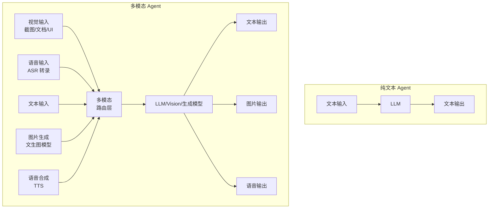

> 造一个好 Agent 系列（十八）——收官篇：Agent 不只处理文本。用户上传一张截图问「这里有什么 bug」，Agent 需要看懂图片。用户说「帮我画一个系统架构图」，Agent 需要生成图片。用户发语音消息，Agent 需要理解并回复语音。从 Vision 模型路由、多模态上下文组装、图像安全审核到语音交互流水线，多模态 Agent 的工程实现。

## 一、多模态为什么重要

纯文本 Agent 的能力边界很明显——用户发一张报错截图，文本 Agent 只能说「请描述错误信息」。多模态 Agent 直接看图说话。

| 模态 | 输入场景 | 输出场景 | 工程挑战 |
|------|---------|---------|---------|
| **视觉** | 截图、文档照片、UI 界面 | 图表分析结果、标注后的图片 | 图片编码成本、分辨率限制 |
| **图像生成** | 文字描述、草图 | 生成的图片 | 生成质量、风格一致性 |
| **语音** | 语音消息、实时对话 | 语音回复、文字转录 | 延迟、ASR/TTS 质量 |
| **视频** | 监控画面、操作录屏 | 关键帧分析、异常检测 | 数据量大、实时性要求高 |



## 二、Vision 模型路由：什么任务用什么模型

不是所有视觉任务都需要最大的 Vision 模型。简单图片描述用小模型，复杂图表分析用大模型。

### 2.1 模型角色路由

```java
/**
 * 模型路由配置：不同任务类型路由到不同能力的模型。
 * Vision 任务根据复杂度路由到不同级别的视觉模型。
 */
@Component
public class ModelRouter {

    private final Map<String, ModelInfo> models = Map.of(
        // 文本任务
        "text-small",  new ModelInfo("qwen3-4b",    0.0001, 200,   Role.TEXT),
        "text-large",  new ModelInfo("qwen3-72b",   0.005,  2000,  Role.TEXT),
        // 视觉任务
        "vision-small", new ModelInfo("qwen-vl-7b",   0.001, 500,   Role.VISION),
        "vision-large", new ModelInfo("qwen-vl-72b",  0.008, 2500,  Role.VISION),
        // 图像生成
        "image-gen",    new ModelInfo("flux-1.1-pro",  0.003, 0,     Role.IMAGE_GEN),
        // 语音
        "asr",          new ModelInfo("whisper-large", 0.0005, 0,    Role.ASR),
        "tts",          new ModelInfo("cosyvoice-2",   0.0005, 0,    Role.TTS)
    );

    public enum Role { TEXT, VISION, IMAGE_GEN, ASR, TTS, EMBEDDING }

    public ModelInfo route(TaskType task, String userId) {
        TenantContext ctx = TenantContext.get();
        return switch (task) {
            case SIMPLE_QA -> models.get("text-small");
            case COMPLEX_ANALYSIS -> models.get("text-large");
            case IMAGE_DESCRIBE -> models.get("vision-small");
            case IMAGE_ANALYSIS -> models.get("vision-large");
            case GENERATE_IMAGE -> models.get("image-gen");
            case SPEECH_TO_TEXT -> models.get("asr");
            case TEXT_TO_SPEECH -> models.get("tts");
        };
    }
}
```

### 2.2 多模态消息格式

```java
/**
 * 多模态消息：支持文本 + 图片 + 音频的混合输入。
 * 图片以 base64 或 URL 形式嵌入，音频以 PCM/WAV 形式嵌入。
 */
public record MultimodalMessage(
    String text,                          // 文本内容
    List<ImageContent> images,            // 图片列表
    List<AudioContent> audios             // 音频列表
) {
    public record ImageContent(
        String url,                       // 图片 URL 或 base64
        String mimeType,                  // image/jpeg, image/png
        String description,               // 可选的图片描述（用于检索）
        long sizeBytes
    ) {}

    public record AudioContent(
        String url,                       // 音频 URL 或 base64
        String format,                    // wav, mp3, pcm
        int sampleRate,
        long durationMs
    ) {}

    /** 转为 Vision 模型可接受的 messages 格式 */
    public List<Map<String, Object>> toVisionMessages() {
        List<Map<String, Object>> content = new ArrayList<>();
        if (text != null && !text.isBlank()) {
            content.add(Map.of("type", "text", "text", text));
        }
        for (ImageContent img : images) {
            content.add(Map.of(
                "type", "image_url",
                "image_url", Map.of("url", img.url())
            ));
        }
        return List.of(Map.of("role", "user", "content", content));
    }
}
```

## 三、图片处理 Pipeline

### 3.1 图片预处理

图片不能直接丢给 Vision 模型——需要压缩、裁剪、格式转换。

```java
/**
 * 图片预处理器：压缩 + 裁剪 + 格式标准化。
 * Vision 模型通常有分辨率上限（如 1024x1024），超限图片需要预处理。
 */
@Component
public class ImagePreprocessor {

    private static final int MAX_DIMENSION = 1024;
    private static final long MAX_FILE_SIZE = 10 * 1024 * 1024;  // 10MB
    private static final String OUTPUT_FORMAT = "jpeg";

    public ProcessedImage preprocess(byte[] imageData) throws IOException {
        // 1. 大小检查
        if (imageData.length > MAX_FILE_SIZE) {
            throw new ImageTooLargeException("图片超过 10MB 限制");
        }

        BufferedImage image = ImageIO.read(new ByteArrayInputStream(imageData));
        if (image == null) throw new InvalidImageException("无法解析图片");

        // 2. 尺寸缩放（保持宽高比）
        image = resizeToFit(image, MAX_DIMENSION);

        // 3. 格式转换 + 压缩
        ByteArrayOutputStream out = new ByteArrayOutputStream();
        ImageWriter writer = ImageIO.getImageWritersByFormatName(OUTPUT_FORMAT).next();
        ImageWriteParam param = writer.getDefaultWriteParam();
        param.setCompressionMode(ImageWriteParam.MODE_EXPLICIT);
        param.setCompressionQuality(0.85f);  // 85% 质量，平衡清晰度和大小

        writer.setOutput(ImageIO.createImageOutputStream(out));
        writer.write(null, new IIOImage(image, null, null), param);
        writer.dispose();

        return new ProcessedImage(out.toByteArray(), image.getWidth(), image.getHeight());
    }

    private BufferedImage resizeToFit(BufferedImage image, int maxDim) {
        int w = image.getWidth(), h = image.getHeight();
        if (w <= maxDim && h <= maxDim) return image;
        double scale = (double) maxDim / Math.max(w, h);
        int newW = (int) (w * scale), newH = (int) (h * scale);
        return resizeImage(image, newW, newH);
    }

    public record ProcessedImage(byte[] data, int width, int height) {}
}
```

### 3.2 图片存储与引用

```java
/**
 * 图片存储服务：上传图片到对象存储，返回引用 ID。
 * Agent 上下文中不存图片二进制——只存引用 ID，按需加载。
 */
@Component
public class ImageStore {

    private final ObjectStorageClient storageClient;
    private final ImagePreprocessor preprocessor;

    /**
     * 上传并预处理图片，返回引用 ID。
     * 引用格式：resourceId，后续通过 /core/api/resources/{resourceId}/detail 访问。
     */
    public String upload(byte[] imageData, String originalName, String userId) throws IOException {
        ProcessedImage processed = preprocessor.preprocess(imageData);
        String resourceId = generateResourceId(userId, originalName);
        String key = "agent/images/" + userId + "/" + resourceId + ".jpg";

        storageClient.upload(key, processed.data(), Map.of(
            "content-type", "image/jpeg",
            "width", String.valueOf(processed.width()),
            "height", String.valueOf(processed.height()),
            "original-name", originalName
        ));

        return resourceId;
    }

    /** 按需加载图片二进制（不提前加载到内存） */
    public byte[] load(String resourceId) {
        String key = resolveKey(resourceId);
        return storageClient.download(key);
    }
}
```

## 四、图像生成与审核

### 4.1 文生图 Pipeline

```java
/**
 * 图像生成服务：文本描述 → 生成图片 → 安全审核 → 返回。
 */
@Component
public class ImageGenerationService {

    private final ImageGenClient genClient;
    private final ContentModerator moderator;

    /**
     * 生成图片的完整流程：
     * 1. 审核输入 prompt（防止生成违规内容）
     * 2. 调用图像生成模型
     * 3. 审核生成结果（防止模型产生违规图片）
     * 4. 返回安全图片
     */
    public Mono<GeneratedImage> generate(String prompt, String userId) {
        // 1. 输入审核
        return moderator.moderateText(prompt)
            .flatMap(verdict -> {
                if (!verdict.allowed()) {
                    return Mono.error(new ContentPolicyViolation(
                        "输入内容违反安全策略: " + verdict.reason()));
                }
                // 2. 生成图片
                return genClient.generate(prompt, userId)
                    // 3. 输出审核
                    .flatMap(img -> moderator.moderateImage(img.data())
                        .map(verdict2 -> {
                            if (!verdict2.allowed()) {
                                throw new ContentPolicyViolation(
                                    "生成内容违反安全策略");
                            }
                            return img;
                        }));
            });
    }
}
```

### 4.2 内容安全审核

```java
/**
 * 内容审核器：对图片和文本进行安全审核。
 * 检测：暴力/色情/政治敏感/个人信息泄露等。
 */
@Component
public class ContentModerator {

    public Mono<ModerationVerdict> moderateText(String text) {
        return Mono.fromCallable(() -> {
            for (Pattern p : SENSITIVE_PATTERNS) {
                if (p.matcher(text).find()) {
                    return new ModerationVerdict(false, "sensitive-text:" + p.pattern());
                }
            }
            return ModerationVerdict.ALLOWED;
        });
    }

    public Mono<ModerationVerdict> moderateImage(byte[] imageData) {
        // 调用图像安全审核 API
        // 或使用本地轻量分类器做初步过滤
        return moderationClient.checkImage(imageData);
    }

    public record ModerationVerdict(boolean allowed, String reason) {
        static final ModerationVerdict ALLOWED = new ModerationVerdict(true, null);
    }
}
```

## 五、语音交互流水线

### 5.1 ASR → LLM → TTS 全链路

```java
/**
 * 语音交互服务：ASR 转录 → LLM 推理 → TTS 合成。
 * 全链路异步，总延迟 = ASR延迟 + LLM延迟 + TTS延迟。
 */
@Component
public class VoiceInteractionService {

    private final AsrClient asrClient;
    private final TtsClient ttsClient;
    private final LlmClient llmClient;

    public Mono<VoiceResponse> processVoice(byte[] audioData, String userId) {
        Instant start = Instant.now();

        return asrClient.transcribe(audioData)            // ASR 转录
            .flatMap(transcript ->
                llmClient.chat(transcript, userId)         // LLM 推理
                    .flatMap(textResponse ->
                        ttsClient.synthesize(textResponse) // TTS 合成
                            .map(audioData ->
                                new VoiceResponse(
                                    textResponse,
                                    audioData,
                                    transcript,
                                    Duration.between(start, Instant.now()).toMillis()
                                )
                            )
                    )
            );
    }

    public record VoiceResponse(
        String text,        // 文字回复
        byte[] audio,       // 语音回复
        String transcription, // ASR 转录文本
        long totalLatencyMs  // 全链路延迟
    ) {}
}
```

### 5.2 流式语音合成

```java
/**
 * 流式 TTS：边生成边播放，降低首包延迟。
 * LLM 输出第一个句子时就开始 TTS 合成，不用等全部生成完。
 */
@Component
public class StreamingTtsService {

    private final TtsClient ttsClient;

    /**
     * 将 LLM 的流式文本输出转为流式音频。
     * 按句子切分（遇到句号/问号/感叹号就合成一段音频）。
     */
    public Flux<byte[]> streamTts(Flux<String> textStream) {
        StringBuilder buffer = new StringBuilder();

        return textStream
            .bufferUntil(chunk -> {
                buffer.append(chunk);
                boolean isSentenceEnd = chunk.matches(".*[。！？.?!]$");
                if (isSentenceEnd) { buffer.setLength(0); }
                return isSentenceEnd;
            })
            .map(chunks -> String.join("", chunks))
            .filter(sentence -> !sentence.isBlank())
            .concatMap(sentence -> ttsClient.synthesizeStream(sentence));
    }
}
```

## 六、多模态上下文组装

多模态 Agent 的上下文不只是文本——还有图片引用、音频转录结果、生成结果的元数据。

### 6.1 多模态上下文组装器

```java
/**
 * 多模态上下文组装器：将文本、图片引用、语音转录、工具结果
 * 统一组装为模型可接受的多模态上下文。
 */
@Component
public class MultimodalContextAssembler {

    private final int maxTokens;

    public String assemble(MultimodalContext context) {
        StringBuilder sb = new StringBuilder();

        // 1. 语音转录文本
        if (context.transcription() != null) {
            sb.append("[语音转录] ").append(context.transcription()).append("\n\n");
        }

        // 2. 图片描述（由 Vision 模型预先生成的图片描述）
        for (ImageDescription desc : context.imageDescriptions()) {
            sb.append("[图片描述] ").append(desc.caption())
              .append(" (来源: ").append(desc.source()).append(")\n");
        }

        // 3. 用户文本
        if (context.userText() != null) {
            sb.append("\n").append(context.userText());
        }

        // 4. 工具结果
        if (context.toolResults() != null) {
            sb.append("\n\n[工具结果]\n").append(context.toolResults());
        }

        // 5. Token 预算截断
        return truncateToBudget(sb.toString(), maxTokens);
    }

    public record MultimodalContext(
        String userText,
        String transcription,
        List<ImageDescription> imageDescriptions,
        String toolResults
    ) {}

    public record ImageDescription(
        String caption,       // 图片描述文本
        String source,        // 图片来源（用户上传/Agent 生成）
        String resourceId     // 图片引用 ID
    ) {}
}
```

## 七、行业实践：多模态 Agent 的设计共识

| 设计点 | 共识做法 | 反面模式 |
|--------|---------|---------|
| 模型路由 | 按任务复杂度选择模型级别 | 所有任务用最大模型 |
| 图片处理 | 预处理压缩 + 按需加载引用 ID | 图片二进制塞进上下文 |
| 图像生成 | 输入审核 + 输出审核双重保险 | 不审核直接生成 |
| 语音交互 | ASR→LLM→TTS 全链路异步 | 同步等待每步完成 |
| 流式输出 | 按句子切分流式 TTS | 全部生成完再合成 |
| 上下文组装 | 图片描述替代图片二进制 | 图片直接塞上下文 |
| 成本控制 | 小 Vision 模型做描述，大模型做分析 | 大 Vision 模型处理一切 |
| 安全审核 | 输入输出双重内容审核 | 不审核 |

## 结语（系列收官）

多模态让 Agent 从「只能读文字」变成「能看、能听、能画」。

> 视觉理解让 Agent 看懂用户的截图和文档，图像生成让 Agent 画出用户描述的内容，语音交互让 Agent 开口说话。多模态不是炫技——它让 Agent 的能力边界和用户的能力边界对齐。

---

## 全系列回顾：造一个好 Agent

十八篇博客，从零到一个完整的 Agent 工程体系：

| # | 主题 | 一句话 |
|---|------|--------|
| 00 | Agent 是什么 | LLM + 工具 + 记忆，ReAct 循环，Harness |
| 01 | 上下文工程 | Token 就是内存，Prompt 就是操作系统 |
| 02 | 工具系统 | 从 Function Calling 到 MCP 的工具操作系统 |
| 03 | 记忆系统 | 三层记忆 + 混合检索 + 信任分 |
| 04 | 规划调度 | 从 ReAct 到 Graph Engineering 的三次跃迁 |
| 05 | 多 Agent 协作 | 四种拓扑 + 通信协议 + 辩论收敛 |
| 06 | 闭环工程 | 感知→规划→行动→记忆→反馈 |
| 07 | 评估调优 | 六维矩阵 + 自动化 Pipeline + A/B 测试 |
| 08 | 安全权限 | Agent 可见性 + 双层 Skill 权限 + 数据权限 |
| 09 | 安全权限（续） | 工具权限矩阵 + 凭证擦除 + 沙箱 + 审计哈希链 |
| 10 | RAG 工程 | 文档入库→分片→向量→混合召回→重排→组装 |
| 11 | 反幻觉 | 架构约束 + 运行时校验 + 忠实度检测 + 审计溯源 |
| 12 | 可观测性 | Observer + OpenTelemetry + Micrometer + Langfuse |
| 13 | SOP 驱动 | Markdown 定义 + 状态机执行 + 审批 + 轮询 |
| 14 | Coding Agent | 代码分片 + Sandbox + Lint-Test-Fix 自愈循环 |
| 15 | 工程化部署 | 会话管理 + 入口守卫 + 多租户 + 灰度 + 优雅停机 |
| 16 | 训练工程 | SFT 轨迹数据 + RL 奖励设计 + PPO 训练 |
| 17 | 人机协作 | 审批流 + 打断接管 + 进度可视化 + 多通道 + 反馈 |
| 18 | 多模态 | Vision 路由 + 图片处理 + 图像生成 + 语音交互 |

从第一篇回答「Agent 是什么」，到第十八篇展示「Agent 能看、能听、能画」——这不仅仅是一系列技术文章，更是一份 Agent 工程的完整蓝图。

> 手写 Agent，不是在写 prompt，是在写一套让语言模型在物理世界里可靠运转的控制系统。这个系统的好坏，决定了一个 Agent 是玩具还是工具。
