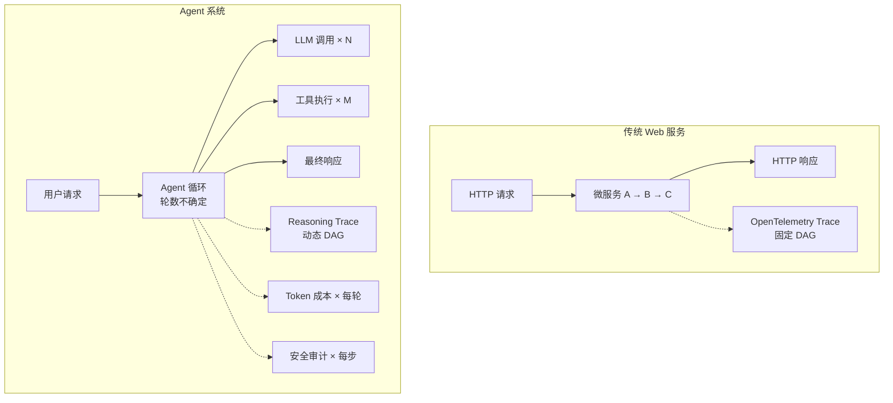
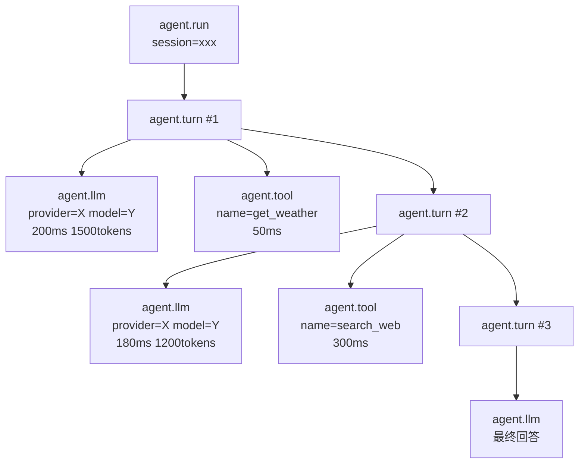
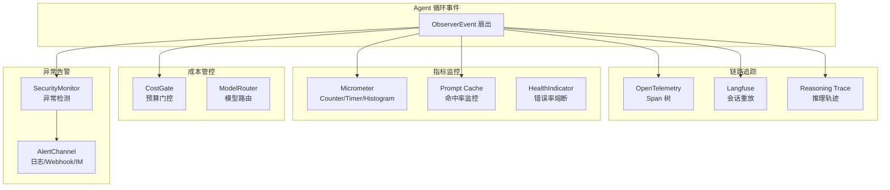

> 造一个好 Agent 系列（十二）：Agent 出了 bug 怎么排查？Token 花在哪了？哪个工具调用最慢？用户说「回答不对」怎么回溯到具体哪一步出了问题？可观测性不是锦上添花——没有它，Agent 就是一个昂贵的黑盒。从 Observer 模式、OpenTelemetry 链路追踪、Micrometer 指标、Langfuse 会话重放、成本管控到异常告警，Agent 可观测性的完整工程体系。

## 一、为什么 Agent 可观测性比传统系统更难

传统 Web 服务的可观测性已经很成熟：一个 HTTP 请求进来，经过几个微服务，日志 + 指标 + 链路追踪三件套搞定。Agent 比这复杂得多：

**Agent 是循环的，不是线性的**。一个 HTTP 请求对应一次函数调用。一个 Agent 请求对应 N 轮 LLM 调用 + M 次工具执行，轮数不确定、步骤不确定、总耗时不确定。

**Agent 的中间状态不可见**。模型每一轮在想什么、为什么选择调用这个工具而不是那个、工具返回了什么、下一步打算做什么——这些信息如果不主动记录，外界完全不知道。

**Agent 的成本是动态的**。一次 Agent 调用可能花 0.01 美元也可能花 1 美元，取决于循环跑了几轮、调了哪些模型。没有成本追踪，财务预算形同虚设。



## 二、Observer 模式：可观测性的接入点

所有可观测性数据的源头，是 Agent 循环中的**事件**。需要一个统一的事件分发机制，把循环中发生的每一件事广播给所有感兴趣的观察者。

### 2.1 Observer SPI

```java
/**
 * Observer SPI：Agent 可观测性的统一事件接口。
 * 具体实现可以是日志、指标、链路追踪、SSE 推送——插拔式接入。
 */
public interface Observer {
    void recordEvent(ObserverEvent event);
    void recordMetric(ObserverMetric metric);
    default void flush() {}
    String name();
}

/**
 * 事件类型：覆盖 Agent 生命周期的所有关键节点。
 */
public sealed interface ObserverEvent {
    record AgentStart(String provider, String model, String sessionId, String turnId) implements ObserverEvent {}
    record AgentEnd(String sessionId, String turnId, long durationNanos, Throwable error) implements ObserverEvent {}
    record LlmCall(String provider, String model, long inputTokens, long outputTokens, long durationNanos, boolean success) implements ObserverEvent {}
    record LlmResponse(String provider, String model, long durationNanos, boolean success, Optional<Long> inputTokens, Optional<Long> outputTokens) implements ObserverEvent {}
    record ToolCallStart(String toolName, Map<String, Object> arguments) implements ObserverEvent {}
    record ToolCallEnd(String toolName, long durationNanos, boolean success, Optional<String> error) implements ObserverEvent {}
    record SopStepStart(String sopName, int stepIndex) implements ObserverEvent {}
    record SopStepEnd(String sopName, int stepIndex, boolean success) implements ObserverEvent {}
}
```

### 2.2 MultiObserver：扇出到多个后端

```java
/**
 * MultiObserver：将一个事件扇出到所有注册的 Observer。
 * 单个 Observer 异常不影响其他 Observer——可观测性不能反过来影响业务。
 */
public final class MultiObserver implements Observer {

    private final CopyOnWriteArrayList<Observer> observers = new CopyOnWriteArrayList<>();

    @Override
    public void recordEvent(ObserverEvent event) {
        for (Observer obs : observers) {
            try {
                obs.recordEvent(event);
            } catch (Exception e) {
                // 日志 Observer 挂了不能影响指标 Observer
                log.warn("Observer {} 记录事件失败: {}", obs.name(), e.getMessage());
            }
        }
    }

    public void register(Observer observer) {
        observers.add(observer);
    }
}
```

**关键设计**：MultiObserver 用 `CopyOnWriteArrayList` 保证线程安全，每个 Observer 的异常被独立捕获——可观测性系统的故障不能反噬业务。

## 三、OpenTelemetry 链路追踪：动态 Span 树

### 3.1 Agent 循环的 Span 结构

Agent 的 Span 树不是固定 DAG——它随循环动态生长：



### 3.2 OTel 集成实现

```java
/**
 * Agent 链路追踪 Observer：将 Agent 事件映射为 OpenTelemetry Span。
 * 每轮循环创建一个子 Span，LLM 调用和工具调用作为孙 Span。
 */
@Component
public class TracingAgentLoopObserver implements AgentLoopObserver {

    private final Tracer tracer;
    private final Map<String, Span> runSpans = new ConcurrentHashMap<>();

    @Override
    public void onRunStart(String sessionId, String agentName) {
        Span span = tracer.spanBuilder("agent.run")
                .setAttribute("session.id", sessionId)
                .setAttribute("agent.name", agentName)
                .startSpan();
        runSpans.put(sessionId, span);
    }

    @Override
    public void onLlmCall(String sessionId, String agentName,
                           long durationNanos, boolean success) {
        Span parent = runSpans.get(sessionId);
        Span span = tracer.spanBuilder("agent.llm")
                .setParent(Context.current().with(parent))
                .setAttribute("duration.nanos", durationNanos)
                .setAttribute("success", success)
                .startSpan();
        span.end();
    }

    @Override
    public void onToolCall(String sessionId, String toolName,
                            long durationNanos, boolean success) {
        Span parent = runSpans.get(sessionId);
        Span span = tracer.spanBuilder("agent.tool")
                .setParent(Context.current().with(parent))
                .setAttribute("tool.name", toolName)
                .setAttribute("duration.nanos", durationNanos)
                .startSpan();
        span.end();
    }

    @Override
    public void onRunEnd(String sessionId, String agentName,
                          int iterations, long durationNanos, Throwable error) {
        Span span = runSpans.remove(sessionId);
        if (span != null) {
            span.setAttribute("iterations", iterations);
            span.setAttribute("duration.nanos", durationNanos);
            if (error != null) span.recordException(error);
            span.end();
        }
    }
}
```

### 3.3 跨服务传播：W3C Trace Context

Agent 调用其他 Agent（A2A）时，trace 需要跨进程传播：

```java
/**
 * Trace 上下文传播：通过 W3C Trace Context 标准协议，
 * 将当前 Span 的 traceparent 注入到 HTTP 头中，实现跨服务链路串联。
 */
@Component
public class TracePropagation {

    public void injectTraceHeaders(Map<String, String> headers) {
        Span span = TraceContextHolder.getCurrentSpan();
        if (span == null || !span.getSpanContext().isValid()) return;
        // 注入 W3C traceparent 头
        W3CTraceContextPropagator.getInstance()
            .inject(Context.current().with(span), headers, Map::put);
    }

    public Span extractTraceHeaders(Map<String, String> headers) {
        Context extracted = W3CTraceContextPropagator.getInstance()
            .extract(Context.root(), headers, Map::get);
        Span span = Span.fromContext(extracted);
        return span.getSpanContext().isValid() ? span : null;
    }
}
```

## 四、Micrometer 指标：Agent 的健康仪表盘

链路追踪告诉你「某次请求慢在哪里」，指标告诉你「整体趋势如何」。

### 4.1 Agent 核心指标

```java
/**
 * Micrometer 指标 Observer：记录 Agent 的核心运行指标。
 * 输出到 Prometheus / Grafana / 任何 Micrometer 支持的后端。
 */
@Component
public class MetricsAgentLoopObserver implements AgentLoopObserver {

    private final MeterRegistry registry;

    // Counter：累计计数
    private final Counter runsTotal;
    private final Counter errorsTotal;
    private final Counter llmCallsTotal;
    private final Counter toolCallsTotal;

    // Timer：耗时分布
    private final Timer runDuration;
    private final Timer llmDuration;

    // DistributionSummary：Token 消耗分布
    private final DistributionSummary inputTokens;
    private final DistributionSummary outputTokens;

    public MetricsAgentLoopObserver(MeterRegistry registry) {
        this.registry = registry;
        this.runsTotal = Counter.builder("agent.runs.total").register(registry);
        this.errorsTotal = Counter.builder("agent.runs.errors").register(registry);
        this.llmCallsTotal = Counter.builder("agent.llm.calls").register(registry);
        this.toolCallsTotal = Counter.builder("agent.tool.calls").register(registry);
        this.runDuration = Timer.builder("agent.run.duration").register(registry);
        this.llmDuration = Timer.builder("agent.llm.duration").register(registry);
        this.inputTokens = DistributionSummary.builder("agent.llm.input_tokens").register(registry);
        this.outputTokens = DistributionSummary.builder("agent.llm.output_tokens").register(registry);
    }

    @Override
    public void onLlmCall(String sessionId, String agentName,
                           long durationNanos, boolean success) {
        llmCallsTotal.increment();
        llmDuration.record(durationNanos, TimeUnit.NANOSECONDS);
        if (!success) errorsTotal.increment();
    }

    @Override
    public void onRunEnd(String sessionId, String agentName,
                          int iterations, long durationNanos, Throwable error) {
        runsTotal.increment();
        runDuration.record(durationNanos, TimeUnit.NANOSECONDS);
        if (error != null) errorsTotal.increment();
    }
}
```

### 4.2 Prompt Cache 监控

```java
/**
 * Prompt Cache 追踪器：监控 KV Cache 命中率的变化趋势。
 * 当缓存命中率骤降时发出 CacheBreak 事件——说明 system prompt 或工具定义被改了。
 */
@Component
public class PromptCacheTracker {

    private static final double STABLE_RATIO = 0.8;  // 命中率低于上次的 80% 视为异常
    private static final long MIN_BREAK_DROP = 1000;  // 最少下降 1000 tokens

    public CacheBreak complete(String sessionId, Usage usage) {
        long cacheRead = usage.cacheReadTokens();
        Long prev = sessionCacheRead.put(sessionId, cacheRead);
        if (prev == null) return null;

        long drop = prev - cacheRead;
        boolean broken = cacheRead < prev * STABLE_RATIO && drop >= MIN_BREAK_DROP;
        return broken ? new CacheBreak(prev, cacheRead, drop) : null;
    }

    public record CacheBreak(long prevRead, long currentRead, long drop) {}
}
```

### 4.3 健康检查：LLM 错误率熔断

```java
/**
 * Agent 健康指示器：当 LLM 5 分钟错误率超过 50% 时，
 * Spring Boot 健康检查标记为 DOWN，触发自动降级或告警。
 */
@Component
public class AgentHealthIndicator implements HealthIndicator {

    private final MetricsSnapshot snapshot;

    @Override
    public Health health() {
        double llmErrorRate = snapshot.llmErrorRate5m();
        Health.Builder builder = Health.up();
        builder.withDetail("llm_error_rate_5m", String.format("%.1f%%", llmErrorRate * 100));

        if (llmErrorRate > 0.5) {
            builder = Health.down()
                .withDetail("reason", "llm_error_rate_exceeds_50%");
        } else if (llmErrorRate > 0.2) {
            builder = Health.outOfService()
                .withDetail("reason", "llm_error_rate_exceeds_20%");
        }
        return builder.build();
    }
}
```

## 五、Langfuse 会话重放：像看录像一样排查问题

链路追踪告诉你「慢在哪里」，Langfuse 告诉你「模型说了什么」。

### 5.1 全生命周期中间件

```java
/**
 * Langfuse 中间件：拦截 Agent 全生命周期事件，
 * 构建 Trace → Generation → Tool Span 的完整会话树，
 * 异步批量上报到 Langfuse。
 */
@Component
public class LangfuseMiddleware implements MiddlewareBase {

    private final LangfuseClient langfuseClient;

    @Override
    public Flux<AgentEvent> onAgent(Agent agent, RuntimeContext ctx,
                                     AgentInput input,
                                     Function<AgentInput, Flux<AgentEvent>> next) {
        // 前置：创建 Trace 和 Generation
        handlePreCall(agent, input.msgs());

        return next.apply(input)
            .doOnNext(event -> {
                // 工具调用：创建 Tool Span
                if (event instanceof AgentResultEvent result) {
                    handlePostCallResult(result);
                }
            })
            .doOnComplete(() -> handlePostCall(agent))
            .doOnError(e -> handleError(agent, e))
            .doOnCancel(() -> handleCancel(agent));
    }
}
```

### 5.2 Token 聚合 + 批量上报

```java
/**
 * Langfuse Trace 上下文：在单次请求生命周期内聚合所有数据。
 */
public class LangfuseTraceContext {

    private final String traceId;
    private int totalInputTokens;
    private int totalOutputTokens;
    private final Map<String, GenerationInfo> generations = new LinkedHashMap<>();
    private final Map<String, ToolSpanInfo> toolSpans = new LinkedHashMap<>();

    public void addInputTokens(int tokens) { this.totalInputTokens += tokens; }
    public void addOutputTokens(int tokens) { this.totalOutputTokens += tokens; }
    public void addGeneration(String id, GenerationInfo info) { generations.put(id, info); }
    public void addToolSpan(String id, ToolSpanInfo info) { toolSpans.put(id, info); }

    public Map<String, Object> usageMetadata() {
        return Map.of(
            "promptTokens", totalInputTokens,
            "completionTokens", totalOutputTokens,
            "totalTokens", totalInputTokens + totalOutputTokens
        );
    }
}

/**
 * Langfuse 客户端：批量上报 + 按大小切分 + 可选字段加密。
 */
@Component
public class LangfuseClient {

    private final int maxBatchBodyBytes = 2_500_000;  // Langfuse API 限制
    private final Function<List<Map<String, Object>>, List<Map<String, Object>>> eventEncryptor;

    public boolean ingest(List<Map<String, Object>> batch) {
        // 可选：对敏感字段加密
        if (eventEncryptor != null) batch = eventEncryptor.apply(batch);

        // 按大小切分（Langfuse 有 body size 限制）
        int estimatedSize = estimateBatchSize(batch);
        if (estimatedSize <= maxBatchBodyBytes) {
            return ingestSingle(batch);
        }
        // 切分为多个子批次
        List<List<Map<String, Object>>> subBatches = splitBySize(batch, maxBatchBodyBytes);
        return subBatches.stream().allMatch(this::ingestSingle);
    }
}
```

### 5.3 钉钉卡片 ID → Langfuse Trace ID 桥接

```java
/**
 * Trace ID 桥接：将钉钉卡片的 outTrackId 映射到 Langfuse Trace UUID。
 * 用户在钉钉里点「不满意」，通过 outTrackId 反查到 Langfuse 里的完整会话，
 * 定位是哪一步出了问题。
 */
@Component
public class LangfuseTraceIdHolder {

    private final ConcurrentMap<String, TraceEntry> byOutTrackId = new ConcurrentHashMap<>();
    private final TraceRegistry registry;

    public String getLangfuseTraceId(String outTrackId) {
        TraceEntry entry = byOutTrackId.get(outTrackId);
        if (entry != null && entry.langfuseTraceId() != null) return entry.langfuseTraceId();
        // 本地缓存未命中 → 查持久化注册表
        return registry != null ? registry.readLangfuseTraceId(outTrackId) : null;
    }
}
```

## 六、推理轨迹重放：看到模型的每一步思考

### 6.1 Reasoning Trace 存储

```java
/**
 * 推理轨迹：记录 Agent 每一轮的思考、行动、观察。
 * 用于事后重放、审计、和模型行为分析。
 */
public class ReasoningTrace {
    private String traceId;
    private String sessionId;
    private List<ReasoningStep> steps = new ArrayList<>();
}

public class ReasoningStep {
    private int step;
    private String thought;          // 模型的推理过程
    private String rawThought;       // 原始推理（含 CoT 标记）
    private String action;           // 采取的行动（工具调用）
    private String observation;      // 观察结果（工具返回）
    private String rationale;        // 行动理由
    private double score;            // 该步的评估分数
}

/**
 * 推理轨迹存储 SPI：内存版用于开发，JDBC 版用于生产。
 */
public interface ReasoningTraceStore {
    Mono<Void> save(ReasoningTrace trace);
    Mono<ReasoningTrace> load(String traceId);
    Mono<List<String>> listBySession(String sessionId);
}

@Component
public class JdbcReasoningTraceStore implements ReasoningTraceStore {

    private final JdbcTemplate jdbc;

    @Override
    public Mono<Void> save(ReasoningTrace trace) {
        String json = objectMapper.writeValueAsString(trace);
        jdbc.update("INSERT INTO eos_agent_reasoning_trace (trace_id, session_id, data) VALUES (?, ?, ?)",
            trace.getTraceId(), trace.getSessionId(), json);
        return Mono.empty();
    }

    @Override
    public Mono<ReasoningTrace> load(String traceId) {
        return Mono.fromCallable(() ->
            jdbc.queryForObject(
                "SELECT data FROM eos_agent_reasoning_trace WHERE trace_id = ?",
                (rs, row) -> objectMapper.readValue(rs.getString("data"), ReasoningTrace.class),
                traceId));
    }
}
```

### 6.2 SSE 实时推送

```java
/**
 * SSE 事件推送 Observer：将 Agent 事件实时推送到前端。
 * 用户在聊天界面看到 Agent 的每一步思考过程。
 */
@Component
public class SseEventObserver implements Observer {

    private final Map<String, SseEmitter> subscribers = new ConcurrentHashMap<>();

    @Override
    public void recordEvent(ObserverEvent event) {
        Map<String, Object> map = new LinkedHashMap<>();
        map.put("type", eventName(event));
        map.put("timestamp", Instant.now().toString());
        map.put("data", event);

        String json = objectMapper.writeValueAsString(map);
        for (SseEmitter sub : subscribers.values()) {
            try { sub.send(json); } catch (IOException e) { subscribers.remove(sub); }
        }
    }
}
```

## 七、成本管控：每一分钱都算清楚

### 7.1 预算门控 + 用量记录

```java
/**
 * 成本管控 SPI：调用前检查预算是否充足，调用后记录实际消耗。
 * 支持租户级隔离和硬上限。
 */
public interface CostGate {
    /** 调用前门控：估算 Token 数和费用，超出预算则拒绝 */
    Mono<Boolean> allowAndRecord(String tenantId, long estTokens, double estCost);

    /** 调用后记录：实际消耗的 Token 和费用 */
    Mono<Void> recordUsage(String tenantId, CostUsage usage);

    /** 单次调用 Token 硬上限（0 = 不限制） */
    default int maxTokensPerCall() { return 0; }
}

public record CostUsage(
    long promptTokens,
    long completionTokens,
    long totalTokens,
    double cost
) {}
```

### 7.2 多模型路由 + 成本优化

```java
/**
 * 模型路由器：根据任务复杂度选择模型，简单任务用小模型省钱。
 * 结合 CostGate 实现成本上限管控。
 */
@Component
public class ModelRouter {

    private final CostGate costGate;
    private final Map<String, ModelInfo> models = Map.of(
        "small",  new ModelInfo("qwen3-4b",  0.0001, 200),
        "medium", new ModelInfo("qwen3-32b", 0.001,  800),
        "large",  new ModelInfo("qwen3-72b", 0.005,  2000)
    );

    public Mono<ModelInfo> route(String task, String tenantId) {
        ModelInfo model = classify(task);
        long estTokens = estimateTokens(task);
        double estCost = model.costPer1k * estTokens / 1000;

        return costGate.allowAndRecord(tenantId, estTokens, estCost)
            .map(allowed -> allowed ? model : fallbackModel(model));
    }

    private ModelInfo fallbackModel(ModelInfo original) {
        // 预算不足 → 降级到更小的模型
        return "large".equals(original.name()) ? models.get("medium") : models.get("small");
    }
}
```

## 八、异常告警：从被动排查到主动发现

### 8.1 告警事件 + 多通道

```java
/**
 * 告警事件：类型化 + 分级。
 */
public class AlertEvent {
    private final String type;       // DENY_BURST / INJECTION_RATE / TOOL_FREQUENCY / TOKEN_OVERBUDGET
    private final String severity;   // INFO / WARN / CRITICAL
    private final String sessionId;
    private final Map<String, Object> details;
}

/**
 * 告警通道 SPI：支持日志、Webhook、内部 IM 等多种通道。
 */
public interface AlertChannel {
    Mono<Void> send(AlertEvent event);
}

@Component
public class LoggingAlertChannel implements AlertChannel {
    @Override
    public Mono<Void> send(AlertEvent event) {
        log.warn("[ALERT] type={} severity={} session={} details={}",
            event.type(), event.severity(), event.sessionId(), event.details());
        return Mono.empty();
    }
}

@Component
public class WebhookAlertChannel implements AlertChannel {
    private final String webhookUrl;

    @Override
    public Mono<Void> send(AlertEvent event) {
        return httpClient.post()
            .uri(webhookUrl)
            .bodyValue(event)
            .retrieve()
            .toBodilessEntity()
            .then();
    }
}
```

### 8.2 异常检测规则

```java
/**
 * 安全监控器：基于审计日志的三类异常检测。
 */
@Component
public class SecurityMonitor {

    /** 拒绝爆发：短时间内大量权限拒绝 → 可能是攻击或配置错误 */
    public Mono<Void> detectDenyBurst(List<AuditLog> recent, String sessionId, int threshold) {
        long denies = recent.stream()
            .filter(l -> sessionId.equals(l.sessionId()) && "DENY".equals(l.result()))
            .count();
        if (denies >= threshold) {
            return alertChannel.send(new AlertEvent("DENY_BURST", "WARN", sessionId,
                Map.of("count", denies, "window", "1m")));
        }
        return Mono.empty();
    }

    /** 注入攻击频率：Prompt Injection 命中率超阈值 */
    public Mono<Void> detectInjectionRate(List<AuditLog> recent, double threshold) {
        long injections = recent.stream()
            .filter(l -> l.denyReason() != null && l.denyReason().startsWith("prompt-injection"))
            .count();
        double rate = (double) injections / recent.size();
        if (rate >= threshold) {
            return alertChannel.send(new AlertEvent("INJECTION_RATE", "CRITICAL", "",
                Map.of("rate", String.format("%.1f%%", rate * 100))));
        }
        return Mono.empty();
    }

    /** 工具调用频率异常：单一工具被过度调用 → 可能是死循环 */
    public Mono<Void> detectToolFrequency(List<AuditLog> recent, String toolName, int threshold) {
        long count = recent.stream()
            .filter(l -> toolName.equals(l.toolName()))
            .count();
        if (count >= threshold) {
            return alertChannel.send(new AlertEvent("TOOL_FREQUENCY", "WARN", "",
                Map.of("tool", toolName, "count", count)));
        }
        return Mono.empty();
    }
}
```

## 九、可观测性全景

把所有组件拼在一起：



## 十、行业实践：可观测性的设计共识

| 维度 | 共识做法 | 反面模式 |
|------|---------|---------|
| 事件分发 | Observer SPI + MultiObserver 扇出 | 硬编码在每个环节 |
| 链路追踪 | OpenTelemetry Span 树 + W3C 传播 | 只记日志不建 Span |
| 会话重放 | Langfuse Trace → Generation → Tool Span | 无法回溯模型说了什么 |
| 指标体系 | Counter + Timer + DistributionSummary | 只看总量不看分布 |
| 推理轨迹 | ReasoningTrace 持久化 + SSE 实时推送 | 看不到模型思考过程 |
| 成本管控 | CostGate 预算门控 + 模型路由降级 | 不限制 Token 消耗 |
| 异常告警 | 规则检测 + 多通道分级告警 | 出事了才去查日志 |
| 健康检查 | LLM 错误率 → HealthIndicator 自动降级 | 服务挂了才知道 |

## 结语

可观测性决定了 Agent 能不能在生产环境里活下来。

> 没有可观测性的 Agent 是一个黑盒——它能跑，但你不知道它为什么跑、跑了多久、花了多少钱、哪里出了问题。Observer 模式是接入点，OpenTelemetry 是骨架，Micrometer 是仪表盘，Langfuse 是录像机，CostGate 是账本，SecurityMonitor 是哨兵。六件套齐了，Agent 才从「能用」变成「能管」。

---

> **🔁 闭环视角**
>
> 本篇覆盖 Agent 闭环的**全链路可观测**——它不是一个独立阶段，而是横切在每一个阶段之上的基础设施。感知阶段需要输入审计，规划阶段需要推理轨迹，行动阶段需要工具 Span，记忆阶段需要 Token 计量，反馈阶段需要异常告警。可观测性不是闭环的某个环节，是闭环每一环的眼睛。
