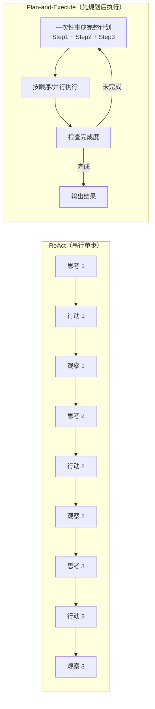
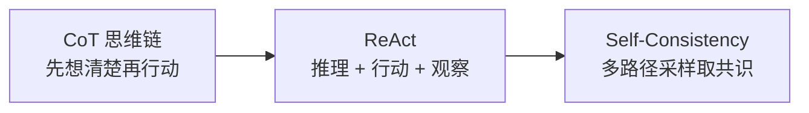

> 规划与调度：ReAct 是 Agent 的「婴儿步」。生产级 Agent 需要任务分解、条件规划、动态重规划。从 Loop Engineering 到 Graph Engineering，规划能力的三次跃迁。

## 一、ReAct 的天花板

前两篇已经用 ReAct 循环跑通了 Agent：思考 → 行动 → 观察 → 再思考 → 再行动。这个循环简洁、通用、几乎不需要额外工程。但它有三个致命短板：

**Token 浪费**。每一轮推理，模型都要重新「想」下一步。对于一个有 10 步的任务，模型要推理 10 次。如果一开始就能生成一个完整计划，只需要一次推理就能确定所有步骤。

**错误累积**。ReAct 是「走一步看一步」。如果第 3 步走错了方向，后面 7 步全在错误的路径上。没有全局视角，就没有纠错能力。

**并行度为零**。ReAct 天然串行——每一步依赖上一步的观察结果。但很多任务里，多个子任务是独立的，可以并行执行。



这三个短板在短任务里不明显——查天气、算汇率，3-5 步就完事。但当任务复杂度上升（「帮我做一个竞品分析报告」），ReAct 的效率断崖式下降。

## 二、Plan-and-Execute：先看地图再出发

Plan-and-Execute（简称 PnE）的核心思路很直接：**先让模型生成完整计划，再按计划执行，执行完检查是否完成，未完成就重新规划**。

```java
import java.util.*;
import java.util.function.BiFunction;
import java.util.function.Function;

// --- 步骤状态枚举 ---
enum StepStatus { PENDING, RUNNING, COMPLETED, FAILED, SKIPPED }

// --- 计划中的单个步骤（不可变 record） ---
record PlanStep(
    int id,
    String description,
    String toolName,                    // 工具名称，可为 null
    Map<String, Object> toolArguments,  // 工具参数
    StepStatus status,
    String result,
    String error,
    List<Integer> dependsOn             // 依赖的前置步骤 ID
) {
    // 便捷构造器：大多数场景只需 id + description
    PlanStep(int id, String description) {
        this(id, description, null, Map.of(), StepStatus.PENDING, null, null, List.of());
    }
    PlanStep(int id, String description, List<Integer> dependsOn) {
        this(id, description, null, Map.of(), StepStatus.PENDING, null, null, dependsOn);
    }
    PlanStep(int id, String description, String toolName, Map<String, Object> toolArguments) {
        this(id, description, toolName, toolArguments, StepStatus.PENDING, null, null, List.of());
    }

    // 状态变更返回新实例（record 不可变）
    PlanStep withStatus(StepStatus s) {
        return new PlanStep(id, description, toolName, toolArguments, s, result, error, dependsOn);
    }
    PlanStep withResult(String r) {
        return new PlanStep(id, description, toolName, toolArguments, StepStatus.COMPLETED, r, error, dependsOn);
    }
    PlanStep withError(String e) {
        return new PlanStep(id, description, toolName, toolArguments, StepStatus.FAILED, result, e, dependsOn);
    }
}

// --- 完整计划 ---
class Plan {
    private final String goal;
    private final List<PlanStep> steps;
    private String status; // draft / executing / completed / replanning

    Plan(String goal, List<PlanStep> steps) {
        this.goal = goal;
        this.steps = new ArrayList<>(steps);
        this.status = "draft";
    }

    /** 获取下一个可执行的步骤（依赖已全部完成） */
    Optional<PlanStep> nextPending() {
        var completedIds = steps.stream()
            .filter(s -> s.status() == StepStatus.COMPLETED)
            .map(PlanStep::id)
            .collect(java.util.stream.Collectors.toSet());
        return steps.stream()
            .filter(s -> s.status() == StepStatus.PENDING)
            .filter(s -> completedIds.containsAll(s.dependsOn()))
            .findFirst();
    }

    boolean isComplete() {
        return steps.stream().allMatch(s -> s.status() == StepStatus.COMPLETED);
    }

    double completionRatio() {
        if (steps.isEmpty()) return 0.0;
        long completed = steps.stream().filter(s -> s.status() == StepStatus.COMPLETED).count();
        return (double) completed / steps.size();
    }

    // getters
    String goal() { return goal; }
    List<PlanStep> steps() { return steps; }
    String status() { return status; }
    void setStatus(String s) { this.status = s; }

    /** 替换某个步骤（按 id 定位） */
    void replaceStep(PlanStep updated) {
        for (int i = 0; i < steps.size(); i++) {
            if (steps.get(i).id() == updated.id()) { steps.set(i, updated); return; }
        }
    }
}

// --- Plan-and-Execute Agent ---
class PlanAndExecuteAgent {
    /**
     * 生成计划 → 逐步执行 → 检查完成度 → 必要时重规划。
     *测、可修订的。
     */
    private final BiFunction<String, String, Plan> plannerFn;   // (goal, context) → Plan
    private final Function<PlanStep, String> executorFn;          // step → result
    private final int maxReplanRounds;

    PlanAndExecuteAgent(BiFunction<String, String, Plan> plannerFn,
                        Function<PlanStep, String> executorFn,
                        int maxReplanRounds) {
        this.plannerFn = plannerFn;
        this.executorFn = executorFn;
        this.maxReplanRounds = maxReplanRounds;
    }

    Map<String, Object> run(String goal) { return run(goal, ""); }

    Map<String, Object> run(String goal, String context) {
        var executionLog = new ArrayList<String>();

        for (int round = 1; round <= maxReplanRounds; round++) {
            // 1. 生成/重新生成计划
            Plan plan = plannerFn.apply(goal, context);
            plan.setStatus("executing");
            executionLog.add("--- 第 %d 轮规划 ---".formatted(round));
            executionLog.add("目标: %s".formatted(goal));
            executionLog.add("计划: %d 步".formatted(plan.steps().size()));

            // 2. 按依赖顺序执行
            int maxSteps = plan.steps().size() * 2; // 防止死循环
            for (int i = 0; i < maxSteps; i++) {
                var stepOpt = plan.nextPending();
                if (stepOpt.isEmpty()) break;

                PlanStep step = stepOpt.get();
                try {
                    String result = executorFn.apply(step);
                    plan.replaceStep(step.withResult(result));
                    context += "\n[步骤 %d 完成] %s: %s".formatted(step.id(), step.description(), result);
                    executionLog.add("  ✓ 步骤 %d: %s".formatted(step.id(),
                        step.description().substring(0, Math.min(40, step.description().length()))));
                } catch (Exception e) {
                    plan.replaceStep(step.withError(e.getMessage()));
                    executionLog.add("  ✗ 步骤 %d: %s - %s".formatted(step.id(),
                        step.description().substring(0, Math.min(40, step.description().length())), e.getMessage()));
                }
            }

            // 3. 检查完成度
            if (plan.isComplete()) {
                plan.setStatus("completed");
                executionLog.add("\n✅ 计划完成！完成率: %.0f%%".formatted(plan.completionRatio() * 100));
                return Map.of("goal", goal, "plan", plan, "completed", true,
                    "execution_log", String.join("\n", executionLog));
            } else {
                executionLog.add("⚠ 完成率: %.0f%%，进入重规划".formatted(plan.completionRatio() * 100));
                plan.setStatus("replanning");
            }
        }
        return Map.of("goal", goal, "completed", false, "execution_log", String.join("\n", executionLog));
    }
}

// --- 模拟使用 ---
// 规划器：根据目标生成步骤（真实场景由 LLM 完成）
BiFunction<String, String, Plan> mockPlanner = (goal, ctx) -> {
    if (goal.contains("竞品分析")) {
        return new Plan(goal, List.of(
            new PlanStep(1, "搜索竞品 A 的产品信息", "search_web", Map.of("query", "竞品 A")),
            new PlanStep(2, "搜索竞品 B 的产品信息", "search_web", Map.of("query", "竞品 B")),
            new PlanStep(3, "对比功能和价格", List.of(1, 2)),
            new PlanStep(4, "生成分析报告", List.of(3))
        ));
    }
    return new Plan(goal, List.of(new PlanStep(1, "执行任务")));
};

Function<PlanStep, String> mockExecutor = step -> "步骤 %d 的执行结果".formatted(step.id());

var agent = new PlanAndExecuteAgent(mockPlanner, mockExecutor, 3);
var result = agent.run("帮我做一个竞品分析报告");
System.out.println(result.get("execution_log"));
```

PnE 比 ReAct 强在哪里？

- **全局视野**：一次规划看到所有步骤，不会在局部最优里打转
- **依赖管理**：步骤之间有 `depends_on`，独立的步骤可以并行
- **重规划能力**：执行到一半发现计划不对，可以重新规划剩余部分
- **可观测性**：计划本身就是文档——每一步是什么、状态如何、完成度多少，一目了然

## 三、任务分解：把大问题拆成小问题

PnE 的核心是「规划」，规划的核心是「分解」。一个大目标怎么拆成可执行的子步骤？三种策略：

### 3.1 递归分解

把大任务递归拆成子任务，直到子任务足够简单、一个工具调用就能搞定。

```java
// --- 递归任务分解树（不可变 record） ---
record DecomposeNode(String task, List<DecomposeNode> subtasks, int depth) {
    /** 叶子节点：无子任务 */
    static DecomposeNode leaf(String task, int depth) {
        return new DecomposeNode(task, null, depth);
    }
}

/**
 * 递归任务分解。
 * 真实场景由 LLM 判断是否需要继续分解。
 * 这里用规则模拟：长度超过 20 且未达最大深度则继续分解。
 */
static DecomposeNode recursiveDecompose(String task, int depth, int maxDepth) {
    // 模拟 LLM 判断：是否需要分解
    boolean needsDecomposition = task.length() > 20 && depth < maxDepth;
    if (!needsDecomposition) {
        return DecomposeNode.leaf(task, depth);
    }

    // 模拟 LLM 分解（真实场景调用模型）
    Map<String, List<String>> subtasksMap = Map.of(
        "竞品分析报告", List.of(
            "搜索主要竞品的产品信息和定价",
            "分析竞品的核心功能差异",
            "评估竞品的市场定位和优劣势",
            "汇总并生成对比分析报告"
        ),
        "搜索结果太笼统", List.of(
            "缩小搜索范围，添加时间限定",
            "换用更具体的关键词",
            "交叉验证多个来源"
        )
    );

    for (var entry : subtasksMap.entrySet()) {
        if (task.contains(entry.getKey())) {
            List<DecomposeNode> children = entry.getValue().stream()
                .map(st -> recursiveDecompose(st, depth + 1, maxDepth))
                .toList();
            return new DecomposeNode(task, children, depth);
        }
    }
    return DecomposeNode.leaf(task, depth);
}

// --- 使用 ---
var tree = recursiveDecompose("帮我做一个竞品分析报告，包括功能对比、价格对比和市场定位分析", 0, 3);
// 可序列化为 JSON 输出（此处省略 Jackson 序列化代码）
```

### 3.2 依赖分析 + 并行度计算

分解完之后，分析子任务之间的依赖关系，找出可以并行的批次。

```java
/**
 * 计算并行批次：无依赖的步骤放在同一批。
 * 返回第0批、第1批... 每批内的步骤可并行执行。
 * 本质是 Kahn 算法的拓扑排序分层版——框架 B 的 DAG 编排也用的同一个思路。
 */
static List<List<PlanStep>> computeParallelBatches(List<PlanStep> steps) {
    var remaining = new LinkedHashMap<Integer, PlanStep>();
    for (var s : steps) remaining.put(s.id(), s);
    var completed = new HashSet<Integer>();
    var batches = new ArrayList<List<PlanStep>>();

    while (!remaining.isEmpty()) {
        // 找出所有依赖已完成的步骤
        List<PlanStep> ready = remaining.values().stream()
            .filter(s -> completed.containsAll(s.dependsOn()))
            .toList();
        if (ready.isEmpty()) {
            throw new IllegalStateException("检测到循环依赖: " + remaining.keySet());
        }
        batches.add(ready);
        for (var s : ready) {
            completed.add(s.id());
            remaining.remove(s.id());
        }
    }
    return batches;
}

// --- 使用：4 步竞品分析 ---
var steps = List.of(
    new PlanStep(1, "搜索竞品 A"),
    new PlanStep(2, "搜索竞品 B"),
    new PlanStep(3, "功能对比", List.of(1, 2)),
    new PlanStep(4, "生成报告", List.of(3))
);

var batches = computeParallelBatches(steps);
for (int i = 0; i < batches.size(); i++) {
    var names = batches.get(i).stream().map(PlanStep::description).toList();
    System.out.printf("批次 %d: %s (%d 个并行)%n", i, names, batches.get(i).size());
}

// 输出:
// 批次 0: [搜索竞品 A, 搜索竞品 B] (2 个并行)
// 批次 1: [功能对比] (1 个)
// 批次 2: [生成报告] (1 个)
```

依赖分析的价值在于**加速**。上面的 4 步任务，纯串行要 4 个时间单位，并行后只需 3 个——步骤 1 和 2 同时跑。任务越大，并行收益越高。

## 四、条件规划：if/else 和循环

真实任务不是线性的。搜索结果满意就继续，不满意就换关键词。数据量小就一次处理，数据量大就分页。这些都需要**条件分支**。

```java
import java.util.function.BiPredicate;

// --- 条件边：目标节点 + 条件谓词 ---
record ConditionalEdge(String target, BiPredicate<Map<String, Object>, Object> condition) {
    /** 无条件转移 */
    static ConditionalEdge of(String target) {
        return new ConditionalEdge(target, null);
    }
    static ConditionalEdge of(String target, BiPredicate<Map<String, Object>, Object> cond) {
        return new ConditionalEdge(target, cond);
    }
}

// --- 图中的执行节点 ---
record PlanNode(
    String name,
    Function<Map<String, Object>, Object> action,
    String description,
    List<ConditionalEdge> edges
) {
    PlanNode(String name, Function<Map<String, Object>, Object> action, String description) {
        this(name, action, description, new ArrayList<>());
    }
}

// --- 条件规划：支持 if/else 分支和循环 ---
class ConditionalPlan {
    private final Map<String, PlanNode> nodes = new LinkedHashMap<>();
    private final String startNode;

    ConditionalPlan(String startNode) { this.startNode = startNode; }

    ConditionalPlan addNode(String name, Function<Map<String, Object>, Object> action, String desc) {
        nodes.put(name, new PlanNode(name, action, desc));
        return this;
    }

    ConditionalPlan addEdge(String from, String to) {
        return addEdge(from, to, null);
    }

    ConditionalPlan addEdge(String from, String to, BiPredicate<Map<String, Object>, Object> condition) {
        if (!nodes.containsKey(from)) throw new IllegalArgumentException("节点不存在: " + from);
        nodes.get(from).edges().add(new ConditionalEdge(to, condition));
        return this;
    }

    PlanNode getStartNode() { return nodes.get(startNode); }
    Map<String, PlanNode> nodes() { return nodes; }
}

// --- 条件规划执行器 ---
class ConditionalExecutor {
    private final ConditionalPlan plan;
    private final int maxIterations;
    private final List<String> trace = new ArrayList<>();

    ConditionalExecutor(ConditionalPlan plan, int maxIterations) {
        this.plan = plan;
        this.maxIterations = maxIterations;
    }

    Map<String, Object> execute(Map<String, Object> context) {
        String current = plan.getStartNode().name();
        int iteration = 0;

        while (current != null && iteration < maxIterations) {
            PlanNode node = plan.nodes().get(current);
            if (node == null) break;

            trace.add("→ %s: %s".formatted(node.name(), node.description()));

            // 执行节点动作
            Object result = node.action().apply(context);
            context.put(node.name() + "_result", result);

            // 评估条件边，决定下一步
            String nextNode = null;
            for (var edge : node.edges()) {
                if (edge.condition() == null || edge.condition().test(context, result)) {
                    nextNode = edge.target();
                    break;
                }
            }
            current = nextNode;
            iteration++;
        }
        return Map.of("context", context, "trace", trace, "completed", current == null);
    }
}

// --- 使用：一个带条件分支的「搜索 → 评估 → 决策」流程 ---
var plan = new ConditionalPlan("search");

plan.addNode("search",         ctx -> "搜索 '%s' 的结果".formatted(ctx.get("query")), "执行搜索");
plan.addNode("evaluate",       ctx -> ((String) ctx.getOrDefault("search_result", "")).length() > 50, "评估结果质量");
plan.addNode("refine_search",  ctx -> "用更具体的关键词重新搜索", "优化搜索关键词");
plan.addNode("analyze",        ctx -> "分析搜索结果", "分析结果");
plan.addNode("report",         ctx -> "生成最终报告", "输出报告");

// 条件边
plan.addEdge("search", "evaluate");
plan.addEdge("evaluate", "refine_search", (ctx, r) -> !(Boolean) r);  // 结果不好 → 重新搜索
plan.addEdge("evaluate", "analyze",     (ctx, r) -> (Boolean) r);    // 结果好 → 分析
plan.addEdge("refine_search", "search");  // 循环回去
plan.addEdge("analyze", "report");

var executor = new ConditionalExecutor(plan, 20);
var result = executor.execute(new HashMap<>(Map.of("query", "AI Agent 架构")));
for (String step : (List<String>) result.get("trace")) {
    System.out.println(step);
}
```

条件规划让 Agent 从「盲目执行」变成「有判断地执行」。搜索结果不好就换关键词，数据量太大就分页处理——这些在 ReAct 里靠模型「自由发挥」，在条件规划里是**显式编排**。

## 五、Graph Engineering：从 Loop 到 Graph

把前面的 PnE、条件规划、依赖分析合在一起，就得到 **Graph Engineering**——用有向图描述 Agent 的完整执行流程。

ReAct 是 Loop（一个 while 循环），Graph Engineering 是 DAG（有向无环图）或状态机。区别在于：

| 维度 | Loop (ReAct) | Graph Engineering |
|------|-------------|-------------------|
| 控制流 | 隐式（模型决定下一步） | 显式（图结构定义） |
| 可观测性 | 弱（只能看日志） | 强（图就是文档） |
| 可调试性 | 差（错在哪一步？） | 好（节点级 trace） |
| 可组合性 | 低（硬编码循环） | 高（子图嵌套） |
| 并行度 | 无 | 拓扑分层并行 |

```java
import java.util.concurrent.CompletableFuture;
import java.util.function.BiPredicate;

/**
 * 状态机驱动的 Agent 执行引擎。
 * 节点 = 原子动作，边 = 状态转移条件。
 * 支持：顺序、并行、条件分支、循环。
 *
 * 映射到框架 B 的 Plan DAG：Plan 被持久化为有向图，
 * Agent 进程重启后从断点恢复执行。
 */
class AgentGraph {
    private final Map<String, Map.Entry<Function<Map<String, Object>, Object>, String>> nodes = new LinkedHashMap<>();
    private final Map<String, List<ConditionalEdge>> edges = new HashMap<>();

    AgentGraph addNode(String name, Function<Map<String, Object>, Object> action, String description) {
        nodes.put(name, Map.entry(action, description));
        return this;
    }

    AgentGraph addEdge(String from, String to) {
        return addEdge(from, to, null);
    }

    AgentGraph addEdge(String from, String to, BiPredicate<Map<String, Object>, Object> condition) {
        edges.computeIfAbsent(from, k -> new ArrayList<>()).add(new ConditionalEdge(to, condition));
        return this;
    }

    /**
     * 执行图：从入口节点开始，沿条件边推进。
     * 返回完整 trace 和最终上下文。
     * 真实场景可用 CompletableFuture 包装为异步，这里用同步简化展示。
     */
    CompletableFuture<Map<String, Object>> execute(Map<String, Object> initialContext, int maxIterations) {
        return CompletableFuture.supplyAsync(() -> {
            // 找入口节点（没有其他节点指向它的）
            Set<String> allTargets = new HashSet<>();
            edges.values().forEach(list -> list.forEach(e -> allTargets.add(e.target())));
            String entry = nodes.keySet().stream()
                .filter(n -> !allTargets.contains(n))
                .findFirst()
                .orElse(nodes.keySet().iterator().next());

            var context = new HashMap<>(initialContext);
            var trace = new ArrayList<String>();
            String current = entry;
            int iteration = 0;

            while (current != null && iteration < maxIterations) {
                var node = nodes.get(current);
                if (node == null) {
                    trace.add("[END] 未找到节点: " + current);
                    break;
                }
                trace.add("[%d] %s: %s".formatted(iteration, current, node.getValue()));

                // 执行节点
                Object result = node.getKey().apply(context);
                context.put(current + "_output", result);

                // 条件路由
                String nextNode = null;
                for (var edge : edges.getOrDefault(current, List.of())) {
                    if (edge.condition() == null || edge.condition().test(context, result)) {
                        nextNode = edge.target();
                        break;
                    }
                }
                current = nextNode;
                iteration++;
            }
            return Map.<String, Object>of("context", context, "trace", trace, "iterations", iteration);
        });
    }
}

// --- 使用：一个研究 Agent 的完整 Graph ---
var graph = new AgentGraph();

graph.addNode("search",        ctx -> "搜索: " + ctx.getOrDefault("topic", ""),         "搜索信息");
graph.addNode("analyze",       ctx -> "分析搜索结果的相关性和质量",                      "分析结果");
graph.addNode("deep_search",   ctx -> "深入搜索特定方面",                               "深度搜索");
graph.addNode("cross_verify",  ctx -> "交叉验证多个来源",                               "交叉验证");
graph.addNode("synthesize",    ctx -> "综合所有信息生成结论",                            "综合结论");
graph.addNode("output",        ctx -> "输出最终报告",                                   "输出报告");

// 流程编排
graph.addEdge("search", "analyze");
graph.addEdge("analyze", "deep_search",  (ctx, r) -> r.toString().contains("不充分"));
graph.addEdge("analyze", "cross_verify", (ctx, r) -> !r.toString().contains("不充分"));
graph.addEdge("deep_search", "analyze");   // 循环：深度搜索后重新分析
graph.addEdge("cross_verify", "synthesize");
graph.addEdge("synthesize", "output");

// 执行（CompletableFuture 异步）
var result = graph.execute(new HashMap<>(Map.of("topic", "AI Agent 的工程实现")), 50).join();
@SuppressWarnings("unchecked")
var traceList = (List<String>) result.get("trace");
traceList.forEach(System.out::println);
System.out.printf("%n总迭代: %d%n", result.get("iterations"));
```

Graph Engineering 的核心价值：**Agent 的执行流程变成了可观测、可调试、可组合的代码**。图结构本身就是文档——看一遍图就知道这个 Agent 怎么工作的。改流程不用改模型，改图就行。

## 六、动态重规划：计划赶不上变化

计划再好，执行中也可能出意外：工具挂了、结果不符合预期、用户中途改了需求。这时候需要**动态重规划**——不是推倒重来，而是在现有进度上调整剩余步骤。

```java
import java.util.function.Function;

/**
 * 动态重规划器：基于已有执行进度，调整剩余计划。
 * 核心思路：保留已完成的步骤，只重新规划未完成的部分。
 *
 *revisePlan()：
 * 已完成（DONE）的子任务保留，只替换未完成的子任务。
 */
class Replanner {
    /** replan(goal, completedContext, failedStep) → 新计划 */
    private final Function<String[], Plan> replanFn;

    Replanner(Function<String[], Plan> replanFn) {
        this.replanFn = replanFn;
    }

    /** 判断是否需要重规划：失败步骤有下游依赖 → 必须重规划 */
    boolean shouldReplan(Plan plan, PlanStep failedStep) {
        boolean hasDownstream = plan.steps().stream()
            .anyMatch(s -> s.dependsOn().contains(failedStep.id()));
        return hasDownstream;
    }

    /** 生成新计划，步骤 ID 从已有最大值之后开始，避免冲突 */
    Plan replan(String goal, Plan plan, PlanStep failedStep) {
        String completedContext = plan.steps().stream()
            .filter(s -> s.status() == StepStatus.COMPLETED)
            .map(s -> "步骤 %d (%s): %s".formatted(s.id(), s.description(), s.result()))
            .collect(java.util.stream.Collectors.joining("\n"));

        Plan newPlan = replanFn.apply(new String[]{goal, completedContext, failedStep.description()});

        // 保留已完成步骤的 ID 空间，避免冲突
        int maxExistingId = plan.steps().stream().mapToInt(PlanStep::id).max().orElse(0);
        List<PlanStep> shifted = newPlan.steps().stream()
            .map(s -> new PlanStep(s.id() + maxExistingId, s.description(), s.toolName(),
                s.toolArguments(), s.status(), s.result(), s.error(), s.dependsOn()))
            .toList();
        return new Plan(goal, shifted);
    }
}

// --- 集成到 PnE Agent：带动态重规划 ---
class ResilientAgent extends PlanAndExecuteAgent {
    private final Replanner replanner;

    ResilientAgent(BiFunction<String, String, Plan> plannerFn,
                   Function<PlanStep, String> executorFn,
                   Replanner replanner,
                   int maxReplanRounds) {
        super(plannerFn, executorFn, maxReplanRounds);
        this.replanner = replanner;
    }

    @Override
    Map<String, Object> run(String goal, String context) {
        Plan plan = plannerFn.apply(goal, context);

        for (int round = 1; round <= maxReplanRounds; round++) {
            for (int i = 0; i < plan.steps().size() * 2; i++) {
                var stepOpt = plan.nextPending();
                if (stepOpt.isEmpty()) break;
                PlanStep step = stepOpt.get();

                try {
                    String result = executorFn.apply(step);
                    plan.replaceStep(step.withResult(result));
                } catch (Exception e) {
                    // 动态重规划决策
                    if (replanner.shouldReplan(plan, step)) {
                        plan = replanner.replan(goal, plan, step);
                        System.out.printf("⚡ 步骤 %d 失败，触发重规划%n", step.id());
                        break; // 跳出内层循环，用新计划继续
                    } else {
                        plan.replaceStep(step.withError(e.getMessage()));
                        System.out.printf("⚠ 步骤 %d 失败，跳过继续%n", step.id());
                    }
                }
            }
            if (plan.isComplete()) break;
        }
        return Map.of("goal", goal, "plan", plan, "completed", plan.isComplete());
    }
}
```

动态重规划的精髓在于**最小化浪费**。不是失败了就从头再来——已完成的步骤保留，只重新规划受影响的下游部分。这和生产环境的发布回滚是一个道理：回滚受影响的模块，不是回滚整个系统。

## 七、行业实践：来自生产级框架的规划与调度

### 7.1 Plan 作为一等公民：框架 B 的 PlanStore

在 框架 B 里，Plan 不是一个临时的 Python 对象——它是**可持久化、可回放的一等公民**：

```java

class PlanStore {
    /**
     * 计划持久化存储。
     * 设计目标：中断恢复、事后审计、计划回放。
     *�— Plan 随 session 持久化。
     */
    private final SessionAttributeStore db; // 概念映射：可以是 MongoDB、Redis 等

    PlanStore(SessionAttributeStore db) { this.db = db; }

    /** 保存计划快照（每完成一步自动保存） */
    void save(Plan plan, String sessionId) {
        db.setAttribute(sessionId, "plan:" + plan.goal(), Map.of(
            "goal", plan.goal(),
            "steps", plan.steps(),
            "status", plan.status(),
            "updatedAt", Instant.now()
        ));
    }

    /** 从断点恢复计划 */
    Plan replay(String sessionId, String goal) {
        @SuppressWarnings("unchecked")
        var record = (Map<String, Object>) db.getAttribute(sessionId, "plan:" + goal);
        if (record == null) return null;
        // 反序列化 steps 并重建 Plan...
        return new Plan(goal, reconstructSteps(record));
    }

    private List<PlanStep> reconstructSteps(Map<String, Object> record) {
        // 从持久化数据反序列化步骤列表（省略具体实现）
        return List.of();
    }
}

// 接口约定：会话级属性存储
interface SessionAttributeStore {
    void setAttribute(String sessionId, String key, Object value);
    Object getAttribute(String sessionId, String key);
}
```

对比 某主流框架 把计划藏在 metadata 里的做法，框架 B 把 Plan 显式建模为 DAG + 持久化存储。好处：**Agent 进程挂了，计划不丢——重启后从断点继续**。这对生产环境是刚需。

### 7.2 显式任务状态追踪：框架 A 的 PlanNotebook + TodoListTool

框架 A 给 Agent 配备了两个专门的计划管理工具：

- **PlanNotebook**：长期计划本，Agent 可以在里面记录多步任务的进度
- **TodoListTool**：运行时待办清单，每完成一步自动勾选

这不是让模型「自由发挥」地管理进度——而是把任务状态**显式化**。Agent 每走一步，TodoList 就更新一次，PlanNotebook 记录全局进展。上下文窗口不需要靠「回忆历史消息」来推断进度——进度就写在 TodoList 里。

### 7.3 混合推理链：框架 B 的 CoT → ReAct → Self-Consistency

框架 B 的推理不是单一的 ReAct——是三种推理模式的混合链：



- **CoT**：复杂任务先让模型「想清楚」，生成思维链
- **ReAct**：按思维链逐步执行，每步观察结果
- **Self-Consistency**：对关键决策采样多条路径，取一致性最高的结果

三种模式不是互斥——是**按任务复杂度自动选择**。简单任务直接 ReAct，复杂任务先 CoT 再 ReAct，关键决策加 Self-Consistency 兜底。

### 7.4 设计共识

| 范式 | 适用场景 | 代表实践 | 关键设计 |
|------|---------|---------|---------|
| **ReAct** | 短任务、探索性 | 四个框架的默认循环 | 简洁但 Token 浪费 |
| **Plan-and-Execute** | 中等复杂度 | 框架 A PlanNotebook | 全局视野 + 显式状态 |
| **Graph Engineering** | 复杂流程 | 框架 B Plan DAG | 可持久化、可回放 |
| **混合推理** | 高复杂度 | 框架 B CoT→ReAct→SC | 按复杂度自适应 |

## 结语

规划能力决定了 Agent 能处理多复杂的任务。

> ReAct 让 Agent 能走，Plan-and-Execute 让 Agent 能跑，Graph Engineering 让 Agent 能在复杂的流程网络里精准导航。

从 Loop 到 Graph 的演进，本质上是把 Agent 的执行流程从「隐式的模型推理」变成「显式的工程编排」。这不是限制模型的自由——是给模型一个更好的舞台，让它的推理能力花在刀刃上。

---

> **🔁 闭环视角**
>
> 本篇聚焦 Agent 闭环的**理解规划**阶段（高级形态）——从 ReAct 的单步推理到 Graph 的全局编排。规划的质量决定了行动的效率：计划清晰，行动精准；计划模糊，行动浪费。
