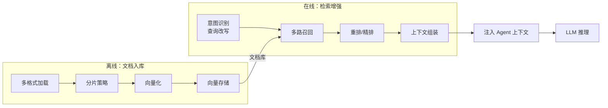
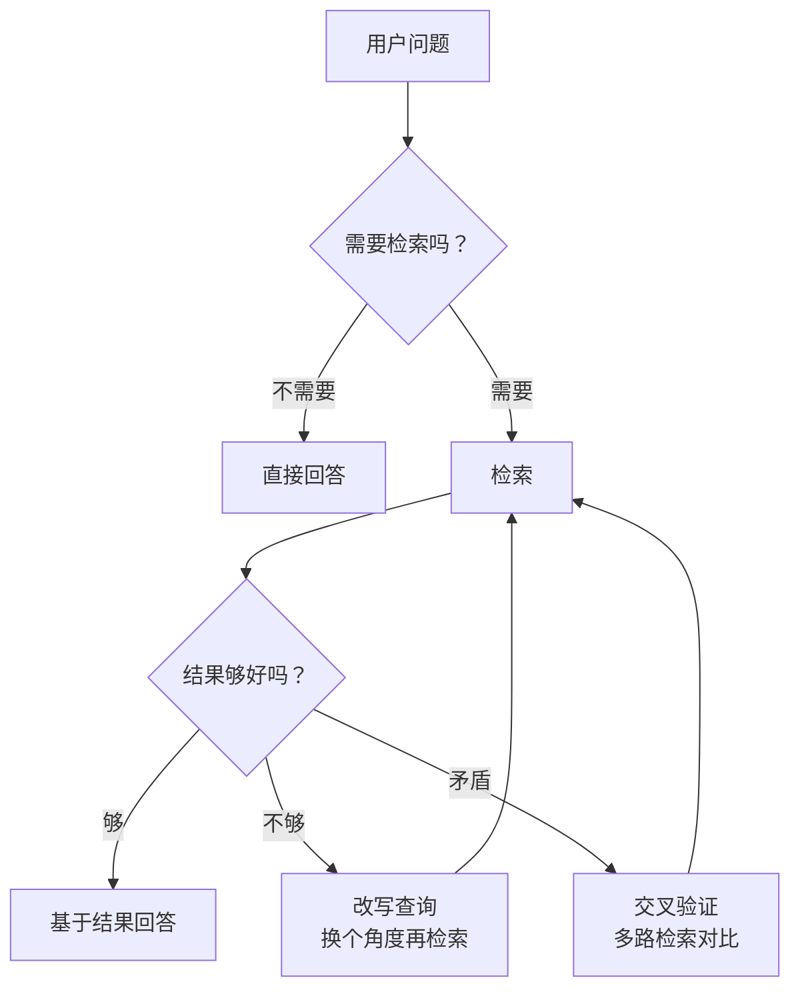

> 造一个好 Agent 系列（十）：RAG 是 Agent 长期记忆的底层引擎。但大多数人对 RAG 的理解停留在「文档切片 → 向量化 → 余弦相似度」三步曲。真实的 RAG 工程是一条涵盖意图识别、多格式解析、分片策略、混合召回、重排精排、上下文组装、可信度校准的完整链路。任何一个环节做糙了，召回质量都会断崖式下降。

## 一、RAG 全景：不止是向量检索

一个生产级 RAG 系统由四个阶段组成：



离线阶段（入库）做一次，在线阶段（检索）每轮对话都跑。大多数人只关注在线阶段，但入库质量决定了检索的上限——垃圾进，垃圾出。

## 二、文档入库：多格式加载 + 分片

### 2.1 类型感知的加载器

不同格式的文档需要不同的解析策略。一个成熟的加载器会根据文件扩展名分发到专用处理器：

```java
/**
 * 类型感知加载器：根据文件扩展名路由到专用解析器。
 * 每种格式的元数据注入策略不同（页码、段落索引、标题层级等）。
 */
@Component
public class TypeAwareLoader {

    private final Map<String, Function<Path, List<Document>>> loaders = Map.ofEntries(
        Map.entry("txt",      this::loadText),
        Map.entry("md",       this::loadMarkdown),
        Map.entry("html",     this::loadHtml),
        Map.entry("pdf",      this::loadPdf),
        Map.entry("docx",     this::loadOffice),
        Map.entry("java",     this::loadCode),
        Map.entry("py",       this::loadCode),
        Map.entry("json",     this::loadText)
    );

    public List<Document> load(Path file) {
        String ext = fileExtension(file).toLowerCase();
        Function<Path, List<Document>> loader = loaders.get(ext);
        if (loader == null) throw new IllegalArgumentException("不支持的格式: " + ext);
        return loader.apply(file);
    }

    /** PDF 逐页提取，注入页码元数据 */
    private List<Document> loadPdf(Path file) {
        try (PDDocument pdf = Loader.loadPDF(file.toFile())) {
            PDFTextStripper stripper = new PDFTextStripper();
            int pages = pdf.getNumberOfPages();
            List<Document> docs = new ArrayList<>();
            for (int i = 1; i <= pages; i++) {
                stripper.setStartPage(i);
                stripper.setEndPage(i);
                String text = stripper.getText(pdf);
                if (text.isBlank()) continue;
                docs.add(new Document(text, Map.of(
                    "sourcePath", file.toString(),
                    "pageNumber", i,
                    "pageCount", pages
                )));
            }
            return docs;
        } catch (IOException e) {
            throw new RuntimeException("PDF 加载失败: " + file, e);
        }
    }

    /** HTML 清理 script/style/nav 标签，提取正文 */
    private List<Document> loadHtml(Path file) throws IOException {
        String html = Files.readString(file);
        String body = html.replaceAll("(?s)<(script|style|nav|footer|header)[^>]*>.*?</\\1>", "");
        String text = body.replaceAll("<[^>]+>", " ").replaceAll("\\s+", " ").trim();
        return List.of(new Document(text, Map.of("sourcePath", file.toString())));
    }

    /** Markdown 解析 YAML frontmatter 为元数据 */
    private List<Document> loadMarkdown(Path file) throws IOException {
        String raw = Files.readString(file);
        Matcher fm = Pattern.compile("(?s)^---\\n(.*?)\\n---\\n?(.*)$").matcher(raw);
        Map<String, String> meta = new HashMap<>();
        String body;
        if (fm.matches()) {
            parseYamlFrontmatter(fm.group(1), meta);
            body = fm.group(2);
        } else {
            body = raw;
        }
        meta.put("sourcePath", file.toString());
        return List.of(new Document(body, meta));
    }
}
```

**关键设计**：每种格式注入不同的元数据——PDF 带页码、Markdown 带 frontmatter、代码带语言类型。这些元数据在后续的引用溯源和分片策略选择中都会用到。

### 2.2 分片策略：五种方案各有适用场景

分片是 RAG 工程中影响召回质量最大的环节。切得太碎，上下文丢失；切得太大，噪声淹没有用信息。

```java
/**
 * 分片器 SPI：所有分片策略的统一接口。
 * 输出带 chunkIndex、chunkCount、parentId、headingPath 元数据的 Document。
 */
public interface DocumentSplitter {
    List<Document> split(Document document);
}
```

**策略一：滑动窗口**——固定长度 + 重叠，最简单。

```java
@Component
public class SlidingWindowSplitter implements DocumentSplitter {

    private final int targetSize;
    private final double overlapRatio;  // 默认 0.15，保留 15% 跨边界上下文

    public List<Document> split(Document doc) {
        String content = doc.getContent();
        int overlap = (int) (targetSize * overlapRatio);
        int step = Math.max(1, targetSize - overlap);
        List<Document> chunks = new ArrayList<>();

        for (int start = 0, idx = 0; start < content.length(); start += step, idx++) {
            int end = Math.min(content.length(), start + targetSize);
            chunks.add(new Document(content.substring(start, end), enrichMeta(doc, idx)));
            if (end == content.length()) break;
        }
        return chunks;
    }
}
```

**策略二：递归分片**——四级降级，Markdown 感知。

```java
@Component
public class RecursiveSplitter implements DocumentSplitter {

    private final int targetChunkSize;
    // 四级分割符：标题 → 段落 → 句子 → 硬切
    private final List<Pattern> delimiters = List.of(
        Pattern.compile("(?m)^#{1,6}\\s+.*$"),           // Markdown 标题
        Pattern.compile("(?m)^\\n\\s*\\n"),              // 段落
        Pattern.compile("[。！？.!?]\\s"),               // 句子
        Pattern.compile("\\s")                           // 硬切（最后手段）
    );

    private List<String> splitRecursive(String content) {
        if (content.length() <= targetChunkSize) return List.of(content);
        // 从最粗粒度开始尝试，逐级细化
        for (Pattern delimiter : delimiters) {
            String[] parts = delimiter.split(content);
            if (parts.length > 1) {
                List<String> result = new ArrayList<>();
                for (String part : parts) {
                    if (part.length() <= targetChunkSize) {
                        result.add(part.trim());
                    } else {
                        result.addAll(splitRecursive(part, delimiterIndex(delimiter) + 1));
                    }
                }
                return result;
            }
        }
        return List.of(content.substring(0, targetChunkSize));
    }
}
```

**策略三：语义分片**——按句子边界累积，小碎片合并到前一块。

```java
@Component
public class SemanticSplitter implements DocumentSplitter {

    private final int targetSize;
    private final int minChunkSize;  // 过小的 chunk 会被合并

    public List<Document> split(Document doc) {
        List<String> sentences = splitBySentence(doc.getContent());
        List<String> chunks = new ArrayList<>();
        StringBuilder current = new StringBuilder();

        for (String sentence : sentences) {
            if (current.length() + sentence.length() > targetSize && current.length() > 0) {
                // 当前块太小，合并到上一块
                if (current.length() < minChunkSize && !chunks.isEmpty()) {
                    int last = chunks.size() - 1;
                    chunks.set(last, chunks.get(last) + current);
                } else {
                    chunks.add(current.toString());
                }
                current.setLength(0);
            }
            current.append(sentence);
        }
        if (current.length() > 0) chunks.add(current.toString());
        return chunks.stream().map(c -> new Document(c, doc.getMetadata())).toList();
    }
}
```

**策略四：父子分片**——子块用于检索，父块用于扩大上下文。

```java
@Component
public class HierarchicalSplitter implements DocumentSplitter {

    private final int parentChunkSize;
    private final int childChunkSize;

    public List<Document> split(Document doc) {
        List<String> parents = chunkBySize(doc.getContent(), parentChunkSize);
        List<Document> children = new ArrayList<>();
        for (int p = 0; p < parents.size(); p++) {
            String parentId = doc.getId() + ":p" + p;
            List<String> childContents = chunkBySize(parents.get(p), childChunkSize);
            for (int c = 0; c < childContents.size(); c++) {
                children.add(new Document(childContents.get(c),
                    Map.of("parentId", parentId, "childIndex", c)));
            }
        }
        return children;  // 索引子块，检索命中后扩展到父块
    }
}
```

**策略五：代码分片**——语言感知的块分割。

```java
@Component
public class CodeSplitter implements DocumentSplitter {

    public List<Document> split(Document doc) {
        String language = (String) doc.getMetadata().get("language");
        String code = doc.getContent();
        List<String> blocks = "python".equals(language)
            ? splitByIndent(code)      // Python 按缩进
            : splitByBraces(code);     // Java/JS/TS 按花括号
        return blocks.stream()
            .filter(b -> !b.isBlank())
            .map(b -> new Document(b, doc.getMetadata()))
            .toList();
    }

    private List<String> splitByBraces(String code) {
        // 花括号平衡匹配，保留完整的函数/类体
        List<String> blocks = new ArrayList<>();
        int depth = 0, start = 0;
        for (int i = 0; i < code.length(); i++) {
            if (code.charAt(i) == '{') depth++;
            else if (code.charAt(i) == '}') {
                depth--;
                if (depth == 0) {
                    blocks.add(code.substring(start, i + 1));
                    start = i + 1;
                }
            }
        }
        return blocks;
    }
}
```

### 2.3 分片选择器：按文档类型自动路由

```java
@Component
public class TypeAwareSplitter implements DocumentSplitter {

    private final RecursiveSplitter textSplitter;
    private final CodeSplitter codeSplitter;
    private final SemanticSplitter semanticSplitter;

    public List<Document> split(Document doc) {
        String docType = (String) doc.getMetadata().get("docType");
        String language = (String) doc.getMetadata().get("language");
        if (isCodeLanguage(language))  return codeSplitter.split(doc);
        if ("markdown".equals(docType)) return textSplitter.split(doc);
        return semanticSplitter.split(doc);  // 文本/PDF/HTML 默认用语义分片
    }
}
```

## 三、向量化：Embedding 工程

### 3.1 Embedding 客户端抽象

```java
/**
 * Embedding 客户端 SPI：统一不同厂商的 Embedding API。
 */
public interface EmbeddingClient {
    Mono<float[]> embed(String text);
    Mono<List<float[]>> embed(List<String> texts);  // 批量
    int dimensions();  // 向量维度
}

/**
 * OpenAI 兼容的 Embedding 客户端。
 * 支持维度裁剪（高维模型可以输出低维向量，节省存储和计算）。
 */
@Component
public class OpenAiEmbeddingClient implements EmbeddingClient {

    private final String baseUrl;
    private final String model;
    private final int dimensions;

    public Mono<List<float[]>> embed(List<String> texts) {
        ObjectNode body = objectMapper.createObjectNode();
        body.put("model", model);
        body.set("input", objectMapper.valueToTree(texts));
        if (dimensions > 0) body.put("dimensions", dimensions);  // 维度裁剪

        return httpClient.post()
            .uri(baseUrl + "/v1/embeddings")
            .bodyValue(body.toString())
            .retrieve()
            .bodyToMono(JsonNode.class)
            .map(resp -> parseEmbeddings(resp, dimensions));
    }
}
```

**维度裁剪**是一个常被忽略的优化：高维 Embedding 模型（如 3072 维）可以通过 API 参数输出低维向量（如 512 维），在精度损失可控的前提下大幅降低存储和检索成本。

### 3.2 批处理与降级

```java
/**
 * 带批处理和降级的 Embedding 服务。
 * 大批量文本分批发送；Embedding 失败时回退到 BM25 纯文本检索。
 */
@Component
public class EmbeddingService {

    private final EmbeddingClient client;
    private final int batchSize = 100;

    public Mono<List<float[]>> embedBatch(List<String> texts) {
        return Flux.fromIterable(texts)
            .bufferAfter(batchSize)
            .flatMap(batch -> client.embed(batch).onErrorResume(e -> {
                log.warn("Embedding 失败，该批次回退到 BM25", e);
                return Mono.just(List.of());  // 返回空向量，上层走 BM25
            }))
            .collect(ArrayList::new, List::addAll);
    }
}
```

## 四、多路召回：向量 + 关键词 + 图

### 4.1 三路召回架构

单一检索方式有盲区：向量检索擅长语义匹配但可能漏掉精确关键词；BM25 擅长关键词匹配但不懂语义。生产环境的标配是**多路召回 + 融合**。

```java
/**
 * 混合检索器：三路召回 + 加权融合。
 * 密集向量 + 稀疏关键词 + 图谱邻居，每路召回 2×topK 再融合。
 */
@Component
public class HybridRetriever {

    private final DenseRetriever denseRetriever;
    private final SparseRetriever sparseRetriever;
    private final GraphRetriever graphRetriever;  // 可选
    private final float denseWeight;              // 默认 0.7

    public Mono<List<Document>> retrieve(String query, int topK) {
        return Mono.zip(
            denseRetriever.retrieve(query, topK * 2).defaultIfEmpty(List.of()),
            sparseRetriever.retrieve(query, topK * 2).defaultIfEmpty(List.of()),
            graphRetriever.retrieve(query, topK * 2).defaultIfEmpty(List.of())
        ).map(tuple -> fuseThree(
            tuple.getT1(), tuple.getT2(), tuple.getT3(), topK, denseWeight
        ));
    }
}
```

### 4.2 BM25 + 余弦融合

```java
/**
 * 融合打分：denseWeight × 余弦相似度 + (1 - denseWeight) × BM25 归一化分。
 * denseWeight 默认 0.7，向量权重占主导但关键词不丢失。
 */
private List<Document> fuseTwo(List<Document> dense, List<Document> sparse,
                                int topK, float denseWeight) {
    Map<String, Document> merged = new LinkedHashMap<>();
    for (Document d : dense) merged.putIfAbsent(d.getId(), d);
    for (Document s : sparse) merged.putIfAbsent(s.getId(), s);

    return merged.values().stream()
        .map(doc -> {
            float cos = cosineScore(doc, queryVec);     // 向量分
            float bm25 = bm25Score(doc, queryTokens);   // 关键词分
            float fused = denseWeight * Math.max(0, cos) + (1 - denseWeight) * bm25;
            doc.setScore(fused);
            return doc;
        })
        .sorted(Comparator.comparingDouble(Document::getScore).reversed())
        .limit(topK)
        .toList();
}
```

### 4.3 中文 BM25：一元 + 二元分词

```java
/**
 * 自实现 BM25，支持中文一元/二元分词。
 * 不依赖外部分词库，用 CJK Unicode 范围判断。
 */
@Component
public class Bm25Searcher {

    private static List<String> tokenize(String text) {
        String s = text.toLowerCase();
        List<String> tokens = new ArrayList<>();
        // CJK 一元
        for (int i = 0; i < s.length(); i++) {
            if (isCjk(s.charAt(i))) tokens.add(String.valueOf(s.charAt(i)));
        }
        // CJK 二元
        for (int i = 0; i + 1 < s.length(); i++) {
            if (isCjk(s.charAt(i)) && isCjk(s.charAt(i + 1))) {
                tokens.add(s.substring(i, i + 2));
            }
        }
        // 英文按空格分词
        tokens.addAll(Arrays.asList(s.split("\\s+")));
        return tokens;
    }
}
```

## 五、重排/精排：召回之后的第二道筛

多路召回后通常有 3×topK 条候选（比如召回 30 条，最终只要 5 条）。重排的目标是从这 30 条里筛出最相关的 5 条。

### 5.1 关键词增强重排

```java
/**
 * 轻量重排器：对召回结果做关键词匹配加分。
 * 作为 Cross-Encoder 重排前的快速筛选层。
 */
@Component
public class SimpleReranker implements Reranker {

    public Mono<List<Document>> rerank(String query, List<Document> documents) {
        String q = query.toLowerCase();
        Set<String> terms = Set.of(q.split("\\s+"));

        return Mono.fromCallable(() -> documents.stream()
            .map(doc -> {
                Document copy = doc.withScore(doc.getScore());
                String content = doc.getContent().toLowerCase();
                for (String term : terms) {
                    if (content.contains(term)) copy.setScore(copy.getScore() + 0.1f);
                }
                return copy;
            })
            .sorted(Comparator.comparingDouble(Document::getScore).reversed())
            .toList());
    }
}
```

### 5.2 LLM 重排

```java
/**
 * LLM 重排器：让模型对候选文档的相关性打分。
 * 精度最高但延迟最大，适合对质量要求极高的场景。
 * LLM 失败时优雅降级到原始排序。
 */
@Component
public class LlmReranker implements Reranker {

    private final LlmClient llmClient;

    public Mono<List<Document>> rerank(String query, List<Document> documents) {
        String prompt = buildRerankPrompt(query, documents);
        return llmClient.complete(prompt)
            .map(resp -> parseScores(resp.getContent(), documents))
            .onErrorResume(e -> {
                log.warn("LLM 重排失败，降级到原始排序", e);
                return Mono.just(documents);
            });
    }
}
```

### 5.3 路由式重排 Pipeline

```java
/**
 * RAG 技能路由器：domain 预过滤 → 召回 → 重排 → 阈值过滤 → 取 topK。
 */
@Component
public class RagSkillRouter {

    public Mono<List<String>> route(String query, List<String> domains, int topK) {
        return vectorStore.search(query, domains, topK * 3)  // 多召回
            .map(docs -> docs.stream().map(this::toScoredSkill).collect(toList()))
            .flatMap(candidates -> rerankIfNeeded(query, candidates))  // 条件重排
            .map(this::applyThreshold)   // 阈值过滤
            .map(scored -> scored.stream().limit(topK)
                .map(ScoredSkill::id).toList());
    }
}
```

## 六、查询改写：让检索更精准

用户的原始查询往往不适合直接检索——太短、太模糊、包含了无关信息。查询改写是提升召回质量成本最低的手段。

### 6.1 三种改写策略

```java
/**
 * 查询改写器：支持 HyDE / Multi-Query / Sub-Question 三种策略。
 * 改写失败时降级到原始查询。
 */
@Component
public class QueryRewriter {

    public enum Strategy { HYDE, MULTI_QUERY, SUB_QUESTION }

    public Mono<List<String>> rewrite(String query, Strategy strategy) {
        String prompt = switch (strategy) {
            case HYDE ->
                "为以下问题生成一段假设性答案（一段话）。问题：" + query;
            case MULTI_QUERY ->
                "将以下问题改写为 3 个不同角度的搜索查询，每行一个。问题：" + query;
            case SUB_QUESTION ->
                "将以下问题分解为子问题，每行一个。问题：" + query;
        };

        return llmClient.complete(prompt)
            .map(resp -> parseLines(resp.getContent()))
            .onErrorReturn(List.of(query));  // 降级到原始查询
    }
}
```

| 策略 | 原理 | 适用场景 |
|------|------|---------|
| **HyDE** | 生成假设性答案，用答案做检索 | 知识问答、定义类问题 |
| **Multi-Query** | 多角度改写，多路检索合并 | 复杂问题、模糊查询 |
| **Sub-Question** | 分解为子问题，分别检索 | 多跳推理、对比分析 |

## 七、上下文组装：检索结果→Prompt

检索到文档后，怎么塞进 Agent 的上下文，也是一门工程。

```java
/**
 * 上下文组装器：去重 + 引用标注 + Token 预算截断。
 */
@Component
public class ContextAssembler {

    private final int maxChars;  // 最大字符预算

    public String assemble(List<Document> docs) {
        // 1. 去重（同一文档的不同 chunk 只保留第一条）
        Map<String, Document> deduped = new LinkedHashMap<>();
        for (Document d : docs) deduped.putIfAbsent(d.getId(), d);

        // 2. 逐条注入，直到达到字符预算
        StringBuilder sb = new StringBuilder();
        int used = 0;
        for (Document d : deduped.values()) {
            String entry = formatCitation(d) + "\n" + d.getContent() + "\n---\n";
            if (used > 0 && used + entry.length() > maxChars) break;
            sb.append(entry);
            used += entry.length();
        }
        return sb.toString();
    }

    private String formatCitation(Document doc) {
        Map<String, String> m = doc.getMetadata();
        return "[Source: " + m.get("sourcePath", "未知")
             + (m.containsKey("pageNumber") ? " 第" + m.get("pageNumber") + "页" : "")
             + (m.containsKey("headingPath") ? " " + m.get("headingPath") : "")
             + " score=" + String.format("%.3f", doc.getScore()) + "]";
    }
}
```

关键设计：
- **去重**：同一个文档的多个 chunk 命中时，只保留第一条，避免重复信息浪费 Token
- **引用标注**：每条结果带来源路径、页码、标题层级、分数，方便溯源
- **预算截断**：达到字符上限就停，而不是粗暴截断某条内容的中间

## 八、RAG 评估：怎么知道召回好不好

### 8.1 忠实度检测

```java
/**
 * 忠实度检查器：检测 Agent 的回答是否忠实于检索到的文档。
 * LLM-as-Judge 方案 + 关键词回退。
 */
@Component
public class FaithfulnessChecker {

    private static final String FAITHFULNESS_PROMPT = """
        你是一个忠实度评估器。给定生成的回答和检索到的源文档，
        判断回答中的每个声明是否被源文档支持。
        输出 JSON: {"total_claims": N, "supported_claims": M, "faithfulness": M/N}
        """;

    public Mono<FaithfulnessResult> check(String answer, List<Document> sources) {
        return llmClient.complete(FAITHFULNESS_PROMPT + "\n回答: " + answer
                + "\n源文档: " + sources.stream().map(Document::getContent).collect(joining("\n")))
            .map(resp -> parseFaithfulnessJson(resp.getContent()))
            .onErrorResume(e -> Mono.just(keywordFallback(answer, sources)));
    }

    /** LLM 不可用时的关键词回退检查 */
    private FaithfulnessResult keywordFallback(String answer, List<Document> sources) {
        String sourceText = sources.stream().map(Document::getContent).collect(Collectors.joining(" "));
        String[] sentences = answer.split("[.。！!？?]");
        long supported = Arrays.stream(sentences)
            .filter(s -> !s.isBlank())
            .filter(s -> containsKeywords(s, sourceText))
            .count();
        return new FaithfulnessResult(supported, sentences.length,
            (double) supported / Math.max(1, sentences.length), "keyword");
    }
}
```

### 8.2 置信度校准

```java
/**
 * RAG Pipeline 的置信度 = 重排后最高分文档的分数。
 * 置信度低时，Agent 应该回答"我不确定"而不是编造。
 */
public record RagResult(
    String answer,
    List<Document> sources,
    Double confidence  // null = 无结果
) {
    public boolean isLowConfidence(double threshold) {
        return confidence == null || confidence < threshold;
    }
}
```

## 九、Agentic RAG：Agent 主动管理检索

传统 RAG 是被动检索——用户问一次，检索一次。Agent 化的 RAG 让模型**主动决定**：



```java
/**
 * Agentic RAG：Agent 自主决定是否检索、检索结果是否充分、是否需要改写重检。
 */
@Component
public class AgenticRagAgent {

    private final Retriever retriever;
    private final QueryRewriter rewriter;
    private final LlmClient llm;
    private final int maxRounds = 3;  // 最多检索 3 轮

    public Mono<RagResult> answer(String question) {
        return decideIfSearch(question)
            .flatMap(needSearch -> {
                if (!needSearch) return answerDirectly(question);
                return searchWithRetry(question, 0);
            });
    }

    private Mono<RagResult> searchWithRetry(String query, int round) {
        if (round >= maxRounds) return answerWithLowConfidence(query);

        return retriever.retrieve(query, 10)
            .flatMap(docs -> {
                double confidence = docs.stream()
                    .mapToDouble(Document::getScore).max().orElse(0.0);
                if (confidence > 0.7) {
                    // 结果够好，直接回答
                    return generateAnswer(query, docs);
                }
                // 结果不够好，改写查询再检索
                return rewriter.rewrite(query, QueryRewriter.Strategy.MULTI_QUERY)
                    .flatMap(queries -> searchWithRetry(queries.get(0), round + 1));
            });
    }
}
```

## 十、行业实践：RAG 工程的设计共识

| 环节 | 共识做法 | 反面模式 |
|------|---------|---------|
| 文档加载 | 类型感知加载器 + 元数据注入 | 全部当纯文本处理 |
| 分片 | 按文档类型自动选策略（递归/语义/代码） | 固定长度硬切 |
| 向量化 | 批量处理 + 维度裁剪 + 失败降级 BM25 | 逐条同步调用 |
| 召回 | 多路融合（dense + sparse + graph） | 纯向量检索 |
| 重排 | 关键词加分 → LLM 重排 → 阈值过滤 | 直接用召回排序 |
| 查询改写 | HyDE/Multi-Query/Sub-Question + 降级 | 原始查询直接检索 |
| 上下文组装 | 去重 + 引用标注 + 预算截断 | 粗暴拼接 |
| 质量保障 | 忠实度检测 + 置信度校准 | 不检查直接输出 |
| Agent 化 | 主动判断是否检索、是否重检 | 被动检索一次 |

## 结语

RAG 不是「切片 → 向量化 → 检索」三步曲。

> 从文档加载的类型感知、分片策略的语义理解、多路召回的融合打分、重排的层层筛选、查询改写的策略选择，到上下文组装的精细控制、忠实度检测的质量兜底——RAG 的工程质量决定了 Agent 知识边界的可靠性。

一条链路，十个环节，每个环节都有多种方案和取舍。把每个环节做到位，Agent 才能真正「言之有据」——而不是在幻觉和遗漏之间摇摆。

---

> **🔁 闭环视角**
>
> 本篇聚焦 Agent 闭环中**记忆更新**阶段的离线和在线两部分——离线入库决定了记忆的质量上限，在线检索决定了记忆在每次推理中的利用率。RAG 的召回质量直接影响规划阶段的输入质量，进而影响行动阶段的决策质量。
