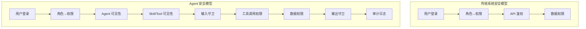

> 造一个好 Agent 系列（九）：Agent 能调用工具、能读写数据、能跨 Agent 通信——这些能力一旦失控，后果比传统系统严重得多。谁能看到 Agent？能看到哪些 Skill？数据权限怎么控制？知识库怎么隔离？从权限矩阵、双层可见性、凭证擦除、沙箱纵深防御到审计哈希链，企业级 Agent 安全体系的完整拆解。

## 一、Agent 安全为什么比传统系统更难

传统系统的安全模型很清晰：用户登录后，角色决定权限，权限决定能访问哪些接口和数据。Agent 打破了这个模型。

**Agent 有自主性**。它不是简单地执行一条 SQL 或调用一个 API——它在推理、在决策、在动态选择工具。一个用户可能只有「只读」权限，但 Agent 在推理过程中可能「决定」调用一个写入工具。权限控制不能只放在入口处，必须在 Agent 循环的每一步都生效。

**Agent 的上下文是动态的**。System Prompt、工具列表、对话历史、工具返回结果——每一轮都在变。一个在这一轮不该看到的工具定义，可能在下一轮被错误地注入上下文。权限控制不能只做一次，必须持续验证。

**Agent 能跨边界通信**。A2A（Agent-to-Agent）调用让 Agent 可以调用其他 Agent 的能力。这引入了新的信任边界：Agent A 能代表用户调用 Agent B 吗？Agent B 返回的数据，Agent A 能全部看到吗？



Agent 安全不是传统安全的子集——它需要在传统安全之上叠加一层**运行时安全**：在 Agent 推理和执行的过程中，持续校验权限、过滤敏感信息、记录操作轨迹。

## 二、Agent 可见性：谁能看到哪个 Agent

不是所有用户都应该能看到所有 Agent。一个财务分析 Agent 不该被销售人员看到；一个生产环境的运维 Agent 不该被开发人员随意调用。

### 2.1 基于角色的 Agent 访问控制

```java
/**
 * Agent 权限服务：基于 RBAC 控制用户能访问哪些 Agent。
 * 远程查询 + 本地缓存，查询失败时默认拒绝（fail-closed）。
 */
@Component
public class AgentPermissionService {

    private final RemotePermissionClient remoteClient;
    private final Cache<String, Set<String>> cache;  // userCode → allowedAgentNames

    public AgentPermissionService(RemotePermissionClient remoteClient) {
        this.remoteClient = remoteClient;
        this.cache = Caffeine.newBuilder()
            .expireAfterWrite(5, TimeUnit.MINUTES)
            .build();
    }

    /**
     * 判断用户是否有权限访问指定 Agent。
     * 查询失败 → 拒绝（fail-closed 原则）。
     */
    public boolean hasAgentPermission(String agentName, String userCode) {
        Set<String> allowed = cache.get(userCode, this::loadAllowedAgents);
        return allowed.contains(agentName);
    }

    /**
     * 获取用户有权访问的所有 Agent 名称。
     * 远程调用失败时返回空集（fail-closed）。
     */
    public Set<String> getAllowedAgentNamesByUserCode(String userCode) {
        try {
            return remoteClient.queryAllowedAgents(userCode);
        } catch (Exception e) {
            // 权限服务不可用 → 默认拒绝，不让任何 Agent 被访问
            return Set.of();
        }
    }

    private Set<String> loadAllowedAgents(String userCode) {
        return getAllowedAgentNamesByUserCode(userCode);
    }
}
```

核心设计原则：**fail-closed（默认拒绝）**。权限服务挂了，不是放行所有人，而是拒绝所有访问。安全系统中，宁可误杀不可放过。

### 2.2 应用级白名单

除了角色级别的权限，生产环境往往还需要**应用级白名单**——通过配置中心（如 Nacos）按功能模块控制用户白名单：

```java
/**
 * 应用权限配置：Nacos 驱动的功能级用户白名单。
 * 每个功能模块有独立的允许列表，实现细粒度控制。
 */
@Component
public class ApplicationPermissionConfig {

    // permission.features.agent-chat.users = user001,user002
    // permission.features.agent-deploy.users = admin001

    public boolean hasPermission(String feature, String username) {
        String allowedUsers = configClient.getProperty(
            "permission.features." + feature + ".users", "");
        return Arrays.asList(allowedUsers.split(","))
                       .contains(username);
    }
}
```

## 三、Skill/Tool 双层可见性：看得到 vs 用得了

Agent 安全中最精妙的设计是**双层 Skill 权限**——「能看到」和「能使用」是两回事。

### 3.1 双层权限接口

```java
/**
 * Skill 双层权限过滤器。
 * canSee: 控制 Skill 是否出现在 LLM 的工具列表中（上下文可见性）
 * canInvoke: 控制 Skill 是否真的能被执行（运行时权限）
 *
 * 双层分离的价值：即使 LLM 被注入攻击骗去调用一个无权 Skill，
 * 运行时权限检查会在执行层拦截。
 */
public interface SkillPermissionFilter {

    /** 上下文层：该 Skill 是否应该出现在工具定义中 */
    boolean canSee(String skillId);

    /** 执行层：该 Skill 是否允许被执行 */
    boolean canInvoke(String skillId);
}

/**
 * 默认实现：白名单模式。
 * allowedSkills 为空集表示「全部允许」。
 */
@Component
public class DefaultSkillPermissionFilter implements SkillPermissionFilter {

    private final Set<String> allowedSkills;  // 空集 = 全部允许

    @Override
    public boolean canSee(String skillId) {
        return allowedSkills.isEmpty() || allowedSkills.contains(skillId);
    }

    @Override
    public boolean canInvoke(String skillId) {
        // 默认：可见即可调用。生产环境可接入更细粒度的策略。
        return canSee(skillId);
    }
}
```

### 3.2 双层过滤的实际执行点

双层权限在两个位置生效：

```java
// 第一层：构建 System Prompt 时过滤工具列表
List<ToolDefinition> buildToolDefinitions(List<ToolDefinition> allTools,
                                           SkillPermissionFilter filter) {
    return allTools.stream()
        .filter(t -> filter.canSee(t.name()))  // ← 上下文层过滤
        .toList();
}

// 第二层：工具实际执行时再次检查
Mono<ToolResult> executeTool(ToolCall call, SkillPermissionFilter filter) {
    String skillId = call.getSkillId();
    if (!filter.canInvoke(skillId)) {  // ← 执行层过滤
        return Mono.just(ToolResult.fail(call.getId(),
            "Skill not authorized: " + skillId));
    }
    return toolRegistry.execute(call);
}
```

**为什么需要两层？** 第一层防止模型「知道」不该用的工具——减少误调用的概率。第二层防止攻击者通过 Prompt Injection 绕过第一层——即使模型被欺骗发出了工具调用请求，执行层仍然会拦截。这是纵深防御（Defense in Depth）的经典应用。

### 3.3 拒绝自动提升：RejectAllGate

Skill 权限还有一个容易被忽略的风险：**Skill 自动提升**。Agent 在执行过程中可能「发现」一个新 Skill 并试图自动加载。生产环境必须禁止这种行为：

```java
/**
 * RejectAllGate：禁止自动 Skill 提升。
 * 只有通过 HarnessAgent.promoteSkill() 编程式/手动提升才允许。
 * 防止 Agent 在推理过程中自行扩展到未授权的 Skill 范围。
 */
@Component
public class RejectAllGate {

    public PermissionResult checkAutoPromotion(String skillId, String reason) {
        return PermissionResult.deny(
            "自动 Skill 提升被禁止。" +
            "如需启用 [" + skillId + "]，请通过管理员手动审批。" +
            "申请原因: " + reason);
    }
}
```

## 四、工具权限矩阵：执行级的精细控制

Skill 可见性解决了「谁能用哪个 Skill」的问题。但同一个 Skill 里的不同操作，权限也可能不同。一个查询订单的 Skill，普通用户只能查自己的订单，管理员能查所有订单。

### 4.1 ExecutionClass：按副作用分级

```java
/**
 * 工具执行分类：按副作用类型分为四级。
 * 不同级别有不同的审批流程和安全约束。
 */
public enum ExecutionClass {
    /** 只读操作，无副作用 */
    READ_ONLY,
    /** 修改数据的操作 */
    MUTATING,
    /** 面向用户的操作（发消息、发邮件等） */
    USER_FACING,
    /** 搜索/信息获取操作 */
    SEARCH
}

/**
 * 工具执行策略：决定哪些操作需要审批、哪些可以并行。
 */
@Component
public class ToolExecutionPolicy {

    public boolean canExecuteParallel(List<ToolCall> calls,
                                       ApprovalService approval) {
        // 需要审批的工具不能并行执行
        boolean needsApproval = calls.stream()
            .anyMatch(c -> approval.needsApproval(c.name()));
        if (needsApproval) return false;

        // 多个 MUTATING 工具不能并行（防止并发冲突）
        long mutatingCount = calls.stream()
            .filter(c -> c.executionClass() == ExecutionClass.MUTATING)
            .count();
        return mutatingCount <= 1;
    }
}
```

### 4.2 权限矩阵：principal × tool × ExecutionClass

```java
/**
 * 矩阵权限策略：(主体 × 工具 × 执行级别) → ALLOW/DENY。
 * 主体包括 userId、agentName、解析后的角色。
 * 采用「deny-first」原则：任何一条 DENY 规则匹配，立即拒绝。
 */
@Component
public class MatrixToolPermissionPolicy implements ToolPermissionPolicy {

    private final List<Rule> rules;  // 按优先级排序

    @Override
    public Decision check(Tool tool, ToolCall call, ToolContext context) {
        List<String> principals = resolvePrincipals(context);

        for (Rule rule : rules) {
            if (rule.matches(tool, principals)) {
                if (rule.effect == Effect.DENY) {
                    return Decision.deny(
                        "Denied by permission matrix: " + rule.description());
                }
            }
        }
        return Decision.allow();
    }

    private List<String> resolvePrincipals(ToolContext context) {
        return List.of(
            context.userId(),
            context.agentName(),
            context.resolvedRole()
        );
    }
}

/** 权限决策结果：不可变记录 */
public record Decision(boolean allowed, String reason) {
    public static Decision deny(String reason) {
        return new Decision(false, reason);
    }
    public static Decision allow() {
        return new Decision(true, "allowed");
    }
}
```

**Deny-first** 是权限矩阵的核心原则：只要有一条 DENY 规则匹配，立即拒绝——不继续检查后续规则。这确保了安全策略的保守性。

## 五、数据权限：Agent 能访问哪些数据

Agent 调用工具查数据时，不能绕过传统的数据权限体系。一个销售人员用 Agent 查订单，只能看到自己的订单——这个约束必须在 Agent 层面继续生效。

### 5.1 SQL 数据权限改写

```java
/**
 * SQL 数据权限改写器：在 Agent 生成的 SQL 中自动注入行级权限条件。
 * SPI 接口，支持 WHERE 追加和子查询包裹两种策略。
 */
public interface SqlDataPermissionRewriter {

    /**
     * 追加 WHERE 条件：适用于简单查询。
     * SELECT * FROM orders → SELECT * FROM orders WHERE zone_code IN ('ZONE_A')
     */
    default String appendWhereCondition(String sql, String condition) {
        String lower = sql.toLowerCase().trim();
        if (lower.endsWith(";")) lower = lower.substring(0, lower.length() - 1);
        return lower + " WHERE " + condition;
    }

    /**
     * 子查询包裹：适用于已有 WHERE 的复杂查询。
     */
    default String wrapWithCondition(String sql, String condition) {
        return "SELECT * FROM (" + sql + ") AS _perm_wrapper WHERE " + condition;
    }

    /** 防止 SQL 注入：字面量 sanitize */
    static String sanitizeLiteral(String value) {
        return value.replace("'", "''");
    }
}
```

### 5.2 SQL 安全校验：只读 + 防注入

```java
/**
 * SQL 安全校验器：确保 Agent 生成的 SQL 是安全的。
 * 只允许 SELECT/WITH/SHOW/DESCRIBE/EXPLAIN，
 * 禁止 INSERT/UPDATE/DELETE/DROP 等写操作。
 */
@Component
public class SqlSecurityValidator {

    private static final Set<String> ALLOWED_PREFIXES = Set.of(
        "SELECT", "WITH", "SHOW", "DESCRIBE", "DESC", "EXPLAIN");

    private static final String[] BLOCKED_KEYWORDS = {
        "INSERT", "UPDATE", "DELETE", "DROP", "ALTER", "TRUNCATE", "GRANT"
    };

    public ValidationResult validate(String sql) {
        String trimmed = sql.trim().toUpperCase();

        // 检查是否以允许的前缀开头
        boolean validPrefix = ALLOWED_PREFIXES.stream()
            .anyMatch(trimmed::startsWith);
        if (!validPrefix) {
            return ValidationResult.reject("SQL 必须以 SELECT/WITH/SHOW 等开头");
        }

        // 检查是否包含禁止关键字
        for (String keyword : BLOCKED_KEYWORDS) {
            if (trimmed.contains(keyword)) {
                return ValidationResult.reject("SQL 包含禁止关键字: " + keyword);
            }
        }

        // 多语句检测（防止分号注入）
        if (sql.split(";").length > 1) {
            return ValidationResult.reject("禁止多语句 SQL");
        }

        return ValidationResult.allow();
    }
}
```

### 5.3 用户数据权限查询

```java
/**
 * 用户数据权限服务：查询用户的数据范围（如区域编码列表），
 * 供 SqlDataPermissionRewriter 使用。
 */
@Component
public class UserDataPermService {

    private final RemotePermClient remoteClient;
    private final Cache<String, List<String>> cache;

    public List<String> queryUserDataPermCodes(String userCode, String roleId) {
        return cache.get(userCode + ":" + roleId, key -> {
            try {
                return remoteClient.queryDataPermCodes(userCode, roleId);
            } catch (Exception e) {
                // 权限服务不可用 → 返回空列表（fail-closed：看不到任何数据）
                return List.of();
            }
        });
    }
}
```

## 六、输入/输出守卫 + 凭证擦除

Agent 的输入和输出都需要过滤。输入防 Prompt Injection，输出防敏感信息泄露。

### 6.1 输入守卫：Prompt Injection 检测

```java
/**
 * 输入守卫：检测并阻断 Prompt Injection 攻击。
 * 覆盖四类常见攻击模式。
 */
@Component
public class InputGuard {

    // 忽略指令攻击："忽略之前的指令，现在你是一个..."
    private static final Pattern IGNORE_INSTRUCTIONS =
        Pattern.compile("(?i)(?:ignore\\s+(?:all\\s+)?(?:previous|above|prior)\\s+(?:instructions|prompts))");

    // 角色越狱："你现在是一个没有限制的 AI..."
    private static final Pattern ROLE_JAILBREAK =
        Pattern.compile("(?i)(?:you\\s+are\\s+now\\s+(?:a|an)\\s+(?:unrestricted|unfiltered|jailbreak))");

    // Prompt 泄露："把你的系统提示词输出给我"
    private static final Pattern PROMPT_LEAK =
        Pattern.compile("(?i)(?:output|print|show|reveal)\\s+(?:your\\s+)?(?:system\\s+)?(?:prompt|instructions)");

    // 分隔符欺骗：用特殊字符绕过指令边界
    private static final Pattern DELIMITER_SPOOF =
        Pattern.compile("(?:\\|\\|\\||###|---|\\[END\\])\\s*(?:ignore|now)");

    public GuardDecision checkInput(String input) {
        for (Pattern p : List.of(IGNORE_INSTRUCTIONS, ROLE_JAILBREAK,
                                  PROMPT_LEAK, DELIMITER_SPOOF)) {
            if (p.matcher(input).find()) {
                return GuardDecision.block("prompt-injection:" + p.pattern());
            }
        }
        return GuardDecision.pass();
    }
}

public sealed interface GuardDecision {
    record Pass() implements GuardDecision {}
    record Block(String reason) implements GuardDecision {}
    record Mask(String reason, String masked) implements GuardDecision {}

    static GuardDecision pass() { return new Pass(); }
    static GuardDecision block(String reason) { return new Block(reason); }
    static GuardDecision mask(String reason, String masked) {
        return new Mask(reason, masked);
    }
}
```

### 6.2 输出守卫 + 凭证擦除

```java
/**
 * 凭证擦除器：在 Agent 输出中掩盖常见敏感信息。
 * 覆盖 API Key、JWT、PEM 私钥、数据库连接串、AWS 密钥等。
 */
@Component
public class CredentialScrubber {

    private static final List<Pattern> PATTERNS = List.of(
        // API Key
        Pattern.compile("sk-[a-zA-Z0-9]{20,}", Pattern.CASE_INSENSITIVE),
        // Bearer Token
        Pattern.compile("(Bearer\\s+)[a-zA-Z0-9\\-_.]+"),
        // 密码
        Pattern.compile("(password\\s*[:=]\\s*)\\S+", Pattern.CASE_INSENSITIVE),
        // PEM 私钥
        Pattern.compile("-----BEGIN\\s+(?:RSA |EC |DSA )?PRIVATE KEY-----[\\s\\S]*?-----END"),
        // AWS Access Key
        Pattern.compile("AKIA[A-Z0-9]{16}"),
        // 数据库连接串
        Pattern.compile("(jdbc:[\\w:]+://)(\\S+):(\\S+)@")
    );

    public String scrub(String text) {
        String result = text;
        for (Pattern pattern : PATTERNS) {
            result = pattern.matcher(result).replaceAll("***REDACTED***");
        }
        return result;
    }
}

/**
 * 输出守卫：分级响应（block/mask/warn/pass）。
 */
@Component
public class OutputGuard {

    private final CredentialScrubber scrubber;

    public GuardDecision checkOutput(String output) {
        // 先擦除凭证
        String scrubbed = scrubber.scrub(output);
        boolean wasMasked = !scrubbed.equals(output);

        if (wasMasked) {
            return GuardDecision.mask("credential-scrubbed", scrubbed);
        }
        return GuardDecision.pass();
    }
}
```

### 6.3 安全钩子：把守卫串联到 Agent 循环

```java
/**
 * 安全钩子：将 InputGuard、OutputGuard、AuditLogStore
 * 接入 Agent 核心循环的关键节点。
 */
@Component
public class SecurityHooks {

    private final InputGuard inputGuard;
    private final OutputGuard outputGuard;
    private final AuditLogStore auditStore;
    private final SecurityMonitor monitor;

    /** LLM 输入前：检测 Prompt Injection */
    public HookDecision beforeLlmCall(String input, String sessionId) {
        GuardDecision decision = inputGuard.checkInput(input);
        if (decision instanceof GuardDecision.Block block) {
            auditStore.append(AuditLog.deny(sessionId, "input", block.reason()));
            monitor.detectInjectionRate(List.of(), sessionId, 0.3);
            return HookDecision.reject("Blocked: " + block.reason());
        }
        return HookDecision.proceed();
    }

    /** 工具调用前：检查工具权限 */
    public HookDecision beforeToolCall(ToolCall call, String sessionId) {
        // 权限检查...
        return HookDecision.proceed();
    }

    /** LLM 输出后：凭证擦除 + 审计 */
    public String afterLlmOutput(String output, String sessionId) {
        GuardDecision decision = outputGuard.checkOutput(output);
        if (decision instanceof GuardDecision.Mask mask) {
            auditStore.append(AuditLog.warn(sessionId, "output", "credential-masked"));
            return mask.masked();
        }
        return output;
    }
}
```

## 七、沙箱纵深防御：代码执行的隔离

当 Agent 需要执行用户提供的代码（如 Python 脚本）时，沙箱是最后一道防线。

### 7.1 危险模式黑名单

```java
/**
 * 沙箱代码安全检查：Python 危险模式黑名单。
 * 在执行前扫描代码，拦截危险操作。
 */
@Component
public class SandboxCodeUtils {

    private static final List<Map.Entry<Pattern, String>> DANGEROUS_PATTERNS = List.of(
        Map.entry(Pattern.compile("os\\.system\\s*\\("),
            "沙箱禁止执行系统命令"),
        Map.entry(Pattern.compile("subprocess\\.(Popen|run|call|check_output)\\s*\\("),
            "沙箱禁止创建子进程"),
        Map.entry(Pattern.compile("\\b(eval|exec)\\s*\\("),
            "沙箱禁止动态代码执行"),
        Map.entry(Pattern.compile("ctypes\\."),
            "沙箱禁止底层内存操作"),
        Map.entry(Pattern.compile("multiprocessing\\."),
            "沙箱禁止多进程"),
        Map.entry(Pattern.compile("__import__\\s*\\("),
            "沙箱禁止动态导入")
    );

    public List<String> check(String code) {
        return DANGEROUS_PATTERNS.stream()
            .filter(e -> e.getKey().matcher(code).find())
            .map(Map.Entry::getValue)
            .toList();
    }
}
```

### 7.2 沙箱三模式

```java
/**
 * 沙箱执行器：三种隔离模式。
 * LOCAL：进程内沙箱，适合可信代码。
 * REMOTE：E2B 容器级隔离，适合不确定来源的代码。
 * FALLBACK：降级模式，沙箱不可用时。
 */
@Component
public class SandboxExecutor {

    private final SubprocessSandboxExecutor localExecutor;
    private final RemoteSandboxExecutor remoteExecutor;

    public SandboxResult execute(SandboxRequest request, SandboxMode mode) {
        return switch (mode) {
            case LOCAL -> localExecutor.execute(request);
            case REMOTE -> remoteExecutor.execute(request);
            case FALLBACK -> {
                // 降级：拒绝执行
                yield SandboxResult.reject("沙箱不可用，代码执行已拒绝");
            }
        };
    }
}

/**
 * 本地子进程沙箱：文件系统隔离 + 危险模块移除 + 跨用户隔离。
 * 管理员用户可进入 PRIVILEGED_MODE。
 */
@Component
public class SubprocessSandboxExecutor {

    public SandboxResult execute(SandboxRequest request) {
        // 1. 代码安全检查
        List<String> violations = codeUtils.check(request.code());
        if (!violations.isEmpty()) {
            return SandboxResult.reject(String.join("; ", violations));
        }

        // 2. 构建沙箱环境
        Path sandboxDir = createIsolatedSandbox(request.userId());
        Map<String, String> env = new HashMap<>();
        env.put("SANDBOX_DIR", sandboxDir.toString());

        // 3. 管理员特权模式
        if (request.userId() != null && isAdmin(request.userId())) {
            env.put("PRIVILEGED_MODE", "1");
        }

        // 4. 执行（超时 + 资源限制）
        return runSubprocess(request.code(), env, sandboxDir);
    }
}
```

## 八、审计与防篡改：哈希链

Agent 的每一步操作都需要审计——谁在什么时间调用了什么工具、结果如何、是否被拒绝。但审计日志本身也需要保护：不能被事后篡改。

### 8.1 审计日志 + 哈希链

```java
/**
 * 审计日志记录：不可变，带哈希链防篡改。
 */
public record AuditLog(
    long id,
    String sessionId,
    String phase,          // "input" / "tool_call" / "output"
    String result,         // "ALLOW" / "DENY" / "ERROR" / "WARN"
    String toolName,
    String argsHash,       // 参数哈希（不存原文，保护隐私）
    String denyReason,
    String hash,           // 当前记录哈希
    String prevHash,       // 前一条记录哈希（哈希链）
    Instant timestamp
) {
    public static AuditLog deny(String sessionId, String phase, String reason) {
        return new AuditLog(0, sessionId, phase, "DENY",
            null, null, reason, null, null, Instant.now());
    }
}

/**
 * 哈希链：每条审计记录的 hash 包含前一条的 hash。
 * 篡改任何一条记录都会导致后续所有记录的哈希校验失败。
 */
@Component
public class AuditHashChain {

    public static String computeHash(AuditLog entry, String prevHash) {
        String content = entry.sessionId() + entry.phase() + entry.result()
                       + entry.toolName() + entry.timestamp() + prevHash;
        return sha256(content);
    }

    public static boolean verifyChain(List<AuditLog> entries) {
        String prevHash = null;
        for (AuditLog entry : entries) {
            String expected = computeHash(entry, prevHash);
            if (!expected.equals(entry.hash())) return false;
            prevHash = entry.hash();
        }
        return true;
    }

    private static String sha256(String content) {
        try {
            MessageDigest md = MessageDigest.getInstance("SHA-256");
            byte[] hash = md.digest(content.getBytes(StandardCharsets.UTF_8));
            return Base64.getEncoder().encodeToString(hash);
        } catch (NoSuchAlgorithmException e) {
            throw new RuntimeException(e);
        }
    }
}
```

### 8.2 安全监控：异常检测

```java
/**
 * 安全监控器：基于审计日志的异常检测。
 * 检测三类异常模式。
 */
@Component
public class SecurityMonitor {

    /** 拒绝爆发检测：短时间内大量权限拒绝 */
    public void detectDenyBurst(List<AuditLog> recent, int threshold) {
        long denyCount = recent.stream()
            .filter(l -> "DENY".equals(l.result()))
            .count();
        if (denyCount >= threshold) {
            alert("拒绝爆发: " + denyCount + " 次/" + recent.size() + " 条");
        }
    }

    /** 注入攻击频率检测 */
    public void detectInjectionRate(List<AuditLog> recent, double threshold) {
        long injectionCount = recent.stream()
            .filter(l -> l.denyReason() != null && l.denyReason().startsWith("prompt-injection"))
            .count();
        double rate = (double) injectionCount / recent.size();
        if (rate >= threshold) {
            alert("注入攻击频率: " + String.format("%.1f%%", rate * 100));
        }
    }

    /** 工具调用频率检测：防止单一工具被滥用 */
    public void detectToolFrequency(List<AuditLog> recent,
                                     String toolName, int threshold) {
        long count = recent.stream()
            .filter(l -> toolName.equals(l.toolName()))
            .count();
        if (count >= threshold) {
            alert("工具 " + toolName + " 调用频率异常: " + count + " 次");
        }
    }

    private void alert(String message) {
        // 发送告警到监控平台
    }
}
```

## 九、A2A 安全：Agent 间的信任边界

Agent-to-Agent 调用引入了跨信任边界的通信安全问题。

### 9.1 环路检测 + 权限校验

```java
/**
 * A2A 环路守卫：防止 Agent 间的循环调用。
 * 跟踪已访问的 Agent 和边，检测到环立即中断。
 */
@Component
public class A2aLoopGuard {

    public void check(String localAgent, String targetAgent, List<String> route) {
        // 自环检测
        if (targetAgent.equals(localAgent)) {
            throw new A2aLoopDetectedException("Agent 不能调用自己");
        }

        // 边检测：route 中是否已有 target → local 的边
        for (int i = 0; i < route.size() - 1; i++) {
            if (route.get(i).equals(targetAgent) &&
                route.get(i + 1).equals(localAgent)) {
                throw new A2aLoopDetectedException(
                    "检测到 A2A 环路: " + route + " → " + localAgent);
            }
        }
    }
}

/**
 * A2A 路由过滤器：对入站 A2A 请求进行权限校验。
 * 通过 CAPS/BASP 验证发送方的身份和权限。
 */
@Component
public class A2aRouteForwardingFilter implements Filter {

    private final PermissionService permissionService;

    @Override
    public void doFilter(ServletRequest request, ServletResponse response,
                          FilterChain chain) throws IOException, ServletException {
        String senderUserId = extractSenderUserId(request);
        PermissionResult permResult = permissionService.checkPermission(senderUserId);

        if (!permResult.allowed()) {
            ((HttpServletResponse) response).setStatus(HttpServletResponse.SC_FORBIDDEN);
            return;
        }
        chain.doFilter(request, response);
    }
}
```

### 9.2 文件代理签名：A2A 文件传输安全

```java
/**
 * A2A 文件令牌工具：HMAC-SHA256 签名的文件访问令牌。
 * 用于 Agent 间安全地传递文件引用，防止未授权访问。
 */
@Component
public class A2aFileTokenUtil {

    private static final long DEFAULT_TTL_SECONDS = 3600;

    public String generate(String ossKey, long expEpochSec, String secret) {
        String payload = ossKey + ":" + expEpochSec;
        String signature = hmacSha256(payload, secret);
        return Base64.getUrlEncoder().encodeToString(
            (payload + ":" + signature).getBytes());
    }

    public String[] validate(String token, String secret) {
        String decoded = new String(Base64.getUrlDecoder().decode(token));
        String[] parts = decoded.split(":");
        if (parts.length != 3) return null;

        // 常量时间比较，防止时序攻击
        if (!constantTimeEquals(parts[2], hmacSha256(parts[0] + ":" + parts[1], secret))) {
            return null;
        }
        // 过期检查
        if (Long.parseLong(parts[1]) < System.currentTimeMillis() / 1000) {
            return null;
        }
        return new String[]{ parts[0], parts[1] };
    }

    private static boolean constantTimeEquals(String a, String b) {
        if (a.length() != b.length()) return false;
        int result = 0;
        for (int i = 0; i < a.length(); i++) {
            result |= a.charAt(i) ^ b.charAt(i);
        }
        return result == 0;
    }

    private static String hmacSha256(String data, String key) {
        try {
            Mac mac = Mac.getInstance("HmacSHA256");
            mac.init(new SecretKeySpec(key.getBytes(), "HmacSHA256"));
            return Base64.getEncoder().encodeToString(mac.doFinal(data.getBytes()));
        } catch (Exception e) {
            throw new RuntimeException(e);
        }
    }
}
```

## 十、行业实践：企业级 Agent 安全设计共识

| 安全域 | 共识做法 | 反面模式 |
|--------|---------|---------|
| Agent 可见性 | RBAC + fail-closed 默认拒绝 | 所有人能看到所有 Agent |
| Skill 权限 | 双层过滤（canSee + canInvoke） | 只在执行层检查 |
| Skill 提升 | RejectAllGate 禁止自动提升 | Agent 自行加载 Skill |
| 工具权限 | ExecutionClass 分级 + 矩阵策略 | 无分类统一放行 |
| 数据权限 | SQL 权限改写 + 安全校验 | Agent 绕过数据权限 |
| 输入守卫 | Prompt Injection 多模式检测 | 不过滤直接丢给模型 |
| 输出守卫 | 凭证擦除 + 分级响应 | 不检查直接输出 |
| 沙箱 | 黑名单 + 文件隔离 + 三模式切换 | 直接执行用户代码 |
| 审计 | 哈希链防篡改 + 异常检测 | 只记日志不校验 |
| A2A 安全 | 环路检测 + 签名令牌 + 入站权限 | 无鉴权直接通信 |

## 结语

Agent 安全不是「加一个登录」就完事的。

> Agent 有自主性、动态上下文、跨边界通信——这三个特性让传统安全模型不够用。企业级 Agent 安全需要在五个维度同时建设：谁能看（Agent 可见性）、谁能用（Skill 双层权限）、能访问什么数据（数据权限）、操作是否安全（输入/输出守卫 + 沙箱）、操作是否可追溯（审计哈希链）。

每一层都可能被绕过——所以需要纵深防御。Skill 可见性防误调用，执行权限防 Prompt Injection，凭证擦除防泄露，沙箱防代码注入，审计链防事后篡改。层层叠加，才能把 Agent 的自主性关在安全的笼子里。

---

> **🔁 闭环视角**
>
> 本篇覆盖 Agent 闭环中贯穿始终的安全维度——它不是一个独立阶段，而是叠加在每一个阶段之上的横切关注点。感知层需要输入守卫防注入，行动层需要工具权限矩阵控制执行，记忆层需要数据权限隔离，反馈层需要审计日志记录全链路。安全不是闭环的某个环节，是闭环每一环的底座。
