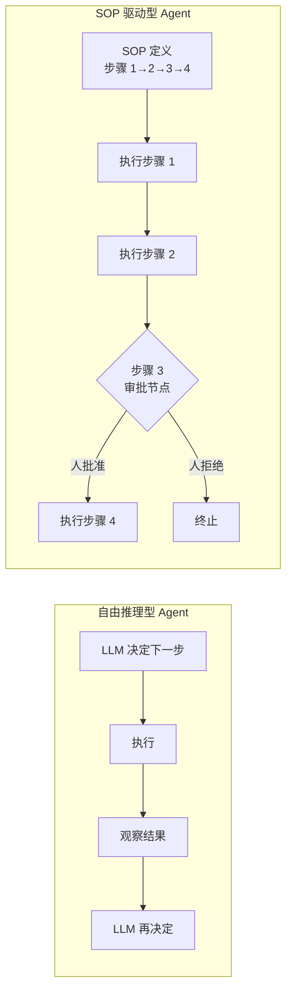
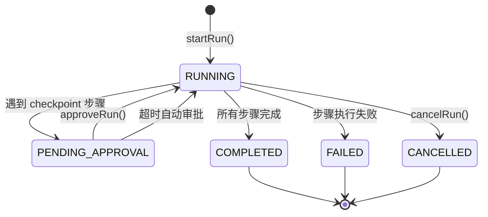

> 造一个好 Agent 系列（十三）：ReAct 循环让 Agent 自由推理，但自由不等于高效。审批流程、入职办理、故障处理——这些场景每一步都有明确规定，不需要模型「自由发挥」。SOP 驱动型 Agent 用 Markdown 定义流程，用状态机驱动执行，在需要人类判断的地方停下来等审批，在需要等待结果的地方自动轮询。自由推理和标准流程，两条腿走路。

## 一、为什么需要 SOP 型 Agent

ReAct 循环的核心是「模型决定下一步」。这对探索性任务很好——查资料、写代码、分析问题。但对流程性任务，自由推理反而是负担：

| 场景 | 自由推理的问题 | SOP 的优势 |
|------|-------------|-----------|
| 采购审批 | 模型可能跳过审批步骤直接下单 | 审批节点强制暂停，等人确认 |
| 故障处理 | 模型可能选错排查路径 | 步骤固定，不遗漏 |
| 数据报表 | 模型每次执行路径不同 | 结果可复现、可审计 |
| 入职办理 | 模型可能搞错顺序 | 步骤有序，依赖明确 |

> SOP 型 Agent 不是削弱了模型的能力——是把模型从「流程管理」中解放出来，让它专注于每一步里的推理和判断。



## 二、Markdown 定义 SOP：流程即文档

SOP 用 Markdown 编写——流程本身就可读、可版本控制、可 Code Review。

### 2.1 SOP 文件结构

一个完整的 SOP 由两个文件组成：

**SOP.toml** — 元数据（触发条件、标签、冷却时间、并发限制）：

```toml
name = "server-failure-triage"
description = "服务器故障自动排查 SOP"
version = "1.2"
priority = "HIGH"
execution_mode = "SUPERVISED"
cooldown_secs = 300
max_concurrent = 3

[triggers]
type = "metric"
condition = "$.cpu_usage > 85"
```

**SOP.md** — 步骤定义：

```markdown
## Step 1: 收集服务器指标
kind: execute
suggested_tools: [get_server_metrics, get_recent_logs]

调用 get_server_metrics 获取目标服务器的 CPU、内存、磁盘使用率。
调用 get_recent_logs 获取最近 10 分钟的错误日志。

## Step 2: 分析根因
kind: execute
suggested_tools: [analyze_logs]

基于 Step 1 的指标和日志，判断故障类型：
- CPU 过高 → 进入 Step 3a
- 内存泄漏 → 进入 Step 3b
- 磁盘满 → 进入 Step 3c

## Step 3: 执行修复
kind: checkpoint

⚠️ 此步骤需要人工确认修复方案后再执行。

## Step 4: 验证修复结果
kind: execute
loop: true
loop_max_rounds: 6
loop_interval_secs: 300
loop_success_pattern: "cpu_usage < 60"

每 5 分钟检查一次 CPU 使用率，直到低于 60% 或超过 6 轮。
```

### 2.2 SOP 解析器

```java
/**
 * SOP 解析器：从 Markdown 文本解析出结构化的步骤定义。
 * 支持 step header、kind 声明、suggested_tools、loop 配置。
 */
@Component
public class SopParser {

    private static final Pattern STEP_HEADER = Pattern.compile("^##\\s+Step\\s+(\\d+):\\s*(.+)$");
    private static final Pattern KIND_LINE = Pattern.compile("^kind:\\s*(execute|checkpoint)$");
    private static final Pattern TOOLS_LINE = Pattern.compile("^suggested_tools:\\s*\\[([^\\]]+)]$");
    private static final Pattern LOOP_LINE = Pattern.compile("^loop:\\s*(true|false)$");
    private static final Pattern LOOP_MAX = Pattern.compile("^loop_max_rounds:\\s*(\\d+)$");
    private static final Pattern LOOP_INTERVAL = Pattern.compile("^loop_interval_secs:\\s*(\\d+)$");
    private static final Pattern LOOP_SUCCESS = Pattern.compile("^loop_success_pattern:\\s*(.+)$");

    public SopDefinition parse(String sopName, String toml, String md) {
        SopMetadata meta = parseToml(toml);
        List<SopStep> steps = parseSteps(md);
        return new SopDefinition(sopName, meta.description(), meta.version(),
            meta.priority(), meta.executionMode(), meta.triggers(), steps,
            meta.tags(), meta.cooldownSecs(), meta.maxConcurrent());
    }

    private List<SopStep> parseSteps(String md) {
        List<SopStep> steps = new ArrayList<>();
        String[] lines = md.split("\n");
        String currentTitle = null;
        StringBuilder body = new StringBuilder();
        SopStepKind kind = SopStepKind.EXECUTE;
        List<String> tools = new ArrayList<>();
        boolean loop = false;
        int loopMax = 0, loopInterval = 0;
        String loopSuccessPattern = null;

        for (String line : lines) {
            Matcher header = STEP_HEADER.matcher(line);
            if (header.matches()) {
                // 保存上一步
                if (currentTitle != null) {
                    steps.add(buildStep(currentTitle, body.toString(), kind, tools,
                        loop, loopMax, loopInterval, loopSuccessPattern));
                }
                currentTitle = header.group(2);
                body.setLength(0);
                kind = SopStepKind.EXECUTE;
                tools.clear();
                loop = false;
                loopMax = 0;
                loopInterval = 0;
                loopSuccessPattern = null;
                continue;
            }
            Matcher kindM = KIND_LINE.matcher(line);
            if (kindM.matches()) {
                kind = "checkpoint".equals(kindM.group(1)) ? SopStepKind.CHECKPOINT : SopStepKind.EXECUTE;
                continue;
            }
            // ... 解析 tools、loop 等配置行
            body.append(line).append("\n");
        }
        // 保存最后一步
        if (currentTitle != null) {
            steps.add(buildStep(currentTitle, body.toString(), kind, tools,
                loop, loopMax, loopInterval, loopSuccessPattern));
        }
        return steps;
    }
}
```

## 三、执行引擎：状态机驱动

### 3.1 运行状态机

SOP 的运行是一个明确的状态机：



```java
/**
 * SOP 运行状态枚举。
 */
public enum SopRunStatus {
    RUNNING,
    PENDING_APPROVAL,
    COMPLETED,
    FAILED,
    CANCELLED;

    public boolean isTerminal() {
        return this == COMPLETED || this == FAILED || this == CANCELLED;
    }
}

/**
 * 引擎返回的密封指令集：类型安全的状态转换。
 * 调用方根据返回的 Action 决定下一步做什么。
 */
public sealed interface SopRunAction {
    record ExecuteStep(String runId, int stepNumber, String sopName) implements SopRunAction {}
    record WaitApproval(String runId, int stepNumber, String sopName) implements SopRunAction {}
    record Completed(String runId, String sopName) implements SopRunAction {}
    record Failed(String runId, String sopName, String error) implements SopRunAction {}
}
```

### 3.2 确定性执行引擎

```java
/**
 * SOP 确定性执行引擎：按步骤顺序执行，遇到 checkpoint 暂停等审批。
 * 不使用 LLM 做决策——流程本身已经定义了每一步做什么。
 */
@Component
public class SopEngine {

    private final ToolRegistry toolRegistry;
    private final Map<String, SopRun> activeRuns = new ConcurrentHashMap<>();
    private final ScheduledExecutorService scheduler = Executors.newScheduledThreadPool(4);

    public SopRunAction executeDeterministic(SopRun run) {
        int step = run.currentStep();

        while (step <= run.totalSteps()) {
            SopStep stepDef = run.sopDefinition().steps().get(step - 1);

            if (stepDef.kind() == SopStepKind.CHECKPOINT) {
                // 暂停，等人工审批
                updateRun(run, SopRunStatus.PENDING_APPROVAL, step);
                scheduleApprovalTimeout(run.runId(), step, stepDef.approvalTimeoutSecs());
                return new SopRunAction.WaitApproval(run.runId(), step, run.sopName());
            }

            // 执行步骤（可能是循环步骤）
            String output = stepDef.loop()
                ? executeLoopStep(stepDef, run)
                : executeStep(stepDef, run);

            step++;
            updateRun(run, SopRunStatus.RUNNING, step);
        }

        updateRun(run, SopRunStatus.COMPLETED, step);
        return new SopRunAction.Completed(run.runId(), run.sopName());
    }

    /**
     * 人工审批后继续执行。
     */
    public SopRunAction approveRun(String runId) {
        SopRun run = activeRuns.get(runId);
        if (run == null || run.status() != SopRunStatus.PENDING_APPROVAL) {
            throw new IllegalStateException("Run 不在审批状态: " + runId);
        }
        cancelPendingTimeout(runId);
        updateRun(run, SopRunStatus.RUNNING, run.currentStep());
        return executeDeterministic(run);
    }
}
```

### 3.3 四种执行模式

```java
/**
 * SOP 执行模式：控制步骤推进方式和人工介入程度。
 */
public enum SopExecutionMode {
    /** 全自动执行，checkpoint 也自动通过 */
    AUTO,
    /** 有 checkpoint 时暂停等审批，其余自动 */
    SUPERVISED,
    /** 每一步都需要人工确认后才执行 */
    STEP_BY_STEP,
    /** 完全不经过 LLM，纯确定性执行 */
    DETERMINISTIC
}
```

## 四、轮询步骤：等待异步结果

很多业务操作不是即时完成的——提交一个部署任务后要等它完成，发一个审批后要等结果。SOP 用**轮询步骤**处理这类场景。

```java
/**
 * 循环步骤执行器：按间隔重复执行，直到匹配成功/失败模式或超过最大轮数。
 * 适用于：等待部署完成、等待审批结果、等待指标恢复正常。
 */
private String executeLoopStep(SopStep stepDef, SopRun run) {
    int maxRounds = stepDef.loopMaxRounds() > 0 ? stepDef.loopMaxRounds() : 6;
    int intervalSecs = stepDef.loopIntervalSecs() > 0 ? stepDef.loopIntervalSecs() : 300;

    for (int round = 1; round <= maxRounds; round++) {
        String output = executeStep(stepDef, run);

        // 检查成功模式
        if (stepDef.loopSuccessPattern() != null && output.contains(stepDef.loopSuccessPattern())) {
            log.info("SOP {} 步骤 {} 第 {} 轮匹配成功模式", run.sopName(), stepDef.title(), round);
            return output;
        }

        // 检查失败模式
        if (stepDef.loopFailurePattern() != null && output.contains(stepDef.loopFailurePattern())) {
            throw new SopStepFailedException(
                "步骤 " + stepDef.title() + " 第 " + round + " 轮匹配失败模式: " + output);
        }

        // 不是最后一轮，等待后重试
        if (round < maxRounds) {
            log.info("SOP {} 步骤 {} 第 {} 轮未匹配，{} 秒后重试",
                run.sopName(), stepDef.title(), round, intervalSecs);
            try {
                Thread.sleep(intervalSecs * 1000L);
            } catch (InterruptedException e) {
                Thread.currentThread().interrupt();
                throw new SopStepFailedException("轮询被中断", e);
            }
        }
    }

    throw new SopStepFailedException(
        "步骤 " + stepDef.title() + " 超过最大轮数 " + maxRounds + "，未能匹配成功模式");
}
```

### 4.1 超时自动审批

审批节点不能无限期等待。超时后自动通过（或自动拒绝），防止流程卡死。

```java
/**
 * 审批超时调度器：checkpoint 步骤暂停后启动定时器，
 * 超时时间内无人审批则自动通过并记录审计日志。
 */
private void scheduleApprovalTimeout(String runId, int stepNumber, int timeoutSecs) {
    if (timeoutSecs <= 0) return;

    ScheduledFuture<?> future = scheduler.schedule(() -> {
        SopRun run = activeRuns.get(runId);
        if (run == null || run.status() != SopRunStatus.PENDING_APPROVAL) return;

        log.warn("SOP {} 步骤 {} 审批超时 {} 秒，自动通过", run.sopName(), stepNumber, timeoutSecs);
        updateRun(run, SopRunStatus.RUNNING, stepNumber);
        auditLogger.logTimeoutAutoApprove(run, stepNumber);
        metricsCollector.recordTimeoutAutoApprove(run.sopName());

        // 继续执行后续步骤
        executeDeterministic(run);
    }, timeoutSecs, TimeUnit.SECONDS);

    pendingTimeouts.put(runId, future);
}
```

## 五、条件分支：根据上一步结果决定走向

不是所有 SOP 都是线性流程。根据上一步的输出，下一步可能走不同的分支。

```java
/**
 * 条件评估器：支持 JSONPath 条件（用于结构化数据）和直接字符串匹配。
 * 用于触发条件判断和步骤分支决策。
 */
@Component
public class SopConditionEvaluator {

    /**
     * 评估条件表达式。
     * 以 $ 开头 → JSONPath 评估（如 $.cpu_usage > 85）
     * 否则 → 直接字符串匹配
     */
    public boolean evaluate(String condition, String payload) {
        if (condition.startsWith("$")) {
            return evaluateJsonPath(condition, payload);
        }
        return evaluateDirect(condition, payload);
    }

    private boolean evaluateJsonPath(String condition, String payload) {
        // 解析 "$.cpu_usage > 85" → 提取 path、operator、value
        // 从 payload JSON 中取出 cpu_usage 的值
        // 按 operator 比较
        String[] parts = condition.split("\\s+", 3);
        String path = parts[0].substring(1);  // 去掉 $
        String operator = parts[1];
        double threshold = Double.parseDouble(parts[2]);

        JsonNode node = objectMapper.readTree(payload);
        double actual = node.at(path.replace(".", "/")).asDouble();

        return switch (operator) {
            case ">" -> actual > threshold;
            case ">=" -> actual >= threshold;
            case "<" -> actual < threshold;
            case "==" -> Math.abs(actual - threshold) < 0.001;
            default -> false;
        };
    }
}
```

## 六、DAG 编排：多 SOP 协同

单个 SOP 处理一个流程。复杂场景需要多个 SOP 按依赖关系协同——这就是 DAG 编排。

```java
/**
 * DAG 编排器：将多个任务按依赖关系组织成有向无环图，
 * 拓扑排序后分层并行执行。
 */
@Component
public class Orchestrator {

    public Mono<OrchestrationResult> orchestrate(List<TaskAllocation> allocations) {
        // 1. 环检测（Kahn 算法）
        detectCycle(allocations);

        // 2. 分层执行
        return executeLayer(new ArrayList<>(allocations), new ConcurrentHashMap<>())
            .map(results -> OrchestrationResult.builder()
                .results(results)
                .totalTasks(allocations.size())
                .successfulTasks(results.values().stream().filter(r -> r.success()).count())
                .build());
    }

    private Mono<Map<String, TaskResult>> executeLayer(
            List<TaskAllocation> remaining, Map<String, TaskResult> results) {
        // 找出所有依赖已满足的任务（本层）
        List<TaskAllocation> ready = remaining.stream()
            .filter(t -> t.dependencies().stream().allMatch(d -> results.containsKey(d)))
            .toList();

        if (ready.isEmpty()) return Mono.just(results);

        // 本层并行执行
        return Flux.fromIterable(ready)
            .flatMap(task -> executeTask(task, results).map(r -> Map.entry(task.id(), r)))
            .collect(Collectors.toMap(Map.Entry::getKey, Map.Entry::getValue))
            .flatMap(layerResults -> {
                Map<String, TaskResult> all = new HashMap<>(results);
                all.putAll(layerResults);
                remaining.removeAll(ready);
                return executeLayer(remaining, all);
            });
    }
}
```

## 七、SOP 指标与审计

### 7.1 运行指标

```java
/**
 * SOP 指标收集器：按 SOP 维度和全局维度统计运行数据。
 * 支持 7d/30d/90d 窗口聚合。
 */
@Component
public class SopMetricsCollector {

    private final ConcurrentMap<String, SopCounters> perSop = new ConcurrentHashMap<>();
    private final GlobalCounters global = new GlobalCounters();

    public void recordRunComplete(SopRun run) {
        perSop.computeIfAbsent(run.sopName(), k -> new SopCounters()).applyRun(toSnapshot(run), 100);
        global.applyRun(toSnapshot(run), 100);
    }

    public void recordTimeoutAutoApprove(String sopName) {
        perSop.get(sopName).timeoutApprovals.increment();
        global.timeoutApprovals.increment();
    }

    public OptionalDouble getCompletionRate(String sopName, Duration window) {
        SopCounters counters = perSop.get(sopName);
        if (counters == null) return OptionalDouble.empty();
        long completed = counters.completedInWindow(window);
        long total = counters.totalInWindow(window);
        return total > 0 ? OptionalDouble.of((double) completed / total) : OptionalDouble.empty();
    }
}
```

### 7.2 审计日志

```java
/**
 * SOP 审计日志：记录运行生命周期中的每一个关键事件。
 * 用于事后追溯和合规审查。
 */
@Component
public class SopAuditLogger {

    private final Memory memory;  // 持久化后端

    public void logRunStart(SopRun run) {
        memory.store("sop_run_" + run.runId(), Map.of(
            "sopName", run.sopName(),
            "status", run.status().name(),
            "startedAt", Instant.now().toString(),
            "triggeredBy", run.triggeredBy()
        ));
    }

    public void logStepResult(String runId, SopStepResult result) {
        memory.store("sop_step_" + runId + "_" + result.stepIndex(), Map.of(
            "stepTitle", result.stepTitle(),
            "success", result.success(),
            "durationMs", result.durationMs(),
            "output", truncate(result.output(), 500)
        ));
    }

    public void logApproval(SopRun run, int stepNumber) {
        memory.store("sop_approval_" + run.runId(), Map.of(
            "stepNumber", stepNumber,
            "approvedBy", run.lastApprovedBy(),
            "approvedAt", Instant.now().toString()
        ));
    }

    public void logTimeoutAutoApprove(SopRun run, int stepNumber) {
        memory.store("sop_timeout_" + run.runId(), Map.of(
            "stepNumber", stepNumber,
            "timeoutAt", Instant.now().toString(),
            "autoApproved", true
        ));
    }
}
```

## 八、行业实践：SOP 型 Agent 的设计共识

| 设计点 | 共识做法 | 反面模式 |
|--------|---------|---------|
| 流程定义 | Markdown + TOML，流程即文档 | 硬编码在代码里 |
| 步骤类型 | execute（自动执行）+ checkpoint（人工审批） | 所有步骤都自动或都手动 |
| 执行模式 | AUTO/SUPERVISED/STEP_BY_STEP/DETERMINISTIC 四档 | 只有一种模式 |
| 审批超时 | 可配置超时自动通过 + 审计记录 | 无限期等待 |
| 轮询步骤 | loop_max_rounds + loop_interval + 成功/失败模式 | 固定等待固定时间 |
| 条件分支 | JSONPath 条件评估 | 不支持分支 |
| 状态机 | 密封指令集驱动状态转换 | if-else 堆砌 |
| 指标审计 | 按 SOP 维度统计 + 全事件审计日志 | 只记成功/失败 |

## 结语

SOP 型 Agent 和自由推理型 Agent 不是对立的——是互补的。

> 自由推理处理「不确定的事」，SOP 处理「确定的事」。一个好的 Agent 系统同时具备两种能力：遇到审批流程走 SOP，遇到模糊问题走 ReAct。甚至在一次任务中，两者交替——SOP 的某个步骤调用自由推理 Agent 做分析，分析结果回到 SOP 继续推进。

流程的确定性保证了可靠性和可审计性，模型的智能保证了每一步的执行质量。两者结合，才是生产级 Agent 的完整形态。

---

> **🔁 闭环视角**
>
> 本篇聚焦 Agent 闭环中**行动执行**阶段的结构化形态——SOP 把行动的每一步都预先定义好，模型只负责每一步内的推理。SOP 的审计日志和指标数据本身就是反馈信号的重要来源：完成率低说明流程设计有问题，超时审批多说明流程太繁琐。
