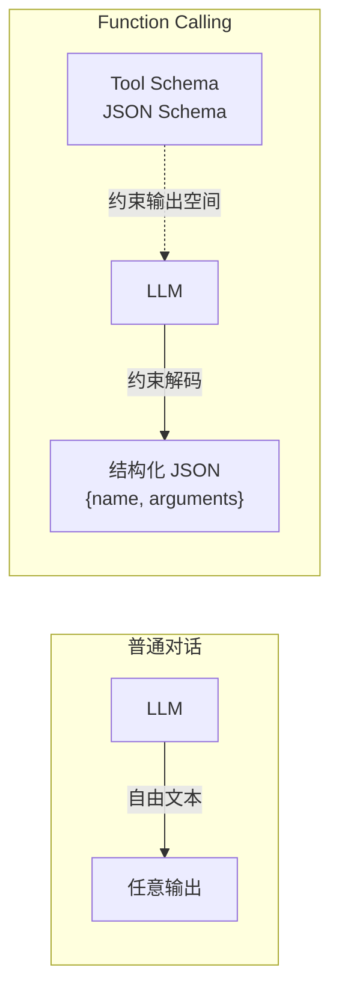
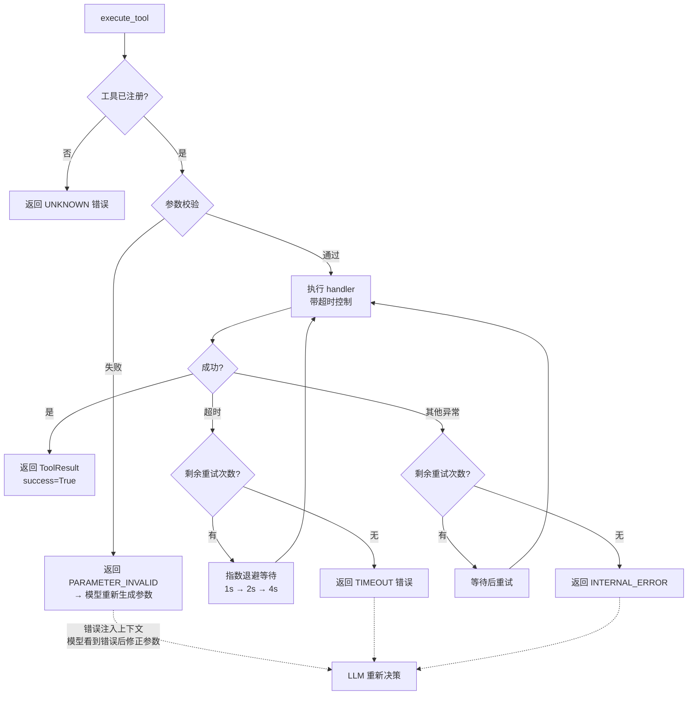
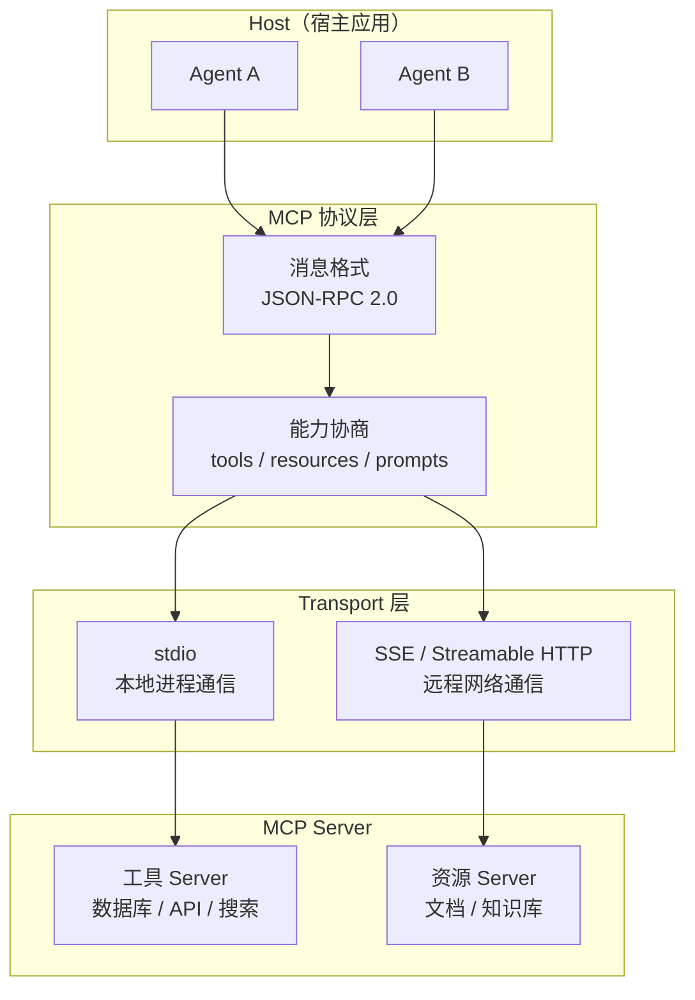

> 工具系统：Agent 的价值不在于它知道什么，在于它能做什么。从 Function Calling 的约束解码，到 MCP 协议的三层架构，再到工具 DAG 编排——拆一个完整的工具操作系统。

## 一、Function Calling 的本质：约束解码

Agent 循环里，工具调用的核心就一行：

```java
var resp = client.chat().completions().create(
    ChatCompletionCreateParam.builder()
        .model("qwen3")
        .messages(messages)
        .tools(tools)
        .build()
);
```

模型收到 `tools` 参数后，如果判断需要调用工具，就不再生成普通文本，而是输出一段**结构化的工具调用请求**——包含工具名和参数。这不是模型「学会」了什么新技能，而是模型在生成时被**约束**在了一个结构化的输出空间里。



**约束解码**是关键——模型不是「理解」了 JSON Schema 然后输出 JSON，而是在 token 采样时被 Schema 限制了可选 token 的集合。这使得输出格式几乎不会出错，但也带来一个副作用：模型只能调用你在 Schema 里注册过的工具，参数类型和取值范围被 Schema 锁死。

各厂商的实现有差异，但核心一致：

| 厂商 | 工具定义格式 | 输出结构 | 多工具调用 |
|------|------------|---------|-----------|
| 某头部厂商 | JSON Schema `tools` | `tool_calls` 数组 | 支持 |
| 某头部厂商 | JSON Schema `tools` | `tool_use` 块 | 支持 |
| 某模型厂商 | JSON Schema `tools` | `tool_calls` 数组 | 支持 |

差异不在接口，在**模型对 Schema 的遵从度**。一个描述模糊的工具定义，有的模型能猜对参数，有的模型会编造参数名。这就是为什么工具定义的质量直接决定了 Agent 的可靠性。

## 二、Tool Registry：工具注册与发现

生产级 Agent 不会把工具定义硬编码在 `tools = [...]` 里。工具会增删、会版本迭代、需要按场景动态加载。你需要一个 **Tool Registry**——工具的注册中心。

```java
import com.fasterxml.jackson.databind.JsonNode;
import com.fasterxml.jackson.databind.ObjectMapper;

import java.util.*;
import java.util.function.Function;

/**
 * 工具规格：描述 + 参数 Schema
 * ToolSpec 设计：
 */
public record ToolSpec(
    String name,
    String description,
    JsonNode parameters,       // JSON Schema
    String version,
    boolean requiresAuth,
    int timeoutMs,
    Function<Map<String, Object>, Object> handler  // 执行器，不参与序列化
) {

    // 转为某头部厂商 / 某模型厂商 兼容的工具定义格式
    public Map<String, Object> toOpenAiFormat() {
        return Map.of(
            "type", "function",
            "function", Map.of(
                "name", name,
                "description", description,
                "parameters", parameters
            )
        );
    }

    // 转为某头部厂商 兼容的工具定义格式
    public Map<String, Object> toAnthropicFormat() {
        return Map.of(
            "name", name,
            "description", description,
            "input_schema", parameters
        );
    }
}

/**
 * 工具注册中心。
 * 负责：注册、发现、版本管理、按场景过滤、多格式导出。
 * ToolRegistry 实现：
 */
@Component
public class ToolRegistry {

    private final Map<String, ToolSpec> tools = new LinkedHashMap<>();

    public ToolSpec register(String name, String description, JsonNode parameters,
                             Function<Map<String, Object>, Object> handler,
                             String version, boolean requiresAuth, int timeoutMs) {
        var spec = new ToolSpec(name, description, parameters, version,
                                requiresAuth, timeoutMs, handler);
        tools.put(name, spec);
        return spec;
    }

    public Optional<ToolSpec> get(String name) {
        return Optional.ofNullable(tools.get(name));
    }

    public Optional<Function<Map<String, Object>, Object>> getHandler(String name) {
        return get(name).map(ToolSpec::handler);
    }

    public List<ToolSpec> listAll() {
        return List.copyOf(tools.values());
    }

    /**
     * 导出当前注册的工具定义，适配目标模型的格式。
     * 注意：这里返回的是「定义」，不是执行器。
     */
    public List<Map<String, Object>> listForContext(String format) {
        return switch (format) {
            case "openai"    -> tools.values().stream().map(ToolSpec::toOpenAiFormat).toList();
            case "anthropic" -> tools.values().stream().map(ToolSpec::toAnthropicFormat).toList();
            default -> throw new IllegalArgumentException("未知格式: " + format);
        };
    }

    /** 按关键词搜索工具（用于按需发现） */
    public List<ToolSpec> search(String keyword) {
        var kw = keyword.toLowerCase();
        return tools.values().stream()
            .filter(t -> t.name().toLowerCase().contains(kw)
                      || t.description().toLowerCase().contains(kw))
            .toList();
    }
}

// --- 注册示例 ---
var registry = new ToolRegistry();
var mapper = new ObjectMapper();

registry.register(
    "get_weather",
    "获取指定城市的实时天气和 3 日预报",
    mapper.readTree("""
        {
          "type": "object",
          "properties": {
            "city": {"type": "string", "description": "城市名，如 上海、Beijing"},
            "unit": {"type": "string", "enum": ["celsius", "fahrenheit"], "default": "celsius"}
          },
          "required": ["city"]
        }
        """),
    args -> Map.of("city", args.get("city"), "temp", 28, "unit", args.getOrDefault("unit", "celsius")),
    "1.0", false, 5000
);

registry.register(
    "search_web",
    "搜索互联网获取实时信息",
    mapper.readTree("""
        {
          "type": "object",
          "properties": {
            "query": {"type": "string", "description": "搜索关键词"},
            "max_results": {"type": "integer", "default": 5, "description": "最大返回条数"}
          },
          "required": ["query"]
        }
        """),
    args -> List.of(Map.of("title", "Result for " + args.get("query"))),
    "1.0", true, 10000
);

// 导出工具定义给模型
System.out.println(mapper.writerWithDefaultPrettyPrinter()
    .writeValueAsString(registry.listForContext("openai")));
// 按需搜索
System.out.println(registry.search("天气"));  // → [ToolSpec[name=get_weather, ...]]
```

Tool Registry 解决了几个关键问题：

- **统一注册**：工具定义和执行器绑定在一起，不会脱节
- **多格式导出**：同一套定义适配 某头部厂商 / 某头部厂商 / 某模型厂商 等不同格式
- **按需发现**：`search` 方法支持按关键词过滤，配合 Skills 注入模式（能力清单始终加载，详细指令按需注入），实现工具的渐进式披露
- **版本管理**：每个工具有版本号，升级时不破坏旧调用

## 三、工具执行引擎：超时、重试、错误恢复

有了 Registry，下一步是执行。工具执行不是简单的 `handler(**args)` 调用——真实世界里工具会超时、会返回脏数据、会抛异常。执行引擎需要处理这些。

```java
import java.util.concurrent.*;
import java.util.function.Function;

/** 工具错误分类：不同错误类型需要不同的恢复策略 */
public enum ToolErrorType {
    PARAMETER_INVALID,   // 参数不合法 → 让模型重新生成
    TIMEOUT,             // 超时 → 重试或降级
    RATE_LIMIT,          // 限流 → 等待后重试
    INTERNAL_ERROR,      // 内部错误 → 重试
    PERMISSION_DENIED,   // 无权限 → 终止并通知
    UNKNOWN
}

/** 工具执行结果：统一封装成功/失败 */
public record ToolResult(
    String toolName,
    boolean success,
    Object data,
    String error,
    ToolErrorType errorType,
    int elapsedMs
) {
    // 静态工厂：成功
    public static ToolResult ok(String toolName, Object data, int elapsedMs) {
        return new ToolResult(toolName, true, data, null, null, elapsedMs);
    }

    // 静态工厂：失败
    public static ToolResult fail(String toolName, String error, ToolErrorType type) {
        return new ToolResult(toolName, false, null, error, type, 0);
    }

    /** 转为注入上下文的 tool 消息格式 */
    public Map<String, Object> toToolMessage() {
        var objectMapper = new ObjectMapper();
        if (success) {
            return Map.of("role", "tool",
                          "content", objectMapper.writeValueAsString(data));
        } else {
            return Map.of("role", "tool",
                          "content", objectMapper.writeValueAsString(
                              Map.of("error", error, "type", errorType.name())));
        }
    }
}

/**
 * 工具执行引擎：带超时控制、重试策略、错误分类。
 * 核心逻辑：执行 → 分类错误 → 决定是否重试 → 返回统一结果。
 */
@Service
public class ToolExecutionEngine {

    private final ToolRegistry registry;
    private final ExecutorService executor = Executors.newCachedThreadPool();

    public ToolExecutionEngine(ToolRegistry registry) {
        this.registry = registry;
    }

    public CompletableFuture<ToolResult> executeTool(
            String toolName, Map<String, Object> arguments, int maxRetries) {

        var spec = registry.get(toolName);
        var handler = registry.getHandler(toolName);

        if (spec.isEmpty() || handler.isEmpty()) {
            return CompletableFuture.completedFuture(
                ToolResult.fail(toolName, "工具未注册: " + toolName, ToolErrorType.UNKNOWN));
        }

        // 参数校验（对照 JSON Schema）
        String validationError = validateParameters(arguments, spec.get().parameters());
        if (validationError != null) {
            return CompletableFuture.completedFuture(
                ToolResult.fail(toolName, "参数校验失败: " + validationError,
                                ToolErrorType.PARAMETER_INVALID));
        }

        return executeWithRetry(handler.get(), arguments, spec.get(), maxRetries, 0);
    }

    private CompletableFuture<ToolResult> executeWithRetry(
            Function<Map<String, Object>, Object> handler,
            Map<String, Object> arguments,
            ToolSpec spec, int maxRetries, int attempt) {

        long start = System.currentTimeMillis();
        var future = CompletableFuture.supplyAsync(
            () -> handler.apply(arguments), executor);

        try {
            Object result = future.get(spec.timeoutMs(), TimeUnit.MILLISECONDS);
            int elapsed = (int) (System.currentTimeMillis() - start);
            return CompletableFuture.completedFuture(
                ToolResult.ok(spec.name(), result, elapsed));
        } catch (TimeoutException e) {
            future.cancel(true);
            var result = ToolResult.fail(spec.name(),
                "超时 (" + spec.timeoutMs() + "ms)", ToolErrorType.TIMEOUT);
            return shouldRetry(attempt, maxRetries)
                ? retryAfterDelay(handler, arguments, spec, maxRetries, attempt, result)
                : CompletableFuture.completedFuture(result);
        } catch (CompletionException e) {
            if (e.getCause() instanceof SecurityException) {
                return CompletableFuture.completedFuture(
                    ToolResult.fail(spec.name(), e.getMessage(), ToolErrorType.PERMISSION_DENIED));
            }
            var result = ToolResult.fail(spec.name(), e.getMessage(), ToolErrorType.INTERNAL_ERROR);
            return shouldRetry(attempt, maxRetries)
                ? retryAfterDelay(handler, arguments, spec, maxRetries, attempt, result)
                : CompletableFuture.completedFuture(result);
        } catch (Exception e) {
            return CompletableFuture.completedFuture(
                ToolResult.fail(spec.name(), e.getMessage(), ToolErrorType.INTERNAL_ERROR));
        }
    }

    private boolean shouldRetry(int attempt, int maxRetries) {
        return attempt < maxRetries;
    }

    private CompletableFuture<ToolResult> retryAfterDelay(
            Function<Map<String, Object>, Object> handler,
            Map<String, Object> arguments,
            ToolSpec spec, int maxRetries, int attempt,
            ToolResult lastResult) {
        // 指数退避：1s, 2s, 4s...
        long delayMs = (long) Math.pow(2, attempt) * 1000;
        return CompletableFuture
            .runAsync(() -> { try { Thread.sleep(delayMs); } catch (InterruptedException ignored) {} })
            .thenCompose(ignored -> executeWithRetry(handler, arguments, spec, maxRetries, attempt + 1));
    }

    /** 轻量参数校验：检查 required 字段是否存在 */
    private static String validateParameters(Map<String, Object> arguments, JsonNode schema) {
        var required = schema.get("required");
        if (required != null) {
            for (var field : required) {
                if (!arguments.containsKey(field.asText())) {
                    return "缺少必填参数: " + field.asText();
                }
            }
        }
        var properties = schema.get("properties");
        if (properties != null) {
            for (var entry : arguments.entrySet()) {
                var prop = properties.get(entry.getKey());
                if (prop == null) continue;
                var type = prop.get("type");
                if (type != null && "integer".equals(type.asText())
                        && !(entry.getValue() instanceof Integer)) {
                    return "参数 " + entry.getKey() + " 类型错误: 期望 integer, 得到 "
                           + entry.getValue().getClass().getSimpleName();
                }
                var enumValues = prop.get("enum");
                if (enumValues != null) {
                    boolean found = false;
                    for (var ev : enumValues) {
                        if (ev.asText().equals(String.valueOf(entry.getValue()))) { found = true; break; }
                    }
                    if (!found) {
                        return "参数 " + entry.getKey() + " 值不在允许范围内";
                    }
                }
            }
        }
        return null;
    }
}

// --- 使用示例 ---
public static void main(String[] args) throws Exception {
    var engine = new ToolExecutionEngine(registry);

    var result = engine.executeTool("get_weather",
        Map.of("city", "上海", "unit", "celsius"), 2).join();
    System.out.printf("成功: %s, 数据: %s, 耗时: %dms%n",
        result.success(), result.data(), result.elapsedMs());

    // 参数错误 → 返回 PARAMETER_INVALID，让模型重新生成参数
    var badResult = engine.executeTool("get_weather",
        Map.of("unit", "celsius"), 2).join();  // 缺 city
    System.out.printf("失败: %s, 类型: %s%n", badResult.error(), badResult.errorType());

    // 未注册工具
    var unknown = engine.executeTool("fly_to_moon", Map.of(), 2).join();
    System.out.println("未知: " + unknown.error());
}
```

执行引擎的核心逻辑是一条决策链：



**关键设计**：错误不是终端——它被格式化成 tool 消息回灌给模型。模型看到「参数校验失败: 缺少必填参数 city」后，会在下一轮重新生成带 city 参数的调用。这就是 Agent 的「自我纠正」能力：错误是反馈信号，不是崩溃信号。

## 四、MCP 协议：工具互联的标准层

单个 Agent 的工具注册表解决了「内部工具管理」的问题。但当多个 Agent、多个系统需要共享工具时，就需要一个**标准协议**。

**MCP（Model Context Protocol）** 就是为此设计的。它的架构分三层：



MCP 的核心设计哲学：**工具不是函数，是服务**。一个 MCP Server 暴露一组 tools、resources、prompts，Host 通过标准协议连接它。这意味着：

- 工具可以跨进程、跨机器部署
- 新工具 = 新 Server，不需要改 Agent 代码
- 多个 Agent 可以共享同一个 MCP Server

一个最小 MCP Server 的实现（概念演示，非完整协议实现）：

```java
import com.fasterxml.jackson.databind.JsonNode;
import com.fasterxml.jackson.databind.ObjectMapper;
import com.fasterxml.jackson.databind.node.ObjectNode;

import java.util.*;
import java.util.concurrent.CompletableFuture;
import java.util.function.Function;

/**
 * MCP Server 最小实现。
 * 暴露 tools 列表，接收 JSON-RPC 风格的调用请求。
 * 真实 MCP 使用 JSON-RPC 2.0 over stdio/SSE，这里简化为内存调用。
 */
@Component
public class McpServer {

    private final String name;
    private final Map<String, McpToolDefinition> tools = new LinkedHashMap<>();
    private final ObjectMapper mapper = new ObjectMapper();

    public McpServer(String name) {
        this.name = name;
    }

    /** 注册一个 MCP tool（等价于 Python 装饰器，Java 中用 Builder 模式） */
    public McpServer registerTool(String name, String description,
                                   JsonNode inputSchema,
                                   Function<Map<String, Object>, Object> handler) {
        tools.put(name, new McpToolDefinition(name, description, inputSchema, handler));
        return this;
    }

    /** 处理 JSON-RPC 请求 */
    public CompletableFuture<Map<String, Object>> handleRequest(String method, Map<String, Object> params) {
        return switch (method) {
            case "tools/list" -> {
                var toolList = tools.values().stream()
                    .map(t -> Map.<String, Object>of(
                        "name", t.name(),
                        "description", t.description(),
                        "inputSchema", t.inputSchema()))
                    .toList();
                yield CompletableFuture.completedFuture(Map.of("tools", toolList));
            }
            case "tools/call" -> {
                var toolName = (String) params.get("name");
                @SuppressWarnings("unchecked")
                var arguments = (Map<String, Object>) params.getOrDefault("arguments", Map.of());
                var tool = tools.get(toolName);
                if (tool == null) {
                    yield CompletableFuture.completedFuture(Map.of(
                        "content", List.of(Map.of("type", "text", "text", "未知工具: " + toolName)),
                        "isError", true));
                }
                try {
                    var result = tool.handler().apply(arguments);
                    yield CompletableFuture.completedFuture(Map.of(
                        "content", List.of(Map.of("type", "text",
                            "text", mapper.writeValueAsString(result))),
                        "isError", false));
                } catch (Exception e) {
                    yield CompletableFuture.completedFuture(Map.of(
                        "content", List.of(Map.of("type", "text", "text", e.getMessage())),
                        "isError", true));
                }
            }
            default -> CompletableFuture.completedFuture(
                Map.of("error", "未知方法: " + method));
        };
    }

    public String getName() { return name; }

    private record McpToolDefinition(
        String name, String description,
        JsonNode inputSchema,
        Function<Map<String, Object>, Object> handler
    ) {}
}

// --- 使用：声明式注册工具 ---
var dbServer = new McpServer("database");
var mapper = new ObjectMapper();

dbServer.registerTool(
    "query_orders",
    "查询订单列表，支持按状态和日期筛选",
    mapper.readTree("""
        {
          "type": "object",
          "properties": {
            "status": {"type": "string", "enum": ["pending", "shipped", "delivered"], "description": "订单状态"},
            "since": {"type": "string", "description": "起始日期 YYYY-MM-DD"}
          },
          "required": ["status"]
        }
        """),
    args -> {
        // 真实场景：连接数据库执行查询
        return List.of(Map.of("id", "ORD-001", "status", args.get("status"), "amount", 299.00));
    }
);

dbServer.registerTool(
    "get_order_detail",
    "获取单个订单的详细信息",
    mapper.readTree("""
        {
          "type": "object",
          "properties": {
            "order_id": {"type": "string", "description": "订单 ID"}
          },
          "required": ["order_id"]
        }
        """),
    args -> Map.of("id", args.get("order_id"), "status", "shipped",
                    "items", List.of("商品A", "商品B"), "total", 599.00)
);

// --- 集成到 Agent：MCP Server 作为外部工具源 ---
/** 从 MCP Server 拉取工具定义，注册到本地 Registry */
public static void loadMcpTools(McpServer server, ToolRegistry registry) {
    var resp = server.handleRequest("tools/list", Map.of()).join();
    @SuppressWarnings("unchecked")
    var toolDefs = (List<Map<String, Object>>) resp.get("tools");

    for (var toolDef : toolDefs) {
        var prefixedName = server.getName() + "." + toolDef.get("name");
        registry.register(
            prefixedName,
            (String) toolDef.get("description"),
            (JsonNode) toolDef.get("inputSchema"),
            args -> server.handleRequest("tools/call",
                    Map.of("name", toolDef.get("name"), "arguments", args)).join(),
            "1.0", false, 10000
        );
    }
}

public static void main(String[] args) {
    var localRegistry = new ToolRegistry();
    loadMcpTools(dbServer, localRegistry);
    System.out.println(localRegistry.listAll().stream().map(ToolSpec::name).toList());
    // 输出: [database.query_orders, database.get_order_detail]

    var result = new ToolExecutionEngine(localRegistry)
        .executeTool("database.get_order_detail", Map.of("order_id", "ORD-001"), 2).join();
    System.out.println(result.data());
}
```

MCP 的价值不在协议本身，在它解决的组织问题：**工具变成可插拔的服务**。加一个新数据源，起一个 MCP Server；Agent 端零改动。这对多 Agent 系统尤其重要——05 篇会讲到。

## 五、工具组合与编排：DAG 执行器

单个工具调用是线性的：模型决定 → 调用 → 拿结果。但复杂任务需要多个工具**组合**：先查 A 再查 B，B 的结果喂给 C，A 和 B 可以并行。

这就是 **Tool DAG**——把工具调用组织成有向无环图。

```java
import java.util.*;
import java.util.concurrent.*;
import java.util.regex.Pattern;
import java.util.stream.*;

/** DAG 中的一个节点 = 一个工具调用 */
public record ToolNode(
    String name,
    String toolName,
    Map<String, Object> arguments,
    List<String> dependsOn,    // 依赖的前置节点
    Object result              // 可变，执行后填充
) {
    // 便捷构造（无依赖）
    public static ToolNode of(String name, String toolName, Map<String, Object> args) {
        return new ToolNode(name, toolName, args, List.of(), null);
    }

    // 便捷构造（有依赖）
    public static ToolNode of(String name, String toolName,
                               Map<String, Object> args, String... deps) {
        return new ToolNode(name, toolName, args, List.of(deps), null);
    }
}

/**
 * 工具依赖图执行器。
 * 拓扑排序 → 按层级并行执行 → 结果注入下游节点。
 */
@Component
public class ToolDAG {

    private final Map<String, ToolNode> nodes = new LinkedHashMap<>();

    public ToolDAG addNode(String name, String toolName,
                            Map<String, Object> arguments, String... dependsOn) {
        nodes.put(name, new ToolNode(name, toolName, arguments,
                                      List.of(dependsOn), null));
        return this;
    }

    /**
     * 拓扑分层：返回 [[第0层节点], [第1层节点], ...]
     * 同一层的节点无依赖，可以并行执行。
     */
    public List<List<String>> topologicalLevels() {
        var inDegree = new HashMap<String, Integer>();
        var children = new HashMap<String, List<String>>();

        for (var entry : nodes.entrySet()) {
            var name = entry.getKey();
            var node = entry.getValue();
            inDegree.put(name, node.dependsOn().size());
            for (var dep : node.dependsOn()) {
                children.computeIfAbsent(dep, k -> new ArrayList<>()).add(name);
            }
        }

        var levels = new ArrayList<List<String>>();
        var queue = inDegree.entrySet().stream()
            .filter(e -> e.getValue() == 0).map(Map.Entry::getKey)
            .collect(Collectors.toCollection(ArrayList::new));

        while (!queue.isEmpty()) {
            levels.add(new ArrayList<>(queue));
            var nextQueue = new ArrayList<String>();
            for (var name : queue) {
                for (var child : children.getOrDefault(name, List.of())) {
                    int newDeg = inDegree.get(child) - 1;
                    inDegree.put(child, newDeg);
                    if (newDeg == 0) nextQueue.add(child);
                }
            }
            queue = nextQueue;
        }

        if (inDegree.values().stream().mapToInt(Integer::intValue).sum() > 0) {
            throw new IllegalStateException("DAG 中存在循环依赖");
        }
        return levels;
    }

    /**
     * 按拓扑分层执行。每层内并行，层间串行（等上一层全部完成）。
     * 支持参数模板：arguments 中的 "{{node_name.result}}" 会被替换为上游结果。
     */
    public CompletableFuture<Map<String, ToolResult>> execute(
            ToolExecutionEngine engine) {

        var levels = topologicalLevels();
        Map<String, ToolResult> results = new ConcurrentHashMap<>();

        CompletableFuture<Void> chain = CompletableFuture.completedFuture(null);

        for (var level : levels) {
            chain = chain.thenCompose(ignored -> {
                // 同层并行执行
                var futures = level.stream()
                    .map(nodeName -> {
                        var node = nodes.get(nodeName);
                        var resolvedArgs = resolveArguments(node.arguments(), results);
                        return engine.executeTool(node.toolName(), resolvedArgs, 2)
                            .thenApply(r -> {
                                results.put(nodeName, r);
                                return r;
                            });
                    })
                    .toArray(CompletableFuture[]::new);

                return CompletableFuture.allOf(futures);
            });
        }

        return chain.thenApply(ignored -> results);
    }

    /** 解析 arguments 中的 {{node_name.result}} 引用 */
    private static final Pattern REF_PATTERN = Pattern.compile("\\{\\{(\\w+)\\.result\\}\\}");

    private Map<String, Object> resolveArguments(Map<String, Object> arguments,
                                                  Map<String, ToolResult> results) {
        var resolved = new HashMap<String, Object>();
        for (var entry : arguments.entrySet()) {
            if (entry.getValue() instanceof String strValue) {
                var matcher = REF_PATTERN.matcher(strValue);
                var sb = new StringBuilder();
                while (matcher.find()) {
                    var ref = matcher.group(1);
                    var refResult = results.get(ref);
                    if (refResult != null && refResult.success() && refResult.data() != null) {
                        matcher.appendReplacement(sb, refResult.data().toString());
                    }
                }
                matcher.appendTail(sb);
                resolved.put(entry.getKey(), sb.toString());
            } else {
                resolved.put(entry.getKey(), entry.getValue());
            }
        }
        return resolved;
    }
}

// --- 使用示例：一个「查天气+查机票+生成行程」的 DAG ---
var dag = new ToolDAG();
dag.addNode("weather", "get_weather", Map.of("city", "上海"))
   .addNode("search_flight", "search_web", Map.of("query", "上海飞北京机票"))
   .addNode("generate_itinerary", "search_web",
            Map.of("query", "上海天气晴朗，机票已查好，生成出差行程"),
            "weather", "search_flight");  // 等前两个完成

// 执行
public void runDag() {
    var registry = new ToolRegistry();
    var engine = new ToolExecutionEngine(registry);
    // ... 注册工具 ...

    var results = dag.execute(engine).join();
    results.forEach((name, result) ->
        System.out.printf("%s: success=%s, elapsed=%dms%n",
            name, result.success(), result.elapsedMs()));
}
```

DAG 执行器解决了三个问题：

1. **并行加速**：无依赖的工具同一层并行执行，减少总等待时间
2. **结果传递**：下游节点的参数可以引用上游结果（`{{weather.result}}`）
3. **循环检测**：拓扑排序时发现环就报错，防止死锁

## 六、安全沙箱：工具不是想调就能调

工具调用是 Agent 对外部世界产生副作用的唯一出口。一个不受控的 Agent 可以删库、可以越权、可以把内部数据发到公网。安全沙箱是最后一道防线。

```java
import java.util.*;
import java.util.concurrent.atomic.AtomicInteger;
import java.util.regex.Pattern;

/** 安全策略：定义工具调用的边界 */
public record SafetyPolicy(
    Set<String> allowedTools,                // 白名单：null = 全部允许
    Set<String> blockedTools,                // 黑名单
    int maxToolCallsPerTurn,                 // 每轮最多调用次数
    Set<String> requireConfirmation,         // 需要人工确认的工具
    List<Pattern> piiPatterns                // PII 匹配正则
) {
    // 便捷构造（带默认值）
    public static SafetyPolicy defaults() {
        return new SafetyPolicy(
            null,
            Set.of("delete_database", "send_email"),
            10,
            Set.of("transfer_money", "delete_record"),
            List.of(
                Pattern.compile("\\b\\d{17}[\\dX]\\b"),           // 身份证号
                Pattern.compile("\\b1[3-9]\\d{9}\\b"),           // 手机号
                Pattern.compile("\\b[A-Za-z0-9._%+-]+@[A-Za-z0-9.-]+\\.[A-Z|a-z]{2,}\\b")  // 邮箱
            )
        );
    }
}

/**
 * 带安全策略的工具执行器。
 * 在执行前检查：白名单 / 黑名单 / 次数限制 / 确认要求 / PII 过滤。
 */
@Component
public class SandboxedToolExecutor {

    private final ToolExecutionEngine engine;
    private final SafetyPolicy policy;
    private final AtomicInteger callCount = new AtomicInteger(0);
    private final List<String> pendingConfirmations = new ArrayList<>();

    public SandboxedToolExecutor(ToolExecutionEngine engine, SafetyPolicy policy) {
        this.engine = engine;
        this.policy = policy;
    }

    /**
     * 执行前检查。返回 null = 通过，返回 Optional = 拒绝原因。
     */
    public Optional<String> preCheck(String toolName, Map<String, Object> arguments) {
        // 黑名单检查
        if (policy.blockedTools().contains(toolName)) {
            return Optional.of("工具已被禁用: " + toolName);
        }

        // 白名单检查
        if (policy.allowedTools() != null && !policy.allowedTools().contains(toolName)) {
            return Optional.of("工具不在白名单: " + toolName);
        }

        // 次数限制
        if (callCount.incrementAndGet() > policy.maxToolCallsPerTurn()) {
            return Optional.of("超出本轮工具调用上限 (" + policy.maxToolCallsPerTurn() + ")");
        }

        // 确认要求
        if (policy.requireConfirmation().contains(toolName)) {
            pendingConfirmations.add(toolName);
            return Optional.of("需要人工确认: " + toolName);
        }

        // PII 检测（检查参数中是否包含敏感信息）
        for (var pattern : policy.piiPatterns()) {
            for (var value : arguments.values()) {
                if (value instanceof String str && pattern.matcher(str).find()) {
                    return Optional.of("参数包含敏感信息 (匹配: " + pattern.pattern().substring(0, Math.min(20, pattern.pattern().length())) + "...)");
                }
            }
        }

        return Optional.empty();  // 通过
    }

    /** 带安全检查的执行 */
    public java.util.concurrent.CompletableFuture<ToolResult> execute(
            String toolName, Map<String, Object> arguments) {
        var rejection = preCheck(toolName, arguments);
        if (rejection.isPresent()) {
            return java.util.concurrent.CompletableFuture.completedFuture(
                ToolResult.fail(toolName, rejection.get(), null));
        }
        return engine.executeTool(toolName, arguments, 2);
    }

    /** 每轮对话结束后重置计数 */
    public void resetTurn() {
        callCount.set(0);
        pendingConfirmations.clear();
    }
}

// --- 使用 ---
var policy = new SafetyPolicy(
    null,
    Set.of("delete_database"),
    5,
    Set.of("transfer_money"),
    SafetyPolicy.defaults().piiPatterns()
);
var sandbox = new SandboxedToolExecutor(engine, policy);

// 正常调用
var result = sandbox.execute("get_weather", Map.of("city", "上海")).join();
System.out.println(result.success());  // true

// 黑名单拒绝
var blocked = sandbox.execute("delete_database", Map.of()).join();
System.out.println(blocked.error());  // "工具已被禁用: delete_database"

// PII 检测
var pii = sandbox.execute("search_web",
    Map.of("query", "帮我查身份证 110101199001011234")).join();
System.out.println(pii.error());  // "参数包含敏感信息..."
```

安全沙箱的五道防线：

| 防线 | 拦截什么 | 恢复策略 |
|------|---------|---------|
| 黑名单 | 危险工具（删库、发邮件） | 直接拒绝 |
| 白名单 | 未授权工具 | 直接拒绝 |
| 次数限制 | 死循环 / 资源耗尽 | 拒绝并通知模型收口 |
| 人工确认 | 高权限操作（转账、删除） | 挂起，等人类审批 |
| PII 检测 | 敏感信息泄露 | 拒绝并告警 |

## 七、行业实践：来自生产级 Agent 框架的工具设计

多个企业级 Agent 框架在工具系统上交出了各自的工程答卷，提炼出的共识比理论更有力。

### 7.1 工具安全分级：ExecutionClass

生产环境不会只靠黑名单。框架 A 把工具按**副作用类型**分为四级：

| 级别 | 含义 | 典型工具 | 约束 |
|------|------|---------|------|
| `READ_ONLY` | 只读，无副作用 | 查询天气、搜索网页 | 可直接执行 |
| `MUTATING` | 修改数据 | 更新记录、创建文档 | 需审计日志 |
| `USER_FACING` | 对外发送 | 发邮件、发消息 | 需人工确认 |
| `SEARCH` | 信息获取 | 知识库检索 | 速率限制 |

每一级有不同的权限校验和审批流程。这不是写在 prompt 里的建议——是代码里的**执行类标签**，工具注册时必须声明，执行引擎据此决定是否需要额外的安全检查。

### 7.2 三层工具可见性：渐进式披露的工程实现

框架 B 把工具可见性拆成了三层：

```java
// 概念映射：框架 B 的三层工具可见性
public enum ToolVisibility {
    ALWAYS_VISIBLE,   // 始终可见（~5 个核心工具）
    SKILL_BOUND,      // Skill 激活后可见（按需加载）
    TOOLSET_GATED     // 工具集权限门控（按角色/场景）
}
```

- **Always-visible**：搜索、对话等基础能力，始终在 system prompt 里
- **Skill-bound**：和 Skill 绑定的工具，只有加载对应 Skill 后才出现
- **Toolset-gated**：按 Agent 角色或场景动态开放的工具集

框架 D 用 Spring Bean 名匹配实现同样的效果——`agentName + "ToolkitStrategy"` 自动组装该 Agent 的工具集，新增业务域零框架改动。

### 7.3 沙箱三模式：从本地到远程

框架 C 的安全沙箱不是简单的黑名单，而是三模式切换：

| 模式 | 运行环境 | 适用场景 | 隔离级别 |
|------|---------|---------|---------|
| `LOCAL` | 进程内 | 可信工具、低风险操作 | 低 |
| `REMOTE_E2B` | E2B 沙箱容器 | Python 代码执行、不确定来源的工具 | 高 |
| `FALLBACK` | 降级模式 | 沙箱不可用时 | 中 |

配合 Python 黑名单和路径隔离，形成纵深防御。工具调用先过可见性过滤，再过 ExecutionClass 权限检查，最后进沙箱执行——三层防线，每一层都可能拒绝。

### 7.4 共识总结

| 设计点 | 共识做法 | 反面模式 |
|--------|---------|---------|
| 工具定义 | JSON Schema + 安全标签(ExecutionClass) | 无副作用声明 |
| 工具发现 | 三层可见性 + Skill 渐进式披露 | 全量注入 |
| 错误处理 | 错误回灌 + 自动重试 + 降级 | 抛异常终止循环 |
| 并发编排 | DAG 拓扑分层 + 并行 | 纯串行 |
| 安全 | ExecutionClass + 三层可见性 + 沙箱三模式 | 无分级 |
| 工具互联 | MCP + A2A 协议 | 各管各的工具 |

## 结语

工具系统是 Agent 的「手」。没有手的 Agent 再聪明也只能纸上谈兵。

> 工具调用不是让 LLM 输出 JSON 那么简单。你需要解决工具发现、参数校验、错误恢复、并发编排、安全沙箱——这是一个完整的工具操作系统。

从 Function Calling 的约束解码，到 Registry 的注册管理，到执行引擎的错误恢复，到 MCP 的跨系统互联，到 DAG 的并发编排，到沙箱的安全防线——每一层都在把「模型能调用函数」这件事，变成「Agent 能在真实世界里可靠地办事」。

---

> **🔁 闭环视角**
>
> 本篇聚焦 Agent 闭环的**行动执行**阶段——模型规划好要做什么之后，工具系统把这些决策变成真实世界的副作用。行动的质量取决于工具系统的工程厚度：参数校验不严会引入脏数据，没有错误恢复会一错到底，没有安全沙箱会出线上事故。
