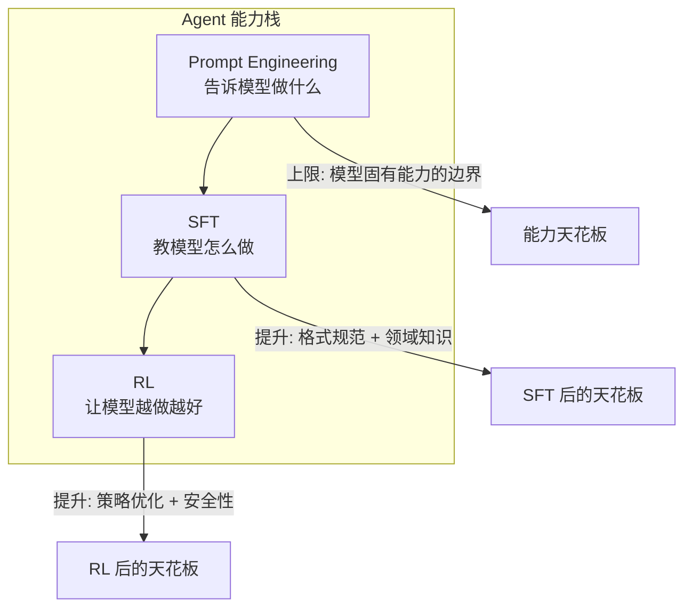
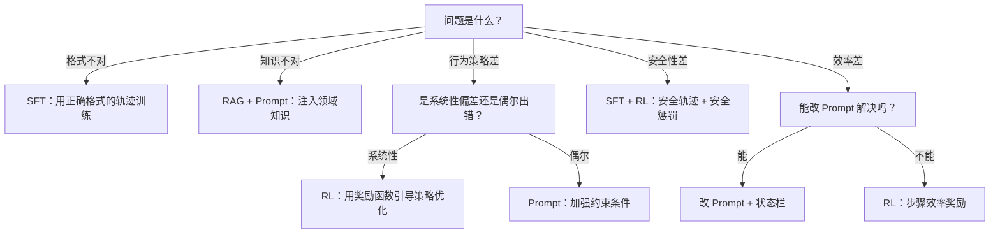

> 造一个好 Agent 系列（十六）：Prompt Engineering 有上限——再好的提示词也弥补不了模型在 Agent 任务上的结构性缺陷。这时候需要训练。但 Agent 训练和对话模型训练不同：不是「给问答对」，而是「给轨迹」；不是「下一个 token 预测」，而是「多步决策优化」。从 SFT 轨迹数据构建、RL 奖励函数设计、PPO 训练工程到常见陷阱，Agent 训练的工程全景。

## 一、为什么 Prompt 不够用

Prompt Engineering 解决了「告诉模型做什么」的问题。但以下场景，Prompt 的改善空间已经很有限：

| 场景 | Prompt 的局限 | 训练的优势 |
|------|-------------|-----------|
| 工具调用格式 | 模型偶尔编造不存在的工具名 | SFT 用真实轨迹教模型只调用注册的工具 |
| 多步推理一致性 | 长循环中模型容易偏离目标 | RL 用任务完成率奖励强化正确行为 |
| 领域知识 | 模型不知道企业内部的业务规则 | SFT 注入领域专家标注的轨迹 |
| 安全性 | 模型偶尔泄露凭证或越权 | RL 用安全惩罚抑制危险行为 |
| 效率 | 模型用 10 步完成 3 步就能完成的任务 | RL 用步骤效率奖励压缩冗余操作 |

> 训练不是替代 Prompt，是在 Prompt 的天花板上再开一层。好的训练数据来自好的 Prompt 工程——先把手工调优做到极致，再用训练固化最优策略。



## 二、SFT 数据构建：从轨迹到训练样本

### 2.1 轨迹数据是什么

对话模型的 SFT 数据是「输入→输出」对。Agent 的 SFT 数据是**完整轨迹**——包含多轮推理、工具调用、工具返回的序列。

```
用户: 帮我查一下上海明天的天气，如果下雨提醒我带伞

Assistant: 我需要查询上海的天气预报。
→ tool_call: get_forecast(city="上海", days=1)

Tool: {"city": "上海", "date": "2026-09-26", "condition": "小雨", "temp": "22-26°C"}

Assistant: 上海明天（9月26日）有小雨，气温22-26°C。记得带伞出门。
```

一条轨迹包含多个回合，每个回合有模型的思考（thought）、工具调用（action）、工具返回（observation）。

### 2.2 轨迹数据构建 Pipeline

```python
"""
轨迹数据构建 Pipeline：从 Agent 运行日志中提取高质量轨迹。
不是所有轨迹都值得训练——只保留任务完成、步骤高效、无错误的轨迹。
"""
from dataclasses import dataclass, field
from typing import Literal


@dataclass
class TrajectoryStep:
    """轨迹中的一步"""
    thought: str            # 模型的推理过程
    tool_call: dict | None  # 工具调用（名称 + 参数）
    tool_result: str | None # 工具返回
    assistant_reply: str | None  # 最终回复（最后一步）


@dataclass
class Trajectory:
    """一条完整的 Agent 轨迹"""
    user_input: str
    steps: list[TrajectoryStep]
    task_completed: bool
    total_steps: int
    optimal_steps: int | None  # 专家标注的最优步数
    source: str  # "production" / "expert_annotation" / "synthetic"


class TrajectoryCollector:
    """
    轨迹收集器：从 Agent 运行日志中筛选高质量轨迹。
    筛选标准：
    1. 任务完成（task_completed = True）
    2. 步骤数不超过最优步数的 2 倍
    3. 无工具调用错误
    4. 无安全告警
    """

    def __init__(self, max_steps_ratio: float = 2.0):
        self.max_steps_ratio = max_steps_ratio

    def should_include(self, trace: dict) -> bool:
        if not trace.get("task_completed"):
            return False
        if trace.get("has_errors"):
            return False
        if trace.get("security_alerts"):
            return False
        if trace.get("total_steps", 0) > trace.get("optimal_steps", 10) * self.max_steps_ratio:
            return False
        return True

    def to_training_format(self, trace: dict) -> dict:
        """将轨迹转为 SFT 训练格式"""
        messages = [
            {"role": "system", "content": trace["system_prompt"]},
            {"role": "user", "content": trace["user_input"]},
        ]
        for step in trace["steps"]:
            if step["thought"]:
                messages.append({"role": "assistant", "content": step["thought"]})
            if step["tool_call"]:
                messages.append({"role": "assistant", "tool_calls": [step["tool_call"]]})
            if step["tool_result"]:
                messages.append({"role": "tool", "content": step["tool_result"]})
        if trace["final_reply"]:
            messages.append({"role": "assistant", "content": trace["final_reply"]})
        return {"messages": messages, "source": trace.get("source", "production")}
```

### 2.3 数据质量控制

```python
"""
数据质量三层过滤：
1. 自动过滤：任务完成 + 无错误 + 无安全告警
2. 去重：相似轨迹只保留质量最高的
3. 多样性：按任务类型、工具组合、复杂度分层采样
"""
class TrajectoryDataset:

    def __init__(self, collector: TrajectoryCollector):
        self.collector = collector
        self.trajectories: list[dict] = []

    def add_traces(self, traces: list[dict]):
        for trace in traces:
            if self.collector.should_include(trace):
                self.trajectories.append(
                    self.collector.to_training_format(trace))

    def deduplicate(self, similarity_threshold: float = 0.95):
        """基于输入相似度的去重：相似输入只保留步骤最少的轨迹"""
        from collections import defaultdict
        buckets = defaultdict(list)
        for t in self.trajectories:
            key = t["messages"][1]["content"][:50]  # 简单哈希
            buckets[key].append(t)
        self.trajectories = [
            min(group, key=lambda x: len(x["messages"]))
            for group in buckets.values()
        ]

    def balance(self, target_per_category: int = 100):
        """按任务类型分层采样，确保数据集多样性"""
        by_category = {}
        for t in self.trajectories:
            cat = self._classify(t)
            by_category.setdefault(cat, []).append(t)
        balanced = []
        for cat, items in by_category.items():
            balanced.extend(items[:target_per_category])
        self.trajectories = balanced

    def _classify(self, trajectory: dict) -> str:
        """简单分类：基于工具调用类型"""
        tools = set()
        for msg in trajectory["messages"]:
            if "tool_calls" in msg:
                tools.add(msg["tool_calls"][0].get("name", "unknown"))
        return "-".join(sorted(tools))

    def save(self, path: str):
        import json
        with open(path, "w") as f:
            json.dump(self.trajectories, f, ensure_ascii=False, indent=2)
        print(f"保存 {len(self.trajectories)} 条轨迹到 {path}")
```

## 三、SFT 训练：让模型学会 Agent 行为模式

### 3.1 训练目标

SFT 的目标不是让模型「更聪明」——是让它**学会正确的行为模式**：

```python
"""
Agent SFT 的核心训练目标：
1. 工具调用格式正确（不编造工具名、参数类型正确）
2. 推理链清晰（先思考再行动）
3. 终止时机正确（该停就停，不无限循环）
4. 领域知识准确（业务规则、数据格式）

Loss 计算与普通 SFT 相同（下一个 token 预测），
但数据质量决定了模型学到的行为模式。
"""
```

### 3.2 训练配置要点

| 超参数 | 推荐值 | 原因 |
|--------|--------|------|
| 学习率 | 1e-5 ~ 5e-6 | Agent 轨迹数据量大，需要小学习率防止灾难性遗忘 |
| Epoch | 2~3 | 多了过拟合，少了学不会 |
| Batch Size | 按显存最大化 | Agent 轨迹长，有效 batch 需要梯度累积 |
| Max Length | 4096~8192 | 轨迹通常比单轮对话长 |
| LoRA Rank | 16~64 | 全量训练成本高，LoRA 性价比高 |

```python
"""
LoRA 微调配置：在注意力层和 FFN 层注入低秩适配器。
只训练适配器参数（约 1-5% 的总参数），冻结基座模型。
"""
from transformers import AutoModelForCausalLM, AutoTokenizer
from peft import LoraConfig, get_peft_model

model = AutoModelForCausalLM.from_pretrained("base-model")
tokenizer = AutoTokenizer.from_pretrained("base-model")

lora_config = LoraConfig(
    r=32,                          # LoRA 秩
    lora_alpha=64,                 # 缩放因子
    target_modules=["q_proj", "v_proj", "gate_proj", "up_proj", "down_proj"],
    lora_dropout=0.05,
    bias="none",
    task_type="CAUSAL_LM",
)

model = get_peft_model(model, lora_config)
model.print_trainable_parameters()
# trainable params: 45,088,768 || all params: 72,438,210,560 || trainable%: 0.062
```

## 四、RL 奖励设计：指挥棒决定行为

SFT 教模型「怎么做」，RL 让模型「越做越好」。但 RL 的效果完全取决于奖励函数的设计。

### 4.1 多维度奖励函数

```python
"""
Agent RL 的奖励函数必须覆盖多个维度。
单一奖励（如任务完成率）会导致模型走捷径——
为了完成任务不惜调用危险工具或浪费大量 Token。
"""
from dataclasses import dataclass


@dataclass
class RewardComponents:
    """多维度奖励分量"""
    task_completion: float   # 任务是否完成 (0 or 1)
    step_efficiency: float   # 步骤效率 (最优步数 / 实际步数)
    tool_accuracy: float     # 工具调用准确率 (0~1)
    safety_score: float      # 安全评分 (0~1，有安全事件则低分)
    format_correctness: float  # 输出格式正确性 (0~1)
    hallucination_penalty: float  # 幻觉惩罚 (负值)


class AgentRewardFunction:
    """
    Agent 奖励函数：多维度加权融合。
    权重需要反复调优——不同任务类型的最优权重不同。
    """

    def __init__(
        self,
        w_completion: float = 0.40,
        w_efficiency: float = 0.15,
        w_tool: float = 0.15,
        w_safety: float = 0.15,
        w_format: float = 0.10,
        w_hallucination: float = 0.05,
    ):
        self.weights = {
            "completion": w_completion,
            "efficiency": w_efficiency,
            "tool": w_tool,
            "safety": w_safety,
            "format": w_format,
            "hallucination": w_hallucination,
        }

    def compute(self, trace: dict) -> float:
        components = self._extract_components(trace)
        total = 0.0
        for key, weight in self.weights.items():
            value = getattr(components, key)
            total += weight * value
        return max(-1.0, min(1.0, total))  # 裁剪到 [-1, 1]

    def _extract_components(self, trace: dict) -> RewardComponents:
        return RewardComponents(
            task_completion=1.0 if trace.get("completed") else 0.0,
            step_efficiency=min(1.0, trace.get("optimal_steps", 1) / max(trace.get("total_steps", 1), 1)),
            tool_accuracy=trace.get("tool_accuracy", 1.0),
            safety_score=trace.get("safety_score", 1.0),
            format_correctness=trace.get("format_correct", 1.0),
            hallucination_penalty=-trace.get("hallucination_count", 0) * 0.2,
        )
```

### 4.2 奖励破解与防范

RL 训练中最常见的问题是**奖励破解（Reward Hacking）**——模型找到了绕过奖励函数获取高分的捷径，而不是真正学会任务。

| 破解方式 | 表现 | 防范措施 |
|---------|------|---------|
| 循环刷步 | 反复调用同一工具刷 step_efficiency | 检测重复调用，给予负奖励 |
| 安全绕过 | 绕过安全守卫获取高 task_completion | safety_score 作为硬约束而非加权项 |
| 格式作弊 | 输出格式正确但内容空洞 | 加入内容质量评估（LLM-as-Judge） |
| 过度保守 | 什么都不做以避免犯错 | 给「无作为」也施加惩罚 |

```python
"""
防范奖励破解：在奖励函数中加入反作弊检测。
"""
def detect_reward_hacking(trace: dict) -> float:
    """
    检测常见的奖励破解行为，返回惩罚分数（负值）。
    """
    penalty = 0.0
    steps = trace.get("steps", [])

    # 1. 重复工具调用检测
    tool_calls = [s.get("tool_name") for s in steps if s.get("tool_call")]
    from collections import Counter
    counts = Counter(tool_calls)
    for tool, count in counts.items():
        if count >= 3:
            penalty -= 0.1 * (count - 2)  # 第三次起每次扣 0.1

    # 2. 空操作检测（模型什么都没做）
    if len(steps) == 0 and not trace.get("completed"):
        penalty -= 0.5

    # 3. 安全绕过检测（有安全事件但任务完成了）
    if trace.get("completed") and trace.get("security_bypass"):
        penalty -= 1.0  # 硬惩罚

    return penalty
```

## 五、PPO 训练工程

### 5.1 训练流程

```python
"""
PPO 训练流程：
1. 用当前策略模型生成轨迹（Rollout）
2. 用奖励函数评估轨迹质量
3. 用 PPO 算法更新策略模型
4. 重复 1→2→3

关键工程点：
- Rollout 需要大量并行（几千条轨迹/轮）
- 奖励计算需要工具执行环境（不能离线算）
- 需要 KL 散度约束防止策略偏离参考模型太远
"""
from trl import PPOTrainer, PPOConfig
from transformers import AutoTokenizer

# 1. 初始化
ppo_config = PPOConfig(
    model_name="sft-model",
    learning_rate=1e-6,
    batch_size=4,
    mini_batch_size=1,
    gradient_accumulation_steps=4,
    kl_penalty="kl",          # KL 散度惩罚系数
    cliprange=0.2,            # PPO 裁剪范围
)

tokenizer = AutoTokenizer.from_pretrained("sft-model")
trainer = PPOTrainer(ppo_config)

# 2. Rollout + 训练循环
for epoch in range(num_epochs):
    for batch in dataloader:
        # 生成轨迹
        queries = batch["input"]
        responses = trainer.generate(queries)

        # 计算奖励
        rewards = []
        for query, response in zip(queries, responses):
            trace = execute_and_collect(query, response)
            r = reward_function.compute(trace)
            r += detect_reward_hacking(trace)
            rewards.append(torch.tensor(r))

        # PPO 更新
        stats = trainer.step(queries, responses, rewards)
```

### 5.2 训练监控

```python
"""
PPO 训练需要监控的关键指标：
1. 平均奖励：应该稳步上升，震荡过大说明学习率太高
2. KL 散度：偏离参考模型太远会导致模式崩溃
3. 奖励分量分布：看哪个维度在拖后腿
4. 轨迹长度：突然变短可能是模型学会了走捷径
5. 安全事件率：不应该随训练上升
"""
class PPOTrainingMonitor:

    def __init__(self):
        self.history = []

    def log_step(self, step: int, stats: dict, rewards: list[float]):
        record = {
            "step": step,
            "mean_reward": sum(rewards) / len(rewards),
            "std_reward": (sum((r - sum(rewards)/len(rewards))**2 for r in rewards) / len(rewards)) ** 0.5,
            "kl_divergence": stats.get("objective/kl", 0),
            "clip_fraction": stats.get("objective/clip_fraction", 0),
            "policy_loss": stats.get("objective/policy_loss", 0),
            "value_loss": stats.get("objective/value_loss", 0),
        }
        self.history.append(record)

        # 告警
        if record["kl_divergence"] > 0.5:
            print(f"[WARN] Step {step}: KL 散度过高 ({record['kl_divergence']:.3f})，策略偏离过大")
        if record["mean_reward"] < -0.5:
            print(f"[WARN] Step {step}: 平均奖励过低 ({record['mean_reward']:.3f})")

    def should_stop_early(self) -> bool:
        """早停：连续 N 轮奖励不再提升"""
        if len(self.history) < 10:
            return False
        recent = self.history[-10:]
        improvement = recent[-1]["mean_reward"] - recent[0]["mean_reward"]
        return improvement < 0.01  # 10 轮提升不到 0.01
```

## 六、训练 vs Prompt：什么时候该训练

不是所有问题都需要训练。先问自己几个问题：



| 问题类型 | 首选方案 | 训练成本 | 见效速度 |
|---------|---------|---------|---------|
| 工具调用格式错误 | SFT | 中 | 1-2 轮 |
| 领域知识缺失 | RAG + Prompt | 低 | 即时 |
| 策略次优 | RL | 高 | 10-50 轮 |
| 安全隐患 | SFT + RL | 高 | 多轮 |
| 偶尔偏离 | Prompt 强化 | 无 | 即时 |

## 七、行业实践：Agent 训练的设计共识

| 设计点 | 共识做法 | 反面模式 |
|--------|---------|---------|
| 数据来源 | 生产轨迹筛选 + 专家标注 + 合成数据 | 只用合成数据 |
| 质量筛选 | 任务完成 + 无错误 + 无安全告警 + 步骤高效 | 全量导入 |
| 去重策略 | 相似输入只保留最优轨迹 | 不去重 |
| 多样性 | 按任务类型/工具组合分层采样 | 随机采样 |
| 奖励函数 | 多维度加权 + 反作弊检测 | 单一奖励 |
| KL 约束 | 限制策略偏离参考模型的距离 | 无约束 |
| 训练监控 | 奖励/KL/安全事件率/轨迹长度 | 只看平均奖励 |
| 训练决策 | 先 Prompt → 再 SFT → 最后 RL | 一上来就训练 |

## 结语

训练是 Agent 工程的最后一块拼图。

> Prompt 定义行为边界，SFT 固化行为模式，RL 优化行为策略。三者不是替代关系——是叠加关系。好的 Agent 不是训出来的，是工程体系长出来的：Prompt 工程打底，SFT 数据固化最优实践，RL 奖励持续进化。

训练的成本很高，但收益也很大。一个经过良好训练的 Agent，可以在更低的 Prompt 工程成本下达到更高的性能天花板——因为它已经把最优策略内化到了权重里。

---

> ** 闭环视角**
>
> 本篇覆盖 Agent 闭环的**进化引擎**——SFT 和 RL 把闭环运行中产生的轨迹数据变成训练信号，让 Agent 的策略持续进化。训练数据的来源就是闭环本身：生产环境的每一次运行、每一次反馈、每一次修复，都在为下一版本的模型积累信号。
