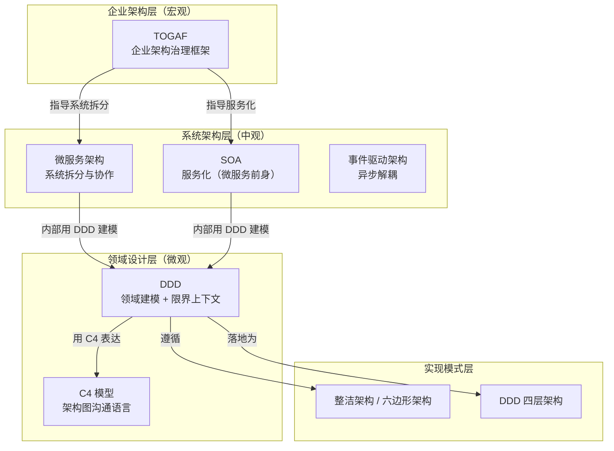

> 架构师的工具箱里不只有 DDD。DDD 解决领域建模，TOGAF 解决企业架构治理，微服务解决系统拆分，C4 解决沟通表达——它们不是互相替代的，是在不同层面解决不同问题。混乱的根源往往是拿错了工具：用 DDD 做企业架构规划，或者用 TOGAF 做单系统设计。理解每种方法论的战场和边界，才能组合使用。

## 一、架构方法论的层次地图



**关键认知**：这不是一个「选哪个」的问题——是**每一层选一个，组合使用**。

## 二、TOGAF：企业架构的治理框架

### 2.1 TOGAF 解决什么问题

TOGAF（The Open Group Architecture Framework）不是技术框架——是**企业架构治理的方法论**。它回答的是：

- 企业的业务能力是什么？
- 业务能力和 IT 系统怎么对齐？
- 新系统上线怎么不影响现有系统？
- 技术选型怎么和企业战略对齐？

### 2.2 ADM 循环（核心）

```
TOGAF 的核心是 ADM（Architecture Development Method）循环：

A. 架构愿景 → 为什么要做这个架构变更？
B. 业务架构 → 业务能力、业务流程、组织结构
C. 信息系统架构 → 数据架构 + 应用架构
D. 技术架构 → 技术选型、基础设施
E. 机会与解决方案 → 实施路线图
F. 迁移规划 → 分阶段迁移计划
G. 实施治理 → 确保实施不偏离架构
H. 架构变更管理 → 持续演进

每一轮 ADM 产出：架构定义文档 + 架构需求规格 + 差距分析
```

### 2.3 TOGAF 在什么场景有用

| 场景 | TOGAF 的价值 |
|------|-------------|
| 大型企业 IT 转型 | 提供标准化的治理流程，确保各部门对齐 |
| 并购后的系统整合 | 用业务能力地图找到重叠和缺口 |
| 云迁移规划 | 技术架构层评估现有系统 → 目标架构 |
| 中小团队日常开发 | ❌ 过度工程，直接用 DDD + 微服务 |

**架构师的判断**：TOGAF 的价值在「治理」不在「设计」。如果你是在设计一个系统——用 DDD。如果你是在规划一个企业的 IT 演进路线——用 TOGAF。

## 三、SOA vs 微服务：不是新旧替代

### 3.1 本质区别

| 维度 | SOA | 微服务 |
|------|-----|--------|
| **服务粒度** | 粗粒度（企业级服务） | 细粒度（业务能力单元） |
| **通信协议** | SOAP/WS-*（重量级） | REST/gRPC/消息队列（轻量级） |
| **数据存储** | 共享数据库 | 每个服务独立数据库 |
| **治理方式** | 中心化 ESB（企业服务总线） | 去中心化（智能端点 + 哑管道） |
| **部署方式** | 单体部署或集群部署 | 独立部署、独立扩缩容 |
| **适用规模** | 大型企业、系统整合 | 互联网、快速迭代 |

### 3.2 核心哲学差异

```
SOA 的哲学：「服务是企业的资产，要统一治理」
  → ESB 做协议转换、消息路由、安全认证
  → 服务注册中心统一管理
  → 问题：ESB 成为瓶颈和单点

微服务的哲学：「服务是团队的边界，要自治」
  → 每个团队拥有自己的服务（Conway 定律）
  → 服务间直接通信（不用 ESB）
  → 每个服务独立数据库（数据自治）
  → 问题：分布式复杂度、数据一致性
```

**架构师的判断**：SOA 没有死——它在大型企业系统整合场景（如银行核心系统）仍然是正确选择。微服务不是 SOA 的替代品——是 SOA 在互联网场景下的演进。如果一个系统不需要独立部署和独立扩缩容，用模块化单体比微服务更合适。

## 四、DDD：领域建模的核心方法

### 4.1 DDD 解决什么问题

DDD（Domain-Driven Design）回答的是：**怎么把复杂的业务逻辑建模成可维护的代码结构**。

```
问题：业务逻辑散落在 Service 层，变成「大泥球」
DDD 的解法：
  1. 战略设计：识别限界上下文 → 确定系统边界
  2. 战术设计：实体 + 值对象 + 聚合根 + 领域服务 → 代码结构

结果：代码结构和业务结构一致 → 改业务改代码，不改业务不改代码
```

### 4.2 战略设计：限界上下文

```
限界上下文（Bounded Context）= 一个明确的业务边界
  在这个边界内，术语有明确含义
  跨边界，同一个术语可能有不同含义

示例：
  「订单」在交易上下文中 = {id, items, amount, status}
  「订单」在物流上下文中 = {id, address, trackingNo, deliveryStatus}
  「订单」在财务上下文中 = {id, amount, invoiceNo, paymentStatus}

  三个上下文各自建模，通过防腐层（ACL）或事件通信
```

### 4.3 战术设计：核心概念

| 概念 | 定义 | 示例 |
|------|------|------|
| **实体** | 有唯一标识，关注生命周期 | User(id)、Order(orderNo) |
| **值对象** | 无标识，关注属性值，不可变 | Money(amount, currency)、Address(city, street) |
| **聚合根** | 一组相关对象的根入口，外部只能通过聚合根访问内部 | Order（包含 OrderLine，外部不能直接改 OrderLine） |
| **领域服务** | 不属于任何实体的业务逻辑 | OrderPricingService（计算优惠） |
| **仓储** | 持久化接口，领域层不关心实现 | OrderRepository |
| **领域事件** | 领域中发生的重要事情 | OrderCreated、PaymentReceived |

### 4.4 DDD 不是什么

| DDD 不是 | 说明 |
|---------|------|
| 不是数据库设计方法 | DDD 建模从业务出发，不是从表结构出发 |
| 不是微服务拆分方法 | DDD 的限界上下文可以作为微服务边界的参考，但不是唯一依据 |
| 不是架构风格 | DDD 可以和整洁架构、六边形架构、四层架构组合使用 |
| 不是银弹 | 简单 CRUD 系统用 DDD 是过度工程 |

## 五、C4 模型：架构图的沟通语言

### 5.1 为什么需要 C4

```
传统架构图的问题：
  - 一张图里既有系统又有容器又有组件 → 信息过载
  - 不同干系人看同一张图 → 理解不同
  - 没有统一的图例 → 每个人画的都不一样

C4 的解法：四层抽象，每层给不同的受众看
```

### 5.2 四层模型

```
Level 1: System Context（系统上下文）
  → 受众：非技术人员、高管
  → 内容：系统 + 外部依赖（用户、第三方系统）
  → 不展示技术细节

Level 2: Container（容器）
  → 受众：架构师、技术负责人
  → 内容：Web App、Mobile App、API、Database、Message Queue
  → 展示技术选型

Level 3: Component（组件）
  → 受众：开发人员
  → 内容：Controller、Service、Repository
  → 展示模块划分

Level 4: Code（代码）
  → 受众：开发者（通常不需要，IDE 就够了）
```

### 5.3 用 C4 表达 DDD

```
Level 2（容器）展示限界上下文之间的关系：
  [交易服务] --事件--> [物流服务]
  [交易服务] --命令--> [支付服务]
  [物流服务] --> [物流数据库]

Level 3（组件）展示聚合根和领域服务：
  [交易服务] 内部：
    OrderController → OrderApplicationService → Order(聚合根)
                                              → OrderPricingService(领域服务)
                                              → OrderRepository(仓储)
```

## 六、整洁架构与六边形架构

### 6.1 核心思想

```
依赖规则：内层不依赖外层

  外层：框架、数据库、UI、外部 API
  中层：应用服务（用例编排）
  内层：领域模型（实体、值对象、领域服务）

依赖方向：外层 → 中层 → 内层
          内层 ← 中层 ← 外层（通过接口反转）
```

### 6.2 与 DDD 的关系

| 架构风格 | 关注点 | 与 DDD 的关系 |
|---------|--------|-------------|
| **整洁架构** | 依赖方向（内层不依赖外层） | DDD 的领域层 = 内层 |
| **六边形架构** | 端口与适配器（Port & Adapter） | DDD 的仓储接口 = 端口 |
| **四层架构** | 模块职责分层 | DDD 的战术设计 = Domain 层 |

**它们不冲突**——整洁架构定义依赖方向，六边形架构定义接口边界，四层架构定义模块职责，DDD 定义领域建模。四个组合使用。

## 七、方法论组合实战

### 7.1 一个电商系统的架构设计

```
Step 1: TOGAF ADM（企业层）
  → 业务能力地图：交易、物流、支付、用户、商品
  → 确定 IT 战略：云原生、微服务化

Step 2: DDD 战略设计（领域层）
  → 限界上下文：交易 BC、物流 BC、支付 BC、用户 BC、商品 BC
  → 上下文映射：交易 BC → 防腐层 → 物流 BC

Step 3: 微服务拆分（系统层）
  → 每个限界上下文 = 一个微服务（不绝对，按团队规模和部署需求调整）
  → 服务间通信：同步（gRPC）+ 异步（事件）

Step 4: 整洁架构 + DDD 战术设计（实现层）
  → 每个微服务内部：Controller → Application → Domain → Infrastructure
  → Domain 层：聚合根 + 实体 + 值对象 + 领域服务

Step 5: C4 模型（沟通层）
  → Level 1：给高管看——电商系统 + 支付网关 + 物流系统
  → Level 2：给架构师看——交易服务、物流服务、支付服务 + 数据库
  → Level 3：给开发看——每个服务内部的模块划分
```

### 7.2 常见反模式

| 反模式 | 表现 | 正确做法 |
|--------|------|---------|
| **DDD 万能论** | 所有系统都用 DDD | CRUD 系统用三层架构就够了 |
| **微服务万能论** | 所有系统都拆微服务 | 小团队用模块化单体 |
| **TOGAF 落地难** | 文档写了 100 页没人看 | 只取 ADM 的业务架构 + 技术架构两层 |
| **C4 过度细化** | Level 4 画到代码行 | Level 3 足够，Level 4 用 IDE |
| **架构与方法论脱节** | 架构图画的和代码结构不一致 | 用 C4 Level 3 和代码模块对齐 |

## 结语

架构方法论不是「学哪个」——是**在哪个层面用哪个**。

> TOGAF 治理企业，DDD 建模领域，微服务拆分系统，C4 表达设计，整洁架构守护边界。五个方法论在五个层面各司其职，组合使用才能覆盖从企业战略到代码实现的全链路。

架构师的价值不是精通某一个方法论——是在正确的问题面前，从工具箱里拿出正确的工具。
