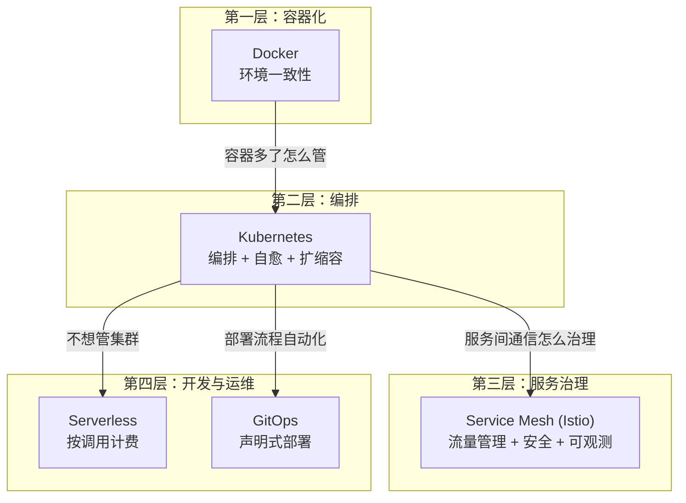
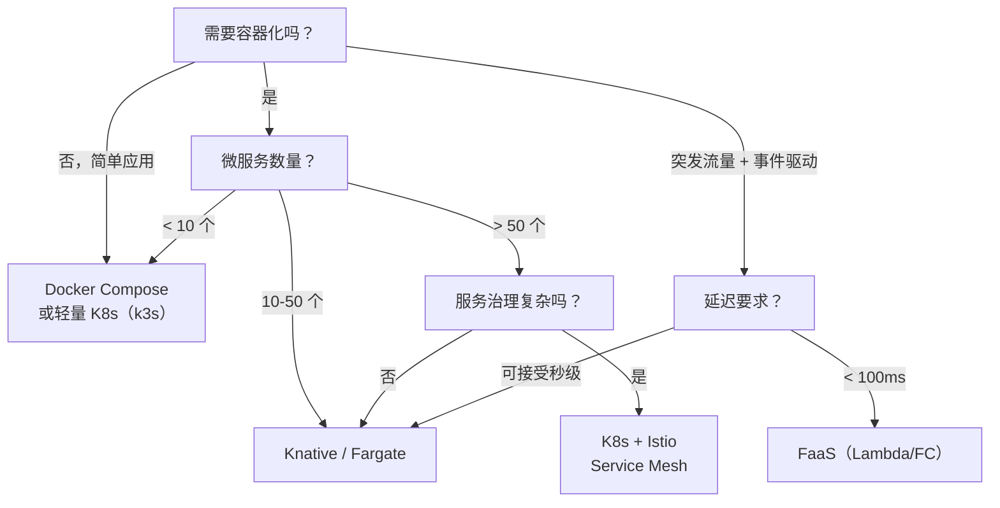

> 云原生不是「把应用装进 Docker 容器丢到 K8s 上」——是一套从开发到部署到运维的完整范式转变。容器化解决环境一致性，K8s 解决编排和自愈，Service Mesh 解决服务间通信治理，Serverless 解决资源利用率，GitOps 解决部署流程。每一层都解决上一层暴露的问题。

## 一、云原生的四层演进



## 二、K8s 核心概念

### 2.1 最小调度单元：Pod

```yaml
# Pod = 一个或多个容器的集合（共享网络 + 存储）
# 为什么不是直接调度容器？
#   → 紧密协作的容器需要共享 localhost 网络（如 App + Sidecar）
#   → 共享 Volume 数据
apiVersion: v1
kind: Pod
metadata:
  name: my-app
spec:
  containers:
    - name: app
      image: my-app:1.0
      ports:
        - containerPort: 8080
    - name: sidecar        # Sidecar 模式：日志收集
      image: fluentd:latest
      volumeMounts:
        - name: logs
          mountPath: /var/log
  volumes:
    - name: logs
      emptyDir: {}
```

### 2.2 部署管理：Deployment

```yaml
apiVersion: apps/v1
kind: Deployment
metadata:
  name: my-app
spec:
  replicas: 3              # 期望副本数
  strategy:
    type: RollingUpdate    # 滚动更新
    rollingUpdate:
      maxSurge: 1          # 更新时最多超出 1 个
      maxUnavailable: 0    # 更新时不允许不可用
  selector:
    matchLabels:
      app: my-app
  template:
    metadata:
      labels:
        app: my-app
    spec:
      containers:
        - name: app
          image: my-app:2.0   # 改版本号 → 自动滚动更新
          resources:
            requests:          # 调度依据
              memory: "256Mi"
              cpu: "250m"
            limits:            # 限制上限
              memory: "512Mi"
              cpu: "500m"
```

**关键概念**：`requests` 决定 Pod 被调度到哪个节点（节点要有足够资源），`limits` 决定 Pod 最多能用多少（超过会被 OOM Killed 或 CPU 节流）。

### 2.3 服务发现：Service

```yaml
apiVersion: v1
kind: Service
metadata:
  name: my-app-service
spec:
  selector:
    app: my-app            # 关联到 Pod 的 label
  ports:
    - port: 80             # Service 暴露的端口
      targetPort: 8080     # 转发到 Pod 的端口
  type: ClusterIP          # 集群内访问（默认）
                           # NodePort: 节点端口暴露
                           # LoadBalancer: 云厂商负载均衡
                           # ExternalName: DNS 别名

# 访问方式：
# 集群内：curl http://my-app-service.default.svc.cluster.local:80
# K8s 自动维护 DNS 和 Endpoints（Pod IP 变化时自动更新）
```

### 2.4 自动扩缩容：HPA

```yaml
apiVersion: autoscaling/v2
kind: HorizontalPodAutoscaler
metadata:
  name: my-app-hpa
spec:
  scaleTargetRef:
    apiVersion: apps/v1
    kind: Deployment
    name: my-app
  minReplicas: 3
  maxReplicas: 30
  metrics:
    - type: Resource
      resource:
        name: cpu
        target:
          type: Utilization
          averageUtilization: 70    # CPU 超过 70% 就扩容
    - type: Resource
      resource:
        name: memory
        target:
          type: Utilization
          averageUtilization: 80
```

**扩缩容延迟**：扩容 ~1 分钟（新 Pod 启动），缩容 ~5 分钟（默认冷却期，防止抖动）。对于秒级弹性需求 → K8s 不够快 → 考虑 Serverless。

## 三、Service Mesh：Istio

### 3.1 解决什么问题

```
没有 Service Mesh：
  每个服务自己实现：负载均衡、熔断、限流、mTLS、可观测性
  → 代码侵入、每个语言都要实现一套

有了 Service Mesh：
  Sidecar 代理（Envoy）注入到每个 Pod
  → 服务间流量经过 Sidecar
  → 负载均衡/熔断/限流/mTLS/链路追踪 全部在 Sidecar 层处理
  → 业务代码零侵入
```

### 3.2 流量管理

```yaml
# 金丝雀发布：10% 流量走 v2，90% 走 v1
apiVersion: networking.istio.io/v1beta1
kind: VirtualService
metadata:
  name: my-app-vs
spec:
  hosts:
    - my-app-service
  http:
    - route:
        - destination:
            host: my-app-service
            subset: v1
          weight: 90
        - destination:
            host: my-app-service
            subset: v2
          weight: 10
```

### 3.3 Service Mesh 的代价

| 优势 | 代价 |
|------|------|
| 零侵入的服务治理 | 每个 Pod 多一个 Sidecar → 资源占用增加 10-20% |
| 统一的 mTLS | 延迟增加 ~1-2ms（多一跳代理） |
| 细粒度流量控制 | 运维复杂度增加（Istio 本身就很复杂） |
| 统一可观测性 | 学习曲线陡 |

**架构师的判断**：微服务数量 < 20 → 不需要 Service Mesh，用 SDK 就够了。微服务数量 > 50 → Service Mesh 的价值开始显现。

## 四、Serverless

### 4.1 两种形态

| 形态 | 代表 | 特点 |
|------|------|------|
| **FaaS** | AWS Lambda / 阿里云 FC | 函数级，按调用次数 + 执行时间计费 |
| **容器 Serverless** | AWS Fargate / K8s Knative | 容器级，不需要管节点 |

### 4.2 Serverless vs K8s

| 维度 | K8s | Serverless |
|------|-----|-----------|
| **启动速度** | 秒级（冷启动 ~10s） | 毫秒~秒级（FaaS 冷启动 ~100ms-1s） |
| **资源粒度** | Pod 级（最少 0.1 CPU） | 函数级（按需分配） |
| **计费方式** | 按节点包月 | 按调用次数 + 执行时间 |
| **运维负担** | 管集群 | 不管集群 |
| **适用场景** | 常驻服务、长连接 | 事件驱动、突发流量、定时任务 |
| **不适用** | — | 长连接（WebSocket）、GPU 计算 |

### 4.3 成本对比示例

```
场景：每天处理 100 万次 HTTP 请求，每次 200ms

K8s（3 节点，2C4G）：
  3 × $100/月 = $300/月（不管用不用都付）

Serverless（AWS Lambda）：
  100 万次 × 200ms = 200,000 GB-s
  100 万次请求 + 200,000 GB-s ≈ $3/月

结论：低负载场景 Serverless 成本是 K8s 的 1%。
      高负载场景（常驻高 QPS）K8s 更便宜。
```

## 五、GitOps

### 5.1 核心理念

```
传统部署：CI/CD Pipeline → kubectl apply → 集群
GitOps：  CI/CD Pipeline → Push 到 Git → ArgoCD 同步到集群

区别：Git 是唯一的事实来源（Source of Truth）
  → 集群状态 = Git 中声明的状态
  → 人工改集群 → ArgoCD 检测偏差 → 自动回滚到 Git 声明的状态
  → 回滚 = git revert + push
```

### 5.2 ArgoCD 工作流

```
1. 开发者 Push 新 manifest 到 Git
2. ArgoCD 检测 Git 变化（每 3 分钟或 Webhook 触发）
3. ArgoCD 对比 Git 声明 vs 集群实际状态
4. 有差异 → 自动同步（或人工审批后同步）
5. 同步失败 → 自动回滚

优势：
  - 部署可审计（Git 历史就是部署历史）
  - 回滚极简（git revert）
  - 多集群管理（一个 Git repo 管理多个集群）
```

## 六、云原生选型决策



## 结语

云原生不是目的地——是手段。

> 容器化解决环境一致性问题，K8s 解决编排和自愈，Service Mesh 解决服务间治理，Serverless 解决资源利用率，GitOps 解决部署流程。每一层都在解决上一层暴露的问题。

架构师的任务不是追新技术——是在正确的规模下选择正确的工具。3 个微服务用 K8s 是过度工程，300 个微服务不用 K8s 是自找麻烦。
