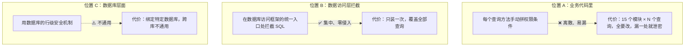
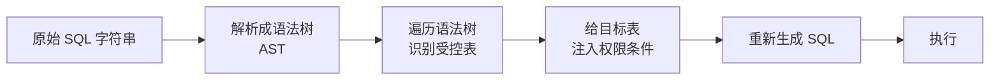
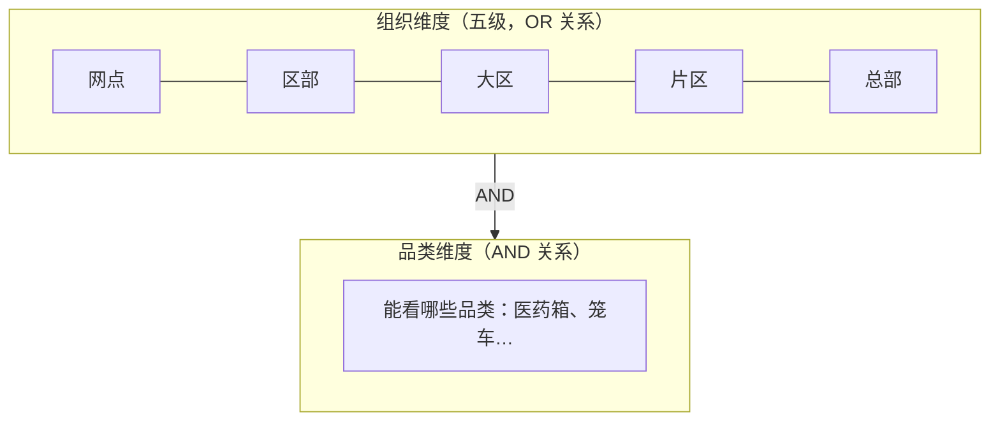
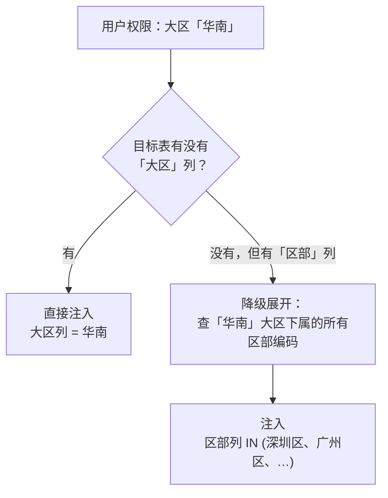
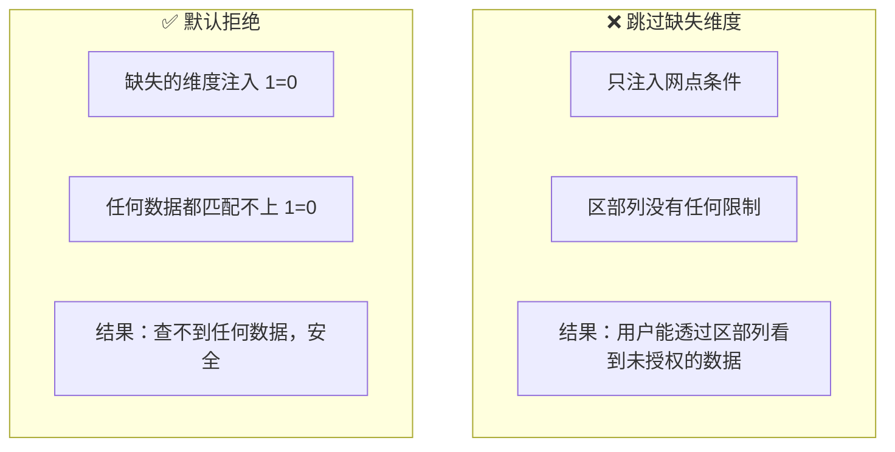

> 数据权限是横切在 15 个模块上的同一道伤疤：每个模块都要实现一遍"谁能看什么数据"，漏一处就是一次泄露。这篇记录的是，如何用一条数据库访问层的拦截链，把权限无声地缝进每一行 SQL——业务代码一个字符都不用改。

---

## 一、横切关注点的困境：权限无处不在，却绝不能被业务感知

先抛出一个反直觉的结论：**数据权限，是业务代码最不应该关心的事。**

一个业务开发写"查询循环容器"的代码时，脑子里想的是"我要查这个容器的状态"，而不是"这个操作人有没有权限看这个容器"。如果每写一个查询，都要手动拼一段"AND 操作人所在网点 = 数据所属网点"，那么：

- **每个模块都要重新实现一遍**——15 个业务模块，就是 15 套大同小异的权限拼接逻辑；
- **漏一处就是事故**——权限逻辑散落在成百上千个查询里，任何一次遗忘，都是一次未授权访问；
- **改一处动全身**——组织层级一旦调整（比如新增"片区"这一层），所有写过权限判断的地方都要跟着改。

更麻烦的是，权限这件事本身是**分层的、正交的、动态的**：

- 组织是五级树：网点 → 区部 → 大区 → 片区 → 总部，一个管理员的权限可能落在任意一层；
- 品类是另一个独立维度：同一个网点的人，可能只能看"医药箱"、不能看"笼车"；
- 权限随时在变：调岗、转岗、角色变更，下一秒权限就不同了。

这三重复杂度叠在一起，任何"让业务代码自己管权限"的方案都会失控。架构要做的，是**把权限这件事从业务代码里彻底拿走，藏到一个业务完全无感的地方。**

---

## 二、核心思想：在"最后一公里"拦截，而不是在"每一处业务点"填空

权限控制，本质是给数据访问套一层"门禁"。门禁装在哪，决定了代价有多大。

有三个可选的位置：



选的是位置 B——**在数据访问框架的统一拦截点，对每一条即将执行的 SQL 做"权限改写"。**

具体机制是这样一条链：数据访问框架（MyBatis）在真正执行 SQL 之前，有一个统一的"拦截"钩子。在这里抓住即将执行的 SQL，做三件事：

```text
// 伪代码：拦截器核心逻辑

拦截(即将执行的SQL) {
    // 1. 判断要不要管：全局开关、白名单、管理员角色，命中就放行
    if (开关关闭 或 白名单命中 或 是管理员) 直接放行

    // 2. 拿到"当前这个人"的权限：他从哪个组织来、能看哪些品类
    权限 = 获取当前用户权限()

    // 3. 解析 SQL，把权限条件"缝"进 WHERE 子句，然后放行
    改写后的SQL = 注入权限条件(原始SQL, 权限)
    执行(改写后的SQL)
}
```

这一步的关键在于：**改写发生在业务代码之外**。业务开发写的 SQL 是"裸"的，完全没有权限意识；拦截器在它进入数据库前的最后一刻，替它补上了门禁。

一个直观的对比，最见效果：

```sql
-- 业务代码写出的 SQL（开发只关心"查这个容器"）
SELECT * FROM t_container WHERE container_code = 'MBOX001'

-- 拦截器改写后的 SQL（权限被无声缝入）
SELECT * FROM t_container
WHERE container_code = 'MBOX001'
  AND (dept_code IN ('755A','755B') OR area_code IN ('755Y'))   -- 组织维度
  AND category_biz_code IN ('CTBOX')                            -- 品类维度
```

业务代码从头到尾不知道"权限"两个字。这就是零侵入的全部含义。

---

## 三、改写 SQL 的工程难度：不是拼字符串，是懂语法

听起来简单——不就是往 WHERE 后面加一段吗？真做起来，SQL 的复杂度会立刻教做人。

业务 SQL 千奇百怪：有 JOIN 多表、有嵌套子查询、有 UNION 合并、有 CTE 公共表表达式，还有表别名。如果靠字符串正则去"找 WHERE 位置"，几乎必然翻车——哪个 WHERE 属于哪个表？子查询里的表要不要注入？别名的列名怎么拼？

所以正确做法是：**先把 SQL 解析成语法树，再在树上精准地给目标表追加条件。**



这带来几个能力：

- **子查询不漏**：语法树天然递归，外层查询和 FROM 子查询、JOIN 子查询都能各自注入；
- **别名不瞎拼**：树里保留了表别名信息，注入的列名能正确带上 `别名.列名`；
- **UPDATE / DELETE 同样覆盖**：改和删也要受权限约束，防止越权修改删除。

而整套机制对**解析失败**的处理，是"返回原始 SQL，不做注入"——这是一个值得写一笔的权衡：解析失败时**放行**而非拒绝。看起来有安全风险，但代价是如果解析器不识别的 SQL 一律拒绝，线上会大面积故障。这是一个"安全降级"的选择：**门禁本身不能成为故障源。**

---

## 四、权限的"形状"：两个正交维度 + 五级组织降级

改写 SQL 是"术"，权限怎么组织是"道"。这部分决定框架能否覆盖真实业务。

### 4.1 两个正交维度

权限被拆成两个互不干扰的维度，各自独立判断：



- **组织维度内部是 OR**：一个管理员，只要命中"网点 / 区部 / 大区 / 片区"任一层的权限，就能看到对应数据。这是"命中了某个层级就有权限"的语义。
- **品类维度与组织是 AND**：光有网点权限还不够，还得看品类授权。一个网点管理员，可能只被授权看"医药箱"这个品类。

两个维度的最终组合，就是前面 SQL 里那个 `(组织 OR 组织) AND (品类)` 的结构。

### 4.2 五级组织与"降级展开"——本框架最巧妙的一处

组织是五级的，但**数据库表不一定每张都有五个组织列**。有的表有"大区"列没有"片区"列，有的表只有"网点"列。

问题来了：一个"大区"级别的管理员，去查一张**只有"区部"列、没有"大区"列**的表，怎么办？

答案叫**降级展开**：



权限是"大区"这个粗粒度，但表只有"区部"这个细粒度列——框架就**把大区往下展开成它下属的一串区部编码**，再注入区部列。同理，片区权限在只有网点列的表上，就展开成片区下属的所有网点。

这一步的深层价值在于：**它把"权限的语义"和"表的物理结构"彻底解耦了。** 授权系统按业务语义发的是"大区权限"，至于落到哪张表、哪一列，是框架根据每张表实际有哪些列，在运行时动态决策的。表的列结构再怎么变，权限的语义定义不用跟着改。

---

## 五、安全哲学：默认拒绝，而不是默认放行

数据权限系统最容易犯、也最致命的一个错，藏在"维度缺失"这个边界里。

设想一张表同时配了"网点列"和"区部列"，而某个用户的权限里**只有网点、没有区部**。这时有两种处理：



**"没有这个维度的权限"必须被理解为"无权限"，而不是"不限制"。**

如果因为"用户没配区部权限"就跳过区部维度，用户就能通过区部列看到不该看的数据——这是实打实的越权漏洞。正确的做法是：只要表配置了某个组织维度列、而用户的权限里缺了这个维度，就注入一个恒假的 `1=0` 条件，让查询直接返回空。

这个选择背后是一条朴素的准则：**在安全边界上，宁可误伤，不可漏放。** 权限控制宁可让一个本该有权限的人偶尔查到空结果（事后可申诉调整），也绝不能放出一个越权的口子。

---

## 六、配置驱动：加一张受控表，一行代码都不用发版

零侵入的另一半，是**权限规则本身也脱离代码**。

哪些表要受控、每张表哪个列对应哪个权限维度、哪些接口要跳过、谁是管理员——这些全部放进一份**配置中心的公共配置**，所有模块共享：

```text
// 伪代码：受控表配置（集中管理，非代码）

受控表 = [
    { 表名: "容器宽表",
      列: [ {列名:"网点列", 权限类型:网点},
            {列名:"区部列", 权限类型:区部},
            {列名:"品类列", 权限类型:品类} ] },
    { 表名: "网点主数据表",
      列: [ {列名:"部门编码", 权限类型:网点} ] }
]
白名单 = ["某系统接口.*", "某查询方法"]
管理员角色 = [100001, 100002]
```

这份配置的价值在于**热更新**：配置中心一改，所有模块的监听器收到推送，立即生效，**不用重启、不用发版**。新增一张受控表、给某个接口加白名单、换个管理员角色，都是配置层面的事。

这里有一个值得展开的设计抉择——**这份公共配置是怎么被各模块加载的？**

直觉方案是"让各模块在启动配置里声明引入这份配置"，但那样每个模块都要加几行声明，违背"零配置接入"的初衷。实际做法是：**组件自己独立去配置中心拉取**，复用了各模块启动时已经建立好的"连到配置中心"的连接，所以命名空间天然一致——**各模块的启动配置一行都不用改，引入依赖即生效。**

---

## 七、开关与缓存：让"灰度"和"性能"都可控

### 7.1 三级开关，逐级降权

一个横切在全部模块上的权限系统，最需要的就是"随时能关"的能力。于是设计了三级开关，从粗到细：


这三级 + 白名单 + 管理员，构成了一条完整的"放行优先级链"。当线上权限误伤、需要紧急排查时，可以在全局一键关闭，或让单个模块临时退出——而不必逐台重启。

### 7.2 二级缓存，扛住高频

权限是**每条 SQL 都要查一次**的超高频场景——如果每次都去调权限中心拿权限，性能会被拖垮。于是权限查询结果被塞进两级缓存：

- **本地缓存**：进程内，最快，防缓存击穿用"每 key 一把锁"；
- **分布式缓存**：跨节点共享，权限变更时通过发布订阅机制广播失效，让所有节点在秒级内感知到"有人调岗了"。

缓存的设计目标很明确：**让权限查询对数据库访问的性能损耗，收敛到可忽略。**

---

## 八、几个关键决策的取舍记录

架构不是拍脑袋，几个决定当时都权衡过：

**决策一：解析器选型，卡在"子查询支持"这个点上。**

选 SQL 语法解析库时，一度卡在版本上——老版本对"括号子查询"的类名和结构不友好，处理子查询要额外适配。最终选了一个子查询支持完整、且核心 API 稳定的版本。这个决策很小，但决定了后面"递归注入子查询"能不能干净落地。

**决策二：缓存用现成的分布式缓存，而不是手搓。**

权限缓存的难点在"跨节点失效同步"——A 节点改了权限，B 节点要在秒级知道。手搓一套发布订阅加本地缓存要上百行代码；而项目里已经有现成的封装，内置了失效同步和防击穿。选择复用，代码量减少九成，代价是绑定一个技术栈——但那个技术栈项目里本来就在用。

**决策三：扩展点用"默认实现 + 可覆盖"，而非强制实现。**

"当前用户是谁"这个问题，Web 模块从请求头拿，Dubbo 模块从 RPC 透传拿，定时任务干脆没有用户。如果让每个接入方都强制实现"取用户"的接口，就会破坏"零配置"的承诺。于是用"提供默认实现，特殊场景可覆盖"的策略——八成场景用默认的请求头取数，两成特殊场景自定义，互不干扰。

**决策四：线程上下文必须"自动清理"。**

权限上下文存在线程本地变量里，而线程是被线程池复用的——如果不清理，下一个请求可能"继承"上一个请求的权限，这是比漏权限更隐蔽的泄露。所以拦截器在 finally 里强制清理，业务代码零负担，从机制上杜绝了泄露。

---

## 九、结语

回看这个数据权限框架，最核心的东西其实只有两个词：**零侵入**，和**默认拒绝**。

零侵入，把权限从业务代码里彻底拿走——业务开发写查询时，脑子里永远只有"我要查什么"，而不用分心"这个人能不能查"。权限被藏进了数据库访问层的那条拦截链，在 SQL 进库前的最后一刻，无声地补上门禁。

默认拒绝，是这条链上最硬的一条原则——**在安全边界上，宁可误伤，不可漏放。** 缺失的维度、没有的授权，一律理解为"无权限"。

这两者叠加，才让一个横切在 15 个模块、成百上千条 SQL 上的关注点，既能被统一治理，又不会拖累任何一行业务代码。

架构设计最难的地方，往往不是把复杂的东西做出来，而是**把横切的东西藏起来，把安全的东西焊死在默认值里**——

**让业务只写业务，让门禁自带牙齿。**

