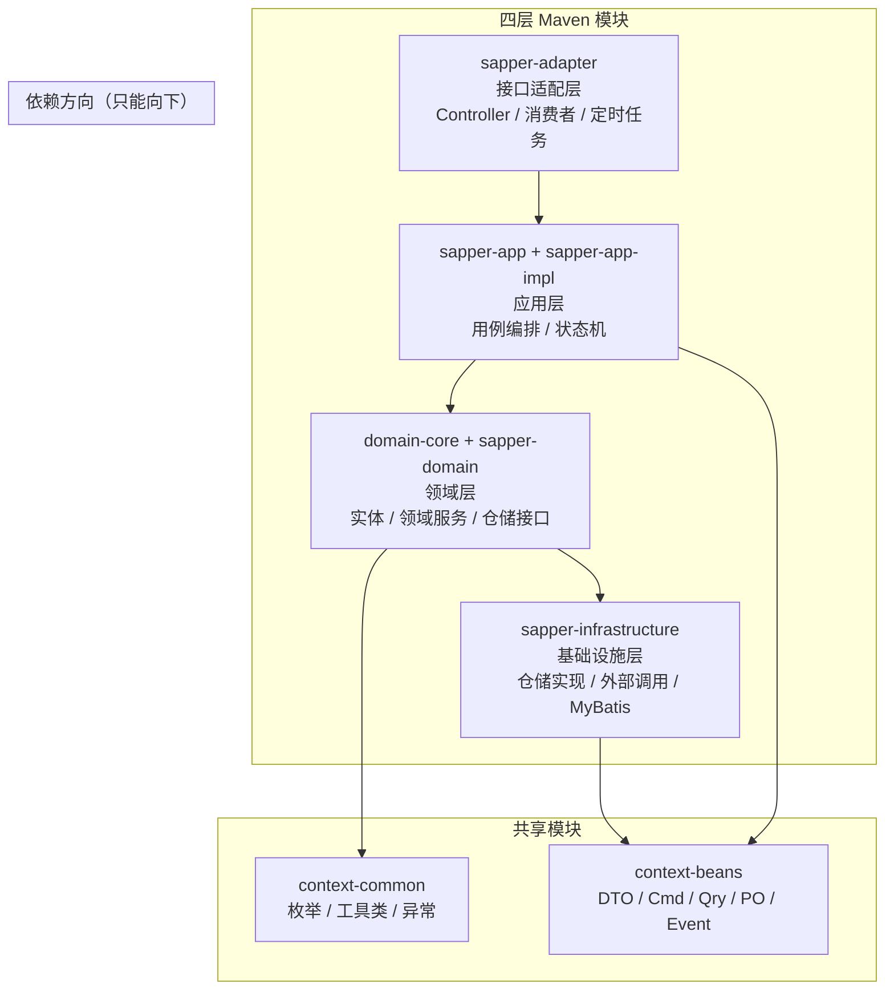
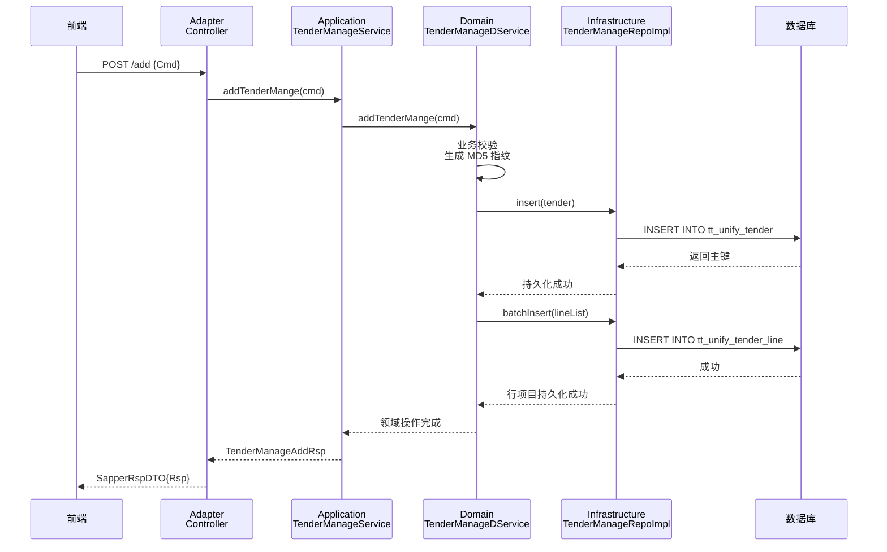

> 四层架构不是画在 PPT 上的框——是 Maven 模块的依赖方向、是代码的存放位置、是变更的影响范围。以一个 10 模块、3000+ Java 文件的真实交易服务为案例，讲透 Interface→Application→Domain→Infrastructure 四层怎么落地、常见坑怎么避。

## 一、先说结论：四层不是四包，是四个模块

很多人把 DDD 四层做成四个 package——`controller/`、`service/`、`domain/`、`repository/`，全塞在一个 Maven 模块里。依赖关系全靠约定，没人真正拦住。三个月后，Controller 直接调 Mapper，Service 里塞了 2000 行业务逻辑，Domain 变成了贫血的 Lombok 数据袋。

**四层架构的工程保障是 Maven 模块的依赖方向**。不是「建议」，是编译报错。



**依赖铁律**：上层可以依赖下层，下层绝对不能反向依赖上层。`domain-core` 不能 import 任何 `sapper-app` 的类——如果出现了，Maven 编译直接报错。这就是四层架构的工程保障。

## 二、模块职责与依赖矩阵

一个交易服务拆成 10 个 Maven 模块，每个模块有明确的职责和允许的依赖：

| 模块 | 职责 | 允许依赖 | 禁止依赖 |
|------|------|---------|---------|
| `context-common` | 枚举、工具类、异常定义、常量 | 无 | 任何业务模块 |
| `context-beans` | Cmd/Qry/Rsp DTO、PO 对象、Event DTO | `context-common` | domain/adapter |
| `domain-core` | 实体、领域服务、仓储接口、策略模式 | `context-common`, `context-beans` | app/adapter/infra |
| `domain-factory` | MapStruct 对象转换工厂 | `domain-core`, `context-beans` | app/adapter/infra |
| `sapper-domain` | 领域外观接口（仓储/SAO/消息/缓存） | `domain-core`, `context-common` | app/adapter/infra |
| `sapper-app` | 应用服务接口（用例入口） | `context-beans`, `sapper-domain` | adapter/infra |
| `sapper-app-impl` | 应用服务实现、状态机构建 | `sapper-app`, `domain-core`, `domain-factory` | adapter/infra |
| `sapper-adapter` | REST Controller、消息消费者、定时任务 | `sapper-app` | domain-core/infra（通过 app 间接调用） |
| `sapper-infrastructure` | MyBatis Mapper、Feign 客户端、仓储实现 | `sapper-domain`, `context-beans` | app/adapter |
| `sapper-starter` | Spring Boot 启动入口 | 以上所有 | — |

**关键设计**：`sapper-adapter` 不直接依赖 `domain-core`——它只通过 `sapper-app` 接口调用。这意味着 Controller 不可能跳过应用层直接操作领域对象。

## 三、第一层：Interface（接口适配层）

适配层是系统与外界的边界——HTTP 请求、消息队列、定时任务都从这里进来。

### 3.1 Controller：只做适配，不做业务

```java
/**
 * 订单管理 Controller。
 * 职责：接收 HTTP 请求 → 参数校验 → 委托 Application Service → 返回统一响应。
 * 禁止：写业务逻辑、直接调领域服务、直接操作数据库。
 */
@RestController
@RequestMapping("/trade/tenderManage")
public class TenderManageController {

    @Autowired
    private TenderManageService tenderManageService;

    /**
     * 新增订单。
     * Controller 只做三件事：
     * 1. 接收请求体（框架自动反序列化）
     * 2. 委托 Application Service
     * 3. 包装统一响应
     */
    @PostMapping("/add")
    public SapperRspDTO<TenderManageAddRsp> add(@RequestBody TenderManageAddCmd cmd) {
        return BIZProxy.excute(() -> tenderManageService.addTenderMange(cmd));
    }

    /**
     * 分页查询待处理订单。
     * 查询类接口同理——参数透传，不加工。
     */
    @PostMapping("/queryPageOrder")
    public SapperRspDTO<Page<TenderManageDTO>> queryPageOrder(
            @RequestBody TenderManagePageOrderQry qry) {
        return BIZProxy.excute(() -> tenderManageService.queryPageOrder(qry));
    }
}
```

### 3.2 消息消费者：和 Controller 同等对待

```java
/**
 * 订单活动状态延迟消费者。
 * 和 Controller 一样——只做适配，不写业务逻辑。
 * 收到消息 → 解析 → 委托 Application Service。
 */
@PulsarConsumer(consumerAlias = "tender-activity-status-consumer")
public class TenderActivityStatusDelayConsumer {

    @Autowired
    private TenderActivityService tenderActivityService;

    public void consumer(byte[] msg) {
        String content = new String(msg, StandardCharsets.UTF_8);
        TenderActivityIdStatusDto dto = JSON.parseObject(content, TenderActivityIdStatusDto.class);
        // 委托 Application Service，不在此处处理业务
        tenderActivityService.handleTenderActivity4Delay(dto);
    }
}
```

**适配层的纪律**：不管是 HTTP 请求还是 MQ 消息还是定时任务，都是「外界输入」——统一走「接收→解析→委托」三步，不在适配层写任何业务判断。

## 四、第二层：Application（应用层）

应用层是用例的编排者——它决定「先做什么、后做什么、什么条件做什么」，但不决定「每步具体怎么做」。

### 4.1 应用服务接口

```java
/**
 * 订单管理应用服务接口。
 * 定义用例入口——每个方法对应一个用户故事/操作场景。
 * 参数用 Cmd/Qry（命令/查询），返回值用 Rsp/DTO。
 */
public interface TenderManageService {

    /** 新增订单（命令） */
    TenderManageAddRsp addTenderMange(TenderManageAddCmd cmd);

    /** 查询订单详情（查询） */
    TenderManage queryDetailById(TenderManageDetailQry qry);

    /** 分页查询待处理订单（查询） */
    Page<TenderManageDTO> queryPageOrder(TenderManagePageOrderQry qry);

    /** 确认订单（命令） */
    void confirmBidding(TenderManageConfirmCmd cmd);
}
```

### 4.2 应用服务实现：薄编排层

```java
/**
 * 订单管理应用服务实现。
 * 职责：编排领域服务和基础设施，不写业务规则。
 *
 * 好的 Application Service 像导演——指挥各个角色出场，
 * 但自己不演戏。
 */
@Service
public class TenderManageServiceImpl implements TenderManageService {

    @Autowired
    private TenderManageRepo tenderManageRepo;

    @Autowired
    private TenderManageDService tenderManageDService;  // 领域服务

    @Override
    public TenderManageAddRsp addTenderMange(TenderManageAddCmd cmd) {
        // 编排：调用领域服务执行业务逻辑
        return tenderManageDService.addTenderMange(cmd);
    }

    @Override
    public void confirmBidding(TenderManageConfirmCmd cmd) {
        // 编排：先查聚合根 → 执行业务操作 → 持久化
        TenderManage tender = tenderManageRepo.queryById(cmd.getTenderId());
        tenderManageDService.confirmBidding(tender, cmd);
        tenderManageRepo.update(tender);
    }
}
```

### 4.3 状态机：应用层的核心编排工具

交易场景有复杂的状态流转——需求包从「待发布」到「已发布」到「进行中」到「已完成」，每一步都有前置条件和后置动作。COLA 状态机把这个编排逻辑显式化。

```java
/**
 * 订单状态机构建器。
 * 每个状态转换 = from + event + when(条件) + perform(动作)。
 * 状态流转规则集中在这里，不在 Service 的 if-else 里散落。
 */
@Component
public class TradeStateMachineBuilder {

    @Autowired
    private StateMachineBuilder<TradeTmpRequirePkgStateEnum, TradeEvent, TradeContext> builder;

    @PostConstruct
    public void init() {
        // 待发布 → 已发布（发布事件）
        builder.externalTransition()
            .from(TradeTmpRequirePkgStateEnum.WAIT_PUBLISH)
            .to(TradeTmpRequirePkgStateEnum.PUBLISHED)
            .on(TradeEvent.PUBLISH)
            .when(ctx -> checkPublishCondition(ctx))    // 前置条件
            .perform(ctx -> doPublishAction(ctx));       // 后置动作

        // 已发布 → 进行中（开始交易事件）
        builder.externalTransition()
            .from(TradeTmpRequirePkgStateEnum.PUBLISHED)
            .to(TradeTmpRequirePkgStateEnum.BIDDING)
            .on(TradeEvent.START_BIDDING)
            .when(ctx -> checkBiddingCondition(ctx))
            .perform(ctx -> doStartBiddingAction(ctx));

        // 进行中 → 已完成（完成事件）
        builder.externalTransition()
            .from(TradeTmpRequirePkgStateEnum.BIDDING)
            .to(TradeTmpRequirePkgStateEnum.CALIBRATED)
            .on(TradeEvent.CALIBRATE)
            .when(ctx -> checkCalibrateCondition(ctx))
            .perform(ctx -> doCalibrateAction(ctx));
    }
}
```

**状态机的价值**：把「哪些状态可以互相转换」这个最容易出 bug 的逻辑，从散落在各个 Service 方法里的 if-else，收敛到一个地方。新增一个状态转换，改一处；查所有转换规则，看一个文件。

## 五、第三层：Domain（领域层）

领域层是业务规则的家——实体、值对象、领域服务、仓储接口都在这里。

### 5.1 聚合根：有行为的实体

```java
/**
 * 交易订单聚合根。
 * 不是纯数据袋——包含业务行为方法。
 * 聚合内的子实体（明细、行项目、流程信息）通过聚合根统一访问。
 */
@Getter
@AllArgsConstructor(access = AccessLevel.PACKAGE)
public class UnifyTender implements Serializable {

    private Long id;
    private String tenderNo;
    private Integer tenderType;         // 交易类型
    private Long activityId;            // 关联活动
    private Integer roundIndex;         // 当前轮次
    private Date firstStartTm;          // 首轮开始时间
    private Date roundStartTm;          // 当前轮开始时间
    private Date roundEndTm;            // 当前轮结束时间
    private String groupIdentity;       // 分组标识（MD5 指纹）
    private List<TtUnifyTenderLineInfo> lineList;   // 行项目
    private List<UnifyTenderFlowInfo> flowList;      // 流程信息

    /**
     * 生成分组标识：根据活动+区域+车型+服务范围生成 MD5 指纹。
     * 用于识别「同一批交易需求」的重复创建。
     */
    public void genGroupIdentity() {
        StringBuilder sb = new StringBuilder();
        sb.append(activityId).append("|");
        // ... 拼接各维度字段
        this.groupIdentity = DigestUtils.md5DigestAsHex(sb.toString().getBytes());
    }

    /**
     * 保存活动信息：将活动信息映射到交易聚合根。
     * 业务规则：首轮开始时间取自活动轮次配置。
     */
    public void saveActivityInfo(TenderActivity activity, TenderActivityRound round) {
        this.tenderType = activity.getBiddingForm();
        this.activityId = activity.getActivityId();
        this.roundIndex = 1;
        this.firstStartTm = round.getStartTm();
        this.roundStartTm = round.getStartTm();
        this.roundEndTm = round.getEndTm();
    }

    /**
     * 判断是否可取消交易。
     * 业务规则：只有「已发布」状态的需求包才能取消。
     */
    public boolean isCanBiddingCancel(String state) {
        return TradeTmpRequirePkgStateEnum.PUBLISHED.getCode().equals(state);
    }
}
```

### 5.2 领域服务：放不进展实体的业务逻辑

```java
/**
 * 交易订单领域服务。
 * 放不进展实体的跨聚合业务逻辑放这里。
 * 注意：领域服务不依赖 Application Service，不依赖 Infrastructure。
 *
 * 职责：
 * 1. 跨聚合的业务操作（如：创建订单时同步初始化行项目价格）
 * 2. 业务规则校验（如：同一批次不可重复创建订单）
 * 3. 编排多个仓储的操作（如：先存主表、再存明细、再初始化价格）
 */
@Service
@Slf4j
public class UnifyTenderDService {

    private final UnifyTenderRepo unifyTenderRepo;
    private final UnifyTenderLineRepo unifyTenderLineRepo;

    @Transactional(rollbackFor = Exception.class)
    public void insert(UnifyTender tender) {
        // 1. 业务校验
        checkDuplicate(tender);

        // 2. 生成分组标识
        tender.genGroupIdentity();

        // 3. 持久化聚合根
        unifyTenderRepo.insert(tender);

        // 4. 持久化子实体（行项目）
        if (tender.getLineList() != null) {
            unifyTenderLineRepo.batchInsert(tender.getLineList());
        }

        // 5. 初始化直通价格
        initDirectPrice(tender);
    }

    private void checkDuplicate(UnifyTender tender) {
        // 同一分组标识不可重复创建
        if (unifyTenderRepo.existsByGroupIdentity(tender.getGroupIdentity())) {
            throw new BizException("同一批次已存在订单，不可重复创建");
        }
    }
}
```

### 5.3 策略模式：消除 if-else 的业务分支

交易场景有大量「按类型走不同逻辑」的业务——不同类型有不同的规则、策略和计算方式。策略模式把这些分支收敛到独立的实现类。

```java
/**
 * 竞价策略接口。
 * 每种竞价类型（一轮竞价、多轮竞价、密封报价...）实现这个接口。
 * 新策略 = 新实现类，不改已有代码。
 */
public interface BiddingStrategy<P, R> extends InitializingBean {

    StrategyResult<R> execute(StrategyContext<P> context);

    BiddingStrategyEnum getStrategyEnum();

    /** 自动注册到策略工厂 */
    @Override
    default void afterPropertiesSet() {
        BiddingStrategyFactory.register(this, getStrategyEnum());
    }
}

/**
 * 多轮竞价策略实现。
 */
@Component
public class MultiRoundBiddingStrategy implements BiddingStrategy<MultiRoundReq, MultiRoundRsp> {

    @Override
    public StrategyResult<MultiRoundRsp> execute(StrategyContext<MultiRoundReq> context) {
        MultiRoundReq req = context.getParam();
        // 多轮竞价的特有逻辑：每轮独立报价、每轮独立截止、支持改价
        // ...
        return StrategyResult.success(result);
    }

    @Override
    public BiddingStrategyEnum getStrategyEnum() {
        return BiddingStrategyEnum.MULTI_ROUND;
    }
}
```

### 5.4 仓储接口：领域层不知道数据怎么存

```java
/**
 * 订单管理仓储接口——定义在领域层。
 * 领域层只定义「需要什么数据」，不关心「数据存在哪」。
 * 实现类在 Infrastructure 层，可以是 MyBatis、可以是缓存、可以是外部 API。
 */
public interface TenderManageRepo {

    TenderManage queryById(Long id);

    int add(TenderManage tenderManage);

    int update(TenderManage tenderManage);

    IPage<TenderManage> selectByStayBidLineIdPage(IPage<TenderManage> page, TenderManagePageQry qry);

    List<TenderManage> queryByLineIds(List<Long> lineIds);
}
```

## 六、第四层：Infrastructure（基础设施层）

基础设施层负责「把领域层的需求变成真实世界的操作」——数据库读写、外部 API 调用、消息发送。

### 6.1 仓储实现

```java
/**
 * 订单管理仓储实现。
 * 实现领域层定义的仓储接口，用 MyBatis 操作数据库。
 *
 * 注意：
 * 1. 返回类型要适配领域层（不能把 MyBatis 的 IPage 直接返回给领域层）
 * 2. 异常要转换（MyBatis 异常 → 领域层能理解的异常）
 */
@Repository
@SapperDatasource(dbName = DataSourceConst.DB_GRD)
public class TenderManageRepoImpl implements TenderManageRepo {

    @Autowired
    private TenderManageMapper tenderManageMapper;

    @Override
    public TenderManage queryById(Long id) {
        return tenderManageMapper.selectById(id);
    }

    @Override
    public int add(TenderManage tenderManage) {
        return tenderManageMapper.insert(tenderManage);
    }

    @Override
    public IPage<TenderManage> selectByStayBidLineIdPage(
            IPage<TenderManage> page, TenderManagePageQry qry) {
        return tenderManageMapper.selectByStayBidLineIdPage(page, qry);
    }
}
```

### 6.2 外部 API 调用

```java
/**
 * 平台服务 Feign 客户端。
 * 外部系统的 API 调用统一放 Infrastructure 层。
 * 领域层通过仓储接口或领域服务间接调用，不直接依赖 Feign。
 */
@FeignClient(value = "sapper-trade-t2p", configuration = SapperFeignInterceptor.class)
public interface PlatformFeign {

    @PostMapping("/t2p/orders/place-order")
    SapperRspDTO<PlatformOrderRsp> placeOrder(@RequestBody PlatformOrderReq req);

    @PostMapping("/t2p/orders/cancel-order")
    SapperRspDTO<Void> cancelOrder(@RequestBody PlatformOrderCancelReq req);
}
```

### 6.3 对象转换工厂

```java
/**
 * MapStruct 对象转换工厂。
 * PO（数据库对象）↔ DO（领域对象）的转换统一放这里。
 * 不在 Service 里写手工的 set/get 转换。
 */
@Mapper(config = BaseMapperConfig.class)
public interface UnifyTenderFactory {

    UnifyTenderFactory INSTANCE = Mappers.getMapper(UnifyTenderFactory.class);

    TtUnifyTenderPo buildPo(UnifyTender unifyTender);

    UnifyTender buildPo2Do(TtUnifyTenderPo po);

    List<TtUnifyTenderPo> buildPoList(List<UnifyTender> tenders);
}
```

## 七、数据流向：一个请求的四层之旅

以「新增交易订单」为例，看一个请求怎么穿过四层：



**关键观察**：
- Controller 不知道有领域服务——它只知道 Application Service 接口
- Application Service 知道领域服务——但只调用接口，不关心实现
- 领域服务不知道数据库——它通过仓储接口操作数据
- Infrastructure 实现了仓储接口——但不知道有 Application Service

## 八、常见坑与工程规范

### 8.1 贫血实体

**问题**：实体只有 getter/setter，业务逻辑全在 Service 里。

```java
// ❌ 贫血实体：只有数据，没有行为
@Data
public class UnifyTender {
    private Long id;
    private String tenderNo;
    private Integer status;
    // ... 100+ 字段，全是 getter/setter
}

// ✅ 充血实体：包含业务行为
public class UnifyTender {
    // 字段用 private final + 包级构造器
    public void genGroupIdentity() { ... }   // 业务行为
    public boolean isCanBiddingCancel() { ... }  // 业务规则
    public void saveActivityInfo(...) { ... }    // 状态变更
}
```

**规范**：实体至少包含 2-3 个业务方法。纯数据对象应该用 record 或 PO，不叫 Entity。

### 8.2 巨型领域服务

**问题**：一个 `*DService` 写了 2000 行，什么逻辑都往里塞。

**规范**：
- 领域服务超过 500 行 → 考虑拆分子领域服务
- 按聚合根拆分：`UnifyTenderDService`、`TenderActivityDService`、`CalibrationDService`
- 跨聚合的编排逻辑放 Application Service，不放 Domain Service

### 8.3 依赖方向违规

**问题**：Domain 层 import 了 Application 层的类。

**规范**：Maven 模块依赖方向是硬约束。如果 Domain 需要调用 Application 的能力，说明分层有问题——应该把那个能力下沉到 Domain，或者通过领域事件解耦。

### 8.4 仓储接口泄漏基础设施

**问题**：仓储接口返回 MyBatis 的 `IPage`，参数用 `*Qry` DTO。

```java
// ❌ 仓储接口泄漏 MyBatis 类型
IPage<TenderManage> selectByPage(IPage<TenderManage> page, TenderManagePageQry qry);

// ✅ 仓储接口用领域类型
List<TenderManage> queryByCondition(TenderQueryCondition condition, int offset, int limit);
```

**规范**：仓储接口的参数和返回值都应该是领域对象。分页参数用 `offset + limit`，不用 `IPage`。

## 九、四层架构的度量指标

怎么判断一个项目的 DDD 四层落地好不好？看这几个指标：

| 指标 | 健康值 | 危险信号 |
|------|--------|---------|
| Controller 方法行数 | ≤ 10 行 | > 30 行（业务逻辑泄漏到适配层） |
| Application Service 方法行数 | ≤ 20 行 | > 50 行（编排逻辑太复杂） |
| Domain Service 类行数 | ≤ 500 行 | > 1000 行（巨型服务） |
| 实体业务方法数 | ≥ 3 个 | 0 个（纯贫血实体） |
| 上层→下层依赖违规 | 0 | > 0（Maven 应该拦住） |
| Application→Domain 直接调用比例 | 100% | < 80%（有 Controller 直调 Domain） |

## 结语

DDD 四层架构不是教科书里的概念——是 Maven 模块的 `pom.xml` 里那几行 `<dependency>`。

> 依赖方向对了，架构就对了 80%。剩下的 20% 是团队纪律：Controller 不写业务、Service 不超 500 行、实体要有行为、仓储接口不泄漏基础设施。这些纪律不是靠 Code Review 维持的——是靠 Maven 编译报错维持的。

一个 3000+ 文件的服务能跑起来，靠的不是某个人的架构设计能力，是每个模块各司其职、每层只做该做的事。
