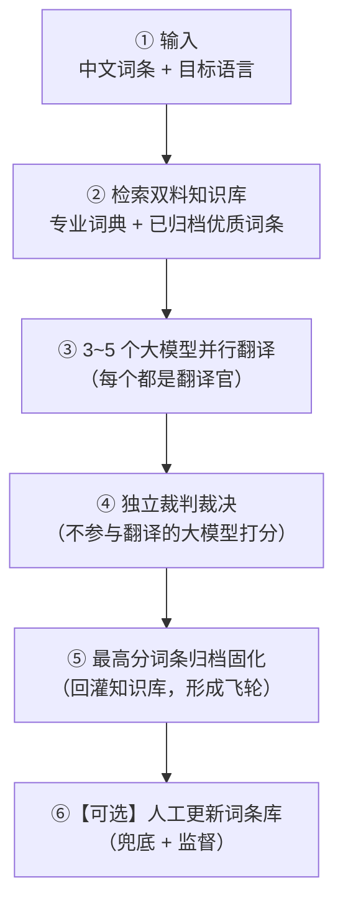
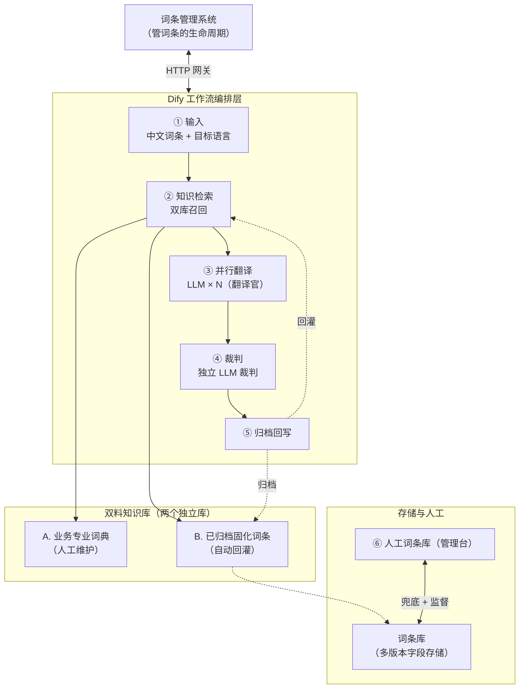

> 副标题：从"一个模型随机翻一句"到"五个翻译官同台竞技、一个裁判打分、好词自动存档"——大模型翻译词条的完整工程方案
>
> 关键词：国际化（i18n）· 词条翻译 · Dify · 多模型投票 · LLM 当裁判 · RAG 知识库 · 自强化闭环
>
> 阅读门槛：**零基础可读**。不需要你懂任何国际化平台或大模型框架，我会从"什么是词条"讲起。

---

## 〇、导语：这篇文章讲什么、适合谁

想象一个场景：你们公司的 App 要出海，界面上的"登录""立即购买""您的包裹已妥投"这些文案，得同时支持中文、英文、日文、泰文、马来文……一共十几二十种语言。

谁来把这些文案翻成各种语言？人工翻？太慢太贵，几万条词条根本翻不过来。用机器翻译？又怕翻得不准、术语不一致、闹笑话。

这篇文章，就是讲**怎么用大模型，把"翻译词条"这件又大又细的事，做成一条自动化的、越用越准的流水线**。

我会讲清楚：

1. **背景**：国际化里的"词条"到底是什么，翻译它难在哪。
2. **问题**：一个真实的国际化平台，原来用大模型翻译，踩了哪四个坑。
3. **方案**：一个"多模型并行翻译 + 独立裁判裁决 + 知识库自强化"的六步流水线。
4. **落地**：这套方案在 Dify 里长什么样（含 DSL 草图）。
5. **思考**：选型理由、踩过的坑、要小心的地方。

方法上我用"**总分总**"——先给全景，再拆细节，最后收束；讲现状和目标时借"**STAR**"（背景→任务→行动→结果），让你看得清"为什么非得这么改"。

---

## 一、背景：先搞懂"国际化词条"是什么

### 1.1 软件为什么要做国际化（i18n）

"国际化"英文叫 internationalization，因为开头字母 `i` 和结尾字母 `n` 之间有 18 个字母，行业里常简写成 **i18n**。

一句话：**让同一份软件，在不同语言环境里，自动显示对应语言的文案。**

做法是：开发时界面上的文字**不写死**，而是写一个"占位标识"；运行时根据用户的语言，去查这个标识对应的译文，再显示出来。

### 1.2 什么是"词条"和"词条库"

那个"占位标识 + 各语言译文"的组合，就叫一条**词条**。一个词条通常长这样：

```
标识（key）：  order.status.delivered
中文（zh）：   已妥投
英文（en）：   Delivered
日文（ja）：   配達済み
泰文（th）：   ส่งถึงแล้ว
马来文（ms）： Telah dihantar
```

把所有词条集中管理的地方，叫**词条库**。一个成熟系统的词条库，动辄几万到几十万条，覆盖几十种语言。

一条词条从"有个中文"到"二十种语言都翻好、审核过、上线生效"，是一个完整的生命周期——它需要被**翻译、校对、发布、缓存、查询**。这篇文章聚焦其中最核心、也最费人的一环：**翻译**。

### 1.3 翻译词条，到底难在哪？——三个要命的点

翻译看似简单，但对词条库这个体量来说，有三个点是真正的硬骨头：

1. **一致性**：术语必须"说一不二"。物流系统里的"运单""妥投""陆运件"是**行业术语**，不是普通词。如果今天翻成 `waybill`、明天翻成 `shipping order`，用户会以为这是两个东西。**同一个词，必须永远翻成同一个词。**

2. **正确性**：大模型会"一本正经地翻错"。单个模型没有第二个声音来挑错，一个幻觉就可能直接流进线上，被几百万用户看到。

3. **可进化**：一次翻对了，如果这个"对"不能被记住、不能下次复用，那每次都在重复劳动、重复试错，成本永远降不下来。

记住这三个词：**一致性、正确性、可进化**。整篇文章的方案，就是奔着解决它们去的。

---

## 二、问题：一个真实平台的四个坑（STAR）

### 2.1 Situation——现状：机器翻译已经用上了，但"随机且失忆"

说一个真实存在的国际化平台（下文叫它"这个平台"）的现状。它分两块：

- **管理端**：管词条的存储、版本、发布、缓存。
- **查询端**：给各个业务系统提供"按 key 查译文"的能力。

它其实**已经接了大模型来翻译词条**，代码里有一行特别能说明问题的逻辑：

```java
// 随机 0 或 1，0 走 GPT-3，1 走 GPT-4o
if (Math.random() < 0.5) {
    content = 用 GPT-3 翻译(...);
} else {
    content = 用 GPT-4o 翻译(...);
}
```

翻译质量，居然取决于一次 `Math.random()`。梳理下来，它踩了四个坑：

**坑一：翻译是"猜硬币"。**

到底用哪个模型，靠随机。代码里虽然也准备了第三个模型（通义千问）的接口定义，但**从没真正让多个模型同时翻、互相较劲**。永远是"一个被随机选中的孤胆翻译官"在干活。

**坑二：翻译是"失忆的"。**

提示词是一段写死的通用模板：

```
你是一位专业的翻译……将以下文字从%s翻译成%s，返回 JSON……
```

模型在翻"陆运件""路由节点"这种专业词时，**手里没有任何业务词典可查**，只能靠它训练参数里的泛化能力去"蒙"。这次蒙对，下次换个场景又翻错。**没有一个地方沉淀"我们已经翻对过的术语"。**

**坑三：翻译是"没有裁判的"。**

模型翻完，解析出结果，就直接返回、直接存进词条库。**没有第二个不参与翻译的模型来打分、来把关**。一个模型的幻觉，原封不动就成了"AI 翻译版本"。

**坑四：翻译是"不闭环的"。**

词条库里其实已经有了很聪明的"多版本"设计——同一个词条，同时存"开发版、AI 版、生产版、人工纠错版"，读取时按优先级取最高的一版。这说明团队已经意识到"译文要分级收敛"。但**"最终被认可的优质翻译"并没有回灌成一个可被下次检索的知识库**——沉淀只停留在数据字段里，没有变成能力。

一句话总结现状：**有"翻译的管道"，缺"翻译的大脑、裁判和记忆"。**

### 2.2 Task——目标：把翻译从"一次性随机行为"升级为"可裁决、可固化、可复用的工程闭环"

我们要搭的目标流水线，一共六步：



六步，正好对上四个坑：

| 环节 | 治哪个坑 | 手段 |
|------|---------|------|
| ② 双料知识库检索 | 坑二（失忆） | RAG：给翻译官注入"术语表 + 历史译文"当上下文 |
| ③ 多模型并行翻译 | 坑一（猜硬币） | Ensemble：3~5 个模型各翻一遍，产生候选 |
| ④ 独立裁判裁决 | 坑三（无裁判） | LLM 当裁判：多维打分选最高分 |
| ⑤ 归档固化 | 坑四（不闭环） | 胜出词条回写知识库，越用越准 |
| ⑥ 人工更新 | 兜底 | Human-in-the-loop，守住质量红线 |

### 2.3 为什么用 Dify 来做，而不是继续写代码

一个很自然的疑问是："既然原来就有翻译代码，为什么还要引入 Dify 这个编排平台？"

答案三层：

1. **工作流编排 ≠ 一个方法。** 原来翻译是 `translate(文本, 语言)` 一个方法从头跑到尾。而我们要的是"检索 → 并行翻译 → 裁决 → 回灌"这样一条**有分支、有并发、有重试、能可视化、提示词能热更新**的流程图。用代码硬写，每改一个环节都要重新发版；用 Dify，改提示词、换模型、加一个打分维度，是**拖拽 + 配置**的事。

2. **翻译质量比拼的是"试错速度"。** 翻译好不好的核心竞争力，在于**提示词怎么写 + 模型怎么组合**，这两样需要高频迭代。Dify 把提示词、模型、知识库、代码都做成了可插拔积木，能让我们在不重新发版的前提下，A/B 测试"3 个翻译官好还是 5 个好""裁判用哪个模型"。

3. **分层边界清晰：代码管"确定的事"，Dify 管"不确定的事"。** 词条的存储、版本、发布、缓存这些**确定性、要审计**的活，留在代码里；翻译这种**不确定、要反复调优观察**的活，交给 Dify。两者用一条轻量接口（HTTP 网关）解耦。

> 一句话：**把"不确定的智能"从"确定的业务"里剥离出来，交给更适合快速演进的编排层去承载**——这是引入 Dify 的根因。

---

## 三、总体方案：一条六环节的翻译流水线（总）

先看全景。整条流水线可以画成：



这条流水线的核心思想，用一个比喻最好懂：

> **把翻译当成一场"翻译比赛"来办。** 多个翻译官各显身手；比赛前给他们发一本"术语词典 + 历年高分范文"当参考资料；比完让一个没参赛的裁判按统一评分卡打分；冠军作品自动收录进"范文库"，供下一场参考。如此循环，越办越专业。

下面逐个环节拆开讲。

---

## 四、逐环节拆解（分）

### 4.1 环节① 输入：中文词条 + 目标语言

输入非常克制，就两个东西：

```json
{
  "text": "陆运件妥投失败，请重新派送",
  "sourceLang": "zh",
  "targetLang": ["en", "ja", "th", "ms", "my"]
}
```

`targetLang` 是"目标语言列表"，支持一次翻好几种语言。这里有个容易忽略的设计点：**多种语言是并行展开的**，而不是"先翻英文、再翻日文"串行跑。因为每种语言是独立的一场"翻译比赛"，中→英 的质量和中→泰 的质量不可比，必须**各自翻译、各自裁判**。

### 4.2 环节② 检索"双料知识库"——决定"一致性"的关键

这是整条流水线里，管"术语不乱"的核心。我们设计成"双料"两个库：

**知识库 A：业务专业词典（人工维护）**

- 内容：行业术语、专有名词、品牌词，以及它们的**官方钦定译法**。
- 例子：`陆运件 → ground shipment`（而不是 `land transport item`）、`妥投 → delivered`、`运单 → waybill`。
- 谁维护：业务/语言专家在后台维护，**严格人工审核，宁缺毋滥**。
- 怎么召回：**精确匹配为主**。术语是"点对点"的，精确命中比语义近似更重要。

**知识库 B：已归档固化的词条（自动回灌）**

- 内容：历史翻译中，被裁判判为高分、甚至人工确认过的"优质译文对"。
- 例子：`"请您耐心等待" → en:"Please wait a moment"` 这种整句级沉淀。
- 谁维护：**环节⑤自动写入**，无需人工，形成飞轮。
- 怎么召回：**向量（语义）召回为主**。面对的是整句，靠语义相似找到"相似的句子以前怎么翻"。

**为什么分两个库，不混成一个？**

因为两类知识的**可信度、粒度、召回方式**完全不同：专业词典是"高置信、精确、人审"，归档词条是"中置信、语义、机审"。混在一起，精确匹配会被语义召回稀释，短术语的稀疏向量又会拖垮打分。分库后各用最合适的召回方式，最后在上下文里**分块注入**：

```
【术语对照】陆运件=ground shipment；妥投=delivered；运单=waybill
【参考译文】"请耐心等待" 曾译为 "Please wait a moment"（得分 0.92）
【待翻译】陆运件妥投失败，请重新派送
```

> 这个"术语约束 + 语境参考 + 原文"三段式上下文，既给翻译官划了"术语不能乱翻"的红线，又给了它语感参考——也是后面裁判打分的重要依据。

### 4.3 环节③ 3~5 个大模型并行翻译——决定"正确性"的第一道闸

翻译官环节的关键词：**并行、异构、隔离**。

- **并行**：让 N 个模型同时翻，总耗时约等于最慢那个，而不是 N 倍累加。
- **异构**：选 3~5 个**不同厂商、不同强项**的模型，避免"同源模型一起犯同样的错"。比如：一个通用能力强的旗舰模型（管语感）、一个指令遵循强的（严格按术语表）、一个对小语种更擅长的、一个开源可自托管的（敏感词条数据不出域）。
- **隔离**：给翻译官的提示词里，**只给翻译指令 + 检索到的上下文**，绝口不提"你是候选之一、后面有裁判"，避免模型猜裁判偏好而投机。

每个翻译官输出**结构化 JSON**：

```json
{
  "translation": "Ground shipment delivery failed, please redeliver.",
  "terminology_used": ["ground shipment", "delivered"],
  "confidence": 0.88
}
```

让模型自己报"用了哪些术语、自信度多少"，是给裁判额外的打分信号（看它是否自觉用对了术语表）。

### 4.4 环节④ 独立裁判裁决——决定"正确性"的第二道闸

裁判是"正确性"的守门人，三条铁律：

**铁律一：裁判绝不参赛。**

翻过的模型不能当裁判（否则既当运动员又当裁判，天然偏袒自己）。裁判必须是一个**能力更强、且从不出现在翻译官名单里**的模型，甚至可以每轮在"裁判池"里轮换。

**铁律二：多维打分，不是"谁顺眼选谁"。**

裁判按一张**评分卡（Rubric）**逐项打分，再加权：

| 维度 | 权重 | 说明 |
|------|------|------|
| 术语一致性 | 30% | 是否严格用了注入的术语表 |
| 语义准确性 | 30% | 是否忠实原文，无漏译/增译/错译 |
| 语境自然度 | 20% | 母语者读起来是否自然（拒绝"翻译腔"） |
| 格式与约束 | 10% | 是否遵守 JSON 格式、无多余符号 |
| 文化适配 | 10% | 是否有目标文化忌讳、是否本地化得当 |

裁判输出结构化的"判决书"：

```json
{
  "winner": "candidate_3",
  "scores": [
    {"candidate": "candidate_1", "total": 0.71, "comment": "术语'运单'误用"},
    {"candidate": "candidate_3", "total": 0.93, "comment": "术语一致、语感自然"}
  ],
  "reason": "candidate_3 严格使用术语表，且更符合英文母语表达习惯"
}
```

**铁律三：设"及格线"，拒绝低质兜底。**

如果最高分都低于阈值（比如 0.75），说明这一轮整体不可靠——**不归档、不发布，直接转人工（环节⑥）**，而不是"矮子里拔将军"硬塞一个错的结果上线。

### 4.5 环节⑤ 归档/固化——自强化飞轮

裁判选出冠军后，触发归档：

1. **写回知识库 B**（已归档词条），供下一次环节②检索——这是飞轮闭环的"最后一公里"。
2. **写回词条库**，落进"AI 版"；如果人工再确认，就逐级升到"生产版 / 人工纠错版"。

这里有一条工程铁律：**归档必须防"知识库污染"。**

不是所有冠军都配进库。要设归档门槛（得分够高 + 裁判信心足），并对**高频被翻盘的词条**做降权或剔除。否则一个"偶尔蒙对的错译文"一旦入库，会像病毒一样，在下一次检索里污染所有后续翻译。

> 自强化系统最大的风险不是"学得慢"，而是"错被固化"。飞轮的每一圈，都要有"准入 + 淘汰"两道闸门。

### 4.6 环节⑥【可选】人工更新词条库——Human-in-the-loop

人机协作的正确姿势，不是"机器干完人一句句检查"，而是**"机器跑量，人只处理例外"**：

- 低于及格线的 → 人工介入。
- 高价值/高曝光词条（首页、计费、时效承诺）→ 强制人工复核。
- 专业词典 A 的增删改 → 只能人工。

人的角色从"翻译工"升级为"术语与质量的仲裁官 + 兜底者"，把精力花在机器搞不定的那 5% 上。

---

## 五、落地：这套流水线在 Dify 里长什么样（DSL 草图）

前面都是"逻辑上的流水线"，这一节把它落到 Dify 的**工作流节点**上。先看一张"环节 → 节点"映射表：

| 环节 | Dify 节点类型 | 关键配置 |
|------|--------------|---------|
| ① 输入 | `start`（开始） | 定义输入变量 `text` / `sourceLang` / `targetLang` |
| 多语言遍历 | `iteration`（迭代） | 遍历 `targetLang` 列表 |
| ② 知识检索 | `knowledge-retrieval` ×2（知识检索） | 分别挂知识库 A / B，设 `top_k`、`score_threshold` |
| 拼接上下文 | `template-transform`（模板转换） | 把术语 + 参考译文 + 原文拼成提示词 |
| ③ 并行翻译 | `llm` × N（LLM） | 多个 LLM 节点并行，各自挂不同模型 |
| ④ 裁判 | `llm`（LLM） | 一个独立裁判模型，读入所有候选 + 评分卡 |
| 是否归档 | `if-else`（条件分支） | 判断最高分 ≥ 阈值 |
| ⑤ 归档 | `code` / `http-request`（代码 / HTTP） | 回写知识库 + 词条库 |
| ⑥ 人工 | 转人工任务 / 落"待处理"队列 | 低分词条转人工 |
| 输出 | `answer` / `end`（结束） | 返回胜出译文 |

下面是**简化的 DSL 草图**（YAML 结构，字段名按 Dify 工作流导出的约定来写；为便于阅读做了省略，**是示意、不是逐字节可导入的导出文件**）：

```yaml
# ──────────────────────────────────────────────────────────────
#  示意草图：翻译工作流（省略了大量 position/坐标 等无关字段）
# ──────────────────────────────────────────────────────────────
app:
  name: i18n-translate-arbiter
  mode: workflow            # 工作流模式（区别于 chat 模式）

workflow:
  graph:
    # ── 节点 ──────────────────────────────────────────────
    nodes:
      # ① 输入
      - id: start
        data:
          type: start
          title: 开始
          variables:
            - { variable: text,       type: paragraph }
            - { variable: sourceLang, type: text-input }
            - { variable: targetLang, type: array[text] }

      # 多语言遍历：每种目标语言各跑一场"翻译比赛"
      - id: loop-lang
        data:
          type: iteration
          title: 遍历目标语言
          iterator_selector: [start, targetLang]

          # ↓ 下面这几个节点，都在 iteration 内部，对单个语言执行
          children:

            # ② 双料知识库检索（两个独立检索节点）
            - id: rag-dict
              data:
                type: knowledge-retrieval
                title: 检索·专业词典
                query_variable_selector: [start, text]
                dataset_ids: [dictA_professional]   # 知识库 A
                retrieval_mode: multiple
                top_k: 5
                score_threshold_enabled: true
                score_threshold: 0.6

            - id: rag-archive
              data:
                type: knowledge-retrieval
                title: 检索·归档词条
                query_variable_selector: [start, text]
                dataset_ids: [dictB_archived]       # 知识库 B
                retrieval_mode: multiple
                top_k: 3
                score_threshold_enabled: true
                score_threshold: 0.5

            # 拼接上下文（术语 + 参考译文 + 原文）
            - id: tpl-context
              data:
                type: template-transform
                title: 组装翻译上下文
                template: |
                  【术语对照】{{#rag-dict.result#}}
                  【参考译文】{{#rag-archive.result#}}
                  【待翻译】{{#start.text#}}
                  目标语言：{{#loop-lang.item#}}

            # ③ 并行翻译官（3 个，从 tpl-context 分出三条边）
            - id: llm-translator-1
              data:
                type: llm
                title: 翻译官A·旗舰模型
                model: { provider: openai, name: gpt-4o, mode: chat }
                prompt_template:
                  - { role: system, text: "你是专业翻译。严格使用【术语对照】，禁止擅改术语。仅输出 JSON。" }
                  - { role: user,   text: "{{#tpl-context.output#}}\n\n只返回：{\"translation\":...,\"terminology_used\":[...],\"confidence\":...}" }

            - id: llm-translator-2
              data:
                type: llm
                title: 翻译官B·指令遵循型
                model: { provider: anthropic, name: claude-sonnet, mode: chat }
                prompt_template: [ "...类似，强调术语硬约束..." ]

            - id: llm-translator-3
              data:
                type: llm
                title: 翻译官C·小语种专长
                model: { provider: tongyi, name: qwen, mode: chat }
                prompt_template: [ "...类似，强调小语种本地化..." ]

            # ④ 裁判（独立模型，从未出现在翻译官名单里）
            - id: llm-judge
              data:
                type: llm
                title: 裁判·独立模型
                model: { provider: deepseek, name: deepseek-reasoner, mode: chat }
                prompt_template:
                  - role: system
                    text: |
                      你是翻译裁判。按评分卡给每个候选打分（术语30%/语义30%/语境20%/格式10%/文化10%），
                      选总分最高者，输出 JSON 判决书。若最高分 < 0.75，winner 置 null。
                  - role: user
                    text: |
                      候选1: {{#llm-translator-1.text#}}
                      候选2: {{#llm-translator-2.text#}}
                      候选3: {{#llm-translator-3.text#}}
                      评分卡与术语表: {{#tpl-context.output#}}

            # 是否归档判断
            - id: if-archive
              data:
                type: if-else
                title: 最高分是否达标
                conditions:
                  - { variable_selector: [llm-judge, winner], operator: not-null }

            # ⑤ 归档（达标分支）—— 回写知识库 + 词条库
            - id: code-archive
              data:
                type: code
                title: 归档固化
                code_language: python3
                code: |
                  # 调用 HTTP 网关，回写知识库 B + 词条库（AI 版）
                  import requests
                  winner = inputs["judge"]["winner"]
                  requests.post("http://i18n-mgr/archive", json={...})

            # 低分兜底（未达标分支）—— 转人工
            - id: code-human
              data:
                type: code
                title: 转人工
                code_language: python3
                code: |
                  # 写入"待人工处理"队列
                  ...

      # 结束
      - id: end
        data:
          type: end
          title: 输出
          outputs:
            - { variable: final_translation, value_selector: [loop-lang, llm-judge, winner] }

    # ── 边（关键连线，体现"并行"和"分支"）──────────────
    edges:
      - { source: start,      target: loop-lang }
      # tpl-context 分三条边 → 三个翻译官（并行）
      - { source: tpl-context, sourceHandle: source, target: llm-translator-1 }
      - { source: tpl-context, sourceHandle: source, target: llm-translator-2 }
      - { source: tpl-context, sourceHandle: source, target: llm-translator-3 }
      # 三个翻译官 → 裁判
      - { source: llm-translator-1, target: llm-judge }
      - { source: llm-translator-2, target: llm-judge }
      - { source: llm-translator-3, target: llm-judge }
      # 裁判 → 条件分支 → 归档 / 转人工
      - { source: llm-judge, target: if-archive }
      - { source: if-archive, sourceHandle: "true",  target: code-archive }
      - { source: if-archive, sourceHandle: "false", target: code-human }
      - { source: loop-lang,  target: end }
```

几个草图里的**要点提示**（也是你在 Dify 里真正配置时要留心的）：

- **并行翻译官的实现**：Dify 里一个节点能分多条边连到多个下游节点。上面 `tpl-context` 分出三条边到三个 `llm` 节点，就实现了"三个翻译官并行"。
- **迭代节点包裹**：`loop-lang` 的 `children` 里的检索、翻译、裁判，都是"对单个目标语言"执行的，多种语言靠 iteration 展开。
- **裁判读入全部候选**：裁判节点的 user 提示词里，同时引用三个翻译官的输出（`{{#llm-translator-N.text#}}`）。
- **阈值分流**：用 `if-else` 判断 `winner` 是否为空（`not-null`），非空走归档，空走转人工。
- **归档走代码/HTTP**：Dify 的 `code` 节点（或 `http-request` 节点）负责回写，正是"智能层"与"业务层"之间那个 HTTP 网关的落点。

---

## 六、选型：每个"为什么这么选"的背后

### 6.1 编排层：Dify vs 自己写代码 vs 自搭 Agent 框架

| 方案 | 优势 | 劣势 | 结论 |
|------|------|------|------|
| 纯代码自研 | 与现有系统零集成成本 | 提示词/模型/流程每改要发版，扛不住高频试错 | ❌ |
| LangChain 等自搭 | 灵活可编程 | 要自己造可视化、知识库、可观测，运维重 | ⚠️ 投入大 |
| **Dify（选它）** | 可视化编排、内建 RAG 知识库、提示词/模型热插拔、可观测 | 深度定制受框架约束 | ✅ 性价比最高 |

决定性理由是：Dify **恰好同时具备"工作流编排 + 知识库 RAG + 提示词/模型热插拔"三件套**，而这正是六环节最需要的三样。

### 6.2 翻译官数量：为什么是 3~5 个，不是 2 个或 10 个

- **1 个**：回到原点，无交叉验证。
- **2 个**：无法形成多数票，裁判"二选一"信息量不足。
- **3~5 个**：甜点区。足够交叉出差异，成本/延迟又不失控。
- **10 个**：边际收益递减，成本线性涨，同质模型多了还互相干扰。

我们默认 **3 个**起步，高价值词条动态升到 5 个——**按词条重要度分级分配算力**。

### 6.3 裁判模型：宁要"更强的一个"，不要"翻译官里最会说的"

裁判选型优先级：**推理与指令遵循能力 > 语言覆盖度 > 成本**。

- 它不需要懂泰语马来语，它需要**能严谨按评分卡打分的"审判逻辑"**。
- 它必须**独立于翻译官池**，最好不同厂商，降低"同源同偏差"。
- 裁判是延迟瓶颈之一，所以选推理快、能稳定输出结构化 JSON 的。

### 6.4 知识库/向量库：双库双策略

- **专业词典 A**：用**精确匹配**（关系型/文档存储即可），术语是短串，未必需要向量化。
- **归档词条 B**：用**向量库**（Milvus / Qdrant / PGVector 等），语义召回整句相似译文。

一个容易忽略的细节：**召回结果要做"去重 + 按分排序 + 截断 top-K"**。一次召回十几条，全塞给翻译官会稀释上下文、超 token，必须取 top-K。

### 6.5 评分卡 vs 让裁判自由发挥

坚持**结构化评分卡**，而不是让裁判"自由评一段再给个总分"。两个原因：一是**可复现**——同一批候选给不同裁判打分，只有评分卡能保证口径一致、可横向对比；二是**可观测**——六维打分能定位"是术语拖了后腿，还是语境不行"，反哺提示词和知识库调优。

---

## 七、思考：那些踩过、想过、要小心的坑

### 7.1 成本与延迟：Ensemble 不是免费午餐

3~5 个翻译官 + 1 个裁判 = 每句词条 **4~6 次大模型调用**，成本放大 4~6 倍，延迟也涨。对策：

- **分级**：高价值词条走全量，长尾词条降级为"单模型 + 轻量裁判"，或命中知识库后直接复用、跳过翻译。
- **缓存**：命中知识库 B 且置信度够的，直接复用归档译文，**零调用**。
- **异步**：翻译走消息队列异步化，不让延迟体现在用户交互里。

### 7.2 裁判也可能"瞎判"：谁来监督裁判？

LLM 当裁判不是银弹，裁判自己也会偏。缓解：

- **裁判池轮换**：多个裁判模型轮值，降单模型系统性偏差。
- **校准**：定期用"已知标准答案"的词条测裁判，看打分和人工标注是否一致，跑偏就换。
- **双重闸门**：裁判之上还有"归档准入阈值"和"人工兜底"，裁判不是最终权威，只是第一道过滤器。

### 7.3 知识库污染：飞轮也可能变"滚雪球"

自强化闭环最大的隐患，是**错误被固化后无限放大**。必须设计好：

- **准入**：冠军得分 ≥ 阈值才入库。
- **淘汰**：被后续反复翻盘的词条，降权甚至剔除。
- **溯源**：每条归档词条记录"来源模型 + 得分 + 时间"，出问题能追责回滚。
- **隔离**：人工词典 A 与自动归档 B 严格隔离，机器永远不能写 A。

### 7.4 术语一致性的"最后一道保险"：约束优于事后纠错

RAG 注入术语表，本质是"**事前约束**"——比"翻完靠裁判发现术语错了再纠"便宜得多。

我们的经验是：**把术语表在提示词里写成"硬约束"**（"以下术语必须原样使用，不得擅自改译"），效果远好于"可以参考以下术语"。因为大模型对"必须"和"可以参考"的服从度，天差地别。

### 7.5 与代码系统的边界：Dify 不该碰的事

Dify 只负责"翻译的质量工程"，词条的存储、多版本流转、发布、缓存、同步这些**确定性事务**，依然留在代码系统里。边界划在"智能"与"业务"之间：

- 智能（不确定、要试错、要观察）→ Dify
- 业务（确定、要事务、要审计）→ 代码

这个边界不清，就会出现"为了用 Dify 而把发布流程也搬进去"的过度设计。

---

## 八、总结：一个会"越用越聪明"的翻译系统

回到开篇的三道难题，看这套方案如何各归其位：

| 难题 | 答案 |
|------|------|
| **一致性** | 双料知识库（专业词典 + 归档词条）做 RAG 事前约束，术语翻不乱 |
| **正确性** | 3~5 模型并行交叉 + 独立裁判多维裁决 + 及格线兜底，幻觉进不了线上 |
| **可进化** | 冠军词条自动归档回灌，知识库随使用飞轮式增强，翻译成本随时间下降 |

而这一切，最终指向同一件事——**一个不再靠 `Math.random()` 决定翻译质量的系统**，一个把"翻译"从一次性的、失忆的随机行为，升级为**可裁决、可固化、可复用、可监督的工程闭环**的系统。

它还不是终点。往远处看，还有三件事值得继续：

1. **多语言评价的本土化**：裁判对泰语、马来语、缅甸语的判分能力，依赖专门的评估微调和母语者语料，是持续投入的方向。
2. **术语治理的自动化**：从"人工维护词典 A"演进到"系统自动发现高频歧义术语、推荐给人确认"，进一步解放人力。
3. **能力度量体系**：给整条流水线建立"术语命中率、人工介入率、翻盘率"等指标，让翻译质量成为一个**可度量、可优化**的工程问题，而不是玄学。

国际化的终极形态，不是"一个能翻译的模型"，而是**一个会记忆、会裁判、会自我纠偏、越用越准的翻译组织**。用 Dify 编排，是我们朝这个方向迈出的、把愿景工程化的关键一步。

---

> 本文定位：面向对国际化平台和大模型框架都陌生的读者，从"词条"概念讲起，完整展开一套"多模型并行翻译 + 独立裁判 + 知识库自强化"的工程方案。
>
> 文中出现的 `Math.random()` 随机选模型、四级版本词条字段、令牌桶限流等细节，均来自一个真实的物流国际化平台，作为"传统方案踩坑"的案例佐证。
