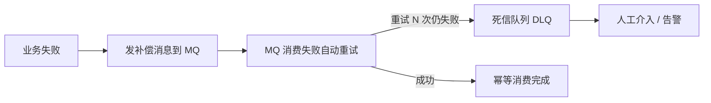

> 一切皆可重试：让重试成为框架的默认能力

## 摘要

分布式系统里，异常处理的核心命题只有一个：**失败不丢、可重试、能恢复**。一个流程失败后，要么直接丢（用户懵、数据不一致），要么堆一堆 `try-catch` 手动补偿（代码乱、规则散）。

好的异常处理框架，应该把「重试」做成默认能力——业务代码只需要"把事做完"，至于"失败了怎么办、怎么重试、重试几次、实在不行怎么办"，交给框架统一处理。本文讲清楚这样一套「一切皆可重试」的框架该怎么分层、怎么设计。

---

## 一、第一层：统一异常拦截，先分类再决定怎么处理

异常往外抛的时候，不能裸奔。框架的第一层是一个全局切面，统一拦截异常、统一封装响应：

```java
// 全局异常处理（伪代码）
@RestControllerAdvice
public class GlobalExceptionHandler {

    // 未知异常 → 500
    @ExceptionHandler(Exception.class)
    public Rsp unknownException(Exception e) {
        log.error("unknown exception", e);
        return Rsp.fail("500-未知异常");
    }

    // 业务异常 → 200 + 业务码
    @ExceptionHandler(BIZException.class)
    public Rsp businessException(BIZException e) {
        return Rsp.fail(e.getBizCode(), e.getMessage());
    }

    // 参数校验异常 → 400
    @ExceptionHandler(MethodArgumentNotValidException.class)
    public Rsp validationException(MethodArgumentNotValidException e) {
        return Rsp.fail("参数校验失败:" + e.getBindingResult().getFieldErrors());
    }
}
```

但拦截只是入口，更关键的是**在拦截时就把异常分类**。不是所有异常都该重试，第一步要分清两类：

| 异常类型 | 例子 | 该怎么处理 |
|----------|------|-----------|
| **可重试（临时性）** | 网络抖动、超时、下游限流、数据库短暂不可用 | 退避重试 |
| **不可重试（确定性）** | 参数错误、业务规则不满足、数据不存在 | 直接失败，重试也是白费 |

分类的意义在于：**重试只对"临时性"异常有效**。对一个"参数错误"重试一百次，结果不会变，纯属浪费。框架要把这个判断显式化，而不是让每个业务方自己拍脑袋。

---

## 二、第二层：同步重试，退避 + 抖动

对于「轻操作」——一次下游 HTTP 调用、一个短事务——失败后适合**同步重试**：稍等再试几次，简单直接。但重试不能"固定间隔猛试"，要**指数退避 + 随机抖动**：

```
第 1 次重试：立即
第 2 次重试：1 秒后
第 3 次重试：2 秒后
第 4 次重试：4 秒后
...（指数退避，每次翻倍，上限封顶）
+ 每次叠加一个随机抖动（jitter），避免"惊群效应"
```

退避让下游有时间恢复；抖动避免大量失败请求同时重试、造成二次雪崩。这些策略应该**声明式配置**，而不是手写 `retryCount >= 15` 这种散落的魔法数字：

```java
// 声明式重试：只对"可重试异常"生效（伪代码）
@Retryable(
    retryFor = {TimeoutException.class, ConnectionException.class},  // 只有这些异常重试
    noRetryFor = {IllegalArgumentException.class},                    // 这些直接失败
    maxAttempts = 5,                     // 最多 5 次
    backoff = @Backoff(delay = 1000, multiplier = 2, jitter = 0.3)  // 指数退避 + 抖动
)
public void processCalibrate(CalibrateEvent event) { ... }
```

重试次数、退避参数、哪些异常重试，全部收敛到注解，用 Spring Retry 或 Resilience4j 这类成熟框架承载。

---

## 三、第三层：异步补偿，消息队列天然重试 + 死信队列

但有些是「重逻辑」——比如定标这种耗时计算、需要多方协调的流程。它们**不能阻塞主流程同步重试**，而应该**异步补偿**：失败后把事件丢进消息队列，由后台异步重试。

这里有一个容易踩的坑：很多人会"手搓一个消息队列"——失败的事件落库、写个定时任务扫表重试。落库是"持久化"、扫表是"投递"、重试是"重新消费"，这三点恰好就是消息队列的职责。既然如此，直接用真正的消息队列，天然具备这三项能力：



- **持久化**：消息队列天然持久化，不用自己落库。
- **重试**：消费失败自动重试，不用定时扫描。
- **死信**：超过重试上限自动进死信队列，人工介入。
- **及时性**：失败立即重试，不用等扫描间隔。

异步补偿里，失败的事件按类型分型，覆盖业务流程的各个关键环节（生成标、首轮开始、末轮结束、入围、定标……），每个类型对应一个补偿处理器，由框架自动注册、自动分发：

```java
// 补偿事件类型（伪代码）
public enum CompensateEventType {
    GENERATE(1, "生成标"),
    FIRST_ROUND_START(2, "首轮开始"),
    LAST_ROUND_END(3, "末轮结束"),
    ENTRY(4, "入围"),
    CALIBRATE(5, "定标"),
    // ...
}
```

---

## 四、第四层：幂等，重试的前提

重试的前提是**消费方幂等**——同一个事件重放多次，结果不变。没有幂等，重试就是"重复执行"，会造成数据重复、状态错乱。两个手段保证幂等：

1. **事件带幂等键**：每个事件带一个 `bizKey`，消费方用 `bizKey` 去重（比如数据库唯一索引，重复插入自动拦截）。
2. **状态机自环**：如果状态已经是终态，重放的事件不产生副作用——这正好复用「状态流转」里状态机的自环设计（`待发布 → 待发布` 这种重复事件不改变状态）。

幂等是贯穿始终的：从"重试"到"死信"，每一层都以幂等为前提，否则重试链条本身就会制造新的脏数据。

---

## 五、第五层：统一兜底，失败自动补偿

最后一层是把"兜底"收敛到框架。补偿的触发不该散落在业务代码里——每个 `catch` 里手动写"发补偿消息"迟早会漏、会不一致。框架应该在事务失败时**自动兜底**：

```java
// 统一的失败兜底：事务回滚后自动发补偿消息（伪代码）
@TransactionalEventListener(phase = AFTER_ROLLBACK)
public void onRollback(BusinessEvent event) {
    // 事务回滚了，发补偿消息到死信主题，交给补偿流程
    compensationProducer.send(event.toCompensationMessage());
}
```

这样"哪些流程要补偿、怎么补偿"从"散落的 try-catch"收敛到"框架层的统一兜底"，业务代码专注"把事情做完"，失败补偿是框架的默认行为。

---

## 六、架构思想提炼

"一切皆可重试"的异常处理框架，是五层递进的：

1. **统一拦截**：全局切面统一捕获异常、统一响应封装，异常在入口处就分类。

2. **异常分类**：可重试（临时性）与不可重试（确定性）分开，前者退避重试、后者直接失败——重试只对临时性异常有效。

3. **同步重试**：轻操作失败后同步重试，指数退避 + 随机抖动，声明式配置，消灭魔法数字。

4. **异步补偿**：重逻辑失败后异步补偿，用消息队列的天然重试 + 死信队列，而不是手搓"落库 + 轮询"。

5. **幂等 + 统一兜底**：重试以幂等为前提（幂等键 + 状态机自环）；兜底收敛到框架层（事务后置钩子），而不是散落在业务代码里。

**失败一定会来，重试是默认，兜底是底线。**

