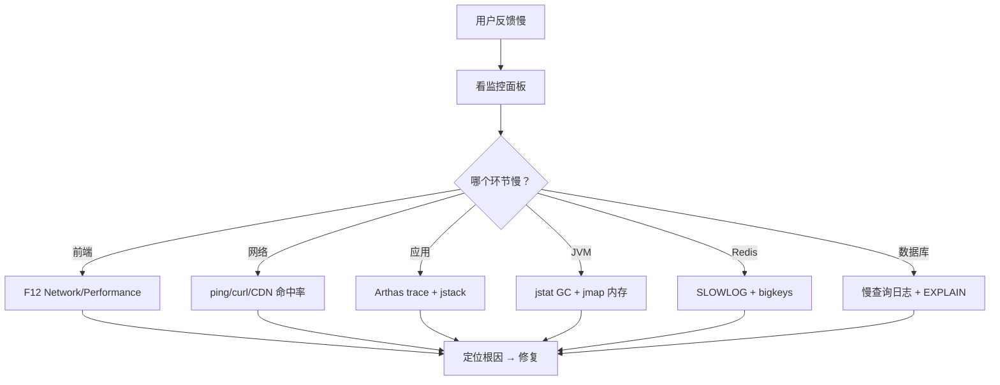

> 线上出了一个问题：「用户反映订单列表加载很慢」。这个问题可能出在——前端渲染慢、CDN 缓存失效、Nginx 配置不当、应用线程池耗尽、JVM 频繁 GC、数据库慢查询、Redis 热点 Key、MQ 消息堆积——任何一个环节。没有一个银弹工具能直接告诉你「问题在这里」。需要的是：一套从外到内的排查流程，逐步缩小范围，最终定位根因。

## 一、排查的通用原则

### 1.1 从外到内，逐步缩小

```
用户反馈「慢」
  → Step 1: 确认范围（所有人慢？还是特定接口慢？）
  → Step 2: 定位环节（前端？网络？后端？DB？）
  → Step 3: 定位组件（哪个服务？哪个方法？哪条 SQL？）
  → Step 4: 定位根因（为什么慢？）
  → Step 5: 修复 + 验证
```

### 1.2 先看监控，再动手

```
动手排查之前，先看三个仪表盘：
  1. 应用监控（Arms/Prometheus）：QPS、RT、错误率、线程数
  2. JVM 监控：堆使用率、GC 频率/耗时、线程状态
  3. 基础设施监控：CPU、内存、磁盘 IO、网络带宽

80% 的问题在监控面板上就能看出端倪。
```

## 二、前端层面

### 2.1 浏览器 F12

```
F12 → Network 面板：
  - 看 Waterfall：哪个资源加载最慢？
  - TTFB（Time To First Byte）> 500ms → 后端慢
  - Content Download 慢 → 响应体太大（没压缩？数据太多？）
  - 大量小请求 → 考虑合并/HTTP2

F12 → Performance 面板：
  - Long Task > 50ms → JS 阻塞渲染
  - Layout Thrashing → 频繁重排

F12 → Console：
  - JS 报错 → 可能导致白屏
```

### 2.2 CDN 和静态资源

```
检查：
  - CDN 命中率（低命中率 → 回源慢）
  - 静态资源是否开启 gzip/brotli 压缩
  - Cache-Control 头是否正确
  - 大图片是否做了压缩/WebP 转换

工具：curl -I https://cdn.example.com/image.jpg → 看响应头
```

## 三、网络层

### 3.1 Nginx

```bash
# 查看 Nginx 访问日志，找慢请求
tail -f /var/log/nginx/access.log | awk '{print $NF, $0}' | sort -rn | head

# 看 Nginx 的 upstream 响应时间
# log_format 中加 $upstream_response_time

# 常见 Nginx 问题：
# 1. worker_connections 不够 → 502
# 2. proxy_read_timeout 太短 → 504
# 3. keepalive 没开 → 每个请求新建连接
```

### 3.2 网络延迟

```bash
# 应用服务器到数据库的网络延迟
ping db-server     # > 1ms 不正常（同机房应该 < 0.5ms）

# 看网络带宽是否打满
sar -n DEV 1       # 每秒采样网络 IO

# DNS 解析慢？
time nslookup some-domain.com
```

## 四、应用层

### 4.1 线程池

```bash
# 用 Arthas 查看线程池状态
thread -n 5                    # CPU 最高的 5 个线程
thread --state BLOCKED          # 阻塞的线程
thread --state WAITING          # 等待的线程

# 关键指标：
# - 活跃线程数 / 最大线程数 → 接近 100% → 线程池满了
# - 队列大小 → 持续增长 → 消费速度跟不上
# - 大量 BLOCKED → 锁竞争
```

### 4.2 JVM 层面

```bash
# GC 是否正常？
jstat -gc <pid> 1000 5
# 看 FGC 列（Full GC 次数）和 FGCT（Full GC 总耗时）
# Full GC > 0 且 FGCT 持续增长 → GC 问题

# 内存是否泄漏？
jmap -histo:live <pid> | head -20
# 看哪个类的实例数异常多

# 有没有死锁？
jstack <pid> | grep "deadlock" -A 10
```

### 4.3 代码层面

```
常见慢查询的根因：
  1. N+1 查询：循环里查 DB → 改为批量查询
  2. 大对象序列化：一个对象 10MB → 拆成小对象
  3. 同步调用链：A → B → C → D，每个 100ms → 总 400ms → 改为异步/并行
  4. 锁竞争：热点 Key 的所有请求串行 → 加本地缓存/分段锁
  5. 正则回溯：复杂正则匹配 → Catastrophic Backtracking → CPU 100%

工具：Arthas trace 命令
  trace com.example.service.OrderService '*' -n 3
  → 显示每个方法的耗时，找到最慢的调用链
```

## 五、缓存层（Redis）

### 5.1 Redis 慢查询

```bash
# 查看 Redis 慢查询日志
redis-cli SLOWLOG GET 10

# 常见 Redis 慢的原因：
# 1. 大 Key 操作：HGETALL 100 万元素的 Hash → 阻塞整个实例
# 2. 复杂命令：KEYS * → 改用 SCAN
# 3. 网络：应用和 Redis 不在同一机房

# 找大 Key
redis-cli --bigkeys

# 找热点 Key
redis-cli --hotkeys
```

### 5.2 缓存穿透/击穿/雪崩

| 问题 | 特征 | 解法 |
|------|------|------|
| **穿透** | 查询不存在的 Key，每次都打穿到 DB | 布隆过滤器 / 缓存空值 |
| **击穿** | 热点 Key 过期瞬间，大量请求打到 DB | 互斥锁 / 永不过期 + 异步刷新 |
| **雪崩** | 大量 Key 同时过期 | 过期时间加随机值 / 多级缓存 |

## 六、数据库层

### 6.1 慢查询定位

```sql
-- MySQL 开启慢查询日志
SET GLOBAL slow_query_log = ON;
SET GLOBAL long_query_time = 1;  -- 超过 1 秒的记录

-- 查看慢查询
SELECT * FROM mysql.slow_log ORDER BY query_time DESC LIMIT 10;

-- 或用 pt-query-digest 分析
pt-query-digest /var/log/mysql/slow.log > slow_report.txt
```

### 6.2 EXPLAIN 分析

```sql
EXPLAIN SELECT * FROM orders WHERE user_id = 123 AND status = 'PAID';

-- 关键看：
-- type: ALL(全表扫描) → ref(索引查找) → const(唯一索引) → 越来越好
-- key: 实际使用的索引（NULL = 没走索引）
-- rows: 预估扫描行数（越大越慢）
-- Extra: Using filesort(需要排序) / Using temporary(临时表) → 都是性能杀手
```

### 6.3 连接池

```java
// HikariCP 关键配置
spring.datasource.hikari.maximum-pool-size=20       # 不是越大越好
spring.datasource.hikari.minimum-idle=10
spring.datasource.hikari.connection-timeout=3000     # 3 秒拿不到连接 → 报错
spring.datasource.hikari.idle-timeout=600000         # 10 分钟回收空闲连接
spring.datasource.hikari.max-lifetime=1800000        # 30 分钟强制回收

// 常见问题：
// 1. 连接池满了 → 请求排队 → RT 飙升
//    → 检查：是否有慢 SQL 占着连接不释放
// 2. 连接泄漏 → 代码里获取了连接但没关闭
//    → 检查：leak-detection-threshold=60000（60 秒未归还告警）
```

## 七、排查流程图



## 八、排查工具速查

| 层面 | 工具 | 用途 |
|------|------|------|
| 前端 | Chrome DevTools | Network/Performance/内存快照 |
| 网络 | curl/wireshark/ping | 请求追踪、抓包、延迟 |
| Nginx | access.log + $upstream_response_time | 定位慢在哪个 upstream |
| 应用 | Arthas | trace/watch/thread/jad |
| JVM | jstat/jmap/jstack/jcmd | GC/内存/线程/诊断命令 |
| Redis | redis-cli --bigkeys/SLOWLOG | 大 Key/慢命令 |
| MySQL | slow_log + EXPLAIN + pt-query-digest | 慢查询分析 |
| 链路追踪 | SkyWalking/Jaeger/Zipkin | 全链路调用链 |

## 结语

全链路排查不是「猜」——是**从外到内、用数据缩小范围**的科学方法。

> 先看监控确定大方向，再用工具逐步深入。80% 的问题在监控面板上就能看出端倪，剩下 20% 需要 Arthas/jstack/EXPLAIN 精确打击。建立标准化的排查流程，下次遇到同样的问题，30 分钟而不是 3 小时。

每一次线上事故都是一次学习机会。把排查过程记录下来，下次同样的问题，直接走 Checklist。
