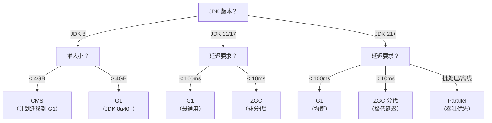

> 选 GC 不是「哪个最新用哪个」。Parallel 在批处理场景下吞吐最高，G1 在大部分应用里是最安全的选择，ZGC 在延迟敏感的场景下无敌但需要 JDK 21+。CMS 已经被废弃了但还有大量老系统在跑。理解每种回收器的设计取舍，才能做出正确的选择。

## 一、分代理论的工程意义

```
堆内存分代的原因：
  1. 大多数对象朝生夕死（临时变量、请求对象）
  2. 少量对象长期存活（缓存、配置、连接池）
  3. 分代后：Young GC 只扫新生代 → 快（回收率高、对象少）
            Full GC 才扫老年代 → 慢（尽量少触发）

新生代（Young Gen）：
  Eden (80%) + Survivor From (10%) + Survivor To (10%)
  → 新对象在 Eden 分配
  → Young GC：Eden + From 存活对象 → To
  → 翻转：From ↔ To
  → 存活超过阈值（默认 15 次）→ 晋升到老年代

老年代（Old Gen）：
  → 长期存活的对象
  → Full GC 才回收 → 耗时长 → 尽量避免
```

## 二、六种 GC 回收器对比

### 2.1 全景图

| GC | JDK 版本 | 算法 | 停顿类型 | 堆大小 | 适合场景 |
|-----|---------|------|---------|--------|---------|
| **Serial** | 1.0+ | 标记-复制/标记-清除 | 全 STW | <100MB | 客户端/嵌入式 |
| **Parallel** | 1.4+ | 标记-复制/标记-清除 | 全 STW | 任意 | **批处理/后台任务（吞吐优先）** |
| **CMS** | 1.4-14 | 标记-清除 | 低停顿（但会 Full STW） | <4GB | 老系统（**已废弃**） |
| **G1** | 6+ | 分区标记-整理 | 可预测停顿 | >4GB | **大部分应用（推荐）** |
| **ZGC** | 15+（21 分代） | 彩色指针 + 读屏障 | 亚毫秒 STW | 任意（TB 级） | **极低延迟** |
| **Shenandoah** | 12+ | 读屏障 + Brooks Pointer | 亚毫秒 STW | 任意 | 极低延迟（Red Hat） |

### 2.2 GC 算法对比

| 算法 | 优点 | 缺点 | 代表 GC |
|------|------|------|---------|
| **标记-复制** | 无碎片、速度快 | 浪费一半空间 | Serial/Parallel Young |
| **标记-清除** | 不浪费空间 | 碎片化 | CMS Old |
| **标记-整理** | 无碎片 | 需要移动对象（STW 长） | G1/ZGC |

## 三、CMS：为什么被废弃

### 3.1 CMS 的四阶段

```
Initial Mark（初始标记）：STW，标记 GC Roots 直接引用的对象 → 快
Concurrent Mark（并发标记）：与用户线程并行，遍历对象图 → 慢但不停顿
Remark（重新标记）：STW，修正并发标记期间的变动 → 可能较长
Concurrent Sweep（并发清除）：与用户线程并行，清理垃圾 → 产生碎片

问题：
  1. 并发清除期间用户线程还在分配对象 → Concurrent Mode Failure → 退化为 Serial Full GC
  2. 标记-清除 → 内存碎片 → 大对象分配失败 → Full GC
  3. CPU 敏感：并发阶段占用 CPU → 影响应用吞吐
```

### 3.2 CMS 的关键参数

```bash
# 如果必须用 CMS（老系统迁移中）
-XX:+UseConcMarkSweepGC
-XX:+UseCMSInitiatingOccupancyOnly
-XX:CMSInitiatingOccupancyFraction=75  # 老年代 75% 时触发（默认 92%，太晚）
-XX:+CMSClassUnloadingEnabled           # 回收元空间
-XX:+CMSParallelRemarkEnabled           # Remark 并行
-XX:+UseCMSCompactAtFullCollection      # Full GC 时压缩碎片

# ⚠️ CMS 在 JDK 9 标记废弃，JDK 14 移除
# 迁移路线：CMS → G1
```

## 四、G1：当前最通用的选择

### 4.1 Region 机制

```
G1 把堆分成多个 Region（默认 2048 个，每个 1-32MB）：

[ E ][ E ][ E ][ S ][ O ][ O ][ H ][ H ]
 Eden  Eden  Eden  Surv  Old  Old  Humongous

每个 Region 可以是 Eden/Survivor/Old/Humongous（大对象）

G1 的 GC 策略：
  1. 维护每个 Region 的回收收益（存活对象越少，收益越高）
  2. 在用户指定的 MaxGCPauseMillis 内，优先回收收益最高的 Region
  3. 这就是 "Garbage-First" 名字的由来
```

### 4.2 Mixed GC

```
Young GC：只回收 Eden + Survivor（类似传统 GC）

Mixed GC：回收 Eden + Survivor + 部分 Old Region
  → 目的：在不触发 Full GC 的前提下，逐步清理老年代

Full GC：所有 Region 一起回收（STW，应该尽量避免）
  → G1 的 Full GC 是单线程的 → 非常慢 → 调优的目标就是避免 Full GC
```

### 4.3 G1 调优核心参数

```bash
-XX:+UseG1GC
-XX:MaxGCPauseMillis=100          # 目标最大停顿（不是保证值！）
-XX:G1HeapRegionSize=4m           # Region 大小（默认自适应）
-XX:InitiatingHeapOccupancyPercent=45  # IHOP：老年代 45% 时触发并发标记
-XX:G1ReservePercent=10           # 预留 10% 空间防止 to-space exhausted
-XX:ParallelGCThreads=8           # 并行 GC 线程数（默认 = CPU 核数）
-XX:ConcGCThreads=2               # 并发标记线程数（默认 = 并行线程数/4）
```

**IHOP 调优**：IHOP 太低 → 频繁 Mixed GC；IHOP 太高 → 并发标记来不及 → Full GC。经验值：45-50%。

### 4.4 G1 日志解读

```
[GC pause (G1 Evacuation Pause) (young) (initial-mark), 0.0234567 secs]
   [Parallel Time: 18.2 ms, GC Workers: 8]
      [Ext Root Scanning: 2.1 ms]
      [Update RS: 1.5 ms]
         [Processed Buffers: 12]
      [Scan RS: 3.2 ms]
      [Code Root Scanning: 0.8 ms]
      [Object Copy: 8.1 ms]
      [Termination: 1.2 ms]
      [GC Worker Other: 0.5 ms]
      [GC Worker Total: 17.4 ms]
      [GC Worker End: 0.0 ms]
   [Code Root Fixup: 0.1 ms]
   [Code Root Migration: 0.2 ms]
   [Code Root Purge: 0.0 ms]
   [Clear CT: 0.3 ms]
   [Other: 4.8 ms]
      [Choose CSet: 0.0 ms]
      [Ref Proc: 2.1 ms]
      [Ref Enq: 0.1 ms]
      [Redirty Cards: 0.5 ms]
      [Humongous Register: 0.1 ms]
      [Humongous Reclaim: 0.3 ms]
      [Free CSet: 1.2 ms]
   [Eden: 512M(512M)->0B(320M) Survivors: 48M->64M Heap: 1.5G(2G)->1.0G(2G)]

关键看：
  - Parallel Time: 18.2ms → 并行阶段耗时
  - Object Copy: 8.1ms → 对象拷贝耗时（存活对象多则此值大）
  - Other > 2ms → 可能有问题（Ref Proc 高 = 弱引用处理慢）
  - Heap: 1.5G → 1.0G → 回收了 500MB
```

## 五、ZGC：亚毫秒停顿的终极方案

### 5.1 核心技术

```
ZGC 的两个核心技术：

1. 彩色指针（Colored Pointers）：
   在 64 位指针中借用高 4 位存储元数据（标记位、重映射位等）
   → 不需要额外的数据结构记录对象状态
   → GC 线程和用户线程可以同时操作对象

2. 读屏障（Load Barrier）：
   每次读对象引用时，检查指针的标记位
   → 如果对象被移动了 → 自动修复指针（forwarding）
   → 用户线程感知不到对象移动
   → 几乎不需要 STW

结果：STW 阶段只做「根扫描 + 线程栈修复」→ < 1ms
```

### 5.2 ZGC 的代价

| 优势 | 代价 |
|------|------|
| STW < 1ms（与堆大小无关） | CPU 开销增加 5-15%（读屏障） |
| 支持 TB 级堆 | 内存占用增加 ~15%（彩色指针 + 多映射） |
| 并发整理（无碎片） | JDK 21 前不支持分代（21+ 支持） |
| 不需要调优参数 | 小堆（< 4GB）优势不明显 |

### 5.3 ZGC 配置

```bash
# Java 21+（分代 ZGC）
-XX:+UseZGC
-XX:+ZGenerational            # 开启分代（Java 21+）
-XX:MaxGCPauseMillis=10       # 目标 10ms（通常能轻松达到）

# Java 17（非分代 ZGC）
-XX:+UseZGC
-XX:SoftMaxHeapSize=4g        # 软上限（ZGC 会自动扩缩）

# 验证 ZGC 是否生效
java -XX:+UseZGC -version
# 输出包含 "using ZGC" 表示成功
```

## 六、GC 选型决策树



## 七、GC 调优的通用原则

1. **先选对 GC，再调参数**——Parallel 的参数调得再好，也做不到 G1 的低延迟
2. **不要过早优化**——大多数应用用默认 GC 就够了
3. **先看 GC 日志**——80% 的 GC 问题在日志里就能看到根因
4. **避免 Full GC**——Full GC 是性能的头号杀手
5. **堆不是越大越好**——堆越大，Full GC 越慢（G1/ZGC 除外）

## 结语

GC 回收器不是「越新越好」——是「越适合场景越好」。

> Parallel 在批处理场景下无人能敌，G1 在大部分应用里是最安全的选择，ZGC 在延迟敏感的场景下是终极方案，CMS 虽然被废弃但理解它有助于理解 G1 和 ZGC 的设计动机。

理解每种 GC 的设计哲学和 trade-off，才能在正确的场景选择正确的回收器。
