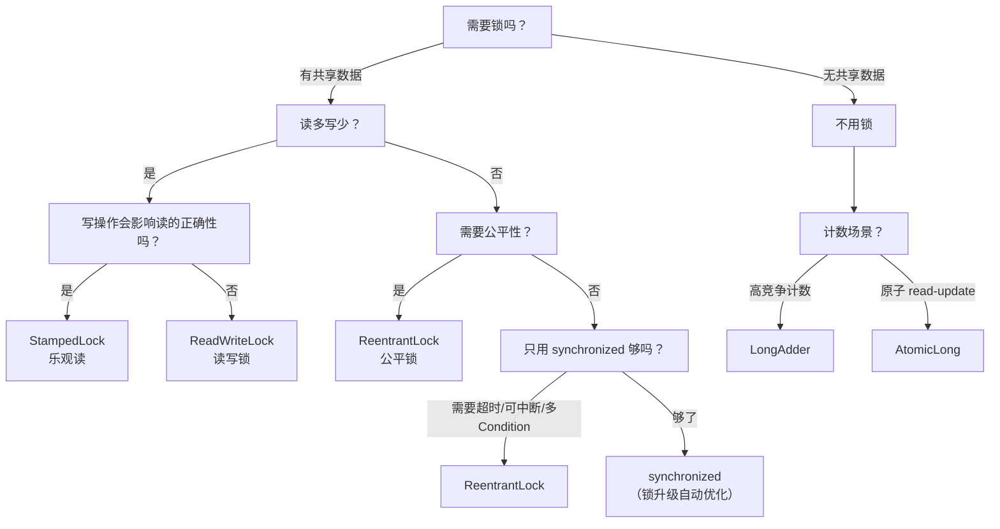

> Java 的锁经历了从「粗暴」到「精细」的演进：synchronized 是 JVM 内置的万能锁，ReentrantLock 给了开发者更多控制，CAS 实现了无锁编程，锁升级让 synchronized 在低竞争时比 ReentrantLock 还快。理解每种锁的适用场景和内部机制，才能在并发编程中做出正确的选择。

## 一、synchronized 的锁升级

### 1.1 四种锁状态

```
无锁 → 偏向锁 → 轻量级锁 → 重量级锁
  ↑                    ↑
  无竞争               有竞争但时间短
                      ↓
                  竞争激烈/等待时间长
```

| 锁状态 | Mark Word 内容 | 适用场景 | 加锁开销 |
|--------|---------------|---------|---------|
| **无锁** | hashCode + GC 分代年龄 | 无线程竞争 | 零 |
| **偏向锁** | 线程 ID + Epoch | 单线程反复进入同一锁 | 极低（CAS 一次） |
| **轻量级锁** | 指向栈帧 Lock Record 的指针 | 多线程交替执行（无竞争） | 中（自旋 + CAS） |
| **重量级锁** | 指向 Monitor 对象的指针 | 多线程同时竞争 | 高（OS 互斥量，线程阻塞） |

### 1.2 升级过程

```java
synchronized (obj) {
    // 步骤 1：检查 obj 的 Mark Word
    //   如果是无锁 → CAS 尝试设置偏向锁（写入当前线程 ID）
    //   如果偏向锁的线程 ID 是自己 → 直接进入（零开销）
    //   如果偏向锁的线程 ID 是别人 → 撤销偏向锁 → 升级轻量级锁

    // 步骤 2：轻量级锁
    //   在当前线程栈帧创建 Lock Record
    //   CAS 尝试把 Mark Word 替换为指向 Lock Record 的指针
    //   成功 → 获得锁
    //   失败 → 自旋等待（默认 10 次）

    // 步骤 3：自旋失败 → 升级重量级锁
    //   创建 Monitor 对象（OS 互斥量）
    //   线程进入 WAITING 状态（让出 CPU）
    //   解锁时唤醒等待线程
}
```

**关键优化**：Java 15+ 默认禁用偏向锁（`-XX:-UseBiasedLocking`），因为偏向锁的撤销代价高，且现代应用很少是单线程反复进入同一锁的场景。

### 1.3 锁消除与锁粗化

```java
// 锁消除：JIT 编译器检测到锁不会被其他线程访问，直接消除
public String concat(String a, String b) {
    StringBuffer sb = new StringBuffer();  // StringBuffer 内部 synchronized
    sb.append(a);
    sb.append(b);
    return sb.toString();
    // JIT 发现 sb 是局部变量，不可能被其他线程访问
    // → 消除所有 synchronized → 性能等同于 StringBuilder
}

// 锁粗化：相邻的同步块合并为一个，减少加锁/解锁次数
for (int i = 0; i < 1000; i++) {
    synchronized (lock) {  // ← 1000 次加锁/解锁
        doSomething();
    }
}
// 粗化后：
synchronized (lock) {     // ← 1 次加锁/解锁
    for (int i = 0; i < 1000; i++) {
        doSomething();
    }
}
```

## 二、ReentrantLock：synchronized 的增强版

### 2.1 核心差异

| 能力 | synchronized | ReentrantLock |
|------|-------------|---------------|
| 可中断 | ❌（阻塞不可打断） | ✅ `lockInterruptibly()` |
| 超时 | ❌ | ✅ `tryLock(timeout)` |
| 公平锁 |  | ✅ `new ReentrantLock(true)` |
| 条件变量 | ❌（只有一个等待队列） | ✅ 多个 `Condition` |
| 锁查询 | ❌ | ✅ `isLocked()`, `getQueueLength()` |

### 2.2 公平锁 vs 非公平锁

```java
// 非公平锁（默认）：新来的线程直接抢锁，抢不到再排队
ReentrantLock lock = new ReentrantLock();  // 默认 false（非公平）

// 公平锁：严格按 FIFO 排队
ReentrantLock fairLock = new ReentrantLock(true);

// 区别：
// 非公平锁：吞吐量高（减少线程唤醒/阻塞的开销），但可能饥饿
// 公平锁：绝对公平，但吞吐量低 20-30%（每次都要检查队列）

// 生产选择：99% 的场景用非公平锁。
// 只有在「必须保证顺序」的场景（如按序处理消息）才用公平锁。
```

### 2.3 必须 unlock 在 finally 里

```java
ReentrantLock lock = new ReentrantLock();
lock.lock();
try {
    doSomething();
} finally {
    lock.unlock();  // ← 必须在 finally 里！否则异常时锁不释放 → 死锁
}

//  错误写法
lock.lock();
doSomething();  // 如果这里抛异常 → 锁永远不释放
lock.unlock();
```

## 三、ReadWriteLock 与 StampedLock

### 3.1 读写锁

```java
ReadWriteLock rwLock = new ReentrantReadWriteLock();

// 读锁（共享）：多个线程可以同时读
rwLock.readLock().lock();
try { return cache.get(key); }
finally { rwLock.readLock().unlock(); }

// 写锁（独占）：同一时刻只有一个线程能写
rwLock.writeLock().lock();
try { cache.put(key, value); }
finally { rwLock.writeLock().unlock(); }

// 适用场景：读多写少（如缓存）。读:写 = 10:1 以上才有明显收益。
// 不适用：写多读少（写锁会阻塞所有读，退化为一把互斥锁）。
```

### 3.2 StampedLock：读写锁的进化版

```java
StampedLock sl = new StampedLock();

// 乐观读（不阻塞写者）
long stamp = sl.tryOptimisticRead();
Object data = cache.get(key);
if (!sl.validate(stamp)) {  // 验证读期间是否有写操作
    // 有写操作 → 降级为悲观读
    stamp = sl.readLock();
    try { data = cache.get(key); }
    finally { sl.unlockRead(stamp); }
}

// 为什么比 ReadWriteLock 快？
// ReadWriteLock：读锁也会阻塞写者（写者要等所有读锁释放）
// StampedLock：乐观读不阻塞写者 → 写者不用等 → 吞吐量更高
//
// 代价：乐观读需要 validate，代码更复杂。
```

## 四、CAS 与原子类

### 4.1 CAS 原理

```
CAS (Compare-And-Swap)：
  1. 读当前值 V
  2. 计算新值 N
  3. CAS(V, expected, N)：如果内存中的值 == expected，更新为 N；否则失败重试

伪代码：
  do {
      expected = value;       // 读
      newValue = expected + 1; // 计算
  } while (!CAS(value, expected, newValue));  // 比较并交换
```

**ABA 问题**：值从 A→B→A，CAS 以为没变——但中间被人改过。

```java
// 解法：AtomicStampedReference（带版本号的 CAS）
AtomicStampedReference<Integer> ref = new AtomicStampedReference<>(0, 0);
ref.compareAndSet(0, 1, 0, 1);  // 期望值=0, 新值=1, 期望版本=0, 新版本=1
// 如果有人把 0→1→0（版本从 0→2），CAS(0, 0, 0, 1) 会因为版本不匹配而失败
```

### 4.2 原子类的性能陷阱

```java
// ❌ 高竞争下 AtomicLong 性能差（所有线程 CAS 同一个变量）
AtomicLong counter = new AtomicLong(0);
for (int i = 0; i < 10000; i++) {
    executor.submit(() -> counter.incrementAndGet());  // 大量 CAS 冲突
}

// ✅ LongAdder：分段 CAS，低竞争时合并
LongAdder adder = new LongAdder();
for (int i = 0; i < 10000; i++) {
    executor.submit(() -> adder.increment());  // 分散到多个 cell，冲突少
}
// 读取：adder.sum()（合并所有 cell，有轻微延迟）

// 选择：
// 读多写少、高竞争 → LongAdder
// 需要原子 read-and-update → AtomicLong
```

## 五、ConcurrentHashMap：锁粒度的极致优化

### 5.1 三代演进

| 版本 | 锁策略 | 并发度 | 特点 |
|------|--------|--------|------|
| JDK 1.7 | 分段锁（Segment） | 16 | 16 个 Segment，每个独立锁 |
| JDK 1.8 | CAS + synchronized | 桶粒度 | 每个桶独立加锁，锁粒度更细 |
| 现代 JVM | 锁升级 | 桶粒度 | 低竞争时自旋，高竞争时才重量级锁 |

### 5.2 JDK 1.8 的 put 流程

```
1. 计算 key 的 hash → 定位到桶 i
2. 桶为空 → CAS 插入（无锁）
3. 桶不为空 → 检查首节点
   a. 首节点的 hash == MOVED（-1）→ 正在扩容 → 帮助扩容
   b. 首节点是链表 → synchronized(首节点) → 遍历链表插入/更新
   c. 首节点是红黑树 → synchronized(首节点) → 树中插入/更新
4. 链表长度 > 8 → 树化（链表转红黑树）
5. 树节点 < 6 → 退化回链表
```

**关键设计**：`synchronized` 只锁桶的首节点，不是整个 Map。不同桶的写入互不阻塞。

## 六、锁选型决策树



## 结语

Java 的锁机制从「一把大锁」演进到了「按需选择最优策略」。

> synchronized 的锁升级让它在低竞争时几乎无开销，ReentrantLock 给了开发者精确控制的能力，CAS 实现了无锁编程，StampedLock 在读写场景下进一步突破了读写锁的瓶颈。

没有最好的锁，只有最适合场景的锁。理解每种锁的内部机制和 trade-off，才能在并发编程中做出正确的选择。
