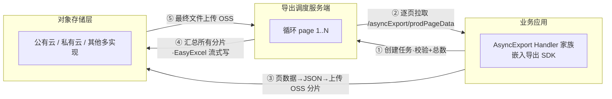
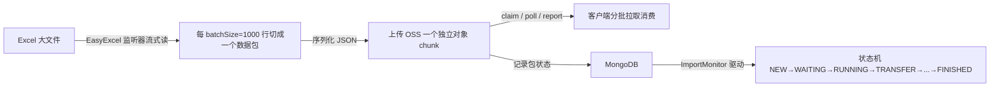

> 从「能不能导」到「怎么导不死」——一个异步流式导出框架的架构思想

## 摘要

招采（招标管理）系统每天要面对一个棘手的问题：把动辄几十万、上百万条的投标报价、线路信息、弃标记录导出成 Excel 给业务分析。如果沿用传统的「Controller 里查全表 → 内存拼 List → 一次性写 Excel → 同步返回文件流」，百万级数据会在瞬间击穿 JVM 堆内存、拖垮数据库连接、超时挂起整个 Web 线程。

本文拆解招采真正的导出实现（导出 SDK + `AsyncExportHandler` 框架 + 分页/游标 + OSS 分片 + 服务端流式汇总），还原它如何用「**模板注册 + 拉取式异步调度 + OSS 分片 + 游标深分页 + 流式汇总**」五板斧，把百万级导出变成一件从容的事。

---

## 一、传统方案为什么必死

先把问题摆清楚。导出百万级数据，表面是「查数据 + 写文件」，实际有四个不可调和的矛盾：

| 矛盾 | 传统做法 | 百万级时的后果 |
|------|----------|----------------|
| 内存 | `SELECT *` 全部加载进 `List<DTO>` | 100 万条 × 每条若干字段，轻松几个 GB，OOM |
| 响应 | 同步阻塞 Web 线程直到写完整文件 | 一个导出拖死一个 Tomcat 线程，几十秒超时 |
| 数据库 | 一次性 `SELECT` 全表 / 大 `IN` 列表 | 慢查询锁表，业务库被导出打挂 |
| 深分页 | `LIMIT offset, size` 逐页翻 | 翻到第 10 万页时 `OFFSET 1000000` 越翻越慢，O(n²) |

结论：**百万级导出不能用「拉全部 → 拼全部 → 写全部」的同步模型，必须拆成「按页生产 → 按片落盘 → 异步汇总」的流水线模型。**

---

## 二、总体架构：把导出变成一条「生产线」

### 2.0 先分流：小数据走同步，大数据走异步

在谈「百万级」之前，招采先做了一个务实的**分流决策**——不是所有导出都上异步，而是「按量」分两条轨道：

| 轨道 | 适用 | 实现 | 关键阈值 |
|------|------|------|----------|
| **同步导出** | 小数据量 | Controller 直接查库 → EasyExcel 写 `HttpServletResponse` | `maxSize=30000` 条 |
| **异步导出** | 大数据量 | 导出框架拉取式分页 + OSS 分片 + 服务端汇总 | 无上限（受内存/时间约束） |

同步导出走「短平快」路径，但写死上限：

```java
@Value("${tender.supplier.export.maxSize:30000}")
private int MAX_DOWN_SIZE;                 // 超过 3 万条
@Value("${tender.supplier.export.pageSize:200}")
private int MAX_DOWN_PAGE_SIZE;            // 每页 200

Long totalCount = rspListDTO.getCount();
if (totalCount.intValue() >= MAX_DOWN_SIZE) {
    throw new BIZException("超过最大限制数");   // 强制引导走异步导出
}
```

这个「分流」本身就是架构思想的第一层：**别用一个笨重的重方案去服务轻场景，也别让轻方案去硬扛重场景。** 同步方案 30000 条封顶，再往上就交给下面这条异步流水线。

### 2.1 异步流水线的四个角色

招采的异步导出不是「一个方法里干完」，而是一条跨进程、跨服务的**流水线**，四个角色各司其职：



**核心思想一句话：数据不是「查完等在那」，而是「调度方来一页、业务方产一页、产完就上云、最后服务端拼起来」。** 这个模式决定了内存占用永远只跟「一页大小」挂钩，而不是跟「总量」挂钩。

下面逐个拆解这五板斧。

---

## 三、板斧一：模板注册框架——`AsyncExportHandler`

导出的业务千差万别（弃标导出、报价流向导出、标准价导出、保证金导出……），但「怎么异步导出」这套骨架是共用的。于是抽出一个抽象基类：

```java
// 异步导出抽象基类（伪代码）
public abstract class AsyncExportHandler<T> implements InitializingBean {

    // 注册：Spring 初始化后，把自己按 templateCode 塞进工厂的 handlerMap
    public void afterPropertiesSet() {
        asyncExportHandlerFactory.registHandler(this.templateCode(), this);
    }

    protected abstract String templateCode();        // 模板编码，全局唯一

    public abstract void checkCreateTask(AsyncExportCreateReq dto);   // 建任务前校验
    public abstract Integer getTotal(Object param);                    // 导出总条数
    public abstract ExportPageDataDTO<T> getPageData(AsyncExportDataProdReq req); // 取一页

    public Map<String,Object> getExtData(AsyncExportDataProdReq req){ return null; } // 多sheet扩展
    public boolean dataValid(AsyncExportDataProdReq req){ return true; }             // 数据校验
}
```

工厂层做一个「模板编码 → 处理器」的注册表：

```java
// 模板编码 → 处理器 的注册表（伪代码）
@Component
public class AsyncExportHandlerFactory {
    private Map<String, AsyncExportHandler> handlerMap = new HashMap<>();

    public void registHandler(String templateCode, AsyncExportHandler h) {
        handlerMap.put(templateCode, h);
    }
    public AsyncExportDataProdRsp prodPageData(AsyncExportDataProdReq req) {
        return handlerMap.get(req.getTaskCode()).asyncExportCallback(req);
    }
}
```

招采侧在此基础上又加了一层 `CustomizedAsyncExportHandler<T>`，新增两件业务侧才关心的事：

```java
// 业务侧扩展：设备权限控制（伪代码）
public abstract class CustomizedAsyncExportHandler<T> extends AsyncExportHandler<T> {

    @Override
    public void checkCreateTask(AsyncExportCreateReq req) {
        // 招采功能安全限制：某些导出模板只允许特定设备(deviceWhiteList)使用
        if (CollectionUtil.contains(tenderConfig.getQuoteExportDeviceLimitTemplateCodes(), templateCode())) {
            Boolean res = resourceService.apiAccess(...);   // 设备级权限校验
            if (!Boolean.TRUE.equals(res)) {
                throw new BIZException("您/设备没有导出权限！请联系招采相关负责人");
            }
        }
    }
}
```

于是，业务同学要加一种导出，只需写一个几十行的 Handler，声明 `templateCode` 和「怎么查总数 / 怎么查一页」即可，例如弃标导出：

```java
@Component
public class AbandonBidExportHandler extends AsyncExportHandler<AbandonBidExportDTO> {
    @Override
    protected String templateCode() { return "AbandonBidExport"; }

    @Override
    public Integer getTotal(Object param) { /* 按条件 count */ }

    @Override
    public ExportPageDataDTO<AbandonBidExportDTO> getPageData(AsyncExportDataProdReq req) {
        // 按 req.getPageNum()/getPageSize() 查一页返回
    }
}
```

**架构收益：开闭原则落地。** 框架对「改」封闭，对「扩展」开放——新增导出模板不改框架一行代码，只加一个 Handler 并在导出平台配一个模板编码。招采里这族 Handler 有十几个（`TenderExportHandler`、`TenderQuoteFlowExportHandler`、`AbandonBidExportHandler`、`SupplierBondQueryExportHandler`……），全靠这套机制收敛。

---

## 四、板斧二：拉取式异步调度——「你来拉，我不推」

这是与「同步导出」最本质的分野。

### 4.1 建任务：先校验、先算总数、再异步

入口是两个 HTTP 接口，内嵌在业务应用里（`ExportController`）：

```java
@RestController
@RequestMapping("/asyncExport")
public class ExportController {
    @PostMapping("/createTask")     // 创建异步导出任务
    @PostMapping("/prodPageData")   // 服务端逐页来拉数据
}
```

建任务的核心逻辑在 `DataExportService.createTask`：

```java
public RspDTO<String> createTask(ExportTaskCreateReq req) {
    // 1. 补参数（当前登录人 username）
    AsyncExportCreateReq asyncReq = exportFilterService.supply(req);
    // 2. 校验任务参数（含设备权限）
    asyncExportHandlerFactory.checkCreateTask(asyncReq);
    // 3. 补充导出任务参数
    asyncExportHandlerFactory.supplyParam(asyncReq);
    // 4. 先算总数，为空直接拦截，不为空才远程建任务
    Integer total = asyncExportHandlerFactory.getTotal(templateCode, param);
    if (total <= 0) throw new BizException("数据总数为空，跳过任务创建");
    asyncReq.setTotal(total);
    // 5. 签名 + 蓝绿标识，POST 到调度服务端创建任务
    SignUtil.supplySign(userName, asyncReq);
    asyncReq.setEnvLabel(getEnvLabel());
    serverSao.postObject(getExportCreateUrl(), asyncReq, ...);
}
```

**这里有两个关键设计：**

1. **总数前置**：建任务前先 `getTotal`，总量为空直接拒绝，避免空跑一个异步任务；同时把 `total` 传给服务端，服务端据此决定要拉多少页。
2. **异步解耦**：用户点击导出，只拿到「任务已创建」就返回了，真正的数据生产在后台由调度服务端驱动。Web 线程不碰大数据。

### 4.2 生产数据：被动「响应拉取」，每页一往返

调度服务端拿到 `total` 后，按 `pageSize` 计算总页数，然后**逐页回调**业务应用的 `/asyncExport/prodPageData`。业务侧的处理器被动响应：

```java
// AsyncExportHandler.asyncExportCallback —— 框架最核心的方法
public AsyncExportDataProdRsp asyncExportCallback(AsyncExportDataProdReq request) {
    AsyncExportDataProdRsp response = new AsyncExportDataProdRsp();
    response.setTaskCode(request.getTaskCode());

    // 三面旗：总数 / 扩展信息 / 数据校验，按需触发
    if (request.getTotalQueryFlag() != null && request.getTotalQueryFlag())
        response.setTotal(this.getTotal(request));
    if (request.getExtQueryFlag() != null && request.getExtQueryFlag())
        response.setExtData(this.getExtData(request));
    if (request.getDataValidFlag() != null && request.getDataValidFlag())
        response.setDataValidResult(this.dataValid(request));

    if (request.getPageSize() == null || request.getPageSize() == 0)
        return response;

    // 取一页数据
    ExportPageDataDTO<T> pageData = this.getPageData(request);
    List<T> data = pageData.getData();
    if (data == null || data.isEmpty()) return response;

    // 关键：把这一页序列化后，作为一个独立 OSS 对象上传，返回地址 + 游标
    String ossPath = this.uploadObject(request.getTaskCode(), data);
    response.setOssPath(ossPath);
    response.setDataCursor(pageData.getDataCursor());
    return response;
}
```

注意这个请求对象 `AsyncExportDataProdReq` 里携带了完整的分页上下文：

```java
public class AsyncExportDataProdReq extends SignDTO {
    private String templateCode;   // 模板
    private String taskCode;       // 任务编码
    private Integer pageSize;      // 每页大小
    private Integer pageNum;       // 当前页
    private String param;          // 业务查询条件(json)
    private Object  dataCursor;    // 数据游标（深分页关键）
    private Boolean totalQueryFlag / extQueryFlag / dataValidFlag; // 三面旗
}
```

**「拉取式」的精髓在于：业务方是「无状态」的。** 它不保存「导到哪了」，而是每来一页就查一页、上一页就走。进度、页码、断点全部由调度服务端持有。业务侧的内存里，任何时刻只有「当前一页」的数据。

---

## 五、板斧三：OSS 分片——每页一个独立对象

`uploadObject` 把一页数据序列化成 JSON，直接以「任务码 + 随机 UUID」为名，作为一个**独立的 OSS 对象**上传：

```java
protected String uploadObject(String taskCode, List<T> dataList) {
    LocalDateTime now = LocalDateTime.now();
    String path = "asyncExport/data/" + now.format("yyyyMMdd")
                + "/" + taskCode + "/" + UUID.randomUUID();
    String data = this.stringSerialize(dataList);   // JSON
    OSSObject ossObject = new OSSObject()
            .container(config.getOssContainer())
            .objectName(path)
            .bytes(data.getBytes("UTF-8"))
            .expireTime(config.getExportOSSExpire());  // 过期自动清理
    ossClient.uploadObject(ossObject);
    return path;   // 返回这一页在 OSS 的地址
}
```

**为什么每页一个对象，而不是往一个大文件里 append？**

| 收益 | 说明 |
|------|------|
| **内存峰值恒定** | 每页产完即释放，内存永远只有一页大小（默认 200 条），与总量无关 |
| **天然可重试** | 某页失败，只重传这一页，不影响其它页 |
| **天然可并发** | 页与页之间无依赖，理论上可并行生产、并行上传 |
| **天然可断点** | 服务端按 ossPath 记录每页，中断后从断点续拉 |
| **自动清理** | `expireTime` 设置 `X-Delete-After`，临时中间对象到点自动删除 |

存储层是一个**多实现抽象**（`OSSClient` 接口 + 工厂），三种对象存储可插拔切换：

```java
// OSS 构建工厂（伪代码）—— 静态注册三种实现
// "PUBLIC-OBS"    -> PublicObsClientBuilder     (公有云 OBS)
// "PRIVATE-OSS"    -> PrivateOSSClientBuilder     (私有云对象存储)
// "PRIVATE-OSS-ONE"-> PrivateOneClientBuilder    (私有云 ONE)
```

业务方只依赖 `OSSClient` 接口，底层是公有云还是私有云，由 `config.getOssType()` 决定，运行时通过工厂构建对应 `ossClient` Bean 注入——这是「存储厂商可插拔」的落地。抽象接口如下：

```java
// OSS 抽象接口（伪代码）
public interface OSSClient {
    void uploadObject(OSSObject obj);        // 支持 bytes / filePath / objectStream 三种形态
    String getTempUrl(String container, String object, String method, Integer durationTime); // 临时下载链接
    InputStream getObject(String container, String objectName);
    boolean deleteObject(...);
}
```

私有云实现里，`uploadObject` 根据入参形态选择流式 / 文件 / 字节三种上传路径：

```java
// 私有云实现（伪代码）
if (obj.getObjectStream() != null)        // 流式（大文件走这个，-1 表示流式上传）
    ossClient.uploadObject(container, name, obj.getObjectStream(), -1, headers);
else if (obj.getFilePath() != null)       // 本地文件
    ossClient.uploadFile(container, name, obj.getFilePath(), headers);
else if (obj.getBytes() != null)          // 字节数组
    ossClient.uploadObject(container, name, obj.getBytes(), headers);
```

> 说明：中间「页数据」因为本身就是一页的量（几十 KB ~ 几 MB），走 `bytes` 即可；最终汇总出来的大 Excel 文件（可能几百 MB）在服务端走 `objectStream` / `filePath` 形态上传，由底层 OSS SDK 处理大文件分片。

---

## 六、板斧四：游标深分页——绕开 `OFFSET` 的性能陷阱

百万级导出最难缠的不是内存，而是**深分页**。传统 `LIMIT pageNo*pageSize, pageSize` 翻到后面，数据库要扫过前面所有行再丢弃，`OFFSET 1000000` 越来越慢。

招采的 Handler 用的是**游标（cursor / keyset）分页**，配合 ES 预筛。看一个真实实现：

```java
// 导出服务实现（伪代码）
public ExportPageDataDTO<PriceAuditExportRsp> getStaticPageData(AsyncExportDataProdReq req) {
    TenderPageQry qry = new TenderPageQry();
    qry.setPageSize(req.getPageSize());
    qry.setPageNo(req.getPageNum());

    // 关键：把上一页返回的游标传下去，实现 search_after 分页
    if (req.getDataCursor() != null) {
        qry.setSearchAfterId(JSON.parseArray(req.getDataCursor().toString()));
    }

    // 先用 ES 按业务条件筛出 id 集合，再用 id 集合回 DB 精查
    tenderPageQry = esQueryStrategy.buildQueryByEs(qry);
    Page<TenderPo> page = tenderQueryRepo.page(tenderPageQry);
    List<TenderPo> records = page.getRecords();

    // 生成本页的游标：取本页最后一条的 id（更早版本是 createTm+id 联合）
    Object dataCursor = getDataCursor(records);
    return new ExportPageDataDTO<>(converted, dataCursor);
}

private <T extends ICommonData> Object getDataCursor(List<T> records) {
    // 用最后一条记录的 id 作为下一页的起点
    return JSON.toJSONString(Lists.newArrayList(records.get(records.size() - 1).getId()));
}
```

对应的 SQL 形态是 `id > #{fromId} order by id asc`（而非 `OFFSET`）：

```sql
-- TenderMapper.xml
... from tender_order where activity_id = #{activityId} and id > #{fromId} order by id asc limit 1000
```

**游标分页为什么快？** 它把「跳过前 N 条」变成了「直接从上次断点之后取」，每次查询都命中主键索引、只扫一页的量，时间复杂度从 O(n²) 降到 O(n)。代价是游标需要靠「有序、稳定」的键（这里是 `id`，早期用 `createTm + id` 联合键解决时间并列的问题）来推进。

同时这里还有一层 **ES 预筛 + DB 精查** 的配合：

- 百万级数据里按「资源类型 / 活动 / 状态 / 地区」等复杂条件过滤，直接跑 DB 会很重；
- 先由 ES（`esQueryStrategy.buildQueryByEs`）用倒排索引快速圈定命中的主键 `idList`；
- 再拿这个（通常已经缩小很多的）`idList` 回 DB 分页取明细。

**ES 负责「筛得快」，DB 负责「取得准」**，两者各司其职，这是大数据量导出的常见组合拳。

---

## 七、板斧五：服务端流式汇总——EasyExcel 只写内存一次一页

调度服务端（独立部署）把逐页收回来的 OSS 分片汇总成最终 Excel。汇总的关键同样是**流式**：用 EasyExcel 的监听器 / 流式写，读一页、写一页，而不是把所有分片再读进内存拼一个大 List。

`AsyncExportDataProdRsp` 里预留了多 Sheet、表头、扩展信息的返回通道：

```java
public class AsyncExportDataProdRsp {
    private Integer total;                 // 总数
    private String  ossPath;               // 本页数据在 OSS 的地址
    private String  taskCode;              // 任务编码
    private Map<String,Object> extData;    // 扩展数据（如 {"sheet1":{...}}）
    private Map<String,Object> headerData; // 表头
    private Map<String,Object> sheetName;  // sheet 名
    private Object  dataCursor;            // 游标（驱动下一页）
    private Boolean dataValidResult;       // 校验结果
}
```

`getExtData` 的注释点明了多 Sheet 场景的约定格式：

```java
public Map<String,Object> getExtData(AsyncExportDataProdReq param) {
    // extDataJson 格式 {"sheet1":{"k1":"v1","k2":"v2"},"sheet2":{"k1":"v1","k2":"v2"}}
    return null;
}
```

例如「标准价线路信息导出」，一个 Excel 里 sheet1 是标的、sheet2 是线路，就是靠这个机制支撑的。最终大文件由服务端一次性上传到 OSS，并通过 `getTempUrl` 生成**带时效的临时下载链接**（私有云 `getTempUrl(container, object, method, durationTime)`）推送给用户——业务方不用把大文件再经过自己的内存。

---

## 八、对称的一侧：百万级「导入」也是同一种思想

理解了导出，顺带看异步导入服务端，会发现它用的是**同一套「分片 + 拉取」哲学，方向相反**：

导入是把「上游百万行 Excel」拆成小包，让下游客户端一批批拉去消费：



关键类与机制：

| 机制 | 实现 |
|------|------|
| 流式解析 | `StrArgReadListener.invoke` 逐行回调，攒够 `batchSize=1000` 触发 `executeBatch` |
| 分片上传 | `DataBatchHandlerDefault.pushPageDataToOSS`：每批序列化 JSON 上传为一个 OSS 对象 |
| 拉取消费 | `ImportDService.pollData`：客户端拉一个 `WAITING` 包；支持 `parallel`/`serial` 两种模式 |
| 状态机 | `ImportTaskStatus`（任务级）+ `ImportTransferStatus`（包级），MongoDB 持久化 |
| 并发控制 | `ImportDispatcher` 的 split/merge 线程池；`findAndModify` 乐观锁 `lockTask` |

**导出与导入一正一反，共享同一个内核**：**「把大问题切成小片，一片一处理，处理一片忘一片」。** 这是异步大数据处理的通用范式。

---

## 九、关键工程细节（容易被忽略的暗坑）

几个让这套框架真正「扛得住生产」的细节：

1. **签名鉴权 + 蓝绿标识**：每次远程调用都带签名 `sign = MD5("biz:" + bizID + ":" + timestamp)`（`SignUtil`），防止任务接口被伪造调用；`getEnvLabel()` 读 `APP_ENV_LABEL` 环境变量，实现蓝绿发布时任务在正确环境落地。

2. **远程调用重试**：`ServerSao` 用 `RestTemplate` 向服务端发 POST，失败自动重试最多 3 次、间隔 2 秒——异步任务链路长、环节多，服务端偶发抖动不能把整条导出任务带崩。

3. **分页大小可配置、按场景差异化**：
   ```properties
   tender.supplier.export.pageSize=200   # 供应商导出每页 200
   clearing.line.export.pageSize=50           # 线路结算导出每页 50（单条更重）
   ```
   每页大小是「内存峰值」与「往返次数」之间的权衡，不同导出场景给不同值。

4. **`getTotal` 与实际分页的口径必须一致**：`getTotal` 里 `pageCount` 用的过滤条件，必须和 `getPageData` 里 `page` 完全一致，否则服务端按 `total` 算出的页数会漏页或多拉空页。工程上这是最容易踩的坑（注释里甚至有 `integer + 1` 这种防御性补偿）。

5. **游标键的稳定性**：游标分页要求排序键「有序且唯一」。早期用 `createTm + id` 联合键，就是为处理「同一毫秒多条」的并列问题；单靠 `createTm` 会有漏数风险。

6. **枚举/字典转换下沉**：导出的 DTO 在 setter 里就把枚举值转成中文（`AbandonBidExportDTO.setStatus` → `AbandonStatusEnum.getLabelByValue()`），SQL 只取原始码值，避免 MyBatis 映射后再散落转换逻辑。

7. **一对多去重**：弃标等场景 SQL 里 `DISTINCT` 去重，避免主表 JOIN 明细表导致的一对多重复行。

8. **设备级权限**：招采对「报价导出」这类敏感数据，`CustomizedAsyncExportHandler.checkCreateTask` 里做 `deviceWhiteList` 设备白名单校验，防止数据从非授权终端导出。

9. **结果回执与下载闭环**：异步导出结果落 `async_import_result` 表（`status` 0 处理中 / 1 成功 / 2 失败），用户通过 `CommonAsyncController.queryDownloadUrl(handleType)` 轮询，拿到 OSS 临时 URL 后再经 `DownloadController.downloadFilePub` 下载。临时链接带时效（导出建任务时申请约 30 分钟，导入轮询时约 10 分钟），既保证可下载，又避免链接长期裸奔。

---

## 十、架构思想提炼

回到标题问的「内幕」——百万级导出的本质不是某个黑科技，而是几个朴素的架构原则的组合：

1. **按量分流**：小数据量走同步「短平快」路径（≤30000 条直下），大数据量才上异步流水线——不为轻场景引入重方案，也不让轻方案硬扛重场景。

2. **异步化**：把「导出」从「同步请求-响应」改成「提交任务-后台生产-完成通知」，Web 线程与大数据的生命期彻底解耦。

3. **流水线化 / 分片化**：数据不是整体搬运，而是「产一页、上一页、忘一页」的流水线；每页是独立、可重试、可断点、可并发的 OSS 对象。

4. **拉取式解耦**：调度方（服务端）主动拉，业务方（Handler）被动产，业务方无状态、不持进度，把「进度/页码/断点」这种会话状态集中到调度侧管理。

5. **游标深分页**：用 keyset/search_after 替代 OFFSET，把深分页的 O(n²) 打成 O(n)。

6. **读写分离 + 索引协同**：ES 负责复杂条件「筛得快」，DB 负责主键「取得准」，各用所长。

7. **可插拔与开闭**：OSS 多实现可插拔（公有云 OBS / 私有云 OSS / ONE），导出模板通过「注册 + templateCode」扩展而不改框架，新增一种导出成本极低。

8. **对称复用**：同一套「分片 + 拉取」思想同时支撑百万级导入与导出，抽象一次、正反两用。

**装不下的，就切成流水线，一片一片扛过去。**
