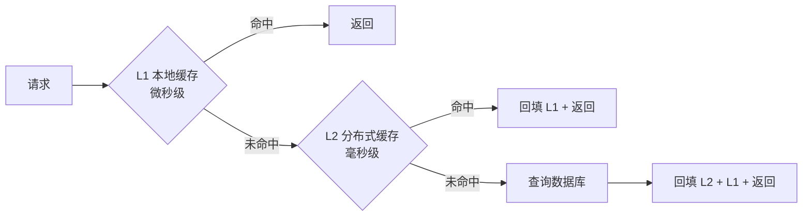

> 统一抽象 + 多级级联 + 防穿透、击穿、雪崩

## 摘要

缓存是高性能系统的基石，但缓存不是"加个 Redis 就完事"。一套好的缓存架构，要系统性地解决四个问题：**什么数据值得进缓存、进哪一级？多级缓存怎么级联？穿透、击穿、雪崩怎么防？数据变了缓存怎么保持一致？**

本文讲清楚一套「统一多级缓存」的架构该怎么分层、怎么设计。

---

## 一、数据分级：先想清楚什么数据进哪一级

缓存分级不是"越多越好"——每多一级，就多一层"一致性"要维护。所以更本质的问题先摆在前面：**什么数据值得进缓存、进哪一级？** 通常按访问模式和一致性要求分级：

| 数据特征 | 缓存策略 |
|----------|----------|
| 读多写少、允许短时间不一致 | 适合缓存（热点数据进 L1 本地，普通数据进 L2） |
| 写频繁、强一致要求 | 不适合缓存，或只缓存"读远多于写"的部分 |
| 冷数据 | 不进缓存，直接查库 |

这个分级是整套架构的前提：**先分清哪些数据该缓存、进哪一级，再谈怎么缓存**。否则要么热点数据没进本地、白白多走 Redis 网络往返；要么冷数据进了缓存、白占空间还引入一致性问题。

---

## 二、多级级联：L1 本地 + L2 分布式 + DB

分级之后，多级缓存是一条清晰的读取链路：



- **L1 本地缓存**：进程内、微秒级、容量小——放热点数据，几乎零开销。
- **L2 分布式缓存**：跨进程、毫秒级、容量大——放大部分数据，保证多实例间一致。
- **DB**：最终数据源。

收益在于各取所长：热点数据在 L1 命中，避免每次走 Redis 网络往返；L1 未命中走 L2，避免多实例本地缓存不一致；只有两级都未命中才查库。

---

## 三、统一抽象：一个 CacheManager 管两级

多级缓存要有一个统一的抽象，业务方不感知"有本地还是 Redis、走了几级"，只调一个接口：

```java
// 统一多级缓存接口（伪代码）
public interface MultiLevelCache<K, V> {
    V get(K key);                              // 自动走 L1→L2→DB
    void put(K key, V value);                  // 同时写 L1 和 L2
    void evict(K key);                         // 同时失效 L1 和 L2
}
```

更进一步用声明式注解，业务方完全无感：

```java
// 声明式缓存（伪代码）
@Cacheable(cacheNames = "tender", key = "#id",
           local = true, ttl = 60,          // L1 本地 60 秒
           remote = true, remoteTtl = 300)  // L2 分布式 300 秒
public Tender getTender(Long id) { ... }

@CacheEvict(cacheNames = "tender", key = "#tender.id")
public void updateTender(Tender tender) { ... }
```

"缓存是几级、TTL 多少、怎么失效"全部收敛到注解配置，而不是散落在各个工具类里由业务方自己决定。

---

## 四、三大防护：穿透、击穿、雪崩

多级缓存绕不开缓存三大经典问题，每一条都要靠**框架机制**，而不是靠"注释里提醒一句"。

### 4.1 防穿透：空值缓存 + 布隆过滤器

**穿透**：查询一个根本不存在的数据（如 `id = -1`），缓存和库都没有，每次请求都打到库。两条防线：

- **空值缓存**：查询不存在的数据，也缓存一个"空标记"（短 TTL），下次直接返回空，不打库。
- **布隆过滤器**：对 key 先做布隆过滤，明显不存在的 key 直接拦截，连缓存都不查。

```java
// 空值缓存（伪代码）
public V get(K key) {
    V v = cache.get(key);
    if (v != null) return v;
    v = db.query(key);
    if (v == null) {
        cache.put(key, NULL_MARKER, 短TTL);  // 缓存空标记，防穿透
        return null;
    }
    cache.put(key, v);
    return v;
}
```

### 4.2 防击穿：互斥锁 + 逻辑过期

**击穿**：某个热点 key 在失效的瞬间，大量并发请求同时打到数据库。两条防线：

- **互斥锁（singleflight）**：热点 key 失效瞬间，只放一个请求去查库重建缓存，其它请求等待。
- **逻辑过期**：value 里带"逻辑过期时间"，物理不过期；读到逻辑过期的值，异步重建，不阻塞请求。

```java
// 单飞：热点 key 只有一个请求查库（伪代码）
public V get(K key) {
    V v = cache.get(key);
    if (v != null) return v;
    // 只放一个请求进去查库，其它等锁
    return singleflight.do(key, () -> {
        V fresh = db.query(key);
        cache.put(key, fresh);
        return fresh;
    });
}
```

### 4.3 防雪崩：TTL 随机抖动

**雪崩**：大量 key 在同一时间过期（比如统一 TTL），过期瞬间数据库被打爆。解决办法是给 TTL 加随机抖动，让过期时间错开：

```java
// TTL 抖动（伪代码）
int ttl = baseTtl + random.nextInt(60);  // 基础 TTL + 0~60 秒随机
cache.put(key, value, ttl);
```

---

## 五、一致性：事件驱动自动失效

缓存最后一个老大难是**一致性**——数据改了，缓存怎么失效？最好的方式是**事件驱动自动失效**，而不是业务代码里手动删 key：


这正好和「状态流转」里的 CDC binlog 消费打通——数据库一变，binlog 消费者自动失效/更新缓存，业务代码完全无感，天然一致，也避免了"改了数据忘了删缓存"的经典事故。

---

## 六、架构思想提炼

多级缓存的架构设计，是四个维度的系统化：

1. **数据分级**：先分清"什么数据进哪一级"——读多写少才缓存、热点进 L1、普通进 L2、冷数据不进缓存，这是整套架构的前提。

2. **多级级联**：L1 本地（微秒级）+ L2 分布式（毫秒级）+ DB，热点走 L1、跨实例走 L2、兜底走库，各取所长。

3. **三大防护机制化**：穿透（空值缓存 + 布隆）、击穿（互斥锁 + 逻辑过期）、雪崩（TTL 抖动），用框架机制兜底，而不是靠"注释里的约定"。

4. **统一抽象 + 事件驱动失效**：一个 `CacheManager` 收敛多级缓存，业务方只调一个接口；一致性交给 CDC binlog 订阅自动失效，业务无感。

**缓存是框架的默认能力，不是业务方的事故现场。**

