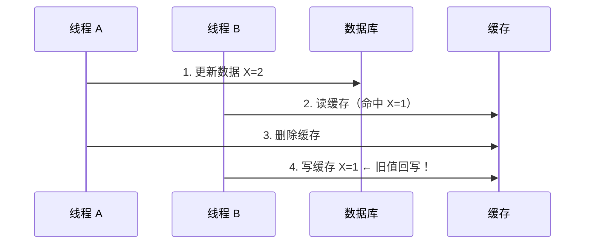
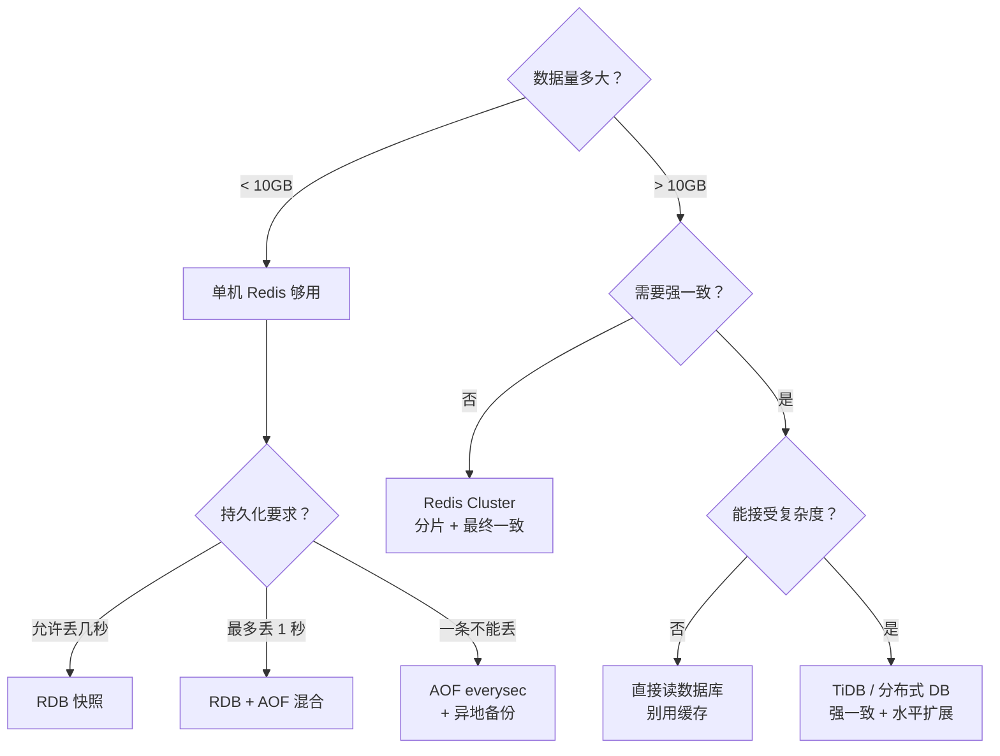

> 很多团队用 Redis 就是 `set`/`get`，出了事就加机器。但 Redis 的坑不在「会不会用」，在「知不知道它什么时候会背叛你」。大 Key 阻塞整个实例、集群脑裂导致数据丢失、缓存和数据库永远不一致——这些不是理论问题，是每个用 Redis 的团队迟早会踩的坑。从底层原理出发，讲透为什么会有这些坑、怎么避。

## 一、Redis 为什么快：不是魔法，是工程

Redis 单线程 QPS 能到 10 万+，比多线程的 MySQL 快一个数量级。原因不是「Redis 用了什么黑科技」，而是它做对了三件事：

### 1.1 单线程事件循环

```c
// Redis 事件循环伪代码（ae.c）
while (!stop) {
    // 1. IO 多路复用：epoll/kqueue 等待 socket 事件
    aeApiPoll(eventLoop, timeout);  // 阻塞等待可读/可写事件

    // 2. 处理文件事件：读请求 → 解析 → 执行 → 写响应
    for (client : readable_clients) {
        readQueryFromClient(client);     // 读请求
        processCommand(client);          // 执行命令（内存操作，纳秒级）
        addReply(client, reply);         // 写响应到输出缓冲区
    }

    // 3. 处理时间事件：过期 key 清理、持久化触发
    processTimeEvents(eventLoop);
}
```

**关键洞察**：Redis 的所有命令都在一个线程里顺序执行。没有锁竞争、没有上下文切换。一个 `GET` 命令的执行时间通常在 100ns 级别——比一次网络 RTT 还短。

**但这也是 Redis 最大的弱点**：任何一个慢操作都会阻塞整个事件循环。一个耗时 100ms 的命令，意味着这 100ms 内所有其他请求都在排队。

### 1.2 内存数据结构

Redis 不是简单地把数据存在 `HashMap` 里。每种数据类型都有精心的内存优化：

| 数据结构 | 底层编码 | 适用场景 | 内存效率 |
|---------|---------|---------|---------|
| String | `embstr`（<44字节）/ `raw` | 缓存、计数器、分布式锁 | 高 |
| Hash | `ziplist`（小）/ `hashtable`（大） | 对象存储 | ziplist 极高 |
| List | `quicklist`（ziplist + 双向链表） | 消息队列、时间线 | 中 |
| Set | `intset`（整数）/ `hashtable` | 标签、共同好友 | intset 极高 |
| ZSet | `ziplist`（小）/ `skiplist + hashtable` | 排行榜、延迟队列 | skiplist 中等 |

**工程教训**：Hash 用 `ziplist` 编码时，如果单个 entry 超过 `hash-max-ziplist-value`（默认 64 字节），整个 Hash 会升级成 `hashtable`，内存占用可能翻倍。设计数据结构时要预估字段长度。

### 1.3 IO 多路复用 + 零拷贝

Redis 用 `epoll`（Linux）或 `kqueue`（macOS/BSD）监听所有客户端连接。一个线程处理成千上万个连接——不是因为它处理得快，而是因为它从不阻塞等待。

网络写操作用的是 `writev`（矢量写）——把响应头和响应体放在两个 buffer 里，一次系统调用发出去，减少内核态/用户态切换。

## 二、大 Key：单线程的阿喀琉斯之踵

### 2.1 什么是大 Key

大 Key 不是「值很大的 Key」——是**操作耗时很长的 Key**。常见场景：

| 场景 | 为什么慢 | 阻塞时间 |
|------|---------|---------|
| Hash 有 100 万个字段 | `HGETALL` 要遍历所有字段 | 秒级 |
| List 有 100 万元素 | `LRANGE 0 -1` 全量返回 | 秒级 |
| Set 有 100 万个成员 | `SUNION` 多个大集合 | 秒级 |
| String 值 10MB | 网络传输 + 序列化 | 百毫秒级 |

### 2.2 大 Key 的连锁反应

```
大 Key 操作（100ms）
  → 阻塞 Redis 事件循环 100ms
    → 期间所有其他请求排队
      → 客户端超时重试
        → 更多请求涌入
          → 连接池耗尽
            → 服务雪崩
```

一次 `HGETALL` 100 万元素的 Hash，可能让整个 Redis 实例上的几百个业务全部超时。

### 2.3 大 Key 的发现与治理

```java
/**
 * 大 Key 扫描策略：用 SCAN 游标遍历，不阻塞 Redis。
 * 统计每种类型的 average/max size，定位大 Key。
 */
public class BigKeyScanner {

    private static final int SCAN_COUNT = 1000;
    private static final int BIG_STRING_THRESHOLD = 10240;    // 10KB
    private static final int BIG_COLLECTION_THRESHOLD = 1000; // 1000 个元素

    public List<BigKeyInfo> scan(Jedis jedis) {
        List<BigKeyInfo> bigKeys = new ArrayList<>();
        String cursor = "0";

        do {
            ScanResult<String> scanResult = jedis.scan(cursor,
                new ScanParams().count(SCAN_COUNT));
            cursor = scanResult.getCursor();

            for (String key : scanResult.getResult()) {
                String type = jedis.type(key);
                long size = getKeySize(jedis, key, type);
                if (isBigKey(type, size)) {
                    bigKeys.add(new BigKeyInfo(key, type, size));
                }
            }
        } while (!"0".equals(cursor));

        return bigKeys;
    }

    private long getKeySize(Jedis jedis, String key, String type) {
        return switch (type) {
            case "string" -> jedis.strlen(key);
            case "hash" -> jedis.hlen(key);
            case "list" -> jedis.llen(key);
            case "set" -> jedis.scard(key);
            case "zset" -> jedis.zcard(key);
            default -> 0;
        };
    }
}
```

**治理方案**：
- **拆分**：大 Hash 按 field 前缀拆成多个小 Hash
- **异步删除**：用 `UNLINK` 替代 `DEL`（后台线程释放内存，不阻塞）
- **限制大小**：业务层控制单个 Key 的元素上限，超过就分片

## 三、缓存一致性：CAP 里的不可能三角

### 3.1 为什么缓存和数据库永远不一致

缓存一致性问题的本质：**写数据库和写缓存不是原子操作**。无论先更新哪个，都存在窗口期让读到旧数据。



这就是经典的**先更新 DB 再删缓存**方案的致命缺陷：并发读写时旧值可能回写缓存。

### 3.2 四种一致性方案对比

| 方案 | 一致性 | 复杂度 | 适用场景 |
|------|--------|--------|---------|
| **Cache-Aside**（旁路缓存） | 最终一致 | 低 | 读多写少，允许短暂不一致 |
| **Read/Write Through** | 强一致 | 中 | 写入不频繁，读要求实时 |
| **Write-Behind**（异步写回） | 最终一致 | 高 | 写性能要求极高，允许丢数据 |
| **Binlog 订阅**（Canal） | 准实时一致 | 中高 | 读写都频繁，一致性要求高 |

### 3.3 生产推荐：Cache-Aside + 延迟双删

```java
/**
 * 延迟双删：解决 Cache-Aside 的并发回写问题。
 *
 * 流程：
 * 1. 先删缓存
 * 2. 更新数据库
 * 3. 延迟 N 毫秒再删一次缓存
 *
 * 延迟时间 = 主从同步延迟 + 业务读缓存的最大间隔
 * 通常设 500ms-1s。
 */
@Service
public class CacheAsideService {

    private final RedisTemplate<String, Object> redis;
    private final DataSource dataSource;

    @Transactional
    public void update(String key, Object newValue) {
        // 1. 先删缓存
        redis.delete(key);

        // 2. 更新数据库
        dataSource.update(key, newValue);

        // 3. 延迟双删（异步，不阻塞主流程）
        CompletableFuture.runAsync(() -> {
            try {
                Thread.sleep(500);
                redis.delete(key);
            } catch (InterruptedException e) {
                Thread.currentThread().interrupt();
            }
        });
    }

    public Object get(String key) {
        Object value = redis.opsForValue().get(key);
        if (value != null) return value;

        // 缓存未命中 → 查 DB → 写缓存
        value = dataSource.query(key);
        if (value != null) {
            redis.opsForValue().set(key, value, 30, TimeUnit.MINUTES);
        }
        return value;
    }
}
```

**架构师的判断**：如果你的业务能容忍秒级不一致（大部分 ToB 场景可以），Cache-Aside + 延迟双删就够了。如果需要强一致——别用缓存，直接读数据库。缓存不是银弹，一致性要求越高，缓存的价值越低。

## 四、持久化：RDB vs AOF vs 混合

### 4.1 三种模式

| 模式 | 原理 | RPO（丢数据窗口） | 性能影响 |
|------|------|-----------------|---------|
| **RDB** | 定时 fork 子进程，写内存快照到磁盘 | 上次快照到现在的全部写入 | fork 时阻塞（Copy-on-Write） |
| **AOF** | 每条写命令追加到日志文件 | 最多丢 1 秒（每秒 fsync） | 日志写入有开销 |
| **混合**（Redis 4.0+） | RDB 快照 + AOF 增量日志 | 最多丢 1 秒 | 重启恢复最快 |

### 4.2 RDB 的 fork 阻塞

```
BGSAVE 触发
  → fork() 创建子进程（拷贝页表，不拷贝数据）
    → 子进程遍历内存写 RDB 文件
    → 父进程继续处理请求
      → 但：父进程修改的页需要 COW（Copy-on-Write）拷贝
        → 写操作越多，COW 内存占用越大
          → 极端情况：内存翻倍 → OOM
```

**生产教训**：大实例（>10GB）做 BGSAVE 时，如果写流量大，COW 内存可能导致 OOM。解法：降低 RDB 频率，用 AOF 混合模式替代。

### 4.3 AOF 重写

AOF 文件会越写越大（同一条 Key 被写了 100 次，AOF 里就有 100 条记录）。Redis 后台重写 AOF：

```
AOF 重写触发（aof-current-size > aof-rewrite-min-size 且增长 > aof-rewrite-percentage%）
  → fork 子进程
    → 子进程遍历当前内存，生成最小化的 AOF
    → 父进程的写操作记录在 rewrite buffer
    → 子进程写完 → 父进程追加 rewrite buffer → 原子替换 AOF 文件
```

和 RDB 一样，fork 瞬间有阻塞风险。大实例要控制重写频率。

## 五、集群：哈希槽、Gossip 与脑裂

### 5.1 哈希槽分片

Redis Cluster 把 16384 个哈希槽分配到多个节点。Key 的路由公式：

```
slot = CRC16(key) % 16384
```

客户端发请求时，先算 slot，找到对应节点。如果算错了（节点迁移中），返回 `MOVED` 重定向。

### 5.2 脑裂与数据丢失

```
Master A  ←→  Slave A
   ↑
  网络分区

Client 继续写 Master A（它认为自己是 Master）
  → 写入 N 条数据
  → 网络恢复
  → Slave A 被选为新 Master（因为旧 Master A 曾失联）
  → 旧 Master A 降级为 Slave
  → 那 N 条数据被清空（同步新 Master 的数据）
```

**解法**：`min-replicas-to-write 1` + `min-replicas-max-lag 10`——要求至少 1 个 Slave 在 10 秒内有响应才允许写。牺牲可用性换一致性。

### 5.3 集群扩容的坑

迁移哈希槽时，被迁移的 Key 如果正在被访问，会出现短暂的不一致。`MIGRATE` 命令是原子搬移，但搬移期间源节点和目标节点都不响应这个 Key 的请求。大 Key 迁移尤其慢——10 万元的 Hash 搬一次可能要几秒。

## 六、布隆过滤器：缓存穿透的终极武器

```java
/**
 * 布隆过滤器：用多个哈希函数把元素映射到位数组。
 * 判断「一定不存在」或「可能存在」。
 * 误判率 = (1 - e^(-k*n/m))^k，其中 n=元素数, m=位数, k=哈希数。
 *
 * 生产配置：误判率 1%，1 亿元素 → 需要 ~1.2GB 内存，9 个哈希函数。
 */
public class BloomFilter {

    private final BitSet bitSet;
    private final int size;       // 位数组大小
    private final int hashCount;  // 哈希函数个数

    public BloomFilter(int expectedInsertions, double fpp) {
        this.size = optimalSize(expectedInsertions, fpp);
        this.hashCount = optimalHashCount(size, expectedInsertions);
        this.bitSet = new BitSet(size);
    }

    public void put(String value) {
        for (int i = 0; i < hashCount; i++) {
            bitSet.set(hash(value, i) % size);
        }
    }

    public boolean mightContain(String value) {
        for (int i = 0; i < hashCount; i++) {
            if (!bitSet.get(hash(value, i) % size)) return false;
        }
        return true;  // 可能存在（有误判）
    }

    // RedisBloom 模块直接用：
    // BF.RESERVE myfilter 0.01 100000000
    // BF.ADD myfilter user:123
    // BF.EXISTS myfilter user:123  → 1 (可能存在)
}
```

**适用场景**：防止查询不存在的数据穿透到 DB（恶意用户随机 ID 刷接口）。**不适用**：需要精确删除的场景（布隆过滤器不支持删除）。

## 七、选型决策树



## 结语

Redis 不是「装个服务、set/get 就完事」的组件。

> 单线程模型决定了大 Key 是致命伤，内存数据结构决定了要预判数据增长，缓存一致性决定了要接受最终一致或放弃缓存，持久化决定了要在性能和安全性之间取舍，集群决定了要理解脑裂和数据丢失的边界。

每一个配置项背后都是一次工程权衡。知道 Redis 为什么快，更要知道它在什么时候会慢、在什么情况下会丢数据——这才是架构师该关心的事。
