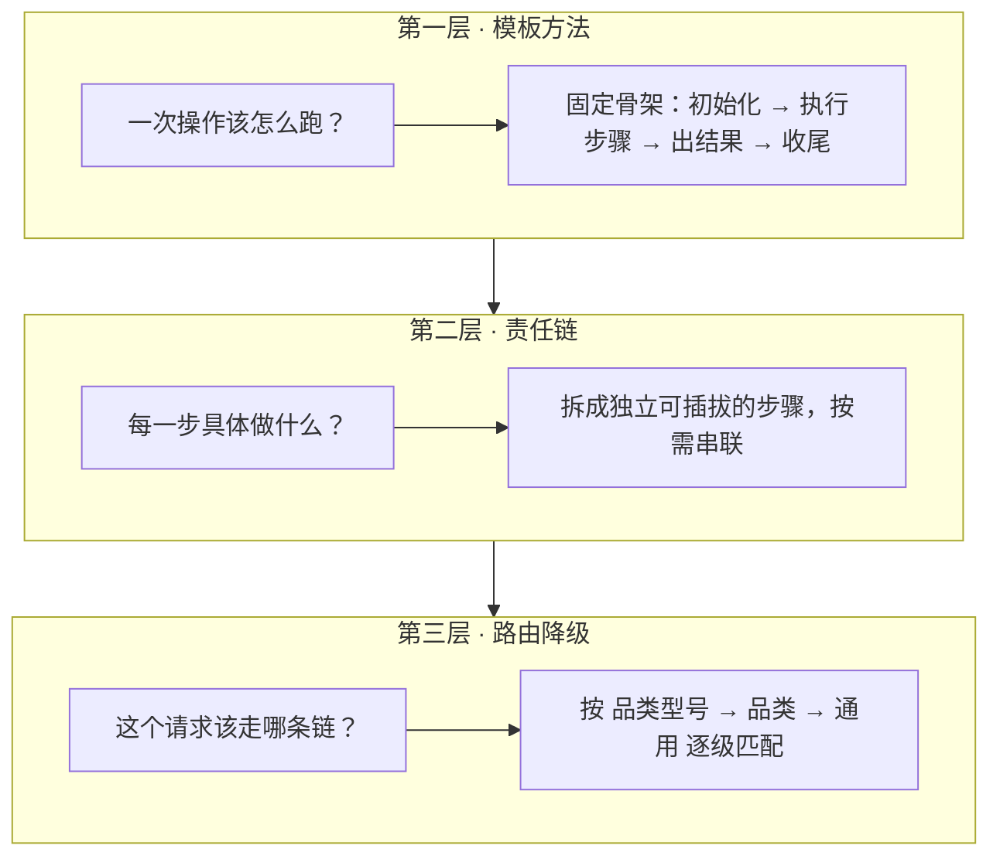
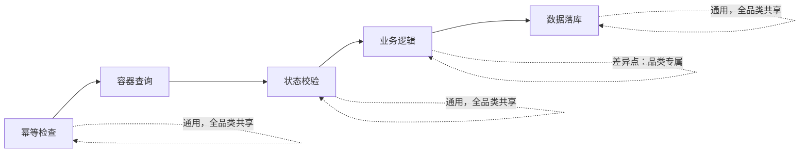
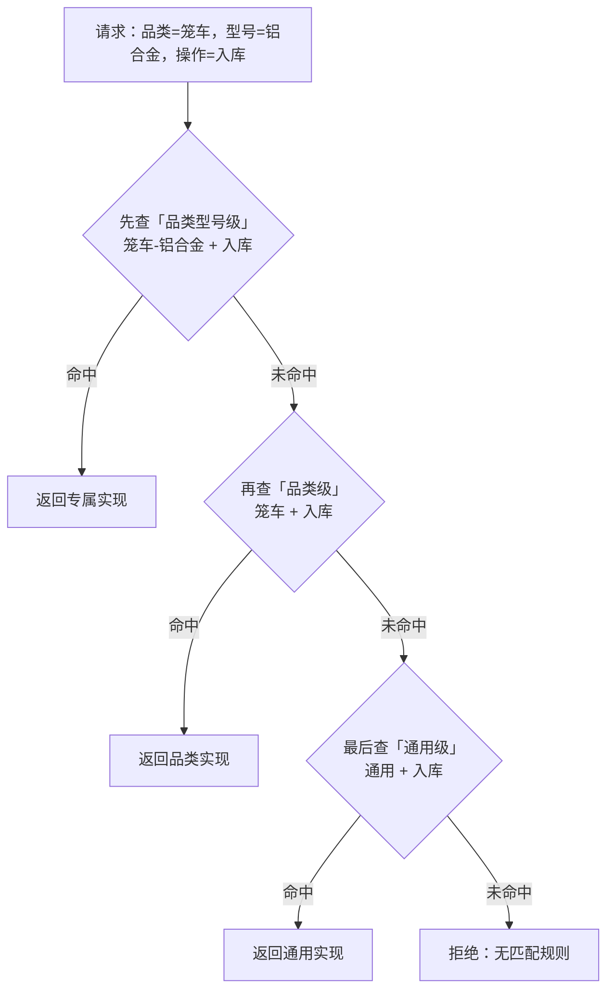
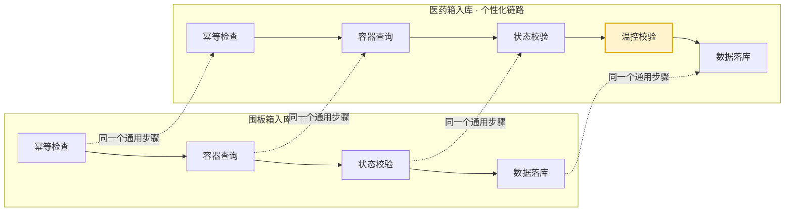

> 28 个操作 × 14 个品类，理论上 392 种组合。老系统靠"复制粘贴 + 逐行检查"来应对，新系统只用三个朴素的抽象就装下了全部——而且让新品类接入从"复制一整个目录"变成"加一个步骤"。

---

## 一、问题的本质：差异藏在 392 个格子背后

先不急着谈技术，把业务摆出来。

循环物资——围板箱、医药箱、笼车、编织袋、铁皮箱……一共 14 个品类。每一个品类都要经历入库、出库、调拨、维修、报废这些操作，粗略算下来有 28 种操作。14 × 28，392 种"品类 + 操作"的组合。

问题的吊诡之处在于：这 392 个格子，**大部分内容是重复的**，只有少数格子真正不一样。

拿"入库"来说，围板箱入库和医药箱入库，九成步骤一模一样——都要先做幂等检查防止重复扣账，都要先查一下这个箱子现在处于什么状态，都要校验"从当前状态跳到入库状态"这个动作合不合法，都要把新状态落库。唯一不同的是：医药箱对温度有硬性要求，必须在 2 到 8 摄氏度之间，超了就得拒收。

就这一处差异，老系统的做法是——**把整条入库链路复制一份**。于是 `围板箱入库处理器` 和 `医药箱入库处理器` 两个文件，90% 的代码是重复的，只有中间多插了一段温控判断。

更糟的是连锁反应：

- **新增品类** = 复制粘贴一整个目录，再逐行核对哪里要改；
- **修改通用逻辑** = 一次性改 20 多个文件，漏一个就是线上事故；
- **状态机规则变了** = 所有品类的处理器都要跟着动。

这不是代码质量问题，这是**抽象失效**的表现：系统把"差异"当成了"另起炉灶的理由"，而不是"在主干上打补丁"。

架构的目标就一句话：**让公共的部分只写一次，让差异的部分只写在它该在的地方。**

---

## 二、三层抽象，各管一件事

面对 392 个格子，第一反应往往是"写一个万能的 if-else 大杂烩"。但那会把复杂度从一个维度换到另一个维度——文件少了，单个文件的认知负担爆炸了。

真正能收敛复杂度的做法，是把问题**分层拆解**，每一层只回答一个问题：



这三层各自解决一个维度的问题，互不干扰：

- **模板方法**回答"流程的骨架长什么样"——它把一次操作的固定节奏锁死，让业务方永远不用重写流程；
- **责任链**回答"流程里有哪些零件"——把每个环节做成独立、可复用、可替换的单元；
- **路由降级**回答"请求和零件怎么对上"——让调用方根本不需要知道某个操作属于哪个品类。

三者叠加，才产生了那个关键效果：**业务方只需要声明"我覆盖哪些组合"、编排"我有哪些步骤"，剩下的全部由框架接管。**

---

## 三、第一层抽象：把"一次操作"锁成模板

这是整个框架的基石。一次循环容器操作，无论品类、无论动作，跑起来的节奏是恒定不变的：

```text
// 伪代码：操作执行的固定骨架（模板方法，业务方不可改写）

执行(上下文) {
    初始化(上下文)               // 生成追踪ID、补齐操作时间
    步骤链.依次执行(上下文)       // 责任链：幂等 → 查询 → 校验 → 业务 → 落库
    组装结果(上下文)             // 成功就提取新旧状态
    后置处理(上下文, 结果)        // 监控打点（成功失败都走）
    返回 结果

    // 任何一步抛异常，走统一异常分支，仍然执行后置处理
}
```

这个骨架里，最关键的约束是：**`执行`方法是"封闭"的**——它定义了流程，但不允许任何人改动它。业务方能碰的，只有两个"空位"：

- **声明归属**：告诉框架"我这个操作负责哪些品类、哪些操作码"；
- **编排步骤**：告诉框架"我的流程由哪几个步骤按什么顺序组成"。

其余一切——初始化追踪 ID、统一异常处理、后置打点、结果封装——都是框架的责任，业务方甚至感知不到它们的存在。

这里藏着模板方法模式最容易被忽略的价值：**它把"最容易写错"的部分（异常处理、后置清理、日志埋点）从业务方的视野里拿走了。** 一个业务开发写入库逻辑时，不用再记得"失败也要打监控点"、"异常要包装成统一结构"——这些坑被模板一次性填平。

同时，模板还预留了一批"钩子"：默认什么都不做的后置处理、默认从上下文提取状态的组装结果、默认按异常类名生成错误码的异常处理。它们是**可选的覆写点**，不覆写就享受默认行为，覆写就能做品类定制。这正是模板方法相较"一股脑塞进接口默认方法"的优雅之处——扩展点清晰可见，而不是散落一地。

---

## 四、第二层抽象：让"步骤"成为可插拔的零件

模板把"流程骨架"定死了，但"流程里装什么"必须灵活。这就引出第二个抽象——**责任链**。

把一次操作拆开，其实就五六个标准步骤：



每个步骤被抽象成一个**最小执行单元**，遵循四条纪律：

1. **单一职责**：一个步骤只做一件事；
2. **无状态**：步骤本身不保存数据，数据全塞进上下文，在步骤之间流转；
3. **可复用**："幂等检查"这个步骤被所有 14 个品类共享，只写一次；
4. **可插拔**：品类差异 = 在链路上增删一个步骤。

而负责串起这些步骤的，是一个"编排器"——它自己不干任何业务，只做三件事：**按顺序执行、记录每个步骤的耗时、把失败精确定位到具体步骤**。

编排器的设计刻意保持"笨"：它不知道每个步骤在干什么，只知道"一个接一个地调"。这种"笨"是刻意为之——**编排逻辑越薄，业务逻辑越内聚**。一个步骤超过 1 秒，编排器会主动打警告日志；一个步骤抛异常，编排器会带着"第几个步骤、叫什么名字"把异常包起来往上抛，排障时一眼就知道断在哪一环。

到这里，公共逻辑和差异逻辑的边界已经很清晰了：**框架提供的通用步骤（幂等、查询、校验、落库）躺在二方库里被所有品类复用；品类专属步骤由业务方自己实现，只在需要它的品类链路上出现。** 医药箱的温控校验，就是这么一个"只属于医药箱"的步骤——它进医药箱的链路，围板箱的链路里根本看不到它。

---

## 五、第三层抽象：让"选谁"这件事对调用方透明

前两层解决了"怎么写"和"怎么拼"，还差一环：**运行时怎么知道该调哪个操作？**

调用方（一个 Kafka 消费者，或一个 HTTP 接口）拿到一条消息，只知道"这是个医药箱、要做入库"，它不该去关心"医药箱入库对应哪个处理器"——那是框架的事。

于是有了第三个抽象：一张**静态路由表**，和一个**逐级降级的匹配规则**。



匹配的哲学是**从细到粗逐级兜底**：

- 先找最具体的——"笼车的铝合金型号"有没有专属实现；
- 没有，就退一步——"笼车"这个品类有没有实现；
- 还没有，就用最粗的"通用"实现兜底。

这一层的好处在于，它把**"默认"变成了系统能力，而不是业务负担**。一个没有特殊需求的品类，根本不用写任何代码，直接命中"通用实现"；只有真正有差异的品类，才需要提供专属实现去"覆盖"默认。

更深一层的思想是：**路由表和状态机的降级规则是同构的。** 状态机校验那一步，也是"品类型号 → 品类 → 通用"三级查规则。整个系统贯彻同一条原则——**能共用就共用，能兜底就兜底，只有差异才需要显式表达。**

---

## 六、数据如何在链条上流动：一个被低估的设计

三个抽象讲完了，但还有一个隐藏主角——**上下文**。它是贯穿整条链路的数据载体，每个步骤从它读输入、往它写输出。上下文设计得好不好，直接决定框架是"优雅"还是"泥潭"。

最大的挑战是：392 种场景，涉及的字段林林总总，车牌号、封签号、月结卡号、运单号、经停点……如果全做成上下文的属性，这个类会膨胀成一个谁都不敢碰的"上帝类"。

于是采用了**冷热分离**：

- **热字段**——容器编码、品类、操作码、当前状态、操作人这类几乎每个操作都用的字段，作为上下文的正式属性，类型安全、IDE 能补全；
- **冷字段**——车牌号、封签号这些只有个别操作才碰的低频字段，塞进一个"扩展字典"，按需存取。

但"按需存取"有个隐患：如果前置步骤忘了往字典里写某个必要的值，后置步骤读到的是 null，bug 就静默埋到下游。为此，字典提供了一种**声明式依赖**的读取方式——"这个值我必须拿到，没有就立刻报错"。这把"步骤 A 依赖步骤 B 的输出"这个隐式约定，变成了显式契约，排障时能精确告诉你"缺的是哪个键、该由谁写入"。

这一步看似琐碎，却是框架能不能长期演进的胜负手：**一个上下文如果放任字段野蛮生长，三个月后就会变成没人敢改的禁区；而冷热分离 + 声明式依赖，让它在持续扩张的同时保持了秩序。**

---

## 七、标准 vs 个性化：一个例子串起全局

把三层抽象拼起来，看两个真实的操作——围板箱入库（标准）、医药箱入库（个性化）：



**这就是差异的全部。** 医药箱比围板箱多的，只是在状态校验和数据落库之间，多插了一个"温控校验"步骤——仅此而已。其余的幂等、查询、校验、落库，两个品类用的是**同一批**通用步骤。

而如果某个品类（比如铁皮箱）和围板箱的入库逻辑**完全一致**，那它甚至不需要自己的链路——在路由表里声明"铁皮箱入库也复用围板箱那套"即可。于是"新品类零代码接入"第一次从口号变成了现实。

写代码的视角更直观，一个个性化的操作，伪代码长这样：

```text
// 伪代码：医药箱个性化入库操作，业务方只需要写两段

声明归属：
    品类 = ["医药箱"]
    操作 = ["入库", "自动收货"]
    // 框架据此自动注册两个路由键，业务方无需关心注册细节

编排步骤：
    步骤链
        .加步骤(幂等检查)      // 通用
        .加步骤(容器查询)      // 通用
        .加步骤(状态校验)      // 通用
        .加步骤(温控校验)      // 医药箱专属，只有这条链有
        .加步骤(数据落库)      // 通用
```

对比老系统，业务方少写了"手动注册""实现初始化接口""注入工厂"等一堆样板代码，从三个方法收敛到两个声明。而且——这是最关键的一点——**公共步骤的改动只需要改一处，14 个品类自动生效。**

---

## 八、三个看似"反主流"的决策，以及背后的取舍

架构不是从空中掉下来的，而是几个关键抉择的叠加。这三个决策当时都不算"标准答案"，每个都要权衡。

**决策一：路由表用静态的，而不是交给容器管理。**

直觉上，一个"工厂"应该由依赖注入框架托管。但仔细想，这张路由表的职责纯粹到只剩"存进去、取出来"——没有复杂依赖、不需要事务、不需要 AOP 切面、全局一份就够。用静态方法，调用方不用注入、不用等容器初始化，代码更直接。

代价是全局状态——测试时要记得清空，多实例下要留意一致。但对"一张只读的路由表"来说，这个代价可接受。**当一个组件的职责纯粹到极致时，为它引入容器的重量反而是一种浪费。**

**决策二：用抽象基类，而不是接口 + 默认方法。**

Java 8 之后，接口也能写默认实现，那为什么还用抽象类？因为那个"执行骨架"逻辑复杂，而且未来可能要有状态。硬塞进接口，会让接口臃肿得吓人；放在抽象类里，结构一目了然。单继承的限制，在这个场景里根本不是约束——业务方只需要继承这一个类。

**决策三：让"注册"这件事对业务方完全隐形。**

这是最见功夫的一步。原始版本里，每个操作都要手动实现初始化接口、覆写初始化方法、注入工厂、再调用注册——**每个类重复 20 行样板**。改进后，注册逻辑收进了抽象基类：容器启动时，基类自动读取业务方声明的"归属"，做笛卡尔积展开，一次性把所有路由键注册进路由表。

业务方从"关心注册"中彻底解脱，只留下两件真正属于业务的事：**声明我覆盖谁、编排我做什么。**

---

## 九、结语

回看这个框架，它没有用任何高深的技术——模板方法、责任链、工厂加注册表，都是教科书里躺了几十年的模式。它的价值在于**组合**：三层抽象各司其职，把"392 种组合"这个看似恐怖的复杂度，拆成了"一个固定骨架 + 一包可插拔零件 + 一张降级路由表"。

架构设计的最高标准，从来不是堆了多少新技术，而是**让变化只发生在它该发生的地方**。

当"新增一个品类"从"复制一整个目录"变成"在链路上加一个步骤"，当"改一处通用逻辑"从"改 20 个文件"变成"改一个文件自动生效"，这套框架的意义就兑现了——

**好的抽象，让重复消失，让差异显形。**

