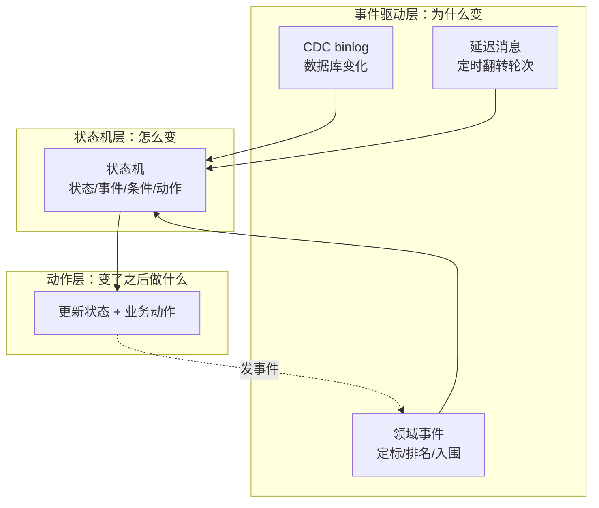
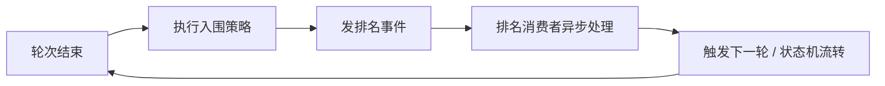

> 招采如何用「状态机 + 事件驱动」治理复杂的招采状态流转

## 摘要

招采（招标管理）里，状态流转是一个既多又乱的难题：一个标的要从「待招标」走到「招标中」，再走到「评标中」，最终「已定标」或「流标」；一个交易包要从「待发布」走到「已发布」「已交易」或「已取消」。

更麻烦的是，状态流转的**触发源**也五花八门：数据库记录变了要同步、投标截止要定时翻转轮次、定标完成要通知下游……如果把这些"状态怎么变"和"什么时候变"的判断散落在各处 `if(status == ...)` 里，代码会变成一锅谁都不敢碰的粥。

本文拆解招采真正的做法：用**状态机（管"怎么变"）+ 事件驱动（管"为什么变"）**两套机制协同，把状态流转做成可声明、可异步、可幂等的架构。

---

## 一、痛点：状态流转的"两难"

先看状态流转到底难在哪。它有两个正交的维度：

1. **状态怎么变**：从状态 A 到状态 B，有哪些合法路径？触发的条件是什么？变了之后要做什么动作？
2. **什么时候变**：数据变了？时间到了？外部系统回调了？

传统做法把这两个维度揉在一起写：

```java
// 反模式：状态判断散落各处（伪代码）
public void someMethod(tenderId) {
    Tender tender = findById(tenderId);
    if (tender.status == 待招标) {
        // 一轮开始 → 改成招标中
        tender.status = 招标中;
        update(tender);
    } else if (tender.status == 招标中 && 是最后一轮) {
        // 末轮结束 → 改成评标中
        tender.status = 评标中;
        update(tender);
        // 还要异步通知下游……
    }
}
```

这带来三个问题：

1. **流转规则散落**：同样的"招标中 → 评标中"判断，可能散在 5 个方法里，改一处漏一处。
2. **触发源耦合**：状态变更逻辑和"定时任务、binlog 消费、外部回调"这些触发机制缠在一起，改触发机制就得动业务逻辑。
3. **不可重放**：状态变更直接改库，消息重放一次就重复执行一次，没有幂等保护。

结论：**必须把"状态怎么变"和"什么时候变"拆开——前者交给状态机（声明式规则），后者交给事件驱动（异步触发器）。**

---

## 二、总体架构：状态机管"怎么变"，事件驱动管"为什么变"

招采的状态流转是**双机制协同**：



- **状态机**：声明式定义「从哪个状态、遇什么事件、满足什么条件、变到哪个状态、执行什么动作」——是"规则引擎"。
- **事件驱动**：用 binlog、领域事件、延迟消息三种事件源，异步触发状态流转——是"触发器"。
- **动作**：状态变更后执行的业务动作，完成后可能再发事件，形成闭环。

下面逐个拆解。

---

## 三、状态机：把状态流转声明化

招采用 COLA 状态机（一个声明式 DSL 框架），把状态流转集中定义。项目里有两个典型状态机。

### 3.1 招采轮次状态机——7 个状态的流转

一个标的的轮次状态，有 7 个取值：

```java
// 轮次状态枚举（伪代码）
public enum RoundStatusEnum {
    WAIT_TENDER(1, "待招标"),
    TENDERING(2, "招标中"),
    BIDDING(3, "评标中"),
    CANCEL_TENDER(4, "取消招标"),
    STOP_TENDER(5, "招标中止"),
    LOSS_BID(6, "流标"),
    WIN_BID(7, "已定标");
}
```

这些状态之间的合法流转，用声明式 DSL 定义：

```java
// 招采轮次状态机（伪代码，COLA 状态机 DSL）
@Bean
public StateMachine<RoundStatus, RoundEvent, Context> roundStateMachine() {
    StateMachineBuilder builder = StateMachineBuilderFactory.create();

    // 待招标 --首轮开始--> 招标中
    builder.externalTransition()
        .from(WAIT_TENDER).to(TENDERING)
        .on(FIRST_ROUND_START)
        .perform(doAction());

    // 招标中 --末轮结束--> 评标中
    builder.externalTransition()
        .from(TENDERING).to(BIDDING)
        .on(LAST_ROUND_END)
        .perform(doAction());

    return builder.build("tenderRoundStateMachineId");
}
```

状态变更时的动作，通过回调函数注入，状态机本身不耦合业务：

```java
// 状态流转动作（伪代码）
private Action doAction() {
    return (from, to, event, ctx) -> {
        // 状态翻转后，执行回调（比如更新数据库状态）
        ctx.getCallback().handle(from, to, event);
    };
}
```

### 3.2 交易包状态机——带「条件守卫」的完整流转

第二个状态机更复杂，展示了状态机的完整能力——**条件守卫（when）+ 动作（perform）**：

```java
// 交易包状态机（伪代码，带条件守卫）
@Bean
public StateMachine<PkgState, TradeEvent, Context> tradeStateMachine() {
    StateMachineBuilder builder = StateMachineBuilderFactory.create();

    // 待发布 --接收--> 待发布（幂等：重复接收不改变状态）
    builder.externalTransition()
        .from(WAIT_PUBLISH).to(WAIT_PUBLISH)
        .on(RECEIVE).when(checkCondition()).perform(receiveAction);

    // 待发布 --发布--> 已发布
    builder.externalTransition()
        .from(WAIT_PUBLISH).to(PUBLISHED)
        .on(PUBLISH).when(checkCondition()).perform(publishAction);

    // 已发布 --发布--> 已发布（发布到第三方平台，状态不变）
    builder.externalTransition()
        .from(PUBLISHED).to(PUBLISHED)
        .on(PUBLISH).when(checkCondition()).perform(publishAction);

    // 已发布 --询价--> 已发布（第三方询价）
    builder.externalTransition()
        .from(PUBLISHED).to(PUBLISHED)
        .on(INQUIRY).when(checkCondition()).perform(inquiryAction);

    // ... 撤回、取消、完成、流标等更多流转
}
```

这里体现了状态机的几个精妙设计：

| 特性 | 说明 |
|------|------|
| **状态自环** | `WAIT_PUBLISH → WAIT_PUBLISH`：重复"接收"不改变状态，天然幂等 |
| **条件守卫 `when`** | 只有满足条件才触发流转，把"边界判断"从业务代码挪进状态机 |
| **动作 `perform`** | 每个流转绑定独立 Action（`publishAction`、`inquiryAction`……），动作可复用、可测试 |
| **非法流转自动拒绝** | 比如"已取消"状态收到"发布"事件，状态机没有对应 transition，直接拒绝 |

**状态机的收益**：所有状态流转规则集中在一处、声明式可读；非法流转被 DSL 天然拦截；新增流转就是加一行，不再散落各处 `if`。

表达状态流转，业界其实还有两种做法——状态模式和数据库状态表——但都不适合招采。状态模式是"每个状态一个类"，招采有十几个状态，会类爆炸，且"从哪到哪合法"仍要散落各处；数据库状态表则是状态值直接存库、业务代码里 `if(status == ...)` 判断，流转规则照样散落、非法流转拦不住、状态变更没有统一入口。招采的状态流转恰好有三个特征——**状态多**（十几个）、**流转带条件**（要 `when` 守卫）、**需要可审计**（变更要留痕）——正好命中状态机的长项：声明式 DSL 把"从哪到哪、遇什么事、满足什么条件、做什么动作"集中表达，非法流转在框架层就拦截掉。

---

## 四、事件驱动：三种事件源触发状态流转

状态机定义了"怎么变"，但"什么时候变"由事件驱动层负责。招采有三种事件源。

### 4.1 CDC binlog——数据库变化即事件

最底层的触发源是**数据库 binlog**：表数据一变，binlog 消费者就收到消息，驱动下游逻辑。典型用途是「DB → 搜索索引」的数据同步：

```java
// binlog 消费者（伪代码）
@Component
public class TenderBinlogConsumer extends Consumer {

    // 消费招标主表的 binlog 变化（INSERT/UPDATE）
    @Override
    public void excute(String binlogMsg) {
        BinlogDTO dto = readData(binlogMsg);          // 解析 binlog
        esService.handleBinlog(dto);                   // 同步到搜索索引
    }

    // 批量消费：一次处理一批 binlog，提高吞吐
    @Override
    public void onMessage(List<String> msgs) {
        Set<Long> ids = msgs.stream()
            .filter(m -> "INSERT".equals(m.type) || "UPDATE".equals(m.type))
            .map(m -> m.data.id).collect(toSet());
        esService.batchHandleBinlog(ids);              // 批量同步
    }

    @Override
    public void afterPropertiesSet() {
        this.automaticAssembly("tender-binlog");        // 绑定 binlog 主题
    }
}
```

**CDC binlog 的价值**：把"数据变化"本身变成事件流，下游（搜索索引、缓存、报表）通过消费 binlog 实现最终一致，而不需要业务代码在每次写库后手动同步。

### 4.2 领域事件——业务动作异步化

第二类事件源是**领域事件**。定标、排名、入围这些重逻辑，通过发事件异步执行，避免同步阻塞：

```java
// 领域事件（伪代码，极简——只带 ID）
public class RankEvent {
    private Long tenderId;   // 只有招标 ID
}

public class CalibrateEvent {
    private Long activityId;
    private Long tenderId;
    private Integer roundIndex;
}
```

消费者是"薄壳"——只负责"接收 → 反序列化 → 分发到领域服务"：

```java
// 排名事件消费者（伪代码）
@Component
public class RankConsumer extends Consumer {

    @Override
    public void excute(String msg) {
        RankEvent event = gson.fromJson(msg, RankEvent.class);
        tenderService.processRankEvent(event);   // 分发到业务逻辑
    }

    @Override
    public void afterPropertiesSet() {
        this.automaticAssembly("tender-rank");    // 绑定排名主题
    }
}
```

业务逻辑在 `processRankEvent` 里，消费者本身极薄——这是"事件驱动"的干净分层：**消息层只管投递，业务层只管处理**。

### 4.3 延迟消息——定时翻转轮次

第三类事件源是**延迟消息**。招采的轮次是"定时"的：投标截止后，延迟一段时间自动触发下一轮或定标。这用 Pulsar 的延迟投递实现：

```java
// 延迟消息生产者（伪代码）
public interface DelayProducer {
    // 延迟 delaySeconds 秒后投递
    void sendKeyedDelay(String partitionKey, byte[] payload, long delaySeconds);
}

// 使用：活动状态延迟变更
activityStatusDelayProducer.sendKeyedDelay(
    activityId, payload, delaySeconds);   // 延迟 N 秒触发
```

配合一个定时扫描任务，把"到了时间该翻转的标的"捞出来，发延迟事件：

```java
// 延迟轮次扫描任务（伪代码，Saturn 定时任务）
public class DelayRoundJob extends SaturnJob {
    @Override
    public void execute() {
        tenderService.sendTenderMiddleEndDelayRoundEvent();   // 扫描并发送延迟轮次事件
    }
}
```

**延迟消息的价值**：把"定时翻转"这种时间驱动的事件，统一成消息投递，与其它事件走同一条消费链路，不用单独维护定时器的业务逻辑。

---

## 五、事件驱动的状态流转闭环

把状态机和事件驱动串起来，就形成完整的闭环。以"轮次结束"为例：

```java
// 轮次结束处理（伪代码）
public void roundEnd(Long tenderId, Long roundId) {
    // 1. 幂等保护：检查标的轮次和活动轮次是否一致，防消息重放
    if (不一致) {
        if (已有下一轮报价) return;   // 已处理过，跳过
    }

    if (是最后一轮) {
        // 末轮：价格继承，C 端标的状态 → 评标中
        inheritLastRoundPrice(tenderId);
        updateStatus(tenderId, 评标中);
    } else {
        // 非末轮：执行入围策略（淘汰一批）
        entry(tender, activity, round);
        // 发排名事件，异步触发下一轮
        RankEvent event = RankEvent.builder().tenderId(tenderId).build();
        rankProducer.send(event);
    }
}
```

可以看到闭环：



**关键设计：**

1. **事件驱动异步解耦**：`roundEnd` 不直接做排名，只发一个 `RankEvent{tenderId}`，排名的重逻辑在消费者里异步执行——主流程不被重计算阻塞。

2. **事件极简化**：事件只带 ID，不带完整数据。消费方按 ID 重新查询最新数据再处理，保证数据一致性（避免事件里的数据过期）。

3. **幂等保护**：`roundEnd` 里检查轮次一致性，Kafka 消息重放时能识别"已处理过"并跳过，避免重复执行入围/排名。

---

## 六、架构思想提炼

回到标题——状态流转架构设计的本质，是把"状态怎么变"和"什么时候变"这两个正交维度拆开，各自用最合适的机制治理：

1. **状态机管"怎么变"**：用声明式 DSL 定义状态/事件/条件/动作四要素，流转规则集中、可读、可拦截非法流转；条件守卫（`when`）把边界判断从业务代码挪进状态机；状态自环天然幂等。

2. **事件驱动管"为什么变"**：三种事件源各司其职——CDC binlog 把"数据变化"变成事件流、领域事件把"业务动作"异步化、延迟消息把"时间触发"统一成消息投递。

3. **事件极简化 + 消费方重查**：事件只带 ID，不传递完整数据；消费方按 ID 拉最新数据再处理，保证幂等和数据一致性。

4. **消费者薄壳化**：消费者只做"接收 → 反序列化 → 分发"，业务逻辑在领域服务里，消息层与业务层清晰分层。

5. **幂等保护**：通过轮次一致性检查、状态自环等手段，让消息重放不产生副作用。

6. **双机制协同**：状态机是"同步的规则引擎"（进程内），事件驱动是"异步的触发器"（跨进程）；两者配合，既有声明式的流转规则，又有异步的解耦能力。

**把「怎么变」交给状态机，把「为什么变」交给事件。**

