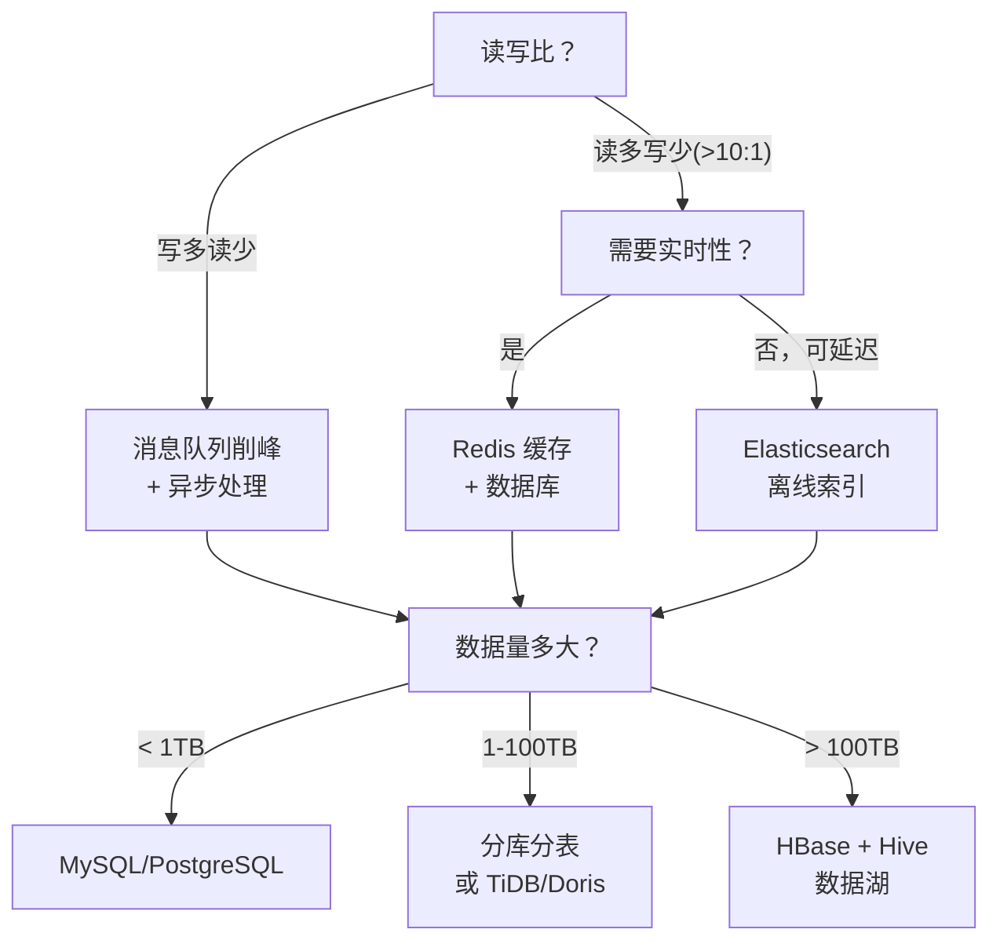

> 系统设计是架构师最核心的能力——不是背方案，是**从需求出发，一步步推到架构图**的推演能力。面试问「设计一个秒杀系统」，不是要你说出标准答案——是看你的推演过程：怎么估算容量、怎么识别瓶颈、怎么做取舍、怎么画架构图。这套方法论不只用于面试，是日常架构设计的通用流程。

## 一、系统设计的五步推演法

```
Step 1: 需求澄清（5 min）
  → 功能需求 + 非功能需求 + 约束条件

Step 2: 容量估算（5 min）
  → DAU → QPS → 存储量 → 带宽

Step 3: 高层架构（10 min）
  → 核心组件 + 数据流 + 技术选型

Step 4: 深入设计（15 min）
  → 瓶颈点深入 + 方案对比 + 取舍

Step 5: 扩展讨论（5 min）
  → 高可用 + 监控 + 演进路线
```

## 二、Step 1：需求澄清

### 2.1 三个维度

```
功能需求：
  - 核心功能是什么？（用户能做什么）
  - 数据模型是什么？（有哪些实体，关系是什么）

非功能需求：
  - 规模：DAU、QPS、数据量
  - 延迟：P99 延迟要求
  - 可用性：几个 9？
  - 一致性：强一致还是最终一致？

约束条件：
  - 团队规模（3 人和 30 人的方案完全不同）
  - 时间（1 个月和 1 年的方案完全不同）
  - 预算（自研还是用云服务）
```

### 2.2 关键问题清单

```
□ 用户量级？（DAU / MAU）
□ 读写比？（读多写少 vs 写多读少）
□ 数据是否热/温/冷分层？
□ 是否需要实时性？
□ 失败是否可以重试？（幂等性要求）
□ 是否需要强一致？
□ 是否需要多地域部署？
```

## 三、Step 2：容量估算

### 3.1 估算公式

```
QPS = DAU × 平均每用户操作数 / 86400 × 峰值系数

示例：设计一个微博系统
  DAU = 1 亿
  平均每用户发 2 条微博 + 看 50 条 Feed
  写 QPS = 1亿 × 2 / 86400 × 5(峰值) ≈ 11,574
  读 QPS = 1亿 × 50 / 86400 × 5(峰值) ≈ 289,352

存储估算：
  每条微博 1KB + 元数据 200B = 1.2KB
  日增 = 1亿 × 2 × 1.2KB = 240GB
  年增 = 240GB × 365 ≈ 87.6TB

带宽估算：
  读带宽 = 读 QPS × 平均响应大小
         = 289,352 × 10KB ≈ 2.75GB/s
```

### 3.2 经验值速查

| 规模 | DAU | QPS（读） | 存储/年 | 团队规模 |
|------|-----|----------|---------|---------|
| 小 | <10 万 | <1,000 | <1TB | 3-5 人 |
| 中 | 10-100 万 | 1K-10K | 1-10TB | 5-20 人 |
| 大 | 100 万-1000 万 | 10K-100K | 10-100TB | 20-100 人 |
| 超大 | >1000 万 | >100K | >100TB | 100+ 人 |

## 四、Step 3：高层架构

### 4.1 核心组件识别

```
任何系统设计都从这三个组件开始：
  1. 客户端（Web/Mobile/API Gateway）
  2. 服务层（业务逻辑）
  3. 存储层（数据库 + 缓存 + 消息队列）

然后按需添加：
  - 高并发 → 加缓存（Redis）+ CDN
  - 高吞吐 → 加消息队列（Kafka）
  - 海量数据 → 分库分表 / NoSQL
  - 高可用 → 多副本 + 故障转移
  - 全球化 → 多地域 + CDN + 边缘计算
```

### 4.2 技术选型决策树



## 五、Step 4：深入设计——以秒杀系统为例

### 5.1 秒杀的核心矛盾

```
正常系统：QPS 1000
秒杀瞬间：QPS 100000（100 倍）

矛盾：数据库扛不住 100 倍流量

解法核心：把流量挡在数据库之外
```

### 5.2 四层防线

```
Layer 1: CDN 层
  → 静态页面缓存到 CDN
  → 秒杀按钮倒计时用 JS 控制，不请求后端

Layer 2: 网关层
  → 限流（令牌桶/漏桶）
  → 用户去重（同一用户只能抢一次）
  → IP 限频（防止刷单）

Layer 3: 服务层
  → Redis 预扣库存（原子操作 DECR）
  → 库存为 0 直接返回失败，不查数据库
  → 异步下单（Redis 扣成功后发 MQ → 消费者写 DB）

Layer 4: 数据库层
  → 乐观锁：UPDATE stock SET count = count - 1 WHERE id = ? AND count > 0
  → 最终入库，保证数据一致性
```

### 5.3 关键技术点

```java
/**
 * Redis 预扣库存 + 异步下单
 * 核心：用 Redis 的原子操作挡掉 99% 的流量
 */
public class SeckillService {

    private final RedisTemplate<String, Integer> redis;
    private final MessageQueue mq;

    public SeckillResult seckill(String skuId, String userId) {
        String stockKey = "seckill:stock:" + skuId;
        String userKey = "seckill:user:" + skuId + ":" + userId;

        // 1. 用户去重（防止重复提交）
        if (Boolean.TRUE.equals(redis.hasKey(userKey))) {
            return SeckillResult.duplicate();
        }

        // 2. Redis 原子扣库存
        Long remaining = redis.opsForValue().decrement(stockKey);
        if (remaining == null || remaining < 0) {
            // 回滚（如果扣成负数）
            if (remaining != null && remaining < 0) {
                redis.opsForValue().increment(stockKey);
            }
            return SeckillResult.soldOut();
        }

        // 3. 标记用户已参与
        redis.opsForValue().set(userKey, 1, 30, TimeUnit.MINUTES);

        // 4. 异步下单（发 MQ）
        mq.send(new SeckillOrder(skuId, userId));

        return SeckillResult.queued();
    }
}
```

## 六、Step 5：扩展讨论

### 6.1 高可用

```
单机故障 → 多副本
机房故障 → 同城双活
城市故障 → 异地多活（数据同步延迟是核心挑战）

关键指标：
  RTO（恢复时间目标）：从故障到恢复的时间
  RPO（恢复点目标）：允许丢失多少数据
```

### 6.2 监控与告警

```
四个黄金信号（Google SRE）：
  1. 延迟（Latency）：P50/P95/P99 请求延迟
  2. 流量（Traffic）：QPS、并发连接数
  3. 错误率（Errors）：5xx 比例、超时比例
  4. 饱和度（Saturation）：CPU/内存/磁盘/连接池使用率

告警原则：
  - 可行动的告警（Actionable）：收到告警知道该做什么
  - 不告警噪音（No Noise）：避免告警疲劳
```

### 6.3 演进路线

```
V1（MVP）：单体 + MySQL → 快速上线验证
V2（增长）：读写分离 + Redis 缓存 → 支撑 10x 增长
V3（规模化）：服务拆分 + 分库分表 → 支撑 100x 增长
V4（全球化）：多地域 + CDN + 边缘计算 → 支撑全球用户
```

## 结语

系统设计不是背答案——是**用一套标准化流程，从模糊需求推到清晰方案**。

> 需求澄清确定边界，容量估算确定规模，高层架构确定组件，深入设计解决瓶颈，扩展讨论覆盖边界情况。这五步走通了，任何系统设计问题都不再是黑盒。

面试考的是推演过程，不是标准答案。日常做的是同样的事——只是需求更真实、约束更具体、代价更高。
