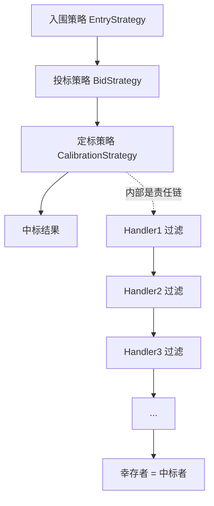

> 招采如何用「策略 + 责任链 + 状态机」消化复杂定标规则

## 摘要

招采（招标管理）系统里，定标是一个极其复杂的判定过程：要从几十上百个投标的供应商中，筛掉黑名单的、车辆数不够的、技术分不达标的、报价超指导价的、体量超限的……最终剩下一个或几个中标者。

更麻烦的是，招采本身有六种以上的资源类型（月标、年标线路、年标流向、区域标准价、通用流向、包天 B），每种又分「竞价」和「报名」两种投标形式——不同组合的定标规则完全不同。

如果把这些规则用 `if-else` 堆在 Service 里，代码会变成一个没人敢改的巨型泥潭。本文拆解招采真正的做法：**策略模式（多维正交分发）+ 责任链（规则可编排）+ 模板方法（骨架稳定）+ 配置驱动（阈值可调）+ 状态机（流程声明式）** 五者协同，把复杂定标规则消化成一套可扩展、可编排、可追溯的架构。

---

## 一、痛点：为什么 if-else 会爆炸

先看定标到底有多复杂。定标要把「投标的供应商」变成「中标的供应商」，中间要过很多道关：

| 过滤规则 | 未通过原因 |
|----------|-----------|
| 招标灰名单 / 黑名单 | 黑名单、灰名单 |
| 车辆数不足 | 不满足车辆数 |
| 技术分不达标 | 低于要求技术分 |
| 报价高于指导价 | 高于指导价 |
| 超过中标体量限制 | 超过中标体量限制 |
| 可承运金额超上限 | 承运任务总金额超上限 |
| 可承接车包数超上限 | 可承接车包数量超上限 |

（以上只是 14 种未通过原因里的一部分。）

再叠加「资源类型」和「投标形式」两个维度，规则的组合数会爆炸：

```
规则组合数 ≈ 资源类型(6种) × 投标形式(2种) × 过滤规则(N种)
```

硬编码 if-else 会遇到三个不可调和的矛盾：

1. **数量爆炸**：几十个规则 × 六种招采类型，`if/switch` 分支多到无法维护。
2. **变化频繁**：业务规则天天变（"技术分阈值从 80 提到 85"、"新增一个车包数上限"），改一行 if-else 要冒回归全量招采的风险。
3. **无法编排**：同一条规则，在"月标"里排第 2 位，在"区域标准价"里可能排第 7 位——顺序本身就是业务逻辑，硬编码锁死了顺序。

结论：**必须把"规则"从"流程"里拆出来，让规则可独立定义、可编排、可配置。**

---

## 二、总体架构：策略分层 + 责任链过滤

招采把"定标"这件事抽象成一条**分层的策略流水线**，招采流程的每个阶段对应一层策略：



三层策略分别对应招采的三个阶段：

| 阶段 | 策略 | 职责 |
|------|------|------|
| 入围 | `EntryStrategy` | 投标前：谁有资格投标（资格筛选） |
| 投标 | `BidStrategy` | 报价时：报价是否合规（报价校验） |
| 定标 | `CalibrationStrategy` | 评标时：谁最终中标（规则过滤链） |

而最复杂的「定标策略」内部，又是一个**责任链**：把每条过滤规则做成一个 Handler，串成链，逐层淘汰。

下面逐个拆解这套架构的五板斧。

---

## 三、板斧一：策略模式——按「编码」分发，消灭 if-else

### 3.1 策略模板：多维正交的「策略编码」

所有策略都实现同一个顶层接口，用一个「模板编码」标识自己：

```java
// 策略接口（伪代码）
public interface ActivityStrategy<T, P, R> {
    R process(T args);                    // 策略核心逻辑
    TenderStrategyTemplateEnum template(); // 策略模板编码
    boolean checkStrategyConfig(String config); // 校验配置
}
```

关键在于 `template()` 返回的模板编码，它是「策略类型 × 资源类型 × 投标形式」三维正交的产物：

```
策略类型(入围/投标/定标) × 资源类型(月标/年标线路/年标流向/区域标准价/通用流向/包天B)
                        × 投标形式(竞价/报名)
```

枚举里就能看到这种正交设计（摘取几例）：

```java
// 策略模板枚举（伪代码）
public enum TenderStrategyTemplateEnum {
    // 月标 + 竞价 + 投标
    BID_MONTHLY_CONTEST(策略类型=投标, code="BID_MONTHLY_CONTEST", 投标形式=竞价, 资源=月标),
    // 月标 + 竞价 + 定标
    CALIBRATION_MONTHLY_CONTEST(策略类型=定标, code="CALIBRATION_MONTHLY_CONTEST", 投标形式=竞价, 资源=月标),
    // 区域标准价 + 报名 + 定标
    CALIBRATION_AREA_STANDARD_PRICE(策略类型=定标, code="CALIBRATION_AREA_STANDARD_PRICE", 投标形式=报名, 资源=区域标准价),
    // ... 共 30+ 个模板
}
```

每一个招采场景（某资源类型 + 某投标形式的某个阶段）都对应唯一一个模板编码。

### 3.2 策略持有器：Spring 启动时自动注册

光有模板编码不够，还得把「编码 → 策略实例」的映射建起来。这里用了一个「自动注册」的持有器：

```java
// 策略持有器（伪代码）
@Component
public class ActivityStrategyHolder implements SmartInitializingSingleton {

    private Map<String, ActivityStrategy> strategyMap = new HashMap<>();

    // Spring 所有单例初始化完成后，扫描所有策略 bean
    public void afterSingletonsInstantiated() {
        for (ActivityStrategy strategy : applicationContext.getBeansOfType(ActivityStrategy.class).values()) {
            String code = strategy.template().getStrategyCode();
            if (strategyMap.containsKey(code)) {
                throw new BIZException("策略编码重复: " + code);
            }
            strategyMap.put(code, strategy);
        }
    }

    public ActivityStrategy getStrategy(String code) {
        return strategyMap.get(code);
    }
}
```

每个策略 bean 在 Spring 初始化后，自动把自己按「模板编码」注册进 Map；重复编码直接抛异常，保证全局唯一。

### 3.3 运行时按编码分发

定标触发时，从招采活动的配置里读出「定标策略编码」，再按编码拿到策略实例：

```java
// 触发定标（伪代码）
public CalibrationStrategyResult triggerCalibration(Long activityId, Long tenderId) {
    // 分布式锁，防止并发定标
    lock(activityId);
    try {
        // 1. 招采活动配置了「最终定标策略ID」
        Long finalStrategyId = tenderActivity.getFinalStrategyId();
        BidStrategy config = strategyRepo.queryById(finalStrategyId);

        // 2. 按编码分发拿到策略实例
        ActivityStrategy strategy = strategyHolder.getStrategy(config.getStrategyCode());

        // 3. 类型检查 + 执行
        if (strategy instanceof CalibrationStrategy) {
            return ((CalibrationStrategy) strategy).process(param);
        }
        throw new BIZException("定标策略配置错误");
    } finally {
        unlock(activityId);
    }
}
```

**策略模式的收益：**
- **消灭 if-else**：`getStrategy(code)` 一行替代几十个 `if(type==月标 && form==竞价)`。
- **开闭原则**：新增一种招采策略 = 新增一个类 + 加一个枚举值，不改任何已有代码。
- **策略可配置化**：策略编码存在招采活动配置里，同一个活动换策略就是改一个配置字段，不改代码。

一个招采活动，其实同时配置了**四类策略**，分别对应招采生命周期的不同阶段：

```java
// 招采活动实体（伪代码）
public class TenderActivity {
    private Long tenderStrategyId;      // 投标策略 ID
    private Long finalStrategyId;       // 定标策略 ID
    private Long eligibilityStrategyId; // 入围策略 ID
    private Long contestRankingId;      // 排名策略 ID
}
```

这四个 ID 都指向同一张「策略配置表」，只是 `strategyType` 字段不同（投标/定标/入围/排名），各自的 `strategyCode` + `config`（JSON 配置）也不同。创建活动时，还会按招采类型校验策略是否配齐——例如「包天 B」要求必填投标 + 定标策略，但**明确禁止**入围策略（因为它没有多轮入围的机制）。

这意味着「策略选择」完全下沉到了**配置层**：业务在创建招采活动时，通过选择四类策略，就完成了整套定标逻辑的编排，全程不碰代码。

---

## 四、板斧二：责任链——把"定标"拆成可编排的过滤规则

策略模式解决了"选哪个策略"，但没解决"定标策略内部怎么做"。定标本质是**多轮过滤**——先淘汰黑名单，再淘汰车辆不足的，再淘汰技术分不够的……

于是把每条过滤规则做成一个 `CalibrationHandler`（定标处理器），串成链：

```java
// 定标处理器接口（伪代码）
public interface CalibrationHandler<T> {
    CalibrationHandleResult handle(T param); // 过滤：输入候选，输出通过/未通过
    String desc();                            // 处理器描述
    T buildParam(CalibrationHandlerParamBuildInfo buildInfo); // 构建自己的参数
}
```

一个处理器做一件事，输出「通过 / 未通过」两类结果：

```java
// 处理结果（伪代码）
public class CalibrationHandleResult {
    List<CalibrationHandleResultItem> passItems;   // 通过的供应商
    List<CalibrationHandleResultItem> unPassItems; // 未通过的供应商（含原因）
}
```

定标策略内部，用 `standardProcess` 遍历这条链，**逐层收窄**：

```java
// 责任链标准流程（伪代码）
protected CalibrationStrategyResult standardProcess(param, configMap) {
    // 1. 加载所有报价（按报价时间升序）
    List<SupplierTenderInfo> candidates = loadSupplierQuotes(tender);

    CalibrationHandleResult lastResult = null;
    // 2. 遍历责任链
    for (CalibrationHandler handler : getHandlerChain()) {
        // 关键：每个 handler 的输入，是「上一轮通过的幸存者」
        List<SupplierTenderInfo> survivors = lastResult == null
            ? candidates
            : lastResult.getPassItems();  // 只把上一轮的通过者交给下一轮

        lastResult = handler.handle(handler.buildParam(buildInfo(survivors)));

        // 短路：如果这轮已经没有通过者，或已是最后一个 handler，就停
        if (survivors 空 || 是最后一个) {
            break;
        }
    }
    // 3. 最终排序、算总价、保存结果
    return result;
}
```

**责任链的两个关键设计：**

1. **逐层收窄**：每个 handler 只处理「上一轮的幸存者」，而不是从头处理全部候选。这既是性能优化（候选越筛越少），也符合业务语义（前面已淘汰的不用重复判断）。

2. **链可伸缩**：不同定标策略的链长度天差地别。最简单的「先进先出（FIFO）」策略，链里只有 1 个 handler；最复杂的「区域标准价」策略，链里串了 8 个 handler：

```java
// 先进先出定标策略：链里只有一个 handler（伪代码）
public void initHandlerChain(List<CalibrationHandler> chain) {
    chain.add(fifoCalibrationHandler);   // 就一个：先进先出
}

// 区域标准价定标策略：链里有 8 个 handler（伪代码）
public void initHandlerChain(List<CalibrationHandler> chain) {
    chain.add(rewardPunishmentCalibrationHandler);       // 1. 奖惩(黑灰名单)
    chain.add(vehicleQuantityConfigCalibrationHandler);  // 2. 车辆数量配置
    chain.add(ownedVehicleCalibrationHandler);           // 3. 自有车辆
    chain.add(newTechScoreCalibrationHandler);           // 4. 技术分
    chain.add(areaCapacityCalibrationHandler);           // 5. 区域容量
    chain.add(totalShippableTaskAmountRatioHandler);     // 6. 可承运金额占比
    chain.add(singleAreaVehiclePackageCapacityHandler);  // 7. 单区车包容量
    chain.add(vehiclePackageCapacityHandler);            // 8. 车包容量
}
```

**顺序就是业务逻辑**——先筛"硬条件"（黑名单、车辆数），再筛"软条件"（技术分、体量）。这个顺序由每个策略自己在 `initHandlerChain` 里编排，互不影响。

### 4.0 二十个 handler：规则的"原子库"

这 20 个 handler 是规则的"原子库"，每个只做一件事，按职责可归为四类：

| 类别 | handler | 过滤什么 |
|------|---------|----------|
| **价格** | 价格校验 / 日租价格校验 / 新价格校验 | 报价是否超指导价（超了送价格中心复核） |
| **车辆** | 自有车辆 / 活跃车辆 / 最少车辆 / 车辆系数 / 金融车辆 / 流向占用 | 车辆数是否够用、车辆系数、流向是否被占 |
| **容量** | 车包容量 / 单区车包 / 区域容量 / 承运金额占比 | 中标体量、车包数、区域份额、金额是否超限 |
| **评分/其他** | 技术分 / 奖惩(黑灰名单) / 先进先出 / 询价流标 | 技术分、黑名单、报价顺序、询价场景 |

每个 handler 的过滤逻辑高度一致：**遍历候选供应商 → 判断是否满足规则 → 通过的进 passItems、未通过的进 unPassItems（带原因）**。例如"自有车辆"这条规则：

```java
// 自有车辆校验 handler（伪代码）
public CalibrationHandleResult handle(param) {
    for (SupplierTenderInfo supplier : param.getSupplierTenderInfoList()) {
        // 计算该供应商的自有车辆是否满足 needCarNum × ownedVehicleTimes
        VehicleSatisfyResult satisfy = vehicleSatisfy(
            tenderId, supplier.getSupplierId(), ownedVehicleTimes, needCarNum);

        if (satisfy.isSatisfy()) {
            buildPassAndPush(supplier, result);   // 通过
        } else {
            buildUnPassAndPush(supplier, result, INSUFFICIENT_VEHICLE_COUNT); // 未通过+原因
        }
    }
    return result;
}
```

一个有意思的业务细节：很多 handler 内部都有**豁免逻辑**——比如 G2C 供应商（政府与企业合作项目的供应商）会自动跳过部分过滤，直接通过。这说明责任链的 handler 内部也可以有自己的分支，但对外接口保持统一（都是"输入候选、输出通过/未通过"）。

### 4.1 过滤规则可追溯

每个未通过的供应商，都带着明确的「未通过原因」，事后能解释"为什么这家没中标"：

```java
// 未通过原因枚举（伪代码，共 14 种）
public enum UnableCalibrationReasonEnum {
    REWARD_PUNISHMENT(1, "招标灰名单、黑名单"),
    INSUFFICIENT_VEHICLE_COUNT(2, "不满足车辆数"),
    BELOW_TECHNICAL_SCORE_REQUIREMENT(3, "低于要求技术分"),
    ABOVE_GUIDE_PRICE(4, "高于指导价"),
    ABOVE_CAPACITY(8, "超过中标体量限制"),
    PACKAGE_LIMIT(11, "可承接车包数量超上限"),
    // ...
}
```

定标结果不仅告诉业务"谁中标了"，还告诉业务"谁为什么没中标"——这对招采的合规审计至关重要。

---

## 五、板斧三：模板方法——骨架稳定，细节可变

定标的**流程骨架**是稳定的（校验 → 加载 → 过滤 → 排序 → 保存），但**每步的细节**因策略而异。于是用「模板方法」把骨架固定下来，细节交给子类：

```java
// 定标策略抽象基类（伪代码）
public abstract class CalibrationStrategy implements ActivityStrategy {

    // 模板方法：final，骨架不可改
    public final CalibrationStrategyResult process(param) {
        // 前置校验（标的、活动、线路是否存在、状态是否评标中）
        standardCheck(param);
        // 具体的定标过程（交给子类）
        CalibrationStrategyResult result = onProcess(param);
        // 保存结果、记录日志
        return result;
    }

    // 抽象方法：子类实现具体定标
    protected abstract CalibrationStrategyResult onProcess(param);

    // 钩子：子类按需重写
    protected boolean needCheckTenderDetail() { return true; }   // 是否需要校验详情
    protected Comparator getFinalPassComparator() { return null; }     // 最终排序规则
    protected void handleTotalPrice(...) {}                            // 算总价
    protected void handleBeforeSave(...) {}                            // 保存前扩展点
}
```

一个具体的定标策略（如"区域标准价"），只需要：
1. 实现 `onProcess`（读配置、调责任链）
2. 组装 `initHandlerChain`（串哪些 handler）
3. 重写 `getFinalPassComparator`（最终按什么排序：技术分 → 车辆数 → 报价时间）
4. 声明 `template()`（挂到哪个编码）

```java
// 区域标准价定标策略（伪代码）
@Service
public class AreaStandardPriceCalibrationStrategy extends CalibrationStrategy {

    @Override
    protected CalibrationStrategyResult onProcess(param) {
        // 读配置
        AreaStandardPriceConf conf = readConfig(param.getBidStrategy().getConfig());
        // 配置转 map 传给责任链
        Map configMap = conf.toMap();
        // 走标准责任链流程
        return standardProcess(param, configMap);
    }

    @Override
    public Comparator getFinalPassComparator() {
        // 最终排序：技术分高 → 车辆多 → 报价早
        return (a, b) -> {
            int s = b.techScore.compareTo(a.techScore);   // 技术分降序
            if (s != 0) return s;
            s = b.vehicleCount - a.vehicleCount;           // 车辆数降序
            if (s != 0) return s;
            return a.quoteTime.compareTo(b.quoteTime);     // 报价时间升序
        };
    }

    @Override
    public TenderStrategyTemplateEnum template() {
        return TenderStrategyTemplateEnum.CALIBRATION_AREA_STANDARD_PRICE;
    }
}
```

**模板方法的收益**：定标的"标准动作"（校验、记日志、异常处理、保存）写一遍，20 多个定标策略复用；每个策略只关心"自己特有的过滤规则和排序规则"。

---

## 六、板斧四：配置驱动——阈值可调，不用改代码

责任链里的每个 handler，过滤时都需要阈值（技术分要多少分？车辆数要几台？体量上限多少？）。这些阈值是**配置**，不是硬编码：

```java
// 区域标准价定标策略配置（伪代码）
@Data
public class AreaStandardPriceCalibrationStrategyConf {
    @NotNull private BigDecimal ownedVehicleTimes;  // 自有车辆数倍数
    @Min(1) @Max(100) private Integer capacity;      // 单曲中标体量上限
    private BigDecimal scoreThreshold;               // 技术分阈值
    @Min(0) @Max(100) private Integer amountLimit;   // 可承运金额占比上限(%)
    @Min(1) @Max(99999) private Integer packageLimit;// 可承接车包数量上限
}
```

配置以 JSON 形式存在招采策略配置里，定标时读出来、转成 `configMap` 传给责任链：

```java
// 读配置 → 转 map → 传给 handler（伪代码）
AreaStandardPriceConf conf = readConfig(param.getBidStrategy().getConfig());
Map configMap = new HashMap();
configMap.put("ownedVehicleTimes", conf.getOwnedVehicleTimes());
configMap.put("scoreThreshold", conf.getScoreThreshold());
configMap.put("capacity", conf.getCapacity());
// ...
return standardProcess(param, configMap);
```

配置用 JSR-303 注解（`@Min`/`@Max`/`@NotNull`）做边界校验，非法配置在定标前就拦下。

**配置驱动的收益**："技术分阈值从 80 提到 85" 这种业务调整，改的是招采活动里的一段 JSON 配置，而不是代码，不用发版、不用回归全量。

---

## 七、板斧五：状态机——招采轮次流转声明式化

除了"定标规则"，招采还有一个"流程状态"要管理：标的从「待招标」走到「招标中」，再到「评标中（定标）」……这些状态流转用声明式状态机管理：

```java
// 招采轮次状态机（伪代码，COLA 状态机 DSL）
@Bean
public StateMachine<RoundStatus, RoundEvent, Context> roundStateMachine() {
    StateMachineBuilder builder = StateMachineBuilderFactory.create();

    // 待招标 --首轮开始--> 招标中
    builder.externalTransition()
        .from(RoundStatus.WAIT_TENDER)      // 待招标
        .to(RoundStatus.TENDERING)          // 招标中
        .on(RoundEvent.FIRST_ROUND_START)   // 首轮开始
        .perform(doAction());

    // 招标中 --末轮结束--> 评标中(定标)
    builder.externalTransition()
        .from(RoundStatus.TENDERING)
        .to(RoundStatus.BIDDING)
        .on(RoundEvent.LAST_ROUND_END)
        .perform(doAction());

    return builder.build("tenderRoundStateMachineId");
}
```

状态流转时的动作，通过回调函数注入，状态机本身不耦合业务：

```java
// 状态流转动作（伪代码）
private Action doAction() {
    return (from, to, event, ctx) -> {
        // 状态翻转后，更新数据库状态
        ctx.getCallback().handle(from, to, event);
    };
}
```

**状态机的收益**：状态流转规则集中在一处、声明式可读；新增一个状态流转就是加一行 DSL，不会散落成各处 `if(status==...)` 的判断。

---

## 八、三阶段策略全景

把五板斧串起来，招采的完整生命周期是「三层策略 + 一条责任链」的流水线：

| 阶段 | 策略层 | 核心动作 | 关键设计 |
|------|--------|----------|----------|
| 入围 | `EntryStrategy` | 轮次晋级（按入围比例淘汰）+ 防围标 | 策略模式分发 |
| 投标 | `BidStrategy` | 报价合规校验 | 策略模式分发 |
| 定标 | `CalibrationStrategy` | 规则过滤 → 确定中标 | 责任链 + 模板方法 + 配置驱动 |

其中「入围策略」负责**多轮招采的轮次晋级**——每轮投标结束，按入围比例筛掉一部分，剩下的进入下一轮，直到最终定标。它的骨架是：

```java
// 入围策略（伪代码）
public Boolean process(args) {
    List<SupplierTender> bids = listByTenderRound(tenderId, roundIndex);
    inheritPrice(bids);                               // 未投标的继承上一轮价格
    if (roundIndex == 1) filterRelatedCompany(bids);  // 首轮：关联供应商去重
    filterSameIPRecord(bids);                         // 同 IP 报价去重
    bids.sort(byPriceThenTime);                       // 按价格、时间排序
    applyEntryRatio(bids, roundEntryConfigs);         // 按入围比例淘汰
    return true;
}
```

骨架里最值得展开的是**防围标串标**——招采合规的第一道防线。它不是"一个功能"，而是两道独立关卡，各自可开关、各自落原因：

**关卡一：关联供应商去重（防马甲投标）。** 同一控制人、同一股东下的多个供应商，本质是"一个人操纵多个报价"。识别它们不靠招采自己建关系图谱，而是调外部资源服务查「谁和我有关联」。关键的一步是**取交集**——`关联供应商 ∩ 本次投标供应商`：既有关联、又都来报价的，才需要合并处理；只关联但没投标的，不影响本轮。

```java
// 关联供应商去重（伪代码）
List<SupplierTender> filterRelatedCompany(List<SupplierTender> bids) {
    Set<Long> bidIds = 本次投标的所有 supplierId;
    Map<Long, List<SupplierTender>> groups = new HashMap<>();
    for (SupplierTender bid : bids) {
        if (已归组过 bid.supplierId) continue;          // 已归组的不重复处理
        List<Long> related = resourceService.queryRelatedSupplierIds(bid.supplierId); // 查关系图谱
        Set<Long> overlap = new HashSet<>(bidIds); overlap.retainAll(related);        // 关联 ∩ 本次投标
        groups.put(bid.supplierId, overlap 对应的投标记录);
    }
    // 每组按 价格(升) → 报价时间(升) 排序，只保留最优，其余落"关联公司报价"未入围
    return 每组保留最优，其余标记未入围;
}
```

**关卡二：同 IP 去重。** 同一个 IP 报出多份价，往往是一台机器挂多个账号。按 IP 分组，同一 IP 只保留一个（价格最低、同价取最早报价），其余落"同 IP 报价"未入围。

两道关卡各有一个配置开关，可灰度、可一键关停；每次淘汰都落表带原因，事后能解释「这家为什么没入围」——对招采的合规审计尤其重要。

而「投标策略」的 `process` 展示了报价阶段的合规校验（这是定标之前的一道前置关卡）：

```java
// 年标流向投标策略（伪代码）
public Boolean process(args) {
    checkSupplierReward(args, rewardType);   // 校验供应商奖惩(黑灰名单)

    // 报价不能为空/为0
    if (报价中存在 null 或 ≤0) throw new BIZException("报价不能为空或者为0");
    // 里程不能为空/为0
    if (里程中存在 null 或 ≤0) throw new BIZException("里程不能为空或者为0");
    // 超低价判断：折算单公里价 ≤ 1
    if (单公里价 ≤ 1) throw new BIZException("存在超低价报价");
    // 技术分控制
    checkTechnicalScore(supplierId, quotes, conf);
    // 去返程控制
    checkGoBack(quotes, conf, args);
    return true;
}
```

可以看到，**投标阶段做"报价合法性"校验（不合格直接拒绝），定标阶段做"谁中标"的排序过滤**——两个阶段职责清晰分离。

---

## 九、架构思想提炼

回到标题——招标策略架构设计的本质，是用几个经典设计模式把"复杂规则"拆解成"可组合的原子单元"：

1. **策略模式消 if-else**：用「模板编码 + 自动注册 + 按码分发」替代几十个 if-else 分支；新增策略 = 新增类 + 枚举值，开闭原则落地。

2. **责任链拆规则**：把"定标"这个复杂判定，拆成 N 条独立的过滤规则，串成链；每条规则只做一件事、顺序可编排、链长可伸缩（FIFO 只有 1 个 handler，区域标准价有 8 个）。

3. **模板方法分骨架与变化**：定标的"标准流程"（校验→过滤→排序→保存）写一次复用；每个策略只重写"自己特有的部分"（哪些规则、怎么排序）。

4. **配置驱动解耦阈值**：规则阈值（技术分、车辆数、体量上限）是配置不是代码，业务调整不发版。

5. **状态机管流程**：招采轮次流转声明式化，状态/事件/动作分离，流程变更加 DSL 即可。

6. **多维正交建模**：策略 = 策略类型 × 资源类型 × 投标形式，用枚举的笛卡尔组合表达，而不是散落的判断条件。

7. **可追溯性**：每个未中标供应商都带明确原因（14 种枚举），定标结果可解释、可审计。

**规则会一直变，就把它做成可换的零件。**
