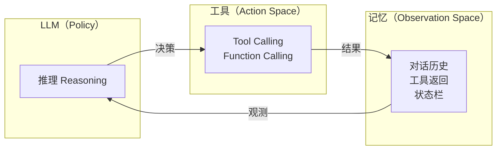
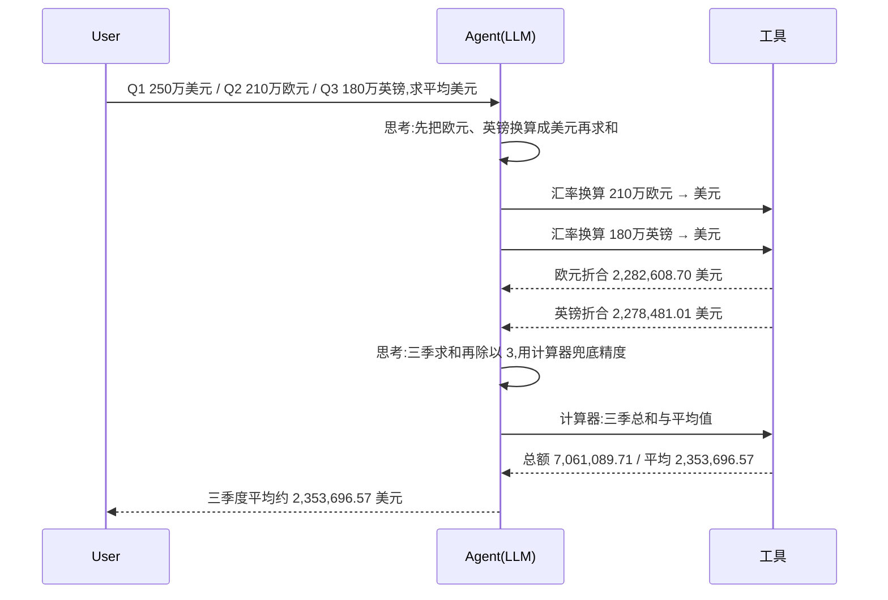
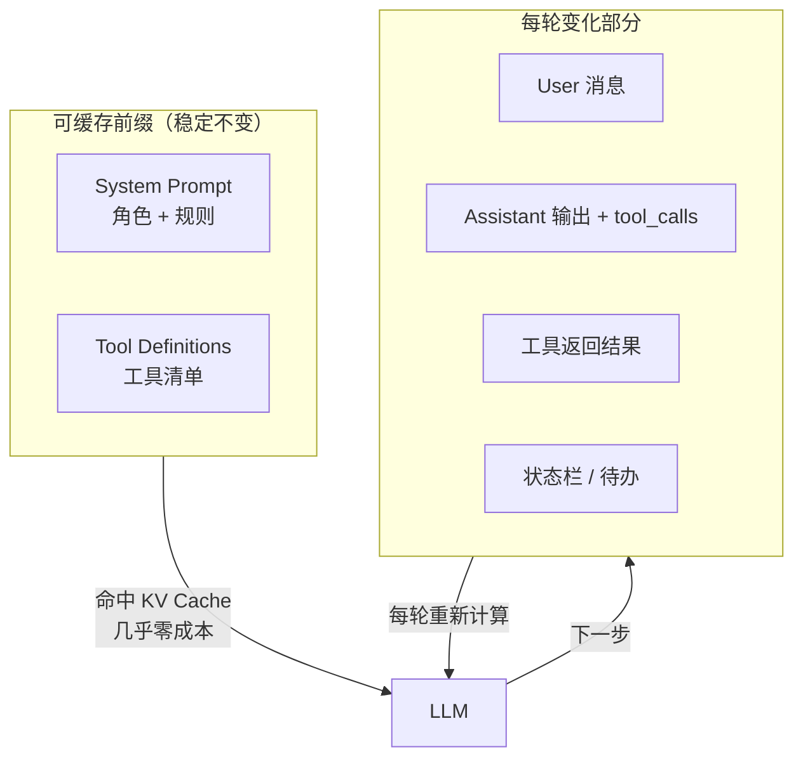

> 开篇：把一个会说话的大模型,变成一个会办事的 Agent,中间到底差了什么。

## 一、从「对话框」到「能办事」:差的那一步

用过对话模型的人都有个体感:问它「上海明天天气怎么样」,它会告诉你「我没法访问实时数据」。它知道该查,但手伸不出去。把一个「只会说」的语言模型,变成一个「会查、会算、会动手办事」的 Agent,中间要补的东西,就是这一系列要拆解的。

先给结论,后面全是论证:

> **Agent = LLM + 工具 + 记忆**

这三个词看起来朴素,但每一个都暗藏玄机。LLM 是大脑(Policy),工具是手(Action Space),记忆是眼睛和耳朵(Observation Space)。这不是生搬硬套强化学习的术语,而是 Agent 的本质——它和传统 RL Agent 同构,只不过「策略」换成了一份会推理的语言模型,「动作空间」换成了可调用的 API,「观测空间」换成了上下文里不断追加的工具返回结果。



很多人把 Agent 等同于「带 Function Calling 的对话框」,这是把冰山一角当成了全貌。工具调用只是动作的出口,真正让一个 Agent「像个 Agent」的,是它外面那一层不显山露水的外壳——Harness。

## 二、ReAct:让 LLM 动起来的核心循环

光有 LLM 和工具还不够,得有一套节奏把它们串起来。这套节奏叫 **ReAct——Reasoning + Acting**(推理 + 行动),是几乎所有现代 Agent 的底层心跳:

> 思考 → 行动 → 观察 → 再思考 → 再行动 → …… → 给出最终答案

举一个具体的轨迹。用户问:「Q1 营收 250 万美元,Q2 是 210 万欧元,Q3 是 180 万英镑,这三个季度平均折合多少美元?」一个合格的 Agent 不会瞎猜汇率,它的轨迹长这样:



注意中间那个「思考」步骤——它不是花架子。推理(Reasoning)让模型把一个模糊目标拆成可执行的子步骤,行动(Acting)把子步骤落地成工具调用,观察(Observation)把工具结果喂回上下文供下一轮推理。三者在循环里咬合,才让模型从「一次生成一段话」变成「持续推进一个任务直到完成」。

没有 Reasoning,模型会盲目调用工具;没有 Acting,推理就是纸上谈兵;没有 Observation 的回灌,模型就成了闭眼瞎猜。三者缺一,循环就转不起来。

## 三、构建一个最小的 Agent

讲再多原理,不如把一个 Agent 从零写出来。一个 Agent 的核心,说穿了就是一个 `while` 循环——不断把模型输出喂回去,直到它不再请求工具为止。

```java
import com.openai.client.OpenAIClient;
import com.openai.client.okhttp.OpenAIOkHttpClient;
import com.openai.models.chat.completions.*;
import java.util.*;

// 工具定义：描述清楚，模型才知道何时该用
var weatherTool = ChatCompletionTool.builder()
    .function(FunctionDefinition.builder()
        .name("get_weather")
        .description("获取指定城市的实时天气")
        .parameters(JsonObjectSchema.builder()
            .putProperty("city", JsonStringSchema.builder()
                .description("城市名").build())
            .putProperty("unit", JsonStringSchema.builder()
                .enums(List.of("celsius", "fahrenheit")).build())
            .required("city")
            .build())
        .build())
    .build();

// 工具执行：把模型请求的参数，转成真实世界的副作用
String executeTool(String name, String arguments) {
    if ("get_weather".equals(name)) {
        // 真实场景里这里调天气 API
        return """
            {"city": "上海", "temp": 28, "conditions": "晴"}
            """;
    }
    throw new IllegalArgumentException("未知工具: " + name);
}

// Agent 的全部灵魂：一个循环
var messages = new ArrayList<ChatCompletionMessageParam>();
messages.add(SystemMessage.builder().content("你是一个有用的助手。需要实时信息时务必使用工具。").build());
messages.add(UserMessage.builder().content("上海今天天气怎么样?").build());

int MAX_STEPS = 10;  // 熔断：防止模型陷入死循环
OpenAIClient client = OpenAIOkHttpClient.builder().build();

for (int step = 0; step < MAX_STEPS; step++) {
    var resp = client.chat().completions().create(
        ChatCompletionCreateParams.builder()
            .model("qwen3")
            .messages(messages)
            .tools(weatherTool)
            .build()
    );
    ChatCompletionMessage msg = resp.choices().get(0).message();
    messages.add(AssistantMessage.builder()
        .content(msg.content().orElse(""))
        .toolCalls(msg.toolCalls())
        .build());

    // 模型不再请求工具，说明它给出最终答案了
    if (msg.toolCalls().isEmpty()) {
        System.out.println(msg.content().orElse(""));
        break;
    }

    // 执行每一个工具调用，把结果作为 tool 消息喂回去
    for (var call : msg.toolCalls()) {
        String result = executeTool(call.function().name(), call.function().arguments());
        messages.add(ToolMessage.builder()
            .toolCallId(call.id())
            .content(result)
            .build());
    }
}
```

这段代码不到 40 行,但它已经是一个**完整的 Agent**。它有大脑(LLM)、有手(工具)、有记忆(messages 列表就是它的短期记忆),有循环(ReAct),还有熔断(MAX_STEPS 防止失控)。后面这一系列文章里要讲的所有花活——Skills、状态栏、上下文压缩、子 Agent 调度——本质上都是在给这个最小骨架加肉。

有几个细节值得停一下:

- **`role: tool` 带着上一轮消息里的 `tool_call_id` 回去**,这是为了让模型知道「这是哪个工具调用的结果」。没有这个对应,模型会张冠李戴。
- **每一轮都把完整 `messages` 发过去**。Agent 没有状态,它靠的是「重放整段对话历史」来恢复记忆。这一点直接决定了上下文工程是 Agent 的核心命题。
- **`MAX_STEPS` 不是可选项**。不加熔断的 Agent 会被模型带进死循环——反复调用同一个工具,永远不满意自己的答案。线上事故里这一类占比极高。

## 四、Harness:你构建的从来不是 LLM,是那层外壳

代码写到这里,一个反直觉的事实浮出水面:**Agent 的能力上限由模型决定,但下限由 Harness 决定。**

Harness,直译是「挽具」——套在马身上、让人能驾驭马的那套装备。在 Agent 语境里,它是包在 LLM 外面的那一整层工程:接住用户的输入、组装上下文、定义工具、约束行为、执行工具调用、校验结果、必要时纠偏。模型是马,Harness 是缰绳和马鞍。

> **Agent = Model + Harness**

一套成熟的 Harness,至少要做五件事——上下文(Context)、工具(Tools)、约束(Constrain)、校验(Verify)、纠偏(Correct):

| 职责 | 做什么 | 不做会怎样 |
|------|--------|------------|
| Context | 组装 system prompt、工具定义、对话历史 | 模型不知道自己是谁、能干什么 |
| Tools | 注册工具、执行调用、回灌结果 | 模型只会说,不会动 |
| Constrain | 熔断次数、权限校验、禁止危险操作 | 失控:死循环、删库、越权 |
| Verify | 校验工具参数合法性、结果合理性 | 把脏数据喂回模型,越走越偏 |
| Correct | 检测到错误后重试、回滚或转人工 | 一次失败 = 整个任务崩盘 |

早期框架爱把 Harness 写成「为每个具体任务硬编码一套流程」。但这违反了一条铁律——Rich Sutton 在《The Bitter Lesson》里讲的:**通用方法最终会赢过手工定制**。一个把退款流程焊死在代码里的 Harness,换个业务就得重写;一个只会把任意工具塞给模型、让它自己 ReAct 的 Harness,能跟着模型一起变强。所以现代 Harness 越来越「瘦」:不教模型怎么做事,只给它环境和护栏,剩下的交给模型的推理能力。

这也解释了一个现象:为什么同样是接一个模型,有的 Agent 看起来聪明得吓人,有的蠢得让人想砸键盘——差距不在模型,在那层 Harness 工程的厚薄与取舍。

## 五、上下文工程:Prompt Engineering 的进阶

理解了 Harness,就理解了为什么业界慢慢把「Prompt Engineering」改口叫「Context Engineering」。Prompt 只是一段系统提示词,上下文工程管的是**整段喂给模型的输入**:system prompt、工具定义、对话历史、工具返回、状态信息,全算。

一个关键洞察是——**前缀是可缓存的**。Transformer 的 KV Cache 机制决定了:如果连续两次请求的前 N 个 token 一模一样,第二次就只需算新增的那部分。对 Agent 来说,system prompt + 工具定义通常几千 token 且几乎不变,这部分可以命中缓存,大幅压低首 token 延迟和成本。



把上下文分成「稳定前缀」和「动态尾部」两段,是 Agent 性能优化的第一课。顺着这条线往下,还有几个工程要点:

**Agent Skills 的渐进式披露。** 工具一多,光工具定义就能吃掉上万 token。Skill 的做法是:平时只在 system 里塞一个「能力清单」(每个 Skill 一句话描述,几百 token),模型判断需要某个 Skill 时再去加载它的详细指令(Skill 本体可能几千 token)。按需加载,而不是一股脑全塞进去——和按需加载模块是一个道理。

**状态栏与 Agent 记忆。** 模型没有时间感、没有「我已经调了三次电话」的记忆。Harness 会在每一轮往上下文里塞一段 `<agent_status>`,告诉模型当前进度、剩余预算、待办清单。没有它,模型会反复干同一件事还不自知。

**上下文压缩。** 跑得久的 Agent,历史动辄十几万 token。不压缩,迟早撞上限;乱压缩,又把关键信息丢了。成熟的 Harness 会在接近上限时,用模型自己去做摘要、保留近期工具结果、丢弃已完成的中间步骤,而不是简单截断——粗暴截断会丢掉「我之所以走到这一步」的关键脉络。

> 系统提示词、工具定义、对话历史、工具结果、状态栏——它们一起构成 Agent 的「工作记忆」。管理好这份记忆,就是上下文工程的全部。

## 结语

Agent 不是魔法,它是一个会自我推进的循环。LLM 给了它推理的底座,工具给了它改变世界的手,记忆给了它不至于失忆的上下文,而 Harness——那一层经常被忽略的工程外壳——决定了它能不能在真实世界里活下来。

构建一个 Agent,不是在写 prompt,是在写一套让语言模型在物理世界里可靠运转的控制系统。
